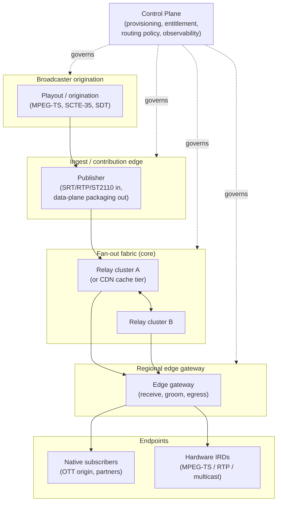
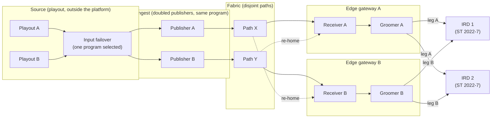

# Reference Architecture: Broadcast-Grade Primary Distribution

Status: working draft.
Layer: **above the transport.** Everything in §4–§9 is required and owned by the distributor
*whichever* data plane carries the bytes, and is the substance of this repository. Only §6 (carriage
lanes) and §8 (the fan-out fabric) are MoQ-specific; their segmented-HTTP counterparts are in
[Comparison](comparison.md) §8 and §2.

Scope: an end-to-end reference architecture for a platform that delivers professional broadcast
primary distribution over an Internet-native transport. It takes the requirement set in
[Problem](problem.md) §5 as given and develops R3 (IRD-conformant egress), R6 (redundancy) and R8
(observability). MoQ is used as the worked example because it is what the
prototype runs on; the transport-specific parts are marked.

The edge gateway (§4) and redundancy (§5) come first — broadcast-grade components and where most
measurement sits. §6 onward is carriage, fabric, operations and design intent.

---

## 1. Purpose and layering

This is deliberately *not* a description of MoQ. The subject is the entire distribution platform —
publishers, relays, edge gateways, egress, control plane, entitlement, observability and operations.
The transport is one layer among several, and by design the least differentiated.

Throughout, three planes are kept separate, because conflating them is the most common source of
architectural error in this domain: the **data plane** (the path media takes from publisher to
endpoint), the **control plane** (the system that provisions, entitles, routes and observes), and the
**management plane** (the human-facing surfaces: APIs, dashboards, NOC integration). Their
availability, latency and consistency requirements are radically different.

### 1.1 Design principles

Derived from [Problem](problem.md) §1 and §5, and governing every decision below.

1. **The installed base is non-negotiable.** The platform must deliver IRD-grade MPEG-TS to existing
   hardware without modification to that hardware. Any design that requires replacing receivers is
   rejected on arrival.
2. **The transport is a swappable dependency.** Because the transport commoditises and is currently
   wire-unstable, the media packaging, control, entitlement and egress layers must be independent of
   the specific transport draft. The value must survive a transport change.
3. **Control-plane and data-plane failures are independent.** A control-plane outage must never take
   down established media flows. The data plane must run on last-known-good state.
4. **Determinism at the edge, elasticity in the core.** The unpredictable public Internet is absorbed
   by grooming and buffering at the egress edge so that the IRD sees a deterministic stream. The core
   relay fabric is elastic and software-defined.
5. **Fail safe, deny by default.** Entitlement, admission and routing default to the safe state. An
   expired or ambiguous entitlement denies delivery; it does not fall open.
6. **Everything is observable and auditable.** If it cannot be observed, it cannot be operated for
   contracted content.

---

## 2. End-to-end overview

```mermaid
flowchart TD
    CP["Control Plane\n(provisioning, entitlement,\nrouting policy, observability)"]

    subgraph Origination["Broadcaster origination"]
        SRC["Playout / origination\n(MPEG-TS, SCTE-35, SDT)"]
    end

    subgraph Ingest["Ingest / contribution edge"]
        PUB["Publisher\n(SRT/RTP/ST2110 in,\ndata-plane packaging out)"]
    end

    subgraph Fabric["Fan-out fabric (core)"]
        direction LR
        R1["Relay cluster A\n(or CDN cache tier)"]
        R2["Relay cluster B"]
        R1 <--> R2
    end

    subgraph Edge["Regional edge gateway"]
        GW["Edge gateway\n(receive, groom, egress)"]
    end

    subgraph Endpoints["Endpoints"]
        direction TB
        NSUB["Native subscribers\n(OTT origin, partners)"]
        IRD["Hardware IRDs\n(MPEG-TS / RTP / multicast)"]
    end

    SRC --> PUB
    PUB --> R1
    R1 --> GW
    R2 --> GW
    GW --> NSUB
    GW --> IRD

    CP -. governs .-> Origination
    CP -. governs .-> Ingest
    CP -. governs .-> Fabric
    CP -. governs .-> Edge
```

Solid lines are the media data plane; dotted lines are control-plane governance. Two deliberate
properties, one simplified in the diagram: native subscribers can subscribe directly from the fabric
without an edge gateway (they need no grooming — a path not drawn), whereas hardware IRDs always sit
behind an edge gateway performing the broadcast-grade adaptation. The control plane touches every
component and sits on none of the media paths.

**The fabric box is the only part that changes with the data plane.** On MoQ it is a relay cluster
(§8); on segmented HTTP it is an origin plus a cache tier. Everything to the right of it is identical.

---

## 3. What the installed base requires

The existing receiving plant is not a component the platform builds; it is a constraint the platform
must satisfy. It is stated before the design because designing as though it were optional is the most
common way Internet-native distribution proposals fail.

A hardware IRD or professional decoder expects, at minimum:

- A conformant MPEG-2 transport stream over its supported interface (ASI, or increasingly RTP/UDP
  over IP, frequently multicast).
- **TR 101 290 P1/P2 conformance — above all conformant PCR timing.**
- Stable service signalling: a consistent PMT PID, correct SDT service identity, and preserved
  SCTE-35, teletext and subtitling.
- ST 2022-7 dual-path input for redundancy, in facilities that use it.

The egress formats the platform therefore supports are MPEG-TS over RTP/UDP (payload type 33) and raw
UDP, unicast or multicast; SMPTE 2022-1 FEC for loss protection on the egress network; ST 2022-7
hitless dual-path; and decoder-safe start gating with de-jitter pacing. Multicast, FEC and ST 2022-7
are treated as *egress implementation details* rather than end-to-end architecture: they are
reconstructed at the edge to match what the local plant expects, decoupled from how the feed
traversed the fabric.

**Coexistence architecture** — receivers, plant and monitoring stay untouched ([Problem](problem.md) §2.4);
native subscribers can bypass the edge gateway, but never as a requirement.

### 3.1 Ingest

The platform ingests the transports broadcasters already use, in descending order of near-term
importance: **RTP/UDP MPEG-TS** including SMPTE 2022-1 FEC and ST 2022-7 dual-path, the established
managed-network format; **SRT**, the dominant IP contribution transport, ingested to coexist with
existing workflows rather than demand replacement; and **ST 2110 essence** in the longer term, which
requires encode/mux before publication and is a heavier integration with its own PTP considerations.

Ingest is a pluggable adaptation layer with no privileged input: the internal representation is a
transport stream, and each ingest module must produce it faithfully.

---

## 4. The edge gateway: grooming and egress

**This is the component that makes the architecture broadcast-grade, it is required in the same place
with the same responsibilities on either data plane, and it is where nearly all the measured work in
this repository sits.**

An edge gateway receives one or more feeds from the nearest fan-out point and, for each configured
egress, performs in order:

1. **Reassembly** into a contiguous MPEG-TS byte stream, preserving the original TS structure.
2. **Grooming** — the broadcast-grade adaptation described in §4.1.
3. **Egress formatting** — RTP/UDP or raw UDP, unicast or multicast, with optional SMPTE 2022-1 FEC
   and ST 2022-7 dual-path output.
4. **De-jitter pacing and a decoder-safe start gate** so the IRD sees a smoothly paced stream and
   starts cleanly.
5. **Read-only TR 101 290 monitoring** of its own output, feeding observability (§9).
6. **Deterministic output** when the gateway is one half of an ST 2022-7 pair (§5.1).
7. **Silence detection and mute** when its content source stops (§5.3). This is not optional and it
   is not obvious; it is the failure mode a component-liveness list misses.

### 4.1 The grooming problem, and why it belongs to every data plane

**Any Internet-native transport delivers media in bursts, and a transport stream reassembled directly
from those bursts has a PCR that fails TR 101 290 — the conformance the installed base enforces (§3),
though no hardware receiver's reaction to it has been observed here. Grooming is the fix, it sits at
the edge, and it is required whichever data plane carries the bytes.**

It is tempting to read this as a cost of MoQ's object model, and measurement says the opposite:
**segmented HTTP is the harder case, by two orders of magnitude.** Carrying the same clip, MoQ's
egress arrives in 12.4 kB bursts with a worst-case silence of 149 ms, while classic HLS arrives in
2.95 MB bursts with 24 silences over a second and a worst case of 4.01 s
([Evidence](evidence.md) §3.8).

**Three distinct things are easily conflated** ([Evidence](evidence.md) §3.8): (1) **delivery cadence**
— burst arrival destroys PCR *intervals*, shared by every Internet-native candidate (SRT, Zixi, RIST,
segmented HTTP all groom before hand-off); (2) **timestamp regeneration** — media-aware MoQ must
re-mint PCR/PTS/DTS, which segmented HTTP and the opaque MoQ lane avoid; (3) **live-wire accuracy** —
P2 ±500 ns PCR_accuracy at the physical output, invisible to file analysis. Grooming addresses (1)
and (3); the opaque lane sidesteps (2).

**What grooming does.** It (a) **re-inserts null packets** (PID `0x1FFF`) to pad the reassembled
stream back to the target mux rate, since nulls are commonly stripped for efficient transport; (b)
**paces the output as a byte-locked constant bit rate**; and (c) applies a **monotonic PCR re-stamp
and PCR re-insertion** so PCR values are byte-accurate against the reconstructed CBR clock rather
than merely approximately correct.

This is *re-timing*, not re-multiplexing — PIDs, PES, SCTE-35 and service signalling stay untouched.
Behind MoQ all three steps (a)–(c) are required and no off-the-shelf stage preserves the mux; behind
segmented HTTP the packager has already preserved stuffing and PCR spacing, so only (b) remains and
TSDuck supplies it — at a cushion at least as deep as the segment period ([Evidence](evidence.md) §3.2).

**Placement at the edge rather than the publisher is deliberate** (§4.1, principle 4): whole-path
jitter is only known at egress; grooming at the publisher would be undone by the fabric.

### 4.2 What is measured, and what is not

This is the load-bearing evidence in the repository and it must be read with its domain attached.
Full results and limits are in [Evidence](evidence.md) §3.2.

Rows are ordered as a receiver meets them: what is delivered first, what the arithmetic says second.

| | Measured | Domain |
|---|---|---|
| Groomed, MoQ lane, **current, over minutes** | **0 of 20,193 intervals above 40 ms over 300 s, 30.1 ms maximum**, with 0 continuity errors, 0 groomer drops, 0 underruns and 10,999,999 b/s against a nominal 11,000,000 | **wire** |
| Groomed, MoQ lane, **across a source rewind** | **27 ms content gap, the control's figure**, since [#3375](https://github.com/moq-dev/moq/pull/3375) — whose own regression on a *continuous* timeline is in [T27](../lab/test-27-liveness-detector.md) and is the reason this row is not the whole story. Before it the same arm held every conformance figure — 0 above 40 ms, 0 continuity errors, exact CBR — across a **62.8 s hole in the programme**, which the wire could not show. That is why the content-gap counter is in the measurement; see [T23](../lab/test-23-pcr-discontinuity-classes.md) | **wire + content-gap counter** |
| Groomed, MoQ lane, **across the 33-bit PCR rollover** | carried correctly at every point: a 30.080 ms step in modulo arithmetic, 6,259 PCRs within ±500 ns, 0 continuity errors, 52 ms content gap against the control's 26 ms | **wire alone suffices** |
| Groomed, MoQ lane, before the edge stage reserved the PCR slot | **131–159 intervals above 40 ms in 25 s, 227 ms maximum**, and **unchanged at every cushion across an eightfold ladder** | **wire** |
| Groomed, MoQ lane | **0 %** of intervals above 40 ms, exact CBR, 0 `pcrverify` violations at ±500 ns across four clips | **file** |
| Ungroomed media-aware egress | **0–26 % of PCR intervals exceed 40 ms**, depending on source | file |
| Groomed, segmented-HTTP lane, 8 s derived cushion | **0** intervals above 40 ms, 0 PCR violations at 481 ns, 0 continuity errors | **wire** |
| Any lane | — | **hardware IRD: not run** |

**P1 PCR repetition failed as delivered because the edge stage placed PCR opportunistically** — only in
slots it was already stuffing, so frame bursts contained zero null slots and an eightfold cushion ladder
moved nothing. **The edge gateway must reserve the slot** (0.34 % of the carrier at a 40 ms limit and
11 Mb/s), independently of buffer depth, exporter cadence and content
([T19](../lab/test-19-pcr-grid-verification.md) measurement 11).

**File validation is optimistic** — it confirms re-stamp arithmetic, not wire scheduling jitter on a
general-purpose OS and NIC; the P1 wire result above is the same point already measured rather than
anticipated ([Evidence](evidence.md) §3.2).

**Buffer depth fixes it on the segmented plane and does nothing on the MoQ lane, and the fix that does
work there is not free of latency either.** The segmented arm reaches 0 on the wire by holding an 8 s
cushion; on the MoQ lane depth changes nothing, because the exporter never hands the groomer a
PCR-bearing packet near the deadline in the first place. **Reserving the slot is what clears the gate**,
independently of cushion, exporter cadence and content — so the trade is not buffer-versus-latency. The
conformant configuration nonetheless costs **2,447 ms of delivery latency against the 109 ms measured
on a build whose wire cannot be made conformant**: about 650 ms is a named upstream regression and the
rest is the buffer bound in §12's second open question, the contribution encoder's VBV occupancy moved
downstream into this gateway ([Comparison](comparison.md) §5.1, [Evidence](evidence.md) §3.2, §3.11).

**The architectural consequence is a real advantage over the other Internet-native plane and not a
sub-second one.** At equal conformance this gateway delivers at 2,447 ms against the segmented plane's
9,286 ms, and does not beat a transparent tunnel, whose egress carries the source's own conformant grid
at whatever jitter buffer the operator sets.

> **The gate that decides this architecture.** A clean TR 101 290 P1/P2 pass on real hardware
> decoders, sustained, including the ST 2022-7 determinism of §5.1 under loss. Until that evidence
> exists, the grooming design is **structurally sound, file-validated, and P1-conformant on PCR
> repetition on the wire in software on both lanes — over 300 s and, on the media-aware lane, over
> 24.01 h** ([T21](../lab/test-21-permanence-soak.md)). That is materially more than this document once
> claimed and it is still not "proven broadcast-acceptable": nothing in this campaign has been fed to a
> hardware decoder or graded by a hardware analyser. This remains the single most important validation
> for the whole architecture and it has not been performed.

### 4.3 Correctness boundaries a groomer must handle, and which are untested

Re-stamping PCR while carrying PES timestamps unchanged must preserve the PCR-to-PTS/DTS relationship
(T-STD validity). Four named cases remain **largely untested** beyond steady-state capture
([Evidence](evidence.md) §5, [T23](../lab/test-23-pcr-discontinuity-classes.md)): **source-clock drift**;
**PCR discontinuities and 33-bit wrap** (partially exercised); **mid-stream PID/PCR-PID changes**; and
**T-STD occupancy** — clustered per-PID delivery from a media-aware exporter that a pacer cannot fix
because it does not re-order packets. Hardware acceptance must exercise these, not only clean captures.

### 4.4 Placement and scaling

Edge gateways scale horizontally: each handles a bounded set of egress flows, and additional flows
are served by additional instances. Because grooming and egress are per-flow and largely stateless
across flows, this scales cleanly. The gateway is, however, the most CPU- and timing-sensitive
component — CBR pacing and PCR re-stamping are real-time obligations — so capacity planning is
dominated by timing headroom, not raw throughput. Relay and gateway therefore scale on different axes
and should be capacity-planned separately (§8.3).

Remote subscribers cost **0.806 % of a core, 1.39 MB and one full stream copy each** — **124–139 per
core** at ~10 Mb/s ([Evidence](evidence.md) §3.6, §8.3). Past that limit throughput *collapses* (up
to 95 % aggregate loss while CPU stays pinned); RSS jumps ~2.5× behind a saturated core. Admission
control that refuses the N+1th subscriber beats serving it badly.

**Gateway placement is open** ([Comparison](comparison.md) §4.5, [Economics](economics.md) §4.5):
close to endpoints for timing determinism and hitless pairing, versus regional PoPs to cut the delivery
bill. Neither data plane is favoured.

### 4.5 The same gateway on a segmented-HTTP data plane

| Gateway responsibility | On MoQ | On segmented HTTP |
|---|---|---|
| Reassemble to a transport stream | re-mux from tracks, or verbatim on the opaque lane | concatenate segments — **easier**, and verbatim in payload for a single programme (the packager re-multiplexes; the payload survives it) |
| Absorb delivery burstiness | 12.4 kB bursts, 149 ms worst-case silence | 2.95 MB bursts, 4.01 s worst-case silence → **seconds of buffer**, derived from arrival rather than configured |
| Re-insert stuffing to the target mux rate | required: nulls are stripped in transit | not required: nulls are carried, which is also why it costs ~7 % more on the wire |
| Byte-locked CBR pacing and PCR re-stamp | required | **required, identically** |
| FEC, ST 2022-7 pairing, start gating, egress TR 101 290 | required | **required, identically** |

The bottom two rows are the expensive ones and they do not move; what moves is ingress buffer depth and
arithmetic — segmented HTTP is *easier to write* and *harder to run*.

Buffer depth is **derived**, not configured: the groomer measures how far ahead of real time its input
runs and sizes cushion, cap, start condition and stall timeout from that observation — ~13.1 MB and
~9 s failure-detection on a 2 s-segment 10 Mb/s feed, against MoQ's ~1 s ([Evidence](evidence.md) §3.2).
**Grade pacing with a packet-conservation column beside timing ones** — a flag that raises only stall
timeout can produce perfect PCR over 231 continuity errors. Partial segments could shrink the buffer but
no freely available client fetches them ([Comparison](comparison.md) §5).

---

## 5. Redundancy and 1+1

Availability target: no visible failure during contracted content (R6), addressed at every layer on a
best-effort substrate.

```mermaid
flowchart LR
    subgraph Source["Source (playout, outside the platform)"]
        S1["Playout A"]
        S2["Playout B"]
        SEL["Input failover\n(one program selected)"]
        S1 --> SEL
        S2 --> SEL
    end
    subgraph Ingest["Ingest (doubled publishers, same program)"]
        P1["Publisher A"]
        P2["Publisher B"]
    end
    subgraph Fabric["Fabric (disjoint paths)"]
        RX["Path X"]
        RY["Path Y"]
    end
    subgraph EdgeA["Edge gateway A"]
        SUBA["Receiver A"] --> PACA["Groomer A"]
    end
    subgraph EdgeB["Edge gateway B"]
        SUBB["Receiver B"] --> PACB["Groomer B"]
    end
    IRD1["IRD 1\n(ST 2022-7)"]
    IRD2["IRD 2\n(ST 2022-7)"]

    SEL --> P1
    SEL --> P2
    P1 --> RX
    P2 --> RY
    RX --> SUBA
    RY --> SUBB
    RY -.->|"re-home"| SUBA
    RX -.->|"re-home"| SUBB
    PACA -->|"leg A"| IRD1
    PACA -->|"leg A"| IRD2
    PACB -->|"leg B"| IRD1
    PACB -->|"leg B"| IRD2
```

Redundancy is applied end to end, mirroring what broadcasters already do with ST 2022-7 but extending
it back to the source. The hitless 1+1 lives in the *delivery* legs, which carry the **same
program**; source redundancy is a separate, upstream concern.

1. **Source** — main/backup playout with input failover *upstream of the platform* (§5.4). This
   resolves to **one** program; the switch is break-before-make and rare.
2. **Ingest** — a doubled publisher pair carries that one program onto the fabric. Both legs must
   carry the *same* content: that is what lets the downstream pair be merged hitlessly. Two unrelated
   encodes cannot be.
3. **Path** — the fabric carries each leg over a link-disjoint path. A subscriber can also re-home to
   the other path's fan-out point (supervisor-assisted today, §8.4).
4. **Edge** — each leg's receiver feeds a groomer that produces a packet-identical, rate-coherent RTP
   egress. The groomer *enables* ST 2022-7 by producing an aligned egress; it does not itself switch.
5. **Merge** — two IRDs, each taking **both** legs, perform the ST 2022-7 hitless switch. This is
   where the failover actually happens, using the receiver's existing capability, so the final
   failover requires no new receiver behaviour.

### 5.1 Making the pair mergeable is a constraint on the groomer, and it is the design decision that matters

ST 2022-7 requires *packet-identical* egress with aligned RTP sequence numbers. Identity must be
computed independently — **whose clock chooses each packet's slot decides whether merge works.**

**Emit-clocked** groomers fail structurally: 39.5 % PID-order disagreement, 28.2 % null-count
disagreement — two transports, not one stamped twice. **Stream-clocked** placement keys each slot to
source PCR at the locked mux rate; two independent groomers then emit one transport.

**Measured at full strength — authoritative account (§5.1).** With publisher, relay, exporter, groomer
and host all independent per leg in two availability zones, sharing nothing but the source file,
single-track content is byte-identical on every shared datagram (46,778/46,778, zero residue),
continuity counters and RTP headers included. A seven-stream mux over the same topology reaches
**75.56 %**: every media PID carries an identical packet count, **99.95 %** of packets are common as a
multiset, but the legs disagree on *order* because the exporter picks the earliest *available* frame
rather than the earliest frame — reordering, not damage
([Evidence](evidence.md) §3.4). **The groomer constraint is necessary but not sufficient:** the stage
above it must order deterministically, and today does so only for single-track content. Until that
changes, carry multi-track 1+1 as one pair per elementary stream or merge above the transport.

**Prerequisite:** slot derivation assumes PCR *value* and *position* advance together. A stream whose
PCR values are an even grid but whose PCR packets arrive bunched — the fixed MoQ exporter over a byte
pipe ([Evidence](evidence.md) §3.2) — gives the stage no consistent rate and it drops content. Verify
both domains on any new upstream build before promoting it.

| Egress topology | Mergeable? | IRD-presentable? | Protects |
|---|---|---|---|
| Ungroomed, RTP framing pinned on both legs | **yes** — 100 % alignment in 12/12 cells | **no** — 1,523 of 1,524 PCRs outside ±500 ns; not a constant-rate transport | the whole chain |
| One *arrival-clocked* groomer per leg | **no** — 30–53 % alignment, never merges | not applicable | nothing mergeable; input-select still works on it |
| One groomer, datagrams duplicated to both paths | **yes** — 100 %, hitless under every path injection | CBR; 0 of 2,598 PCRs outside ±500 ns. **See the PCR-interval caveat below** | **the last hop only** |
| One *stream-clocked* groomer per leg, **single-track** feed | **yes** — byte-identical on every datagram, with publisher, relay, exporter and host all independent | as above | **the whole chain**, including publisher, relay and exporter death |
| One *stream-clocked* groomer per leg, **multi-track** mux | **no** — 75.56 % over independent chains; the same packets in a different order, decided by the exporter's arrival-ordered interleave | as above | nothing mergeable at the byte; merge above the transport instead |

**Two qualifications on the "IRD-presentable" column, and neither is small.** First, on the rig that
produced these cells **1.4–1.6 % of PCR intervals exceed 40 ms in every cell including the clean
control** — an unexplained floor that the experiment attributes provisionally to running a 4 Mb/s
carrier for a 1.9 Mb/s feed, and which it explicitly declines to draw absolute PCR conclusions from.
So P1 PCR repetition is **not** established by these runs; what they establish is P2 accuracy and
mergeability. Second, the receiver is a reference implementation of the ST 2022-7 selection rules,
not a hardware IRD's merge engine, so these results can disprove mergeability but cannot substitute
for the hardware gate in §4.2.

**Build two independently stream-clocked groomers.** Groom-once-and-duplicate is equally hitless but
protects the last hop only. Where deterministic grooming cannot be guaranteed, use 1+1 hot-standby rather
than a claimed-hitless pair. Stream-derived placement also unlocks stripping null stuffing over the WAN
(regenerated at the edge regardless) — measured at 5.3 % below SRT ([Evidence](evidence.md) §3.5).

### 5.2 One leg cannot always be restarted alone

Stream clocking removes the constraint that a pair be co-started: a leg that mutes and returns
rejoins its partner's numbering exactly, and a leg joining late puts the same programme in the same
slots under the same numbers, a median 10 ms from its partner.

What stops both cases short of *byte*-identity is not the groomer but the exporter, which renders
continuity counters from its own process state. So **which receiver a deployment uses decides whether
a single leg can be restarted alone**: input-select protection returns immediately, while a
sequence-merge receiver needs the pair restarted together until the upstream fix lands
([Evidence](evidence.md) §3.4). This is an operational constraint on planned maintenance, and it is
the reason §9's runbook says what it says.

### 5.3 A groomer must stop when its content stops, and only the groomer can

A groomer holding rate against a dead source emits a byte-perfect CBR carrier with **no programme
packets** — every conventional check reports healthy; input-select performs **zero** switches at
50–500 ms; sequence merge prefers the dead leg. **The groomer must detect silence and mute**; with
that, publisher/relay/egress kill each produce exactly **one** switch (1–3 continuity errors)
([Evidence](evidence.md) §3.4). Failure detection cannot beat a leg's burstiness — ungroomed gaps to
242 ms make 50 ms unsafe (413–446 spurious switches); groomed gaps of 3.8–4.3 ms make 50 ms safe. The
groomer enables prompt failover detection, not only TR 101 290 conformance (§9.1).

### 5.4 Separation of responsibilities

The layers compose cleanly only if each failure domain is owned by the layer best able to handle it.

- **Publisher *input* redundancy stays outside the platform, permanently.** Choosing between primary
  and backup *source* feeds is a contribution-domain concern with mature tools — a TSDuck input
  switch, a hardware selector, a redundant encoder pair. Putting source-selection logic inside a
  publisher would re-implement that ecosystem badly and couple input policy to transport. The
  publisher's job is to take *one* good input and get it onto the fabric reliably.
  - **The constraint the drills add:** the two publishers must be fed the *same* source, or they are
    not a failover pair. The practical topology is **two ingest paths, one selected path fanned into
    both publishers**, with the second path held as source-side failover for both. A standby joining
    that shared feed mid-stream is fine; what must not differ is the *content*.
- **The transport owns per-leg resilience and routing** — reconnection, keep-alive and idle-timeout
  tuning, cache and fan-out, announce propagation, and route selection across the fabric.
- **Broadcast-grade *service* redundancy is the doubled chain plus downstream hitless selection.**
  Relay-mesh source failover exists but is bounded by failure detection (one idle timeout,
  ungraceful loss only) and does not cover a graceful source exit at all, so service continuity is
  delivered the way broadcasters already trust: **dual publishers → dual fan-out paths → dual
  receivers → dual groomers → ST 2022-7 selection at the receiver.**
- **On segmented HTTP the same protection is far cheaper** — the serving node holds no state. Two
  packagers of one feed into a shared store emit byte-identical segments (`--intra-close`) with no
  receiver-side merge; the chain is still doubled, engineering moves to store consistency, and a pair
  that does **not** share feed and naming is accepted silently ([Comparison](comparison.md) §2).

### 5.5 Failure scenarios

Every response assumes the two legs are actually mergeable, which §5.1 shows is a property of the
egress topology rather than a given.

| Failure | Response |
|---|---|
| **Source (playout)** | Upstream input failover selects the backup; break-before-make at the source and rare. Both delivery legs then carry the new program and nothing downstream re-initialises |
| **Publisher** | The other leg keeps its path flowing and the IRD rides it with no visible transition. The fabric *can also* reselect a dead active source onto a shared-origin standby, but only as a bounded reselect — one idle timeout of detection, ungraceful loss only, no seamless merge. Useful, not load-bearing |
| **Relay or link** | The surviving leg keeps flowing and the IRD rides it hitlessly; the affected receiver can additionally re-home (supervisor-assisted today) |
| **Edge (receiver / groomer)** | The redundant leg's egress continues; the ST 2022-7 merge covers the loss hitlessly |
| **Content loss behind a healthy groomer** | The groomer must detect and mute (§5.3). With that in place, exactly one input-select switch at any threshold. **Monitoring keys on programme content, not packet arrival** |
| **A leg that returns** | Rejoins the schedule and the numbering but not byte-identity (§5.2). Input-select protection is restored immediately; sequence-merge protection needs the pair restarted together |
| **IRD** | The second IRD, also dual-input, keeps delivering; doubling the receiver removes the last single point |
| **Regional** | Routes are re-homed to another region; gateways in the failed region are replaced by gateways in a neighbouring one, at the cost of added path latency |
| **Control-plane partition** | The data plane continues on last-known-good state; only change operations are suspended |

### 5.6 The honest limit

All of the above assumes the *public-Internet substrate does not fail simultaneously along both
disjoint paths*. Disjoint-path routing reduces but does not eliminate correlated failure: a
large-scale BGP event or a shared upstream provider can affect both. This is a genuine residual risk
that satellite — with its terrestrial-network independence — does not have. The platform mitigates it
with path diversity across providers and with the transport-swappable hedge (falling back to a
managed transport for the most critical always-on routes), but it does not claim to eliminate it, and
it has not been characterised in production.

### 5.7 Graceful degradation

Where full redundancy cannot prevent impairment, QUIC's per-stream delivery and MoQ's prioritisation
allow the platform to shed lower-priority tracks or renditions while preserving the primary
programme, instead of head-of-line-blocking the whole flow as a single ordered byte stream would.
This is realised on the media-aware lane, which exposes the individual tracks to shed or protect. On
the **opaque fallback lane** the benefit is constrained, because the programme is a single opaque
object stream with limited internal prioritisation: the fallback trades graceful degradation away in
exchange for verbatim carriage.

---

## 6. Media carriage and the two lanes *(MoQ-specific)*

How broadcast media is mapped onto the transport is more consequential than which transport draft is
used, because it determines whether the installed base survives transit.

### 6.1 The two lanes

**Media-aware re-muxing** parses the elementary streams and republishes them as discrete MoQ tracks.
It is the natural fit for the object model, inherits per-track prioritisation and selective
subscription, produces the individual renditions endpoints such as OTT origins want, and is the
upstream project's own preference — so it is the approach most likely to attract ongoing investment.

**Opaque transport-stream carriage** carries the MPEG-TS verbatim as an opaque payload, packaged per
the MSFTS `m2ts` profile, publishing an MSF catalog describing it. It preserves service signalling
and programme structure *by construction* and makes no assumptions about the source encode.

**Media-aware is the default and preferred path; opaque carriage is the fallback.** That ordering is
supported by what has been measured rather than only by design direction: the media-aware lane is the
one carried end-to-end over the public internet, the one whose contribution-feed defects have closed
upstream, and the one that costs 5.3 % less bandwidth than SRT because it declines to carry null
stuffing ([Evidence](evidence.md) §3.1, §3.5).

**The opaque lane is weaker than its architectural role suggests** — one loopback run on obsolete
draft-14, never over a real path or current build ([Evidence](evidence.md)). **Demonstrated principle,
not validated component.** Use it when a receiver needs carried wall clock or unknown provenance forbids
assumptions; it forgoes per-track prioritisation and null-stripping savings if truly verbatim. **Rule:
media-aware unless a specific feed or endpoint forces the fallback.**

### 6.2 What survives the media-aware lane, and what does not

Measured ([Evidence](evidence.md) §3.1): every elementary stream, PID, `stream_type`, PMT descriptor
and SCTE-35 splice PID round-trips intact; the DVB service layer — SDT service name, provider and
type, NIT, PMT PID, TSID, ONID — is threaded through the catalog; and EIT, schedule included,
round-trips section-for-section, each table on its own snapshot track.

TDT/TOT are now proxied from the source (EIT needs absolute UTC; TOT carries DST policy). **Residual:
emission timing** — the exporter re-emits on its own grid, **~14 s late** against a source true to half
a second, and can step a receiver's clock backwards where the source ticks slower ([Evidence](evidence.md) §3.1).
Audio frame-sync recovery is **signalled nowhere** at egress — an observability gap, not a carriage one.

### 6.3 What happens to the transport stream, end to end

Under the opaque lane the transport **segments** the TS without parsing it — timing is lost because
**the transport is bursty, not a constant-rate pipe**, not because of re-multiplexing. Path: CBR ingest
→ optional null stripping → object segmentation → bursty fabric delivery → edge reassembly → grooming
(§4.1) → IRD egress. The **media-aware lane** differs at segmentation (demux to tracks); steps 2 and 6
are required either way.

### 6.4 The limit of "byte-accurate"

Byte-identity holds under reliable, complete delivery at TS-packet payload level, excluding nulls
stripped in transit and deliberate PCR re-stamp — not under loss (§5.1). Guarantee: intact and in order
*when delivered*.

---

## 7. Publishers

The publisher is the point at which a feed enters the platform. Its job is to accept a broadcast
source, package it for the transport without discarding what the endpoints will need, publish it to
the fabric, and expose enough of itself to the control plane to be provisioned and observed.

**Publisher redundancy.** A publisher is a candidate single point of failure, so publishers must be
deployable as redundant pairs with independent ingest paths, publishing under a scheme that lets the
egress perform hitless selection (§5). Of the two common patterns — active/active dual publication
and active/standby — **active/active is preferred for contracted content** because it removes
failover-detection latency from the critical path, at the cost of roughly double ingest and first-hop
bandwidth. This is the same trade-off broadcasters already accept for ST 2022-7, carried end to end.

**Transport independence.** The publisher's packaging layer — framing, catalog generation, and the
reassembly contract with the egress — is specified *independently of the transport draft*: the draft
governs how bytes move on the wire, the packaging governs what they mean. Because successive drafts
change the wire protocol substantially, binding the media layer to one would make every transport
upgrade a media-layer rewrite. This is the concrete mechanism behind principle 2, and it is developed
in §10.

---

## 8. The fan-out fabric *(MoQ-specific)*

> The segmented-HTTP counterpart is an ordinary CDN cache — the same topology under a different name,
> since both collapse upstream carriage to one copy and leave the last mile as N unicast copies
> ([Comparison](comparison.md) §2, [Economics](economics.md) §4.4).

A relay terminates sessions from publishers and downstream subscribers, maintains per-track
subscription state, forwards objects, and caches recent objects for late or recovering subscribers.
It does **not** groom for IRD conformance, transcode, or make entitlement decisions beyond enforcing
what the control plane already granted.

**Keeping the relay "dumb and fast" is an economic position as much as an architectural one.** A
relay that stays cache-shaped is one a CDN can operate as an extension of what it already runs, which
is the mechanism by which relay capacity could reach commodity pricing
([Economics](economics.md) §4.6); a relay that accumulates broadcast-specific intelligence becomes a
media server, which is the shape that has kept every incumbent IP transport in premium per-stream
pricing. Complexity pushed into the relay is therefore paid for twice — once in engineering, once in
forgoing the cheapest delivery market available.

### 8.1 Topology, and why the default is simple

**The topology should be no more elaborate than the destination footprint requires.** The sensible
default is a **redundant pair of flows** with endpoints egressing directly from them — the same
pattern used with managed services such as MediaConnect. For a bounded, known set of destinations
this is sufficient and it keeps the topology, the operational surface and the cost model simple. A
tree of relays is not free: each additional fan-out point amplifies egress, so imposing a hierarchy
where the destination count does not warrant it adds cost without benefit.

A tiered fabric is therefore an **option, not a requirement**. It becomes appropriate specifically
when there are many destinations spread across many geographies, where fanning out from a single pair
of flows would repeatedly cross expensive inter-region links. Where that applies, relays organise
into **core** (close to publishers and inter-region links), **regional** (aggregating demand so a
track crosses into a region once) and **edge** tiers, with relays in a region forming a **cluster**
that shares subscription and cache state and clusters interconnecting as a **mesh**.

**Clustering primitives are shipped** — peer dial, gossip discovery, cost-priced links, two-relay
end-to-end carry ([Evidence](evidence.md) §3.4) — but cross-relay subscription, cache coherence and
partition behaviour are the platform's to build. Co-locating relay and gateway reduces last-hop latency
but couples commodity fan-out to timing-sensitive grooming; keep them separate under heavy grooming load.

### 8.2 Routing and policy

Baseline: shortest-path routing; subscriptions propagate upstream only as far as necessary. Policy
(routing pins, sovereignty, link-disjoint paths) lives in the control plane, not the relay — it must
survive a transport swap ([Control](control-plane.md)).

Relay caching is a small recovery buffer for loss and late attach, not time-shift — live endpoints must
not fall seconds behind.

### 8.3 Capacity planning

Relay cost tracks **session count**, not bitrate: a session costs ~0.34 % / 0.87 % / 1.18 % of a core
at 2 / 10 / 27 Mbps co-resident, so nearly fourteen times the bitrate costs about three and a half times
the CPU and cost per Mbps *falls* as bitrate rises. One core carries roughly a gigabit. **Size a tier
from the cross-host figure — 0.806 % of a core per remote subscriber, 124–139 per core — not from the
co-resident one** ([Evidence](evidence.md) §3.6, and §4.4 for how the limit ends). Three planning
consequences:

- **Count sessions, not gigabits.** High-bitrate contribution feeds are the *cheapest per Mbps* to
  relay; the expensive part of an always-on high-bitrate service is egress, not compute.
- **Host configuration outweighs anything else measured** — the same relay cost ~6× more CPU per Mbps
  on macOS loopback with UDP GSO disabled than on Linux with it enabled. Host tuning is a first-order
  deployment decision, and instance *family* matters before core count, because a cloud instance's
  sustained network allowance can discard more than half the relay's measured capacity.
- **Size relay memory per channel carried, at about twice the slot arithmetic, and not per viewer.** The
  relay retains roughly 9 KiB for every group it ingests, in the QUIC library beneath it rather than in
  its own cache, proportional to group rate, and it plateaus over the first several hours. The slot
  derivation gives ~100 MB above baseline per publisher connection; a 14 h soak converged asymptotically
  on **2.03× that**, still creeping when it ended, so **budget ~200 MB per ingested channel**. Audience is
  not a term in it: the growth rate is flat across 0–4 subscribers and five connections land in the same
  range as two, which the mechanism predicts, since the retained state is a pool for streams the *peer*
  may open and a subscriber connection is one the relay opens streams on. No cache setting bounds it
  ([Evidence](evidence.md) §3.6).

Inter-region bandwidth scales with the number of *distinct tracks* crossing the boundary, not the
number of subscribers, while per-region egress scales with local subscriber count. **That asymmetry
is the whole of the fan-out saving: it is on the inter-region line, while last-mile egress remains
linear in subscribers and is the line that dominates a real bill** ([Economics](economics.md) §4.5).

### 8.4 Resilience, and its two limits

Confirmed: byte-identical fan-out, publisher and subscriber survive relay restart/kill — recovery
**automatic and bounded, not hitless** ([Evidence](evidence.md) §3.4).

**No client-side failover** — one connect URL, no fallback list; moving between relays needs a doubled
chain or external supervisor.

**Source failover is bounded by QUIC idle timeout (~30 s default, ~11 s tuned)** and **blind to graceful
exit** — SIGTERM propagates completion instead of reselecting ([Evidence](evidence.md) §3.4). Load-bearing
redundancy stays at the receiver (§5), not relay object de-duplication (SHOULD, keyed on object IDs not
bytes).

### 8.5 Congestion control is a deployment decision

Congestion controller is selectable and decisive: CUBIC collapses under uniform loss; BBR holds full rate
on par with SRT ([Evidence](evidence.md) §3.3). **Pin it explicitly** — defaults differ per QUIC backend,
and the flag selects different BBR generations. **No recommendation for a permanent fixed-rate trunk**
from what has been run.

### 8.6 Federation, as a research direction

Federation — interconnecting fabrics operated by *different parties* — is the least mature part of
this architecture and should be treated as **a research direction, not a capability it delivers.**
Everything the platform needs in the near and mid term works within a single operator's fabric.

The shape, so the design does not paint itself into a corner: a peering is defined by a mutually
authenticated trust relationship, a namespace agreement, an entitlement bridge and a capacity/QoS
agreement. The key decision is that **entitlement does not blindly transit a boundary** — the
originating grant is validated and a domain-local grant is minted for onward propagation, with the
mapping recorded for audit, because transparent pass-through would make one operator's compromise
another operator's breach.

Cross-operator federation with negotiated entitlement is not something the protocol or surrounding
standards offer today, and it must clear a commercial-trust bar arguably harder than the technical
one. The honest position: revisit it if and when both standards and trust models catch up, and do not
let the rest of the platform depend on it meanwhile.

---

## 9. Observability and operations (R8)

The platform must be observable in *two languages simultaneously*: the language of distributed
systems (latency, traffic, errors, saturation) and the language of broadcast operations (signal
conformance, error seconds, PCR integrity). The broadcast-domain half is identical on either data
plane; §9.3 gives the segmented-HTTP differences in the systems half.

**Broadcast-domain monitoring.** Every edge gateway performs read-only TR 101 290 monitoring of its
own egress and reports P1/P2 status, PCR interval statistics, continuity-counter integrity and
service presence. The design intent is that a broadcast NOC sees the platform's output in the same
terms it sees a satellite or fibre feed today — same probes, same alarms — so that adopting the
platform does not require adopting a new operational vocabulary.

**Systems-domain monitoring.** Session counts and health, per-track subscription counts, cache
hit/miss, delivery latency and jitter, congestion and loss indicators, and control-plane operation
latency.

**Correlation and audit.** The two domains must be correlatable: a TR 101 290 excursion at a gateway
should be traceable to a congestion event on a specific path. A common correlation identifier flows
from publisher through fabric to gateway so a single delivery incident can be reconstructed end to
end. Separately, every control-plane action writes an immutable audit record — a requirement for
rights compliance and incident forensics, not merely good practice.

> **Readiness caveat.** This operating model — green TR 101 290 at egress, hitless failover on the
> last hop, drilled runbooks — is the *target* state. It presumes the make-or-break validation in
> §4.2 has been achieved, and that is still open. Until it passes, these runbooks are *designed and
> rehearsable* but not *proven* for contracted content.

### 9.1 The four probes that are not obvious

Most of the monitoring surface is standard. Four items are specific to this architecture and were
each found by measurement rather than design.

**A healthy transport does not imply a live programme, and a conformant wire does not imply a healthy
stage** ([T22](../lab/test-22-silent-media-plane-failure.md), [T21](../lab/test-21-permanence-soak.md)).
Neither session state nor wire conformance alone suffices.

**Per-PID access-unit liveness, with programme clock progression beneath it.** Two detectors are needed
and only one of them is sufficient.

*Clock progression* — alarm when no PCR has advanced for longer than the P1 repetition limit plus the
edge stage's cushion — is the cheap layer, needs nothing from the transport, the edge stage or the
sender, and every broadcast monitoring product already implements it. It catches a *total* stall in
about one cushion where session state never fires at all, and it catches a frozen relay faster than
QUIC's idle timeout does (1.9 s against 34.3 s).

**It is not sufficient, and the insufficiency is the operationally important case.** When only part of
the programme stops, the clock keeps advancing and **the whole of TR 101 290 P1 passes over a service
carrying no pictures**; the two wire-observable detectors that do fire are blind to a small stream, and
an audio-only stall has no wire-observable signature at all
([T24](../lab/test-24-partial-media-plane-stall.md)). The only detector that caught every arm counts
**access units per elementary stream in media time**, configured from the stream's own PMT. Built and
run in a real lane, it measures the same suppression at a cross-host groomed output that offline
analysis measures on loopback — so the fine structure it needs survives a relay, the exporter's PCR
regeneration and a CBR groomer — and localises an audio stall to its PID in 0.7–1.4 s
([T27](../lab/test-27-liveness-detector.md)). Three constraints on deploying it: detection latency *is*
the learned per-stream threshold, so it is knowable in advance but **wider at a groomed monitoring point
than in a file (1.0–3.1 s against 1.0–1.8 s), so a monitoring point must be quoted with any latency
figure**; streams with no cadence to measure — SCTE-35, DVB subtitling — must be declared unmonitorable
rather than watched; and **a frozen picture carried in valid, advancing access units defeats this and
every other transport-layer detector**, so it does not remove the need for content-aware monitoring.

**Edge-stage counters** (buffer occupancy, recovered rate, underrun/drop counts) as time series — the
only signals of stage degradation when output stays conformant.

**Programme content, not carrier presence** (§5.3): mute past a grace period and alarm on absence of
packets that are neither null **nor adaptation-field-only**.

**A leg that returns is not yet a merging pair** (§5.2) — alarm on live-live but non-mergeable legs.

**Relay liveness, not process health** — probe by completing a session and reading a byte; alarm on RSS
*trend* against the per-ingested-channel plateau in §8.3 ([T21](../lab/test-21-permanence-soak.md)).

### 9.2 Runbooks

- **Feed bring-up.** Provision channel/route, configure publisher and gateway, issue entitlement,
  confirm green TR 101 290 at egress. The measured elapsed time from API call to green is itself the
  headline operational metric — and it is contingent on §4.2's gate, so today it describes intended
  operation rather than proven operation.
- **Failover / failback.** Shift to the redundant disjoint path, confirm the ST 2022-7 switch was
  hitless, service the drained element, restore. Two constraints from measurement: the drained leg
  must be **confirmed dead by content, not by carrier** (§5.3), and restoring a single leg is
  transparent only to an input-select receiver — a sequence-merge receiver needs the pair restored
  together (§5.2).
- **Entitlement incidents.** Emergency disable or revoke under time pressure; simple enough to
  execute correctly under stress ([Control](control-plane.md) §4).
- **Degraded-quality triage.** Use the correlation id to trace a P1/P2 or delivery alarm to a
  congested path, saturated gateway or failing publisher, then reroute, scale or fail over.
- **Change.** Drain a single layer to its redundant path, change it, restore, repeat on the other
  path. This applies to gateway and publisher upgrades and, critically, to transport-draft migrations
  (§10). The drain-and-restore discipline is what makes that migration *hitless*, not what makes it
  small.

**Pre-contract checklist:** congestion controller pinned (§8.5); relay memory per ingested channel
(§8.3); groomer silence detection (§5.3); dual-domain monitoring correlated; drills timed on real topology.

### 9.3 What changes on a segmented-HTTP data plane

Almost nothing in §9 does. What differs is the set of failure modes the NOC watches for *upstream of
the groomer*, and they are worth naming because they are unfamiliar to a broadcast NOC.

| Concern | On MoQ | On segmented HTTP |
|---|---|---|
| Liveness signal | subscription state; relay memory against its per-ingested-channel ceiling | playlist freshness — a stalled packager looks like a served-but-stale playlist, not a dropped connection |
| Silent failure mode | **a stalled source behind a healthy session, indefinitely.** The idle timeout catches an *idle* peer — a publisher with no subscriber dies to it at ~30 s, and a frozen relay at 34.3 s — but a publisher whose input has stopped is not idle from QUIC's point of view, and [T22](../lab/test-22-silent-media-plane-failure.md) froze one for 120 s without provoking a single error, timeout or reconnect anywhere. Detection has to come from the media plane, where it takes ~1.7 s. An edge stage configured `--on-stall continue` then re-hides it, emitting valid empty CBR | **a cache serving the last good segment indefinitely.** There is no connection to drop, so the classic "is it still up?" alarm does not fire |
| Buffer to alarm on | milliseconds; a stall is visible almost immediately | seconds; multi-second silences are *normal*, so an alarm below the segment duration chatters and one above it is slow. Measured, the groomer derives ~9 s against the MoQ lane's ~1 s |
| Third-party surface | the relay, which you or a vendor run | the CDN — cache TTLs, purge behaviour and edge-node health, largely unobservable from your side |
| Recovery | reconnect and resubscribe | re-fetch; the segment is still addressable, which is genuinely easier |

Segmented HTTP failure modes are *quieter* — stale playlist, warm cache, no error anywhere. **A
segment-fetching leg cannot report a dead source faster than a segment period** (~9 s on a 2 s-segment
feed); tighter failover budgets need MoQ or a second monitored path.

---

## 10. Draft and version strategy *(MoQ-specific)*

MoQ's pre-standard instability is the single largest transport risk, and it is managed by
architecture rather than wished away.

**The problem.** Successive drafts change the ALPN identifier, the control-message set, the parameter
encoding and the data-plane encoding to the point that the working group describes them as "almost a
completely new protocol". Broadcasters plan on five-to-ten-year horizons. The two lanes sit at
different points on that moving target and neither sits on the interop target: the preferred
media-aware lane rides moq-lite, upstream's own simplified wire protocol, so it tracks upstream
releases rather than the IETF draft series; the opaque prototype pins draft-14, and a draft-14
endpoint cannot negotiate an ALPN with a draft-18 one.

Multi-draft negotiation from a single build is trending (`moq-dev` carries draft-14–19 alongside
moq-lite). **Version fragmentation is a real planning problem; measured, it is not what blocks interop**
([Evidence](evidence.md) §3.7).

**Mitigation:** media packaging, catalog, reassembly and control are tested independently of the draft
(principle 2) — a draft upgrade is thin glue, not a media rewrite. Fleet migration (ALPN, control
semantics, multi-draft coexistence) remains substantial engineering.

**The residual risk.** If the standard stabilises in a form hostile to opaque transport-stream
carriage, or if no production implementation reaches broadcast-required stability on an acceptable
timeline, the transport choice must change. The architecture survives this by design; the specific
MoQ framing would need revisiting. The same decoupling makes the transport genuinely swappable for a
*different* transport entirely, so a control plane built on it can run over today's transports if MoQ
slips.

---

## 11. Key decisions and trade-offs

| Decision | Rationale | Trade-off accepted |
|---|---|---|
| Grooming at the edge, not the publisher (§4.1) | Absorbs whole-path jitter where determinism is required | CPU/timing-heavy edge; per-flow real-time obligation |
| Pass-through grooming rather than re-multiplexing (§4.1) | Only a stage that leaves the mux alone preserves SCTE-35 typing, AC-3 labelling and the full PSI a broadcast contract specifies | The stage cannot improve PCR spacing by re-ordering content, so it must **reserve** an output slot on the repetition deadline and defer the displaced packet — 0.34 % of the carrier, and the only thing that clears the gate on the MoQ lane, where neither an eightfold cushion sweep nor an exporter-side fix to PCR *values* moved it. On that lane it also requires a buffer bound set by the source's peak coded frame, which is content-dependent and costs latency (§4.2) |
| Two independently *stream-clocked* groomers for 1+1 (§5.1) | Protects the whole chain, not just the last hop, and needs no coordination between legs | Single-track byte-identity settled across independent chains (§5.1); **75.56 % on multi-track mux**, upstream reordering not damage |
| Media-aware carriage as default, opaque as fallback (§6.1) | MoQ-native, enables per-track prioritisation, and carries the service in 5.3 % less bandwidth by not carrying stuffing | The fallback forgoes per-track prioritisation and, if truly verbatim, the stuffing saving; the default relays TDT/TOT on the exporter's own emission grid, so the clock reaching the edge is later than the one the source sent |
| Transport-independent media/control layers (§7, §10) | Survives draft churn; the transport commoditises | Extra abstraction; cannot exploit every transport-specific feature |
| Dumb-and-fast relays (§8) | Keeps the commodity layer commodity; value moves up-stack | Intelligence and cost concentrate at edge and control plane — and there they are largely the *operator's* to build, not a vendor's to sell, because the control plane's value is integration with systems that differ at every broadcaster ([Economics](economics.md) §8). Relays are also not yet interchangeable *between* implementations |
| Out-of-band, non-fate-sharing control plane (§1.1, [Control](control-plane.md)) | Data plane survives control-plane outages | Revocation needs a token backstop, not just a live signal |
| ST 2022-7 last-hop redundancy (§5) | Hitless failover using the IRD's existing capability | Doubles egress bandwidth; needs disjoint paths end to end |
| Hybrid backstop for highest-assurance routes (§5.6) | Correlated Internet failure is a real residual risk | Retains some managed or satellite cost where used |

---

## 12. Open questions

Ranked by how much a negative answer would change the architecture.

1. **Hardware TR 101 290 P1/P2 validation (§4.2).** The make-or-break gate, and the highest-leverage
   item outright. Grooming is file-validated, structurally sound and **P1-conformant on the wire in
   software on both lanes — on the media-aware lane over 24.01 h and 632 M packets, crossing the 33-bit
   rollover in flight** ([T21](../lab/test-21-permanence-soak.md)). **Nothing has been near an IRD**, so
   the gate is not complete. Two qualifications travel with the software result. It is bounded by build
   rather than by duration: the soak ran pre-#3375, and on current `main` a continuous timeline whose
   content restarts stalls video and primary audio permanently, so a deployment must pin or patch
   (§12.3). And it costs 2,447 ms of delivery latency, an order of magnitude above the lane's fastest
   measured figure ([Comparison](comparison.md) §5.1).
2. **How is the edge gateway's buffer sized for a feed it has not seen?** (§4.2.) The media-aware lane
   costs a buffer bound set by the **peak coded frame**, not by the bitrate: three sources at
   9.5–9.9 Mb/s of programme, with peak frames of 256, 1,826 and 4,562 transport packets, need bounds
   differing by more than 3×, and the bound that conserves 100 % of two of them loses content on the
   third. A bound of 3.6× the peak frame's carriage duration sufficed on all three and 2.5× did not
   ([T19](../lab/test-19-pcr-grid-verification.md) measurement 11). Since a coded frame's carriage
   duration at the mux rate is the encoder's VBV occupancy for that picture, the figure should be
   derivable from the contribution encoder's published configuration — **the media-aware lane moves the
   encoder's VBV budget downstream into the edge gateway's buffer**, because the T-STD schedule that
   used to carry it lived in the source's byte spacing. What is not established is the coefficient, or
   what a real network path adds to it on top of the burst.
3. **Do the correctness boundaries in §4.3 hold?** **PCR discontinuity and wrap are now tested**
   through the exporter and the groomer, not merely reachable: the 33-bit wrap is carried correctly
   end to end, and since [#3375](https://github.com/moq-dev/moq/pull/3375) so are rewinds, forward
   jumps and an encoder restart — all six *placed* classes at the control's content gap, with a
   **forward jump still unflagged** ([T23](../lab/test-23-pcr-discontinuity-classes.md)). **A seventh
   case is now failing and it is the ordinary one**: on a continuous timeline whose content restarts,
   #3375 itself stalls video and primary audio permanently
   ([T27](../lab/test-27-liveness-detector.md)), so a deployment on current `main` must pin or patch
   the client. What remains untested is
   source-clock drift, mid-stream PID change and T-STD occupancy; each has a reproducible stimulus and
   an instrument asserted to grade it, but has met neither stage.
4. **Can a multi-track 1+1 pair be merged at the byte?** (§5.1.) Single-track identity is settled
   (§5.1); what remains is upstream's arrival-ordered interleave on a mux.
5. **Where should the edge gateway sit?** (§4.4.) An open cost-versus-determinism decision that moves
   most of the delivery bill.
6. **Relay portability between implementations (§8).** This architecture treats the relay as a
   commodity layer, which presumes a feed can be carried over a relay somebody else operates.
   Measured, it currently cannot ([Evidence](evidence.md) §3.7). Until it is demonstrated, "commodity
   relay" is an aspiration and vendor lock-in is the realistic near-term position.
7. **Correlated-failure behaviour (§5.6).** The residual risk of simultaneous impairment across
   disjoint Internet paths is not characterised in production.
8. **Cross-operator federation (§8.6).** A long-term aspiration depending on standards, protocol and
   commercial-trust developments that do not exist today.
9. **Economics at always-on trunk scale.** Route-specific, strongest for dynamic and long-tail
   routes, and — unlike the others here — it cannot be settled in public
   ([Economics](economics.md) §4.4).

These are the questions the rest of this repository exists to reduce. The architecture is
deliberately written so that a negative answer to any one of them changes a component or a trade-off,
rather than invalidating the whole.
