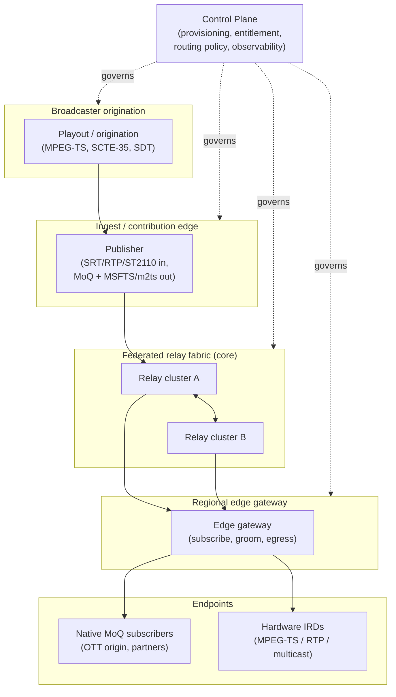
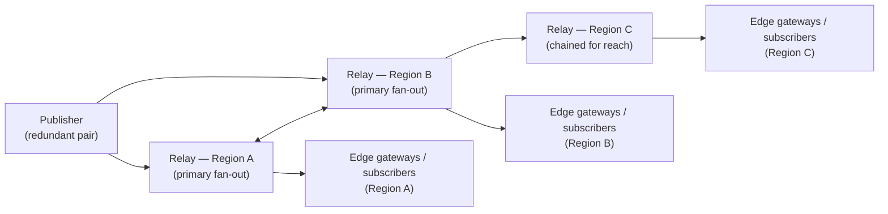
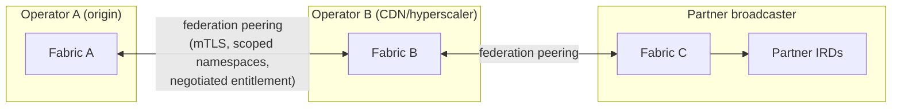
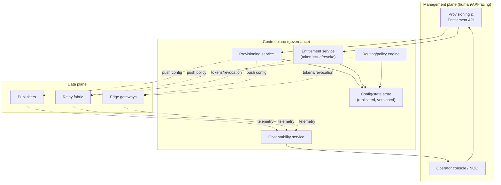
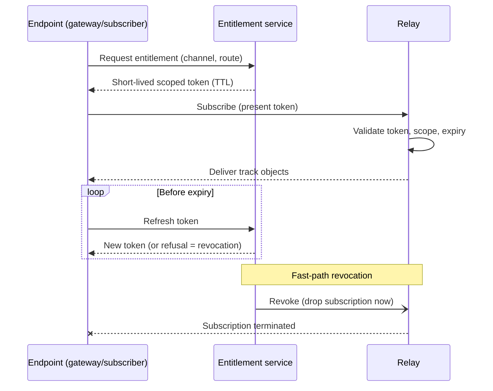
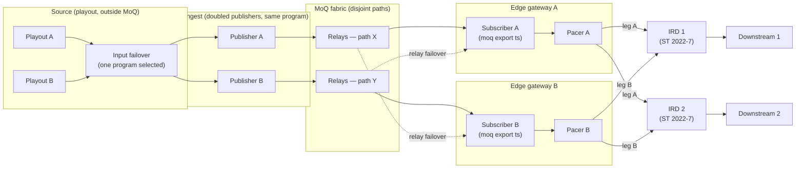
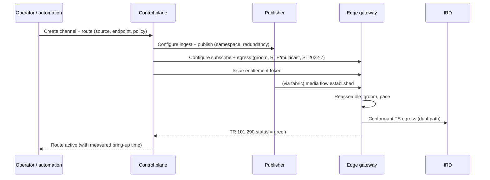

# Reference Architecture: Broadcast-Grade Primary Distribution

Status: working draft
Layer: **above the transport,** worked through on the MoQ data plane. The distinction matters for
reading this document: the grooming stage (§7), redundancy (§14), control (§9–§12) and installed-base
interop (§4.1, §8) are required and owned by the distributor *whichever* data plane carries the bytes,
and are the substance here. Only §4–§6 — packaging lanes and relay fabric — are MoQ-specific, and their
segmented-HTTP counterparts are in [alternatives](alternatives.md) §2–§3.
Scope: an end-to-end reference architecture for a broadcast-grade primary
distribution platform, covering the data plane, the control plane,
interoperability with the installed base, and the operational model. MoQ is used
throughout as the worked example because it is what the prototype runs on.

---

## 1. Purpose and scope

This document describes a reference architecture for a platform that delivers
professional broadcast primary distribution over an Internet-native transport.
It takes the requirements developed in the vision document as given: routes
provisioned by API, dynamic and revocable entitlement, the existing IRD/plant
kept working unchanged, engineered redundancy, NOC-grade observability, strong
multi-tenancy, and an interchangeable transport.

It is deliberately *not* a description of MoQ. MoQ is the preferred data plane,
but the subject here is the entire distribution platform — publishers, relays,
federation, edge gateways, egress, control plane, entitlement, observability, and
operations. The transport is one layer among several, and by design the least
differentiated. Each significant choice is stated with its justification and
trade-offs; where a design point is uncertain, this is called out rather than
smoothed over.

A note on layering: throughout, we separate the **data plane** (the path media
takes from publisher to endpoint), the **control plane** (the system that
provisions, entitles, routes, and observes), and the **management plane** (the
human-facing operational surfaces: APIs, dashboards, NOC integration). Conflating
these is the most common source of architectural error in this domain, because
their availability, latency, and consistency requirements are radically
different.

---

## 2. Design principles

These principles, derived from the vision requirements and the characteristics of
primary distribution, govern every subsequent decision.

1. **The installed base is non-negotiable.** The platform must deliver
  IRD-grade MPEG-TS to existing hardware without modification to that hardware.
   Any design that requires replacing receivers is rejected on arrival.
2. **The transport is a swappable dependency.** Because the transport
  commoditises and is currently wire-unstable, the media packaging, control,
   entitlement, and egress layers must be independent of the specific transport
   draft. The value must survive a transport change.
3. **Control-plane and data-plane failures are independent.** A control-plane
  outage must never take down established media flows. The data plane must be
   able to run on last-known-good state.
4. **Determinism at the edge, elasticity in the core.** The unpredictable public
  Internet is absorbed by grooming and buffering at the egress edge so that the
   IRD sees a deterministic stream. The core relay fabric is elastic and
   software-defined.
5. **Fail safe, deny by default.** Entitlement, admission, and routing default
  to the safe state. An expired or ambiguous entitlement denies delivery; it
   does not fall open.
6. **Everything is observable and auditable.** Every route, entitlement, and
  delivery decision emits structured telemetry and an audit record. If it
   cannot be observed, it cannot be operated for contracted content.

---

## 3. End-to-end overview

At the highest level, the platform moves a feed from a broadcaster's
origination through a publisher, across a federated relay fabric, to a regional
edge gateway that grooms and delivers broadcast-grade output to endpoints —
both native MoQ subscribers and, critically, existing hardware IRDs. A control
plane provisions and governs the whole path out-of-band.

```mermaid
flowchart TD
    %% Control plane sits naturally at the top layer
    CP["Control Plane\n(provisioning, entitlement,\nrouting policy, observability)"]

    %% Main components
    subgraph Origination["Broadcaster origination"]
        SRC["Playout / origination\n(MPEG-TS, SCTE-35, SDT)"]
    end

    subgraph Ingest["Ingest / contribution edge"]
        PUB["Publisher\n(SRT/RTP/ST2110 in,\nMoQ + MSFTS/m2ts out)"]
    end

    subgraph Fabric["Federated relay fabric (core)"]
        direction LR
        R1["Relay cluster A"]
        R2["Relay cluster B"]
        R1 <--> R2
    end

    subgraph Edge["Regional edge gateway"]
        GW["Edge gateway\n(subscribe, groom, egress)"]
    end

    subgraph Endpoints["Endpoints"]
        direction TB
        NSUB["Native MoQ subscribers\n(OTT origin, partners)"]
        IRD["Hardware IRDs\n(MPEG-TS / RTP / multicast)"]
    end

    %% Main Media Flow
    SRC --> PUB
    PUB --> R1
    R1 --> GW
    R2 --> GW
    GW --> NSUB
    GW --> IRD

    %% Control Plane Governance Connections (Targeting the Subgraphs directly)
    CP -. governs .-> Origination
    CP -. governs .-> Ingest
    CP -. governs .-> Fabric
    CP -. governs .-> Edge
```

The solid lines are the media data plane; the dotted lines are control-plane
governance. Two deliberate properties, one simplified in the diagram: native
subscribers can subscribe directly from the relay fabric without an edge gateway
(they need no grooming — a path not drawn), whereas hardware IRDs always sit
behind an edge gateway performing the broadcast-grade adaptation. The control
plane touches every component but sits on none of the media paths.

---

## 4. Publishers

The publisher is the point at which a feed enters the platform. Its job is to
accept a broadcast source, package it for the transport without discarding the
information the endpoints will need, publish it to the relay fabric, and expose
enough of itself to the control plane to be provisioned and observed.

### 4.1 Ingest interfaces

A publisher must accept the transports broadcasters already use, in descending
order of near-term importance:

- **RTP/UDP MPEG-TS, including SMPTE 2022-1 FEC and ST 2022-7 dual-path** — the
established IP contribution/distribution format in managed networks.
- **SRT** — the dominant IP contribution transport; the platform ingests it to
coexist with existing workflows rather than demand replacement.
- **ST 2110 essence** (longer term) — for uncompressed-IP plants; requires
encode/mux before publication and is a heavier integration.

Ingest is a pluggable adaptation layer with no privileged input: the publisher's
internal representation is a transport stream (or an equivalent tightly-timed
elementary-stream set), and each ingest module must produce it faithfully.

### 4.2 Media packaging: two lanes

The most consequential design decision in the publisher is *how* the media is
mapped onto MoQ. There are two broad strategies, and the choice between them is
genuinely contested: each has real advantages, and the right answer depends on
the endpoint being served and on the maturity of the tooling at the time.

1. **Media-aware re-muxing**, where the publisher parses the elementary streams
   and republishes them as discrete media tracks (video, audio, metadata) in
   MoQ's native model. This is the direction the upstream/core project prefers,
   because it is the natural fit for MoQ's track/object model.
2. **Opaque transport-stream carriage**, where the publisher carries the MPEG-TS
   verbatim as an opaque payload, packaged per the MSFTS `m2ts` profile
   (`draft-gregoire-moq-msfts`), publishing an MSF catalog describing it.

**The case for media-aware re-muxing.** Because it maps onto MoQ's native model,
it inherits the protocol's per-track prioritisation and selective-subscription
benefits directly, and it produces the individual renditions that endpoints such
as OTT origins actively want. It is the upstream/core preference and therefore
the approach most likely to attract ongoing investment and to interoperate
cleanly with the broader MoQ ecosystem. It had two weaknesses for broadcast
*contribution*, and **both are now closed upstream and verified here**: naive
keyframe detection failed on open-GOP encodes signalling recovery-point SEI
rather than IDR frames (common on real feeds, roughly one IDR every fifteen
seconds), and the re-mux lost service signalling (SDT/NIT, the exact PMT PID
layout, TSID/ONID) that an IRD and downstream headend depend on
([evidence](evidence.md) §4). What the lane still does not relay is the *clock*.
TDT/TOT is dropped by design, on the argument that an exporter mints wall time
more accurately than it relays it — but nothing regenerates it downstream either,
so it is the one named residual in the DVB service layer. EIT, including the
schedule, is measured to round-trip section-for-section, on an open upstream pull
request that carries each table on its own snapshot track
([evidence](evidence.md) §4).

**The case for opaque carriage.** It carries the transport stream verbatim, so
it preserves service signalling and programme structure *by construction* and
sidesteps the media-aware import failure classes without depending on the
upstream fixes having landed and been proven. That makes it the lower-risk path
for feeding hardware IRDs *today*, precisely because it makes no assumptions
about the source encode. Its cost is that it forgoes per-track prioritisation and
selective subscription, because a multiplexed programme is treated as a single
opaque object stream.

**How this architecture treats the choice.** **Media-aware re-muxing is the
default and preferred path**; opaque carriage is the **fallback**. That ordering
is now supported by what has been measured rather than only by design direction:
the media-aware lane is the one carried end-to-end over the public internet, the
one whose contribution-feed defects have closed upstream, and the one that costs
5.3 % less bandwidth than SRT because it declines to carry null stuffing
([evidence](evidence.md) §1, §4, §8). The opaque prototype has never left
loopback, so it functions here as a transparency *reference* — the benchmark
against which the media-aware lane's residual gaps are measured — rather than as
a deployed alternative ([implementation](implementation.md) §2). Media-aware is
also what lets the platform exploit per-track prioritisation and selective
subscription (a subscriber can protect video over a secondary audio, or drop a
rendition under stress) and serve rendition-consuming endpoints directly.

Two reasons to reach for the fallback remain. It preserves the time-varying
tables the media-aware lane drops, which matters where a receiver needs the
carried wall clock or EPG rather than a regenerated one. And it makes no
assumptions about the source encode at all, which is worth something for a feed
whose provenance is unknown. Against that it cannot express per-track
prioritisation, presenting the whole programme as one object stream, and it
forgoes the null-stripping saving if it carries the stream truly verbatim. The
rule for a given route is therefore "media-aware unless a specific feed or
endpoint forces the fallback." This is a point on which the repository actively
invites challenge (see [CONTRIBUTING](../CONTRIBUTING.md)).

Upstream has for now scoped the opaque TS lane out of the core protocol
implementation (it "breaks interop with players that don't support TS") — a
sensible boundary for a general-purpose transport, and simply why the opaque
adaptation is a platform responsibility here rather than inherited from the
transport.

### 4.3 Transport independence

The publisher's packaging layer (framing, catalog generation, and the reassembly
contract with the egress) is specified *independently of the MoQ transport draft*:
the draft governs how bytes move on the wire, the MSFTS/m2ts framing governs what
they mean. Because successive drafts change the wire protocol substantially,
binding the media layer to one would make every transport upgrade a media-layer
rewrite. Keeping them independent — and covering the media layer with round-trip
and property tests — reduces the media-layer impact of an upgrade to a thin glue
change. It does not make the *fleet* migration trivial; that remains substantial
operational work ([transport](transport.md) §5.2). This is the concrete mechanism
behind principle 2 (§2).

### 4.4 Publisher redundancy

A publisher is a candidate single point of failure, so publishers must be
deployable as redundant pairs with independent ingest paths, publishing under a
scheme that lets the egress perform hitless selection (§14). Of the two common
patterns — active/active dual publication and active/standby — active/active is
preferred for contracted content because it removes failover-detection latency
from the critical path, at the cost of roughly double ingest and first-hop
bandwidth. This is the same trade-off broadcasters already accept for ST 2022-7,
carried end-to-end.

---

## 5. Relays & the fabric

> **Deep dive:** this section gives the integrative view; see [relay](relay.md)
> for the detailed relay topology, routing, capacity, and resilience treatment.

Relays are the core of the data plane. A relay accepts published tracks and
serves them to subscribers — other relays or endpoints — implementing
subscription-based fan-out, caching, and prioritised forwarding.

### 5.1 Role and placement

A single relay does three things: it terminates QUIC/MoQ sessions from
publishers and downstream subscribers; it maintains, for each track, the set of
active subscriptions and forwards objects to them; and it caches recent objects
so that a late or recovering subscriber can be served without going back to the
publisher. Fan-out happens at the relay: one inbound copy of a track can serve
many outbound subscriptions, which is what makes 1:N distribution efficient
without publisher-side replication.

Relays are organised into **clusters** (relays sharing state within a region or
availability zone) that interconnect into a **fabric** spanning regions. In
practice a modest number does most of the work: a typical deployment might use
two relays in two regions, each handling the bulk of fan-out for nearby
endpoints, chaining onward to reach a further region only where reach demands it.
The diagram below shows that minimal shape, not a maximal mesh.

```mermaid
flowchart LR
    PUB["Publisher\n(redundant pair)"]
    RA["Relay — Region A\n(primary fan-out)"]
    RB["Relay — Region B\n(primary fan-out)"]
    RC["Relay — Region C\n(chained for reach)"]

    GWA["Edge gateways / subscribers\n(Region A)"]
    GWB["Edge gateways / subscribers\n(Region B)"]
    GWC["Edge gateways / subscribers\n(Region C)"]

    PUB --> RA
    PUB --> RB
    RA <--> RB
    RB --> RC
    RA --> GWA
    RB --> GWB
    RC --> GWC
```

The fabric is a mesh, not a static tree: a subscription propagates *upstream*
toward the publisher only as far as necessary. If an intermediate relay already
carries the track (because another subscriber in that region wants it), the new
subscription attaches to the existing flow. This is the mechanism by which
fan-out scales without re-originating traffic, and it is why two well-placed
relays can serve many endpoints before additional relays are needed.

### 5.2 Routing strategy

The fabric routes subscriptions along paths chosen by policy. The baseline is
shortest-path routing across a mesh of relay clusters. MoQ supplies the
building blocks for this — relay/subscription semantics and the notion of a
relay serving objects it already carries — but the distributed parts (peer
discovery, cross-relay subscription and cache state, coherence, and failure
recovery) are properties the platform must *build and operate*, not behaviours
guaranteed by the base transport. On top of that baseline the platform layers
policy-aware routing: a route may be pinned to particular regions for
data-sovereignty or rights reasons, may be constrained to avoid a degraded link,
or may be required to use two link-disjoint paths for redundancy.

The design decision here is to keep *reachability and fan-out* in the transport
layer (where it is efficient and commoditised) but to keep *policy* in the
control plane. The control plane expresses intent ("this route must use two
disjoint paths and must not egress outside the EU"); the fabric realises it. We
resist the temptation to encode rights and sovereignty policy into the transport
itself, both because the transport is swappable (§2) and because policy changes
far more frequently than topology.

### 5.3 Caching & late subscribers

Relay caching lets a newly attached subscriber start promptly from a recent point
and provides a small recovery buffer for loss. Its size and retention trade
start-up latency against memory cost and how far behind live a recovering
subscriber may fall. Note that primary distribution tolerates fairly high
end-to-end latency, so *low latency is a benefit of this architecture, not a hard
requirement*; the bias toward small caches is about bounding how far behind live a
subscriber falls and limiting memory cost, not about a few seconds of latency
being unacceptable.

### 5.4 What relays don't do

Relays do not groom for IRD compliance, do not perform entitlement decisions
beyond enforcing the authorization the control plane has already granted, and do
not transcode. Keeping relays "dumb and fast" is deliberate: it lets the relay
layer be the part of the stack that most closely resembles commodity HTTP-3 CDN
infrastructure, which is exactly the layer the vision argues will commoditise.
The broadcast-grade intelligence lives at the edge (§7) and in the control plane
(§9), not in the relay.

That is an economic position as much as an architectural one. A relay that stays
cache-shaped is one a CDN can operate as an extension of what it already runs, which
is the mechanism by which relay capacity could reach commodity pricing
([economics](economics.md) §4.9); a relay that accumulates broadcast-specific
intelligence becomes a media server, which is the shape that has kept every
incumbent IP transport in premium per-stream pricing. Complexity pushed into the
relay is therefore paid for twice — once in engineering, once in forgoing the
cheapest delivery market available.

---

## 6. Relay federation

> **Deep dive:** see [relay](relay.md) for federation topology detail.

Federation is the mechanism by which relay fabrics operated by *different
parties* — a broadcaster's own fabric, a CDN's fabric, a hyperscaler's fabric,
and partner broadcasters' fabrics — interconnect to deliver a feed across
administrative boundaries.

> **Read this section as a long-term aspiration, not a near-term deliverable.**
> Everything the platform actually needs in the near and mid term works *within a
> single operator's* fabric. Cross-operator federation is the most speculative
> part of this document; it is described so the design does not paint itself into
> a corner, not because it is buildable today (see §6.3).

### 6.1 Why federation matters

Primary distribution routinely crosses organisational boundaries: a rights
holder delivers to partner broadcasters who operate their own infrastructure. A
single-operator fabric cannot serve this without either forcing all parties onto
one operator (commercially untenable and a single point of control) or
reintroducing manual hand-offs at every boundary. Federation makes the boundary
a first-class, governed interconnect rather than an ad-hoc gateway.

```mermaid
flowchart LR
    subgraph OrgA["Operator A (origin)"]
        FA["Fabric A"]
    end
    subgraph OrgB["Operator B (CDN/hyperscaler)"]
        FB["Fabric B"]
    end
    subgraph OrgC["Partner broadcaster"]
        FC["Fabric C"]
        IRDC["Partner IRDs"]
    end

    FA <-->|"federation peering\n(mTLS, scoped namespaces,\nnegotiated entitlement)"| FB
    FB <-->|"federation peering"| FC
    FC --> IRDC
```

### 6.2 The federation contract

A federation peering is defined by four things: a mutually authenticated trust
relationship (typically mTLS with a negotiated or cross-signed identity), a
namespace agreement (which track namespaces one fabric will accept from and
serve to the other), an entitlement bridge (how an entitlement issued in one
domain is honoured or re-issued in the other), and a capacity/QoS agreement
(what throughput and priority the peering carries).

The key design decision is that **entitlement does not blindly transit a
federation boundary**. Fabric B honouring an entitlement issued by Fabric A
requires an explicit trust and mapping decision, because the two operators have
different tenants, different namespaces, and different accountability. The
architecture models this as an *entitlement exchange* at the boundary: the
originating entitlement is validated, and a domain-local entitlement is minted
for downstream propagation, with the mapping recorded for audit. This is more
work than transparent token pass-through, but transparent pass-through would
make one operator's compromise another operator's breach.

### 6.3 Uncertainty

Federation is the least mature part of this architecture and should be treated as
a **research direction, not a capability it delivers.** The MoQ cluster/relay
model provides the *mechanics* of inter-relay peering *within a single trust
domain*; cross-*operator* federation with negotiated entitlement across
administrative boundaries is not something the protocol or surrounding standards
offer today, and it must clear a commercial-trust bar (one operator honouring
another's entitlements) arguably harder than the technical one. The honest
position: revisit it if and when both standards and trust models catch up, and do
not let the rest of the platform depend on it meanwhile.

---

## 7. Regional edge gateways

The edge gateway is where the platform earns the right to call itself
broadcast-grade. It is the component that turns the elastic, best-effort,
object-bursty output of the relay fabric into a deterministic, conformant stream
that a hardware IRD will accept.

### 7.1 Responsibilities

An edge gateway subscribes to one or more tracks from the nearest relay, and for
each configured egress it performs, in order:

1. **Reassembly** of the MSFTS/m2ts objects back into a contiguous MPEG-TS byte
  stream, preserving the original TS structure.
2. **Grooming** — the broadcast-grade adaptation described in §7.2.
3. **Egress formatting** — RTP/UDP (payload type 33) or raw UDP, unicast or
  multicast, with optional SMPTE 2022-1 FEC and ST 2022-7 dual-path output.
4. **De-jitter pacing and a decoder-safe start gate** so the IRD sees a smoothly
  paced stream and starts cleanly.
5. **Read-only TR 101 290 monitoring** of its own output, feeding observability.
6. **Deterministic output** when the gateway is one half of an ST 2022-7 pair, so
  that a peer gateway grooming the same objects produces a bit-identical,
  sequence-aligned stream the IRD can merge hitlessly (§14.1). This holds when
  placement is keyed to stream position rather than to the groomer's own emit
  clock, and is measured for a co-started pair across every path and upstream
  failure ([evidence](evidence.md) §7). A leg that *joins* a pair separately is
  the open case, and what blocks it is upstream of the gateway.

### 7.2 The grooming problem, and why it belongs to every data plane

**Any Internet-native transport delivers media in bursts, and a transport stream
reassembled directly from those bursts has a PCR that hardware IRDs reject on
TR 101 290. Grooming is the fix, it sits at the edge, and it is required whichever
data plane carries the bytes.**

It is tempting to read this as a cost of MoQ's object model, and measurement says the
opposite: **segmented HTTP is the harder case, by two orders of magnitude.** Carrying the
same clip, MoQ's egress arrives in 12.4 kB bursts with a
worst-case silence of 149 ms, while classic HLS arrives in 2.95 MB bursts with 24
silences over a second and a worst case of 4.01 s
([evidence](evidence.md) §10). A MoQ groomer needs milliseconds of buffer; a
segmented-HTTP groomer needs seconds — a depth it derives from the arrival it observes rather
than one an operator supplies, which is what lets a single stage sit behind either plane
(§7.4). Low-latency HLS does not rescue this in practice — partial segments would, but no
free client fetches them (§7.4).

The underlying mechanism is common. A stream reassembled from bursts has a programme
clock reference that is *smooth but not byte-accurate*: the PCR values are broadly
correct but the inter-PCR timing, as seen at the byte level, is not. Software players
tolerate this. **Hardware IRDs do not**: they lock a phase-locked loop to the PCR and
raise TR 101 290 P1/P2 alarms when the PCR interval drifts. On MoQ's media-aware lane
**13–26 % of PCR intervals exceed the 40 ms conformance limit** depending on source,
with excursions well over 100 ms ([evidence](evidence.md) §3,
[lab: T2](../lab/test-2-media-aware-transparency.md)).

It is worth being precise about *what* is at fault, because three distinct things
are easily conflated. (1) **Delivery cadence:** MoQ hands objects to the edge in
bursts, so a stream reassembled directly from those bursts has PCR *intervals*
that no longer reflect a constant mux rate — this is the 13–26 % figure above, and it
is a property of object delivery over a congestion-adaptive transport, not of MoQ
corrupting the TS bytes. (2) **Timestamp regeneration:** the *media-aware* lane,
which demultiplexes and re-muxes, additionally has to *regenerate* PCR/PTS/DTS
from decoded timing, a separate source of error that the opaque lane avoids
entirely by carrying the original values verbatim. (3) **Live-wire accuracy:**
even a perfectly re-timed file can jitter at the physical output (§7.2 caveat).
Only (1) is inherent to *Internet-native delivery as such* — it is the same reason SRT,
Zixi, RIST and segmented HTTP all groom the transport stream before hand-off to an IRD.
They do not arrive at that requirement by the same route: the object and segment planes
impose a cadence of their own, whereas the point-to-point tunnels are transparent and
merely pass on their publisher's ([evidence](evidence.md) §11). Either way none of them
re-stamps PCR against an output clock, which is what the IRD is grading. (2) is the only one of the three that is genuinely
specific to a data plane, and specifically to MoQ's media-aware lane: segmented HTTP
carries the original timestamps verbatim, as the opaque lane does, and so avoids it.
Grooming (below) addresses (1) and (3), while the opaque lane sidesteps (2).

Grooming reconstructs a constant cadence from the bursty arrival. Concretely it:
(a) **re-inserts null packets** (PID `0x1FFF` stuffing) to pad the reassembled
stream back to the target mux rate, since null packets are commonly stripped for
efficient transport (see [transport](transport.md) §4.4 for the full end-to-end
transformation); (b) **paces the output as a byte-locked constant bit rate
(CBR)**; and (c) applies a **monotonic PCR re-stamp and PCR re-insertion** so PCR
values are byte-accurate against the reconstructed CBR clock rather than merely
approximately correct. The result is a stream whose inter-PCR timing satisfies the
IRD's PLL and TR 101 290 P1/P2 regardless of how bursty the arrival was. Note that
this is *re-timing*, not re-multiplexing: the TS packets themselves (PIDs, PES,
SCTE-35, service signalling) are untouched. Because PCR is re-stamped to the
reconstructed egress clock while the PES timestamps (PTS/DTS) are carried
unchanged, the groomer must preserve the PCR-to-PTS/DTS relationship so that the
receiver's transport-stream buffer model (T-STD) remains valid; confirming this
against a real decoder is part of the hardware acceptance work in §17. This is a
genuine correctness boundary: re-stamping to a locally reconstructed clock means
the groomer must also have a defined answer for **source-clock drift** (the
reconstructed egress rate must track the source's true rate, or PTS/DTS and the
egress PCR clock diverge and the T-STD buffer eventually under- or overflows),
**PCR discontinuities and the 33-bit PCR wrap**, and **mid-stream changes** (PID
or PCR-PID changes, `discontinuity_indicator` handling; the safe default is to
preserve source discontinuity signalling, not mask it). None of this is solved by
the re-stamp arithmetic alone, and the hardware acceptance work must exercise it,
not just steady-state conformance on a clean capture. This function is not provided
by the upstream transport; it lives in the platform, realised today by a
byte-locked CBR groomer (the public `mpegts-pacer` crate) that is file-validated to
deliver CBR/PCR conformance — 13–26% of PCR intervals > 40 ms taken to 0%, 0
`pcrverify` violations at 500 µs ([lab: T2](../lab/test-2-media-aware-transparency.md)) — subject to the
hardware caveat below. It is one of the clearest examples of broadcast-grade work
living in the platform, not the protocol.

The design decision to place grooming at the *edge* rather than at the publisher
is deliberate: grooming depends on the delivery jitter accumulated across the
whole path, which is only known at the point of egress. Grooming at the
publisher would be undone by the fabric; grooming at the edge absorbs the
Internet's variability exactly where determinism is required (principle 4, §2).

> Caveat, stated plainly: the correctness of grooming must be *demonstrated on
> real hardware IRDs*, not merely asserted from file analysis, and file
> validation is *optimistic* for a specific reason. Analysing a captured file
> (e.g. TSDuck `pcrverify`) checks PCR values against byte position and the
> nominal mux rate — it confirms the *arithmetic* of the re-stamp. It cannot
> capture the real-time behaviour that actually decides P1/P2 on hardware: the
> egress is produced by a software CBR pacer on a general-purpose OS and NIC,
> whose scheduling jitter is invisible in a re-captured file. PCR_accuracy in
> particular (the ±500 ns TR 101 290 P2 check) is a property of the *wire timing
> at the physical output*, which only a hardware analyser or IRD measuring the
> live egress can confirm — a file that looks clean can still fail on a decoder
> if output pacing jitters. A clean TR 101 290 P1/P2 pass on hardware decoders is
> therefore the single most important validation for this entire architecture, and
> it must include the ST 2022-7 determinism of §14.1 under loss — the software half
> of which is now measured, including under 1 % and 3 % loss, leaving the hardware
> merge as the open part. Until that evidence exists, the grooming design is
> "structurally sound and file-validated," not "proven broadcast-acceptable."

### 7.3 Placement and scaling

Edge gateways are placed close to the endpoints they serve — ideally at the hand-off location within the partner's own facility. They scale horizontally: each
gateway handles a bounded set of egress flows, and additional flows are served
by additional gateway instances. Because grooming and egress are per-flow and
largely stateless across flows, this scales cleanly. The gateway is, however,
the most CPU- and timing-sensitive component (CBR pacing and PCR re-stamping are
real-time obligations), so gateway capacity planning is dominated by timing
headroom, not raw throughput.

### 7.4 The same gateway on a segmented-HTTP data plane

The edge gateway is the component that makes this architecture broadcast-grade, and
**it is required in the same place, with the same responsibilities, if the data plane
is segmented HTTP instead of MoQ.** Setting the two side by side is the clearest
statement of why the transport choice settles less than it appears to:

| Gateway responsibility (§7.1) | On MoQ | On segmented HTTP |
|---|---|---|
| Reassemble to a transport stream | re-mux from tracks, or verbatim on the opaque lane | concatenate segments — **easier**, and byte-verbatim for a single programme |
| Absorb delivery burstiness | 12.4 kB bursts, 149 ms worst-case silence → milliseconds of buffer | 2.95 MB bursts, 4.01 s worst-case silence → **seconds of buffer**, derived from arrival rather than configured |
| Re-insert stuffing to the target mux rate | required: nulls are stripped in transit | not required: nulls are carried, which is also why it costs ~7 % more on the wire |
| Byte-locked CBR pacing and PCR re-stamp | required | **required, identically** |
| FEC, ST 2022-7 pairing, start gating, egress TR 101 290 | required | **required, identically** |

The bottom two rows are the expensive ones, and they do not move. What moves is the
buffer the gateway needs and the arithmetic it does on the way in — and on balance the
segmented-HTTP gateway is *easier to write* and *harder to run*: reassembly is trivial,
and the burst absorption that precedes conformant pacing is two orders of magnitude
larger. The obligation is identical on both, and it is now discharged by one stage on
both: the public groomer has been measured to the same conformance on a segmented-HTTP
egress as on a MoQ one, with no flag changed ([implementation](implementation.md) §9.1,
[T16](../lab/test-16-grooming-segmented-http.md)).

**The buffer depth is a quantity the gateway derives, not an operator assumption, and that
distinction is load-bearing.** "Seconds of buffer" is not a number anyone can supply in
advance, because it is a property of the egress rather than of the gateway: it follows from
segment duration, from how often the client misses a publish cycle, and — behind a
transparent transport like RIST or SRT — from whatever the far-end encoder happens to do
([evidence](evidence.md) §11). The groomer therefore measures how far ahead of real time its
input runs and sizes the cushion, the buffer cap, the start condition and the stall timeout
from that one observation. Two consequences for anyone sizing a gateway: the resident memory
is set by the input (13.1 MB on a 2 s-segment 10 Mb/s feed, against megabytes on MoQ), and so
is the failure-detection time (~9 s against MoQ's ~1 s), because a cushion deep enough to ride
out a normal inter-segment gap cannot also distinguish a dead origin from a slow publish.

**The escape route is closed for now.** Burst size is segment size, so a smaller
segment reduces both the buffer and the latency floor, and the limit of that is partial
segments. Those can be *published* carrying MPEG-TS, free, with Apple's tools — but no
freely available client fetches them, so the egress a gateway actually sees is the
classic one and the only receivers that could change that are commercial ABR-to-TS
boxes ([evidence](evidence.md) §10.1,
[implementation](implementation.md) §2.2). Until that changes, choosing segmented HTTP
means choosing the larger buffer.

---

## 8. The installed base

The existing receiving plant is not a component the platform builds; it is a
constraint the platform must satisfy. It is listed here as a first-class element
of the architecture because designing as though it were optional is the most
common way Internet-native distribution proposals fail.

### 8.1 What the IRD expects

A hardware IRD or professional decoder expects, at minimum:

- A conformant MPEG-2 transport stream over its supported interface (RTP/UDP over IP, frequently multicast).
- TR 101 290 P1/P2 conformance, above all conformant PCR timing.
- Stable service signalling: a consistent PMT PID, correct SDT service identity,
and preserved SCTE-35, teletext, and subtitling.
- ST 2022-7 dual-path input for redundancy, in facilities that use it.

The edge gateway (§7) exists precisely to meet this contract. From the IRD's
perspective, nothing has changed: it receives the same kind of stream on the
same kind of interface, monitored by the same TR 101 290 probes, with the same
redundancy scheme. The Internet-native fabric upstream of the gateway is
invisible to it.

### 8.2 Coexistence, not replacement

The architecture is explicitly a *coexistence* architecture. It does not require
the broadcaster or its affiliates to replace receivers, re-cable plant, or
change monitoring. This is both a technical stance and a commercial one: the
trust barrier (vision §3.3) is lowered dramatically when the receiving end is
untouched, and migration can proceed route by route rather than as a plant-wide
cutover. Where a partner is willing to run a native MoQ subscriber (for example
at an OTT origin), the edge gateway can be bypassed for that endpoint — but this
is an option, never a requirement.

---

## 9. Control plane

> **Deep dive:** this section gives the integrative view; see
> [control-plane](control-plane.md) for the detailed API surface, state model,
> and consistency treatment.

The control plane is where the durable value of the platform concentrates — not
the groomer, and certainly not the transport. One honest caveat belongs here,
though: the control-plane space is already crowded. MediaConnect, Zixi, LTN and
others ship capable provisioning and management planes, so "value lives in the
control plane" is a *necessary* condition for defensibility, not a sufficient one;
it has to be materially better for *this* job, not merely present. Its job is to
provision routes, manage entitlement, express routing and redundancy policy, and
drive observability — all out-of-band from the media path.

### 9.1 Core model

The control plane operates on a small set of first-class entities:

- **Tenant** — an isolated administrative and billing domain (a broadcaster, a
business unit, a partner).
- **Channel / service** — a logical feed, independent of the routes that carry
it.
- **Route** — a delivery relationship from a source (publisher) to an endpoint,
with policy attached (redundancy, region constraints, priority).
- **Endpoint / subscriber** — a consuming party: an edge gateway feeding IRDs, a
native MoQ subscriber, or a federation peer.
- **Entitlement** — a time-bounded, revocable grant permitting a specific
endpoint to receive a specific channel over a specific route.
- **Policy** — the routing, redundancy, and compliance rules attached to routes
and tenants.

```mermaid
flowchart TB
    subgraph MP["Management plane (human/API-facing)"]
        API["Provisioning &\nEntitlement API"]
        UI["Operator console / NOC"]
    end

    subgraph CPcore["Control plane (governance)"]
        PROV["Provisioning service"]
        ENT["Entitlement service\n(token issue/revoke)"]
        ROUTE["Routing/policy engine"]
        OBS["Observability service"]
        STATE["Config/state store\n(replicated, versioned)"]
    end

    subgraph DP["Data plane"]
        PUBS["Publishers"]
        RELAYS["Relay fabric"]
        GWS["Edge gateways"]
    end

    API --> PROV
    API --> ENT
    UI --> API
    PROV --> STATE
    ENT --> STATE
    ROUTE --> STATE
    PROV -. push config .-> PUBS
    PROV -. push config .-> GWS
    ROUTE -. push policy .-> RELAYS
    ENT -. tokens/revocation .-> RELAYS
    ENT -. tokens/revocation .-> GWS
    PUBS -. telemetry .-> OBS
    RELAYS -. telemetry .-> OBS
    GWS -. telemetry .-> OBS
    OBS --> UI
```

### 9.2 The out-of-band principle

The single most important control-plane decision is that it is **out-of-band and
non-fate-sharing with the data plane** (principle 3, §2). Components in the data
plane are pushed configuration, policy, and entitlement, and they *cache and
enforce it locally*. If the control plane becomes unavailable, established media
flows continue on last-known-good state: publishers keep publishing, relays keep
forwarding, gateways keep grooming, and existing entitlements remain valid until
their natural expiry. What is lost during a control-plane outage is the ability
to *make changes* — provision new routes, grant new entitlements, or revoke
early — not the ability to *keep delivering*.

This has a sharp consequence for entitlement design, addressed in §11:
revocation cannot depend solely on the control plane being reachable at the
moment of revocation, or a control-plane outage would make revocation
impossible. The architecture resolves this with short-lived tokens plus an
explicit revocation channel, so that the *worst case* for revocation is bounded
by token lifetime even if the fast-path revocation is unavailable.

### 9.3 API surface

The control plane exposes a versioned, idempotent API mirroring the entity
model: create/update/suspend/delete for tenants, channels, routes, and
endpoints; grant/refresh/revoke for entitlements. Idempotency is required
because provisioning is frequently driven by automation that retries, and a
retried "create route" must not create two routes. Versioning is required
because the platform's clients (a broadcaster's own orchestration) have their
own release cycles and cannot be forced to upgrade in lockstep.

### 9.4 State and consistency

The control-plane state store is replicated and versioned. Its consistency
requirement is *strong for entitlement and policy* (you must not serve two
conflicting views of who is entitled) but it tolerates higher latency than the
data plane because control operations are human- or automation-paced (seconds),
not media-paced (milliseconds). This asymmetry — a strongly consistent but
comparatively slow control plane, a fast but eventually-consistent data plane —
is a deliberate and load-bearing design choice.

---

## 10. Authentication

> **Deep dive:** see [security](security.md) for the full identity, key
> management, and threat-model treatment.

Authentication establishes *who* a party is before any authorization decision is
made. The platform authenticates three distinct classes of principal, and
conflating them is a security error.

### 10.1 Principal classes

- **Data-plane peers** (publishers, relays, gateways, federation peers)
authenticate to one another with **mTLS**. Each component holds an identity
certificate; sessions are mutually authenticated. This is the natural fit for
long-lived, machine-to-machine QUIC sessions and gives strong, revocable
identity at the transport layer.
- **Subscribers/endpoints** authenticate to the fabric using **path-scoped
tokens** (JWT) that also carry entitlement (§11). Identity and entitlement are
bound in the same credential for endpoints, because for a consuming endpoint
the two questions ("who are you" and "what may you receive") are answered
together.
- **Management-plane callers** (operators, automation) authenticate to the
control-plane API using the tenant's chosen identity system (typically OIDC /
federated SSO for humans, and API credentials or workload identity for
automation), distinct from the data-plane credentials.

### 10.2 Why token auth is native

MoQ provides an authorization *hook* at the point of subscription: a relay can
carry authorization information and accept or reject a subscription there, so the
platform builds on it rather than fronting the transport with a separate auth
proxy. The credential presented at that hook — a path-scoped JWT verified against
a signing key — is a deployment profile of ours, not a wire-format primitive MoQ
defines; what MoQ contributes is the native enforcement point, not the token
format. The advantage is that authorization is enforced locally at the relay at
subscription, with no window in which an unauthorised subscription is accepted
then torn down. The enforcement is coupled to how MoQ exposes that hook, but the
shape we depend on (scoped paths plus expiry, checked at subscription) is simple
and stable even as the wire format churns, and the entitlement *service* is
transport-independent.

---

## 11. Entitlement

> **Deep dive:** see [entitlement](entitlement.md) for the detailed grant model,
> token/policy design, and cross-org delegation treatment.

Entitlement is the mechanism that makes distribution *dynamic and revocable* —
the property the vision identifies as central to API-driven operation. It
answers: may this endpoint receive this channel, right now, and for how long?

### 11.1 Model

An entitlement is a time-bounded, revocable grant binding a principal (endpoint)
to a resource (channel/track namespace) over a route, subject to policy. It is
realised as a short-lived, path-scoped token that the endpoint presents when
subscribing. The relay enforces it: no valid entitlement, no delivery.
Enforcement is *deny-by-default* (principle 5, §2) — an absent, malformed, or
expired token denies the subscription.

### 11.2 The revocation problem

Revocation is the hard part of any entitlement system, and it interacts directly
with the out-of-band control-plane principle (§9.2). There are two revocation
paths, and the architecture uses both:

1. **Fast path** — an explicit revocation signal pushed from the entitlement
  service to the relays and gateways, which drop the affected subscriptions
   immediately. This gives sub-second revocation *when the control plane is
   healthy*.
2. **Backstop** — short token lifetimes with continuous renewal. Because tokens
  expire quickly and must be refreshed, the *worst-case* time to revoke is
   bounded by the token lifetime even if the fast path is unavailable. Revocation
   then happens simply by declining to refresh.

The design trade-off is token lifetime: shorter lifetimes tighten the worst-case
revocation bound but increase renewal traffic and the control plane's steady-state
load. The choice is a policy parameter, and for high-value contracted content the
bias is toward short lifetimes and aggressive renewal, accepting the overhead in
exchange for a tight, control-plane-independent revocation guarantee.

```mermaid
sequenceDiagram
    participant EP as Endpoint (gateway/subscriber)
    participant ENT as Entitlement service
    participant RLY as Relay

    EP->>ENT: Request entitlement (channel, route)
    ENT-->>EP: Short-lived scoped token (TTL)
    EP->>RLY: Subscribe (present token)
    RLY->>RLY: Validate token, scope, expiry
    RLY-->>EP: Deliver track objects
    loop Before expiry
        EP->>ENT: Refresh token
        ENT-->>EP: New token (or refusal = revocation)
    end
    Note over ENT,RLY: Fast-path revocation
    ENT-)RLY: Revoke (drop subscription now)
    RLY--xEP: Subscription terminated
```

### 11.3 Federation and delegation

As noted in §6.2, entitlement does not transit a federation boundary
transparently. When a route crosses into a peer fabric, the boundary performs an
entitlement exchange: it validates the incoming grant and mints a domain-local
grant for onward propagation, recording the mapping for audit. Delegation within
a tenant (a broadcaster authorising an affiliate to re-distribute) is modelled
the same way — as an explicit, recorded delegation, never as credential sharing.

---

## 12. Observability

> **Deep dive:** see [operations](operations.md) for the NOC operating model,
> SLOs, alerting, and runbooks.

Observability is a first-class requirement (principle 6, §2), not an add-on,
because contracted content cannot be operated on faith. The platform must be
observable in *two languages simultaneously*: the language of distributed
systems (the golden signals — latency, traffic, errors, saturation) and the
language of broadcast operations (signal conformance, error seconds, PCR
integrity).

### 12.1 Broadcast-domain monitoring

Every edge gateway performs read-only TR 101 290 monitoring of its own egress
and reports P1/P2 status, PCR interval statistics, continuity-counter integrity,
and service presence. This is the telemetry a NOC already understands, and it is
what lets the platform integrate with existing broadcast monitoring rather than
replace it. The design intent is that a broadcast NOC sees the platform's output
in the same terms it sees a satellite or fibre feed today — the same probes, the
same alarms — so that adopting the platform does not require adopting a new
operational vocabulary.

### 12.2 Systems-domain monitoring

Every component emits structured telemetry: session counts and health, per-track
subscription counts, relay cache hit/miss, delivery latency and jitter across
the fabric, congestion and loss indicators, and control-plane operation latency
(provisioning time, revocation time). This is what lets the platform be operated
as software infrastructure — capacity-planned, auto-scaled, and alerted on before
a broadcast-domain symptom appears.

### 12.3 Correlation and audit

The two domains must be correlatable: a TR 101 290 excursion at a gateway should
be traceable to a congestion event on a specific fabric path, which should in
turn be visible in the systems telemetry. The architecture requires a common
correlation identifier flowing from publisher through fabric to gateway so that a
single delivery incident can be reconstructed end-to-end. Separately, every
control-plane action (provision, grant, revoke, policy change) writes an
immutable audit record — who did what, to which resource, when — which is a
requirement for rights compliance and incident forensics, not merely good
practice.

---

## 13. Multi-tenancy

> **Deep dive:** tenancy isolation spans the control plane and security model;
> see [control-plane](control-plane.md) and [security](security.md) for detail.

Multi-tenancy is the precondition for the platform being operated as *shared*
infrastructure rather than one silo per customer. It is also a primary source of
risk, because a tenancy-isolation failure is simultaneously a security breach and
a rights-compliance breach.

### 13.1 Isolation model

Tenancy isolation operates at several layers:

- **Namespace isolation** — each tenant's channels and tracks live in a scoped
namespace; tokens are scoped to a tenant's namespace and cannot address
another tenant's tracks. This is enforced at the relay, at the point of
subscription.
- **Policy and quota isolation** — each tenant has resource quotas (routes,
bandwidth, subscriber counts) that bound the blast radius of any one tenant's
behaviour, whether malicious, buggy, or merely a traffic spike.
- **Data isolation** — telemetry, audit records, and captures are partitioned by
tenant; one tenant cannot observe another's routes or logs.

### 13.2 Shared data plane, isolated control

The deliberate trade-off is that tenants **share the relay fabric** (what makes
shared-infrastructure economics work) but are **isolated in the control plane and
in namespace/entitlement**. Sharing the data plane means one tenant's traffic
contributes to congestion another might experience. Quotas and prioritisation
*bound* this but do not *eliminate* it: quotas cap admission and volume, but do
not by themselves guarantee latency or jitter isolation once a shared relay's CPU,
NIC, or an upstream link is saturated. This is the same residual risk any
multi-tenant CDN carries. Where a contract requires *hard* isolation, the
architecture permits dedicated relay clusters at higher cost — isolation is a
spectrum expressed as policy, not a single global choice.

---

## 14. High availability & redundancy

The platform's availability target is not a web-style number of nines; it is
the broadcast expectation of "no visible failure during contracted content"
(vision §2). Meeting that on a best-effort substrate is the central reliability
challenge, and it is addressed at every layer rather than at one.

### 14.1 Layered redundancy

```mermaid
flowchart LR
    subgraph Source["Source (playout, outside MoQ)"]
        S1["Playout A"]
        S2["Playout B"]
        SEL["Input failover\n(one program selected)"]
        S1 --> SEL
        S2 --> SEL
    end
    subgraph Ingest["Ingest (doubled publishers, same program)"]
        P1["Publisher A"]
        P2["Publisher B"]
    end
    subgraph Fabric["MoQ fabric (disjoint paths)"]
        RX["Relays — path X"]
        RY["Relays — path Y"]
    end
    subgraph EdgeA["Edge gateway A"]
        SUBA["Subscriber A\n(moq export ts)"]
        PACA["Pacer A"]
        SUBA --> PACA
    end
    subgraph EdgeB["Edge gateway B"]
        SUBB["Subscriber B\n(moq export ts)"]
        PACB["Pacer B"]
        SUBB --> PACB
    end
    IRD1["IRD 1\n(ST 2022-7)"]
    IRD2["IRD 2\n(ST 2022-7)"]
    D1["Downstream 1"]
    D2["Downstream 2"]

    SEL --> P1
    SEL --> P2
    P1 --> RX
    P2 --> RY
    RX --> SUBA
    RY --> SUBB
    RY -.->|"relay failover"| SUBA
    RX -.->|"relay failover"| SUBB
    PACA -->|"leg A"| IRD1
    PACA -->|"leg A"| IRD2
    PACB -->|"leg B"| IRD1
    PACB -->|"leg B"| IRD2
    IRD1 --> D1
    IRD2 --> D2
```

Redundancy is applied end to end, mirroring what broadcasters already do with
ST 2022-7 but extending it back to the source. The hitless 1+1 lives in the
*delivery* legs, which carry the **same program**; source (playout) redundancy is
a separate, upstream concern:

1. **Source** — main/backup playout with input failover *upstream of MoQ* (§14.5).
  This resolves to **one** program; the switch is break-before-make and rare, and its
  only job is to keep a good program flowing into ingest.
2. **Ingest** — a doubled publisher pair carries that **one** program onto the
  fabric. Both legs must carry the *same* content (§14.5, [evidence](evidence.md) §7):
  that is what lets the downstream pair be merged hitlessly — two unrelated encodes
  cannot be.
3. **Path** — the fabric carries each leg over a link-disjoint path. If a relay or
  path fails, the surviving leg keeps flowing and the IRD rides it; a subscriber can
  *also* re-home to the other path's relay (**subscriber-side relay failover**, the axis
  that matters most here — today supervisor-assisted, since MoQ has no native
  client-side relay failover yet, [transport](transport.md) §8.3).
4. **Edge** — each leg's **subscriber** (`moq export ts`) feeds a **pacer** that
  grooms the delivered MoQ objects into a packet-identical, rate-coherent RTP egress.
  (The "edge gateway" of §7 is exactly this subscriber+pacer pairing.) The pacer
  *enables* ST 2022-7 by producing an aligned egress; it does not itself switch.
5. **Merge / egress** — two **IRDs**, each taking **both** legs, perform the
  ST 2022-7 hitless switch. This is where the failover actually happens and where
  "no visible stall" is delivered; each IRD feeds a downstream path, so the receiver
  is doubled too.

The redundancy is therefore two same-program legs **merged at the receiver**, not a
full ingest-side mesh. Cross-connection is placed where it does work: each IRD takes
both legs (the always-on ST 2022-7 dual input), and each subscriber can re-home to the
other path's relay. We deliberately **do not** rely on relay-side source reselect
between the two publishers — that is a bounded nice-to-have (§14.3,
[relay](relay.md) §4.1), not the mechanism that keeps the service up. The hitless
decision lives at the IRD, using its existing ST 2022-7 capability, so the final
failover requires no new receiver behaviour.

**Making the ST 2022-7 pair actually hitless is a constraint on the groomer, and it is
the one design decision in this section that matters.** ST 2022-7 reconstructs by matching
RTP sequence numbers, so the two egress streams must be *packet-identical with aligned
sequence numbers*; it tolerates differential path delay but not differing packet content.
The pacers cannot be locked together in real time, so identity has to be computed
independently — and **what decides whether they can is whose clock chooses each packet's
slot.**

Two groomers keyed to their own **emit instants** do not merge at all, and the failure is
structural rather than a timing mismatch: each strips the arriving nulls and picks its own
content/stuffing interleave, so the legs disagree on PID order and null count. They are two
different transports rather than one transport stamped twice, and nothing at the receiver
can rescue that. Keying placement to the **stream** instead — a packet's slot is a function
of its source PCR at the locked mux rate, with the emitted PCR, RTP sequence number and RTP
timestamp all derived from that slot — makes what a leg sends a function of the broadcast
rather than of when its process started. Two such groomers sharing no process, clock or
messages emit one transport.

That is measured: at a reference receiver, a pair from **two independent stream-clocked
groomers** is hitless across leg blackout, path loss, differential delay and every
upstream-chain failure, as is a pair from **one groomer duplicated onto both paths**
([evidence](evidence.md) §7, [lab: T12](../lab/test-12-dual-path-handoff.md)). One half of
the requirement is not: identity is necessary but not sufficient, because two gateways
pacing from free-running oscillators can drift apart, and if that drift plus differential
path delay exceeds the merge window protection fails even with identical packets. The pair
measured shared a host and therefore a clock, so **rate coherence between independent
gateways is untested**; a real deployment needs a disciplined common egress rate, locked to
a shared reference or to the source-derived CBR rate, though not packet-for-packet phase
alignment.

That change has a second payoff, because it shares the same prerequisite: **it is what
lets the platform stop carrying null stuffing over the WAN at all.** Stuffing exists to
hold a constant carrier rate for the receiver, and §7.2 regenerates it at the edge
regardless, so carrying it across the fabric is waste a byte pipe such as SRT cannot
avoid and MoQ need not pay — measured at **5.3 % below SRT on the same path**, and worth
roughly half the bandwidth bill on a loosely filled carrier ([evidence](evidence.md) §8,
[economics](economics.md) §3.1). The saving used to be unbankable on a redundant pair for
exactly the reason above, since stripping made each groomer choose its own stuffing.
Stream-derived stuffing removes the objection and unlocks the saving together.

**Two independently groomed chains are therefore the topology to build.**
Groom-once-and-duplicate is equally hitless but has a single publisher, relay and exporter
behind it, so it protects the last hop only; a stream-clocked pair protects the whole
chain. (Two *ungroomed* legs also merge exactly, which was worth establishing because it
isolated the obstacle to the groomer rather than to MoQ delivery, but an ungroomed leg is
not a transport an IRD will lock to, [evidence](evidence.md) §3.) Where deterministic
grooming cannot be guaranteed for a feed, the honest fallback is 1+1 hot-standby with a
brief switch artefact, not a claimed-hitless pair.

One operating constraint survives, and stream clocking moved it to a different component.
Under arrival clocking a pair had to be **co-started**, because a leg that joined late or
returned came back misnumbered by the length of its own absence — RTP sequence counted
datagrams sent, so silence cost it numbers instead of consuming them. Stream clocking
removes that: a leg that mutes and returns rejoins its partner's numbering exactly, and a
leg joining late puts the same programme in the same slots under the same numbers. What
stops both cases short of *byte*-identity is not the groomer but `moq export ts`, which
renders continuity counters from its own process state. So **which receiver a deployment
uses decides whether a single leg can be restarted alone**: input-select protection returns
immediately, while a sequence-merge receiver needs the pair restarted together until the
upstream fix lands ([moq-dev/moq#2779](https://github.com/moq-dev/moq/issues/2779)). And
grooming, which is what makes a leg presentable, is also what makes a *dead* leg look alive
unless the groomer stops with its content: see §14.3.

### 14.2 Graceful degradation

Where full redundancy cannot prevent impairment, QUIC's per-stream delivery and
MoQ's prioritisation allow the platform to degrade gracefully rather than fail
abruptly — shedding lower-priority tracks or renditions while preserving the
primary programme, instead of head-of-line-blocking the whole flow as a
TCP-based transport would. This is realised on the default media-aware lane (§4.2),
which exposes the individual tracks to shed or protect. On the **opaque fallback
lane** the benefit is constrained, because the programme is a single opaque object
stream with limited internal prioritisation; the fallback trades graceful
degradation away in exchange for verbatim carriage. This is an honest limitation
of the fallback, not of the default design.

### 14.3 Failure scenarios and responses

Every response below assumes the two legs are actually mergeable, which §14.1 shows is
a property of the egress topology rather than a given. Where a response says the IRD
rides the surviving leg hitlessly, that is measured for a pair the receiver can merge:
two stream-clocked groomers on independent chains, or one groomer duplicated onto both
paths — the latter having no independent upstream chain to protect, so the upstream
responses below do not apply to it ([lab: T12](../lab/test-12-dual-path-handoff.md)).
Two *arrival-clocked* groomers are not a pair at all.

- **Source (playout) failure** — upstream input failover selects the backup
playout (§14.5); the switch is break-before-make at the source and rare. Both
delivery legs then carry the new program, and nothing downstream re-initialises.
- **Publisher failure** — the other leg's publisher keeps its path flowing, so the
IRD rides that surviving leg with no visible transition; with active/active ingest
there is no failover-detection latency on the critical path. The relay *can also*
reselect a dead active source onto a shared-origin standby
([#2473](https://github.com/moq-dev/moq/pull/2473), on `main`; [relay](relay.md) §4.1,
[evidence](evidence.md) §7), but only as a **bounded reselect** — one QUIC idle timeout
of detection, ungraceful loss only, no seamless merge. Useful, not load-bearing; the
no-stall path is the IRD.
- **Relay or link failure** — the surviving leg keeps flowing and the IRD rides it
hitlessly; the affected subscriber can additionally re-home to another relay
(supervisor-assisted today, [transport](transport.md) §8.3).
- **Edge (subscriber / pacer) failure** — the redundant leg's egress continues; the
IRD's ST 2022-7 merge covers the loss hitlessly.
- **Content loss behind a healthy groomer** — the failure mode a component-liveness list
missed, and the one the receiver cannot be made responsible for. A groomer asked only
to hold a rate holds it against a dead source: byte-perfect CBR carrier, correct PCRs
included, no programme packets in it, for as long as it is left running. Loss,
continuity and silence all read healthy; an input-select receiver performs zero
switches at any threshold, and a sequence merge prefers the dead leg to its live
partner. The signal has been destroyed upstream of the receiver, so **the groomer must
detect the silence and mute** — stop emitting while holding its output byte clock, and
stop minting the PCR that makes the carrier look conformant. With that in place each
upstream failure above produces a leg that stops with its content and exactly one
input-select switch at any threshold ([lab: T12](../lab/test-12-dual-path-handoff.md)).
Monitoring still keys on **programme content** rather than packet arrival, because a
mute is a configured behaviour and a leg groomed by something else will not do it — and
the content check has to discount the groomer's own adaptation-field-only PCR
insertions, which otherwise register as content ([operations](operations.md) §3).
- **A leg that returns** — a recovered leg rejoins the schedule but not byte-identity. A
stream-clocked groomer that mutes and resumes comes back on exactly the numbering its
partner has reached, carrying the same programme in the same slots within ~10 ms, so
input-select protection is restored immediately and the numbering deficit that made an
arrival-clocked leg unusable is gone (§14.1). What it does not recover is packet identity,
because `moq export ts` renders continuity counters and the audio/video interleave from its
own process state; the returning leg is therefore mergeable by input select but not by
sequence merge until the pair is restarted together, and closing that gap is upstream work
([evidence](evidence.md) §7). Which of the two a deployment's receivers implement therefore
decides whether a single leg can be maintained in isolation.
- **IRD failure** — the second IRD (also dual-input) keeps delivering to its
downstream path; doubling the receiver removes the last single point.
- **Regional failure** — routes are re-homed to another region by the routing
engine; edge gateways in the failed region are replaced by gateways in a
neighbouring region, at the cost of added path latency.
- **Control-plane partition** — the data plane continues on last-known-good
state (§9.2); only change operations are suspended until the control plane
recovers.

### 14.4 The honest limit

All of the above assumes the *public-Internet substrate does not fail
simultaneously along both disjoint paths*. Disjoint-path routing reduces but
does not eliminate correlated failure (a large-scale BGP event or a shared
upstream provider can affect both paths). This is a genuine residual risk that
satellite — with its terrestrial-network independence — does not have. The
platform mitigates it with path diversity across providers and with the
transport-swappable hedge (falling back to a managed transport for the most
critical always-on routes), but it does not claim to eliminate it. 

### 14.5 Separation of responsibilities: what MoQ owns vs. what stays around it

The redundancy layers above only compose cleanly if each failure domain is owned by
the layer best able to handle it. The redundancy investigation
([lab: T6](../lab/test-6-relay-resilience.md), [evidence](evidence.md) §7) makes that division
concrete, and it is a deliberate architectural position rather than a workaround for
current gaps:

- **Publisher *input* redundancy stays outside MoQ.** Choosing between primary and
  backup *source* feeds (SDI/ASI/IP input switching, upstream contribution failover)
  is a contribution-domain concern with mature tools — a TSDuck input switch
  (`tsp -I switch`), a hardware/software input selector, or a redundant encoder pair.
  Putting source-selection logic inside a MoQ publisher would re-implement that
  ecosystem badly and couple input policy to transport. The publisher's job is to
  take *one* good input and get it onto the fabric reliably; which input is "good" is
  decided before MoQ. **Recommendation: keep input failover upstream of the publisher.**
  - **Constraint the drills add: the two publishers must be fed the *same* source, or they are not a
    failover pair.** Relay-mesh source failover only splices cleanly when both publishers carry an
    identical PMT/track layout and a consistent PTS timeline, which a single shared feed guarantees but
    two independent encodes do not ([relay](relay.md) §4.1, [evidence](evidence.md) §7). The practical
    topology is therefore **two ingest paths, but one selected path fanned into *both* publishers** so
    they produce the same broadcast, with the **second path held as source-side failover for both**
    (the `tsp -I switch`/input-selector decision upstream of the fan-out). A standby publisher joining
    that shared feed **mid-stream** is fine — an offset in moq group numbering does not break the
    reselect, since the exporter skips to the new live edge — so the pair need not be started in
    lock-step. What must not differ is the *content*: distinct encodes with the same broadcast name
    cannot fail over.
- **MoQ owns transport resilience and relay routing.** Per-leg QUIC reconnection,
  keep-alive/idle-timeout tuning, cache/fan-out, announce propagation, and cost/
  shortest-path route selection across the relay mesh are squarely MoQ's
  responsibility, and are where MoQ adds value over a point-to-point transport. The
  drills confirm the transport half works (publisher auto-reconnect, byte-identical
  fan-out, cluster formation), and the two gaps they pinned as legitimately MoQ's have
  since landed upstream: the exporter's session-loss handling
  ([#2469](https://github.com/moq-dev/moq/pull/2469)) and standby-route propagation for
  active/active source failover ([#2473](https://github.com/moq-dev/moq/pull/2473), §14.3;
  [relay](relay.md) §4.1) — the latter as a *bounded* reselect, since this implementation's
  content-agnostic relay does route selection rather than the object-level dedup the IETF draft
  specifies as a hedged SHOULD ([relay](relay.md) §4.1, [evidence](evidence.md) §7).
- **Broadcast-grade *service* redundancy is the doubled chain plus downstream hitless
  selection.** Relay-mesh source failover has since landed, but it is bounded (one idle
  timeout, ungraceful loss only), so service continuity is still delivered the way
  broadcasters already trust: **dual publishers → dual relays → dual subscribers →
  ST 2022-7 / IRD hitless selection at the edge** (§14.1). MoQ carries two healthy
  disjoint legs; the *hitless switch* between them lives at the receiver, which already
  implements it. This keeps the last-hop failover free of new receiver behaviour and
  depends on no unshipped MoQ feature. A **dual-pacer** edge, one groomer per leg, is
  the natural reading of this bullet, and it now works: with placement keyed to stream
  position the two legs are byte-identical and the pair rides out the death of a
  publisher, a relay or an exporter with nothing lost at the receiver
  ([lab: T12](../lab/test-12-dual-path-handoff.md), §14.1). The residual constraint is
  narrower than the old one and sits upstream: a leg that restarts *alone* rejoins the
  numbering and the programme but not byte-identity, because `moq export ts` numbers
  continuity counters per process. Planned maintenance on one leg of a live pair is
  therefore safe under an input-select receiver and needs a paired restart under a
  sequence-merge one.

The forward-looking nuance: relay-mesh source failover has landed and is *useful* — it
lets a single-homed subscriber ride out an *ungraceful* active-source death without a
downstream merge — but it is a **bounded routing-layer enhancement, not a substitute for
broadcast-grade service today**: it costs one detection interval, does not cover a
graceful source exit, and a genuinely seamless merge is out of scope for *this*
content-agnostic-relay implementation. The IETF draft does specify object-level dedup, as a hedged
SHOULD, but conformant dedup needs identical object *numbering* across the pair rather than merely
identical bytes, which is at least as hard as the receiver-side alignment
([relay](relay.md) §4.1, [evidence](evidence.md) §7). The doubled-and-downstream pattern remains the
no-stall answer, and input failover should stay outside MoQ permanently.

---

## 15. Operational workflows

These workflows show how the components combine in day-to-day operation — the
concrete expression of the vision's "channel in minutes, not months" claim.

### 15.1 Route bring-up

```mermaid
sequenceDiagram
    participant OP as Operator / automation
    participant CP as Control plane
    participant PUB as Publisher
    participant GW as Edge gateway
    participant IRD as IRD

    OP->>CP: Create channel + route (source, endpoint, policy)
    CP->>PUB: Configure ingest + publish (namespace, redundancy)
    CP->>GW: Configure subscribe + egress (groom, RTP/multicast, ST2022-7)
    CP->>GW: Issue entitlement token
    PUB->>GW: (via fabric) media flow established
    GW->>GW: Reassemble, groom, pace
    GW->>IRD: Conformant TS egress (dual-path)
    GW-->>CP: TR 101 290 status = green
    CP-->>OP: Route active (with measured bring-up time)
```

The measured elapsed time from API call to green TR 101 290 status is itself a
headline operational metric — the concrete proof of the agility claim. Note the
sequence presumes the make-or-break gate is met: "green TR 101 290" at the end is
contingent on grooming passing P1/P2 on real hardware (§7.2, §17), not yet
demonstrated. Until it is, this describes the intended operation, not a proven
one.

### 15.2 Entitlement change and revocation

A rights window closing, a partner being off-boarded, or an emergency takedown
are all entitlement operations (§11.2). The operator (or automation) calls
revoke; the fast path drops the subscription within sub-second latency when the
control plane is healthy, and the short-token backstop bounds the worst case
otherwise. The action is audited.

### 15.3 Planned failover and maintenance

Because redundancy is end-to-end (§14), maintenance on any single layer — draining
a relay, upgrading a gateway, patching a publisher — is performed by shifting
traffic to the redundant path first, then servicing the drained element, then
restoring. The IRD, protected by ST 2022-7 on the last hop, sees nothing. This is
the operational pattern that lets the platform be patched and upgraded (including
transport-draft upgrades, §4.3) without a maintenance window visible to the feed.
Two conditions from §14.1 apply: the drained leg must be confirmed dead by *content*
rather than by carrier, and restoring a single leg is only transparent to an
input-select receiver — a sequence-merge receiver needs the pair restored together
([operations](operations.md) §4).

### 15.4 Degraded-quality triage

When a TR 101 290 excursion or delivery-quality alarm fires, the correlation
identifier (§12.3) lets the NOC trace the broadcast-domain symptom to a
systems-domain cause — a congested path, a saturated gateway, a failing publisher
— and respond with the appropriate workflow (reroute, scale, failover). The
platform's value in this workflow is that the two domains are correlated; the
broadcast NOC is not left guessing whether a PCR alarm is a source problem or a
transport problem.

---

## 16. Key decisions & trade-offs

The load-bearing decisions and the trade-offs they carry:

| Decision                                              | Rationale                                                        | Trade-off accepted                                                 |
| ----------------------------------------------------- | ---------------------------------------------------------------- | ------------------------------------------------------------------ |
| Media-aware re-muxing as default/preferred; opaque TS carriage as fallback (§4.2) | Media-aware is MoQ-native, enables per-track prioritisation, and carries the service in 5.3 % less bandwidth by not carrying stuffing; opaque preserves the time-varying tables verbatim | Opaque fallback forgoes per-track prioritisation and, if truly verbatim, the stuffing saving; media-aware does not relay TDT/TOT, so the edge must mint wall time |
| Transport-independent media/control layers (§4.3, §9) | Survives MoQ draft churn; transport commoditises                 | Extra abstraction; cannot exploit every transport-specific feature |
| Grooming at the edge, not the publisher (§7.2)        | Absorbs whole-path jitter where determinism is required          | CPU/timing-heavy edge; per-flow real-time obligation               |
| Dumb-and-fast relays (§5.4)                           | Keeps the commodity layer commodity; value moves up-stack        | Intelligence and cost concentrate at edge and control plane; relays are not yet interchangeable *between* implementations (§17) |
| Out-of-band, non-fate-sharing control plane (§9.2)    | Data plane survives control-plane outages                        | Revocation needs a token backstop, not just a live signal          |
| Short tokens + fast-path revocation (§11.2)           | Bounds worst-case revocation independent of control-plane health | Steady-state renewal overhead                                      |
| Shared data plane, isolated control (§13.2)           | Enables shared-infrastructure economics                          | Cross-tenant congestion coupling, bounded by quotas                |
| ST 2022-7 last-hop redundancy (§14.1)                 | Hitless failover using the IRD's existing capability             | Doubles egress bandwidth; needs disjoint paths end-to-end          |
| Hybrid backstop for highest-assurance routes (§14.4)  | Correlated Internet failure is a real residual risk              | Retains some managed/satellite cost where used                     |

---

## 17. Open questions

The significant unresolved points in this architecture, consistent with the
repository's stance against overstating confidence:

- **Hardware TR 101 290 validation.** Grooming is file-validated and
structurally sound but must be proven to pass P1/P2 on real hardware IRDs
(§7.2). This is the make-or-break validation and is not yet complete.
- **Cross-operator federation.** A long-term aspiration, not a deliverable of
this architecture: cross-operator entitlement exchange (§6) depends on standards,
protocol, and commercial-trust developments that do not exist today. The
near-term platform is deliberately single-operator.
- **Correlated-failure behaviour.** The residual risk of simultaneous impairment
across disjoint Internet paths (§14.4) is not yet characterised in production,
which is why a hybrid backstop is recommended for the highest-assurance routes.
- **Relay portability between implementations.** This architecture treats the relay
as a commodity layer (§5.4), which presumes a feed can be carried over a relay
somebody else operates. Measured against every public relay, it currently cannot:
carriage succeeds only within a single implementation, blocked by an announce
convention rather than by anything architectural ([evidence](evidence.md) §9,
[interoperability](interoperability.md) §9.6). The protocol permits portability and
the fix is a client-side default, but until it is demonstrated, "commodity relay"
is an aspiration and vendor lock-in is the realistic near-term position.
- **Economics at always-on trunk scale.** As the vision notes, the cost case is
route-specific and strongest for dynamic/long-tail routes; it is not
established for always-on trunk routes against depreciated incumbent capacity — and
unlike the others here, it cannot be settled *in public*, since the deciding inputs are
commercially sensitive. [Economics](economics.md) §4.7 therefore states it as a parity
threshold an operator substitutes its own figures into.

These are the questions the rest of the repository — the transport, control-plane,
interoperability, operations, and economics documents — exists to reduce. This
architecture is the frame into which those answers are placed as they arrive; it
is deliberately written so that a negative answer to any one of them changes a
component or a trade-off, rather than invalidating the whole.