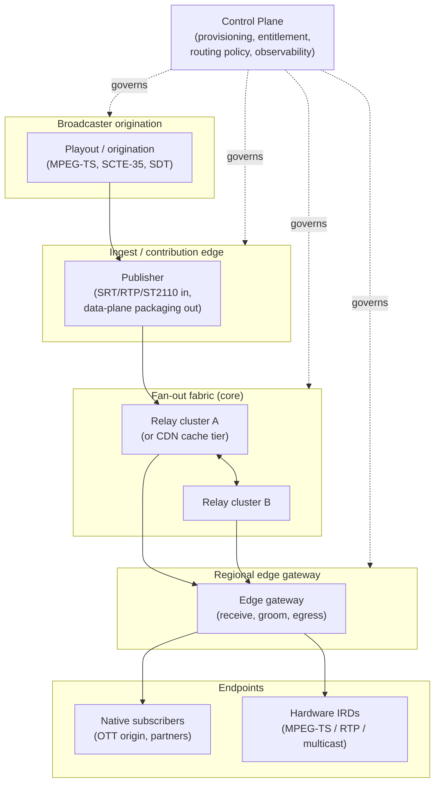
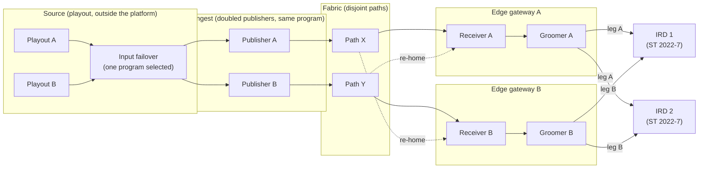

# Reference Architecture: Broadcast-Grade Primary Distribution

Status: working draft.
Layer: **above the transport.** Everything in §4–§9 is required and owned by the distributor
*whichever* data plane carries the bytes, and is the substance of this repository. Only §6 (carriage
lanes) and §8 (the fan-out fabric) are MoQ-specific; their segmented-HTTP counterparts are in
[Comparison](comparison.md) §8 and §2.

Scope: an end-to-end reference architecture for a platform that delivers professional broadcast
primary distribution over an Internet-native transport. It takes the requirement set in
[Problem](problem.md) §5 as given and develops R3 (IRD-conformant egress), R6 (redundancy) and R8
(observability). MoQ is used as the worked example because it is what the
prototype runs on; the transport-specific parts are marked.

The document is ordered by where the engineering actually is. The edge gateway (§4) and redundancy
(§5) come first because they are the components that make the result broadcast-grade and the ones
this campaign has measured. Everything after §6 is context, design intent or a deep dive.

---

## 1. Purpose and layering

This is deliberately *not* a description of MoQ. The subject is the entire distribution platform —
publishers, relays, edge gateways, egress, control plane, entitlement, observability and operations.
The transport is one layer among several, and by design the least differentiated.

Throughout, three planes are kept separate, because conflating them is the most common source of
architectural error in this domain: the **data plane** (the path media takes from publisher to
endpoint), the **control plane** (the system that provisions, entitles, routes and observes), and the
**management plane** (the human-facing surfaces: APIs, dashboards, NOC integration). Their
availability, latency and consistency requirements are radically different.

### 1.1 Design principles

Derived from [Problem](problem.md) §1 and §5, and governing every decision below.

1. **The installed base is non-negotiable.** The platform must deliver IRD-grade MPEG-TS to existing
   hardware without modification to that hardware. Any design that requires replacing receivers is
   rejected on arrival.
2. **The transport is a swappable dependency.** Because the transport commoditises and is currently
   wire-unstable, the media packaging, control, entitlement and egress layers must be independent of
   the specific transport draft. The value must survive a transport change.
3. **Control-plane and data-plane failures are independent.** A control-plane outage must never take
   down established media flows. The data plane must run on last-known-good state.
4. **Determinism at the edge, elasticity in the core.** The unpredictable public Internet is absorbed
   by grooming and buffering at the egress edge so that the IRD sees a deterministic stream. The core
   relay fabric is elastic and software-defined.
5. **Fail safe, deny by default.** Entitlement, admission and routing default to the safe state. An
   expired or ambiguous entitlement denies delivery; it does not fall open.
6. **Everything is observable and auditable.** If it cannot be observed, it cannot be operated for
   contracted content.

---

## 2. End-to-end overview

```mermaid
flowchart TD
    CP["Control Plane\n(provisioning, entitlement,\nrouting policy, observability)"]

    subgraph Origination["Broadcaster origination"]
        SRC["Playout / origination\n(MPEG-TS, SCTE-35, SDT)"]
    end

    subgraph Ingest["Ingest / contribution edge"]
        PUB["Publisher\n(SRT/RTP/ST2110 in,\ndata-plane packaging out)"]
    end

    subgraph Fabric["Fan-out fabric (core)"]
        direction LR
        R1["Relay cluster A\n(or CDN cache tier)"]
        R2["Relay cluster B"]
        R1 <--> R2
    end

    subgraph Edge["Regional edge gateway"]
        GW["Edge gateway\n(receive, groom, egress)"]
    end

    subgraph Endpoints["Endpoints"]
        direction TB
        NSUB["Native subscribers\n(OTT origin, partners)"]
        IRD["Hardware IRDs\n(MPEG-TS / RTP / multicast)"]
    end

    SRC --> PUB
    PUB --> R1
    R1 --> GW
    R2 --> GW
    GW --> NSUB
    GW --> IRD

    CP -. governs .-> Origination
    CP -. governs .-> Ingest
    CP -. governs .-> Fabric
    CP -. governs .-> Edge
```

Solid lines are the media data plane; dotted lines are control-plane governance. Two deliberate
properties, one simplified in the diagram: native subscribers can subscribe directly from the fabric
without an edge gateway (they need no grooming — a path not drawn), whereas hardware IRDs always sit
behind an edge gateway performing the broadcast-grade adaptation. The control plane touches every
component and sits on none of the media paths.

**The fabric box is the only part that changes with the data plane.** On MoQ it is a relay cluster
(§8); on segmented HTTP it is an origin plus a cache tier. Everything to the right of it is identical.

---

## 3. What the installed base requires

The existing receiving plant is not a component the platform builds; it is a constraint the platform
must satisfy. It is stated before the design because designing as though it were optional is the most
common way Internet-native distribution proposals fail.

A hardware IRD or professional decoder expects, at minimum:

- A conformant MPEG-2 transport stream over its supported interface (ASI, or increasingly RTP/UDP
  over IP, frequently multicast).
- **TR 101 290 P1/P2 conformance — above all conformant PCR timing.**
- Stable service signalling: a consistent PMT PID, correct SDT service identity, and preserved
  SCTE-35, teletext and subtitling.
- ST 2022-7 dual-path input for redundancy, in facilities that use it.

The egress formats the platform therefore supports are MPEG-TS over RTP/UDP (payload type 33) and raw
UDP, unicast or multicast; SMPTE 2022-1 FEC for loss protection on the egress network; ST 2022-7
hitless dual-path; and decoder-safe start gating with de-jitter pacing. Multicast, FEC and ST 2022-7
are treated as *egress implementation details* rather than end-to-end architecture: they are
reconstructed at the edge to match what the local plant expects, decoupled from how the feed
traversed the fabric.

**This is a coexistence architecture.** It does not require the broadcaster or its affiliates to
replace receivers, re-cable plant or change monitoring. That is both a technical stance and a
commercial one: the trust barrier ([Problem](problem.md) §2.4) is lowered dramatically when the
receiving end is untouched, and migration can proceed route by route rather than as a plant-wide
cutover. Where a partner is willing to run a native subscriber — at an OTT origin, say — the edge
gateway can be bypassed for that endpoint, but this is an option, never a requirement.

### 3.1 Ingest

The platform ingests the transports broadcasters already use, in descending order of near-term
importance: **RTP/UDP MPEG-TS** including SMPTE 2022-1 FEC and ST 2022-7 dual-path, the established
managed-network format; **SRT**, the dominant IP contribution transport, ingested to coexist with
existing workflows rather than demand replacement; and **ST 2110 essence** in the longer term, which
requires encode/mux before publication and is a heavier integration with its own PTP considerations.

Ingest is a pluggable adaptation layer with no privileged input: the internal representation is a
transport stream, and each ingest module must produce it faithfully.

---

## 4. The edge gateway: grooming and egress

**This is the component that makes the architecture broadcast-grade, it is required in the same place
with the same responsibilities on either data plane, and it is where nearly all the measured work in
this repository sits.**

An edge gateway receives one or more feeds from the nearest fan-out point and, for each configured
egress, performs in order:

1. **Reassembly** into a contiguous MPEG-TS byte stream, preserving the original TS structure.
2. **Grooming** — the broadcast-grade adaptation described in §4.1.
3. **Egress formatting** — RTP/UDP or raw UDP, unicast or multicast, with optional SMPTE 2022-1 FEC
   and ST 2022-7 dual-path output.
4. **De-jitter pacing and a decoder-safe start gate** so the IRD sees a smoothly paced stream and
   starts cleanly.
5. **Read-only TR 101 290 monitoring** of its own output, feeding observability (§9).
6. **Deterministic output** when the gateway is one half of an ST 2022-7 pair (§5.1).
7. **Silence detection and mute** when its content source stops (§5.3). This is not optional and it
   is not obvious; it is the failure mode a component-liveness list misses.

### 4.1 The grooming problem, and why it belongs to every data plane

**Any Internet-native transport delivers media in bursts, and a transport stream reassembled directly
from those bursts has a PCR that hardware IRDs reject on TR 101 290. Grooming is the fix, it sits at
the edge, and it is required whichever data plane carries the bytes.**

It is tempting to read this as a cost of MoQ's object model, and measurement says the opposite:
**segmented HTTP is the harder case, by two orders of magnitude.** Carrying the same clip, MoQ's
egress arrives in 12.4 kB bursts with a worst-case silence of 149 ms, while classic HLS arrives in
2.95 MB bursts with 24 silences over a second and a worst case of 4.01 s
([Evidence](evidence.md) §3.8).

**Three distinct things are easily conflated, and only one is inherent to Internet-native delivery as
such.**

1. **Delivery cadence.** Objects or segments arrive in bursts, so a stream reassembled directly from
   them has PCR *intervals* that no longer reflect a constant mux rate. This is a property of
   delivery over a congestion-adaptive transport, not of any protocol corrupting TS bytes. It is the
   only one of the three that every candidate shares — which is why SRT, Zixi, RIST and segmented
   HTTP all groom before hand-off. They do not arrive at the requirement by the same route: the
   object and segment planes impose a cadence of their own, whereas the point-to-point tunnels are
   transparent and merely pass on their publisher's ([Evidence](evidence.md) §3.8). Either way none
   of them re-stamps PCR against an output clock, which is what the IRD is grading.
2. **Timestamp regeneration.** The *media-aware* MoQ lane, which demultiplexes and re-muxes,
   additionally has to regenerate PCR/PTS/DTS from decoded timing. This is the only one of the three
   that is specific to a data plane: segmented HTTP carries the original timestamps verbatim, as the
   opaque MoQ lane does, and so avoids it.
3. **Live-wire accuracy.** Even a perfectly re-timed file can jitter at the physical output. This is
   what TR 101 290 P2's ±500 ns PCR_accuracy check measures, and it is invisible to file analysis.

Grooming addresses (1) and (3); the opaque lane sidesteps (2).

**What grooming does.** It (a) **re-inserts null packets** (PID `0x1FFF`) to pad the reassembled
stream back to the target mux rate, since nulls are commonly stripped for efficient transport; (b)
**paces the output as a byte-locked constant bit rate**; and (c) applies a **monotonic PCR re-stamp
and PCR re-insertion** so PCR values are byte-accurate against the reconstructed CBR clock rather
than merely approximately correct.

Note that this is *re-timing*, not re-multiplexing: the TS packets themselves — PIDs, PES, SCTE-35,
service signalling — are untouched. That distinction is what separates a stage that passes all four
grading criteria from the alternatives that re-mux, which each fail a different one.

How much of (a)–(c) the stage has to do depends on the delivery lane it sits behind, and that changes
which tools qualify. Behind a MoQ egress all three are required, and no off-the-shelf stage does (a)
while leaving the mux intact, so the stage is custom. Behind a segmented-HTTP egress the packager has
already preserved the stuffing, the declared mux rate and the PCR spacing, so only (b) is left and
TSDuck supplies it — at the cost of a cushion at least as deep as the segment period
([Evidence](evidence.md) §3.2).

**Placement at the edge rather than the publisher is deliberate**: grooming depends on the delivery
jitter accumulated across the whole path, which is only known at the point of egress. Grooming at the
publisher would be undone by the fabric; grooming at the edge absorbs the Internet's variability
exactly where determinism is required (principle 4).

### 4.2 What is measured, and what is not

This is the load-bearing evidence in the repository and it must be read with its domain attached.
Full results and limits are in [Evidence](evidence.md) §3.2.

Rows are ordered as a receiver meets them: what is delivered first, what the arithmetic says second.

| | Measured | Domain |
|---|---|---|
| Groomed, MoQ lane | **131–159 intervals above 40 ms in 25 s, 227 ms maximum**, at the ~1 s cushion the lane runs — and **unchanged at every cushion across an eightfold ladder**, and with groomer starvation removed altogether. *The ladder was run on a different rig over a longer window, so its counts are larger for the same defect; they are in [Evidence](evidence.md) §3.2* | **wire** |
| Groomed, MoQ lane, live public-internet path | **0.06 %** of intervals above 40 ms — 8 gaps, 139 ms maximum *(one run)* | live chain, file-analysed |
| Groomed, MoQ lane | **0 %** of intervals above 40 ms, exact CBR, 0 `pcrverify` violations at ±500 ns across four clips | **file** |
| Ungroomed media-aware egress | **0–26 % of PCR intervals exceed 40 ms**, depending on source | file |
| Groomed, segmented-HTTP lane, 8 s derived cushion | **0** intervals above 40 ms, 0 PCR violations at 481 ns, 0 continuity errors | **wire** |
| Any lane | — | **hardware IRD: not run** |

Three consequences follow and none of them is cosmetic.

**P1 PCR repetition is a measured failure as delivered, not a caveat, and no amount of buffer fixes
it.** The groomer inherits the exporter's PCR spacing and delivers 131–159 intervals above 40 ms in 25 s.
A stage that mints its own PCR schedule (a regenerating muxer) places PCRs freely and posts none; a
pass-through stage that carries the exporter's inherits their spacing. That word "inherits" is exact and
was tested: sweeping the cushion across eight times the depth, and separately removing groomer starvation
entirely, moves the figure not at all — while the groomer's own insertions vary 137 → 0 across that
ladder, because it can only place a PCR in a slot it was going to stuff and those slots do not fall in
the exporter's gaps ([Evidence](evidence.md) §3.2). **The MoQ lane is not P1-conformant on PCR repetition as delivered at any
buffer depth**, the cause sits upstream of this architecture's edge gateway, and any claim of "0 %" that
does not name the file domain is wrong.

**File validation is optimistic, which is why the two columns disagree.** Analysing a captured file
checks PCR values against byte position and the nominal mux rate — it confirms the *arithmetic* of
the re-stamp, and that is a precondition rather than a result. It cannot capture the real-time
behaviour that decides P1/P2 on hardware: the egress is produced by a software CBR pacer on a
general-purpose OS and NIC, whose scheduling jitter is invisible in a re-captured file. The
repository has always said this of P2 PCR_accuracy, which is a property of wire timing at the
physical output; the P1 result above is the same point, already measured rather than anticipated.

**Buffer depth is what fixes it on the segmented plane, and it does nothing on the MoQ lane.** The
segmented-HTTP arm reaches 0 on the wire by holding an 8 s cushion, which made *"the stage always has a
packet ready at the deadline"* look like the general explanation. On the MoQ lane it is not the
explanation: depth changes nothing there, because the exporter never hands the groomer a PCR-bearing
packet near the deadline in the first place ([Evidence](evidence.md) §3.2). So the choice for a
pass-through groomer on this lane is not buffer-versus-latency at all — it is **regenerate PCR (and lose
the mux, per §4.1's tool grading), or fix the emission cadence upstream**. The architectural consequence
is a good one: the edge gateway costs tens of milliseconds rather than seconds, and MoQ's latency
advantage survives the stage that makes it presentable — measured at 109 ms across the public internet
([Evidence](evidence.md) §3.11).

> **The gate that decides this architecture.** A clean TR 101 290 P1/P2 pass on real hardware
> decoders, sustained, including the ST 2022-7 determinism of §5.1 under loss. Until that evidence
> exists, the grooming design is **structurally sound and file-validated, and measurably not
> conformant on P1 PCR repetition on the wire at any depth** — not "proven broadcast-acceptable". This is
> the single most important validation for the whole architecture and it has not been performed.

### 4.3 Correctness boundaries a groomer must handle, and which are untested

Re-stamping PCR to a locally reconstructed clock while carrying PES timestamps unchanged means the
groomer must preserve the PCR-to-PTS/DTS relationship, so that the receiver's transport-stream buffer
model (T-STD) remains valid. That is a genuine correctness boundary with four named cases, and **none
of them has been exercised**:

- **Source-clock drift.** The reconstructed egress rate must track the source's true rate, or PTS/DTS
  and the egress PCR clock diverge and the T-STD buffer eventually under- or overflows.
- **PCR discontinuities and the 33-bit PCR wrap.**
- **Mid-stream changes** — PID or PCR-PID changes, `discontinuity_indicator` handling. The safe
  default is to preserve source discontinuity signalling, not mask it.
- **T-STD occupancy, which is a re-mux concern rather than a timing one.** A media-aware exporter
  that emits an access unit's packets contiguously produces "clustered" per-PID delivery that a
  strict T-STD model can flag as a transient buffer overflow, even though real IRDs with
  larger-than-minimum buffers usually decode it cleanly. A pacer cannot fix this, because it does not
  re-order packets. It is currently observed only as a compliance-tool shape warning and has not been
  root-caused to the exporter's interleaving versus the source content
  ([Evidence](evidence.md) §5). A broadcast-grade media-aware lane should interleave elementary-stream
  packets in a T-STD-aware way; this one has not been shown to.

None of this is solved by the re-stamp arithmetic, and the hardware acceptance work must exercise it
rather than only steady-state conformance on a clean capture.

### 4.4 Placement and scaling

Edge gateways scale horizontally: each handles a bounded set of egress flows, and additional flows
are served by additional instances. Because grooming and egress are per-flow and largely stateless
across flows, this scales cleanly. The gateway is, however, the most CPU- and timing-sensitive
component — CBR pacing and PCR re-stamping are real-time obligations — so capacity planning is
dominated by timing headroom, not raw throughput. Relay and gateway therefore scale on different axes
and should be capacity-planned separately (§8.3).

**Where to place them is an open decision, not a settled one.** This architecture's working
preference is placement close to the endpoints served, ideally at the hand-off location within the
partner's own facility, on timing-determinism and hitless-pairing grounds. The alternative — regional
PoPs, with a short TS-over-IP delivery on local transit for the client-facing hop — is the
configuration that most reduces the delivery bill, and its cost side has not been modelled against
this preference ([Comparison](comparison.md) §4.5, [Economics](economics.md) §4.5). The choice sets
how many destinations the Internet-native transport actually serves and therefore most of the
delivery cost. Neither data plane is favoured by it.

### 4.5 The same gateway on a segmented-HTTP data plane

Setting the two side by side is the clearest statement of why the transport choice settles less than
it appears to.

| Gateway responsibility | On MoQ | On segmented HTTP |
|---|---|---|
| Reassemble to a transport stream | re-mux from tracks, or verbatim on the opaque lane | concatenate segments — **easier**, and verbatim in payload for a single programme (the packager re-multiplexes; the payload survives it) |
| Absorb delivery burstiness | 12.4 kB bursts, 149 ms worst-case silence | 2.95 MB bursts, 4.01 s worst-case silence → **seconds of buffer**, derived from arrival rather than configured |
| Re-insert stuffing to the target mux rate | required: nulls are stripped in transit | not required: nulls are carried, which is also why it costs ~7 % more on the wire |
| Byte-locked CBR pacing and PCR re-stamp | required | **required, identically** |
| FEC, ST 2022-7 pairing, start gating, egress TR 101 290 | required | **required, identically** |

The bottom two rows are the expensive ones and they do not move. What moves is the buffer the gateway
needs and the arithmetic it does on the way in — and on balance the segmented-HTTP gateway is *easier
to write* and *harder to run*.

**The buffer depth is a quantity the gateway derives, not an operator assumption.** "Seconds of
buffer" is not a number anyone can supply in advance, because it is a property of the egress rather
than of the gateway: it follows from segment duration, from how often the client misses a publish
cycle, and — behind a transparent transport like RIST or SRT — from whatever the far-end encoder
happens to do. The groomer therefore measures how far ahead of real time its input runs and sizes the
cushion, the buffer cap, the start condition and the stall timeout from that one observation. Two
consequences for anyone sizing a gateway: resident memory is set by the input (13.1 MB on a
2 s-segment 10 Mb/s feed), and so is failure-detection time (~9 s against MoQ's ~1 s), because a
cushion deep enough to ride out a normal inter-segment gap cannot also distinguish a dead origin from
a slow publish ([Evidence](evidence.md) §3.2).

**One measured caution about deriving those numbers.** A configuration reachable by flag that raises
only the stall timeout produces a *perfect* PCR record and a perfect wire cadence over a stream
carrying 231 continuity errors. Every measure that looks at *when* bytes leave was satisfied; the
failure is only visible in measures of *which* bytes left. **Any grading of a pacing stage needs a
packet-conservation column beside the timing ones** — a lesson that generalises well beyond this
tool.

**The escape route is closed for now.** Burst size is segment size, so a smaller segment reduces both
the buffer and the latency floor, and the limit of that is partial segments. Those can be *published*
carrying MPEG-TS, free — but no freely available client fetches them, so the egress a gateway
actually sees is the classic one ([Comparison](comparison.md) §5).

---

## 5. Redundancy and 1+1

The availability target is not a web-style number of nines; it is the broadcast expectation of "no
visible failure during contracted content" (R6). Meeting that on a best-effort substrate is the
central reliability challenge, and it is addressed at every layer rather than at one.

```mermaid
flowchart LR
    subgraph Source["Source (playout, outside the platform)"]
        S1["Playout A"]
        S2["Playout B"]
        SEL["Input failover\n(one program selected)"]
        S1 --> SEL
        S2 --> SEL
    end
    subgraph Ingest["Ingest (doubled publishers, same program)"]
        P1["Publisher A"]
        P2["Publisher B"]
    end
    subgraph Fabric["Fabric (disjoint paths)"]
        RX["Path X"]
        RY["Path Y"]
    end
    subgraph EdgeA["Edge gateway A"]
        SUBA["Receiver A"] --> PACA["Groomer A"]
    end
    subgraph EdgeB["Edge gateway B"]
        SUBB["Receiver B"] --> PACB["Groomer B"]
    end
    IRD1["IRD 1\n(ST 2022-7)"]
    IRD2["IRD 2\n(ST 2022-7)"]

    SEL --> P1
    SEL --> P2
    P1 --> RX
    P2 --> RY
    RX --> SUBA
    RY --> SUBB
    RY -.->|"re-home"| SUBA
    RX -.->|"re-home"| SUBB
    PACA -->|"leg A"| IRD1
    PACA -->|"leg A"| IRD2
    PACB -->|"leg B"| IRD1
    PACB -->|"leg B"| IRD2
```

Redundancy is applied end to end, mirroring what broadcasters already do with ST 2022-7 but extending
it back to the source. The hitless 1+1 lives in the *delivery* legs, which carry the **same
program**; source redundancy is a separate, upstream concern.

1. **Source** — main/backup playout with input failover *upstream of the platform* (§5.4). This
   resolves to **one** program; the switch is break-before-make and rare.
2. **Ingest** — a doubled publisher pair carries that one program onto the fabric. Both legs must
   carry the *same* content: that is what lets the downstream pair be merged hitlessly. Two unrelated
   encodes cannot be.
3. **Path** — the fabric carries each leg over a link-disjoint path. A subscriber can also re-home to
   the other path's fan-out point (supervisor-assisted today, §8.4).
4. **Edge** — each leg's receiver feeds a groomer that produces a packet-identical, rate-coherent RTP
   egress. The groomer *enables* ST 2022-7 by producing an aligned egress; it does not itself switch.
5. **Merge** — two IRDs, each taking **both** legs, perform the ST 2022-7 hitless switch. This is
   where the failover actually happens, using the receiver's existing capability, so the final
   failover requires no new receiver behaviour.

### 5.1 Making the pair mergeable is a constraint on the groomer, and it is the design decision that matters

ST 2022-7 reconstructs by matching RTP sequence numbers, so the two egress streams must be
*packet-identical with aligned sequence numbers*. It tolerates differential path delay but not
differing packet content. The groomers cannot be locked together in real time, so identity has to be
computed independently — and **what decides whether they can is whose clock chooses each packet's
slot.**

Two groomers keyed to their own **emit instants** do not merge at all, and the failure is structural
rather than a timing mismatch: each strips the arriving nulls and picks its own content/stuffing
interleave, so the legs disagree on PID order and null count. Measured, **none** of the sampled
conflicting datagrams differs only in the PCR field; 39.5 % disagree on PID order and 28.2 % carry a
different number of null packets. They are two different transports rather than one transport stamped
twice, and nothing at the receiver can rescue that.

Keying placement to the **stream** instead — a packet's slot is a function of its source PCR at the
locked mux rate, with the emitted PCR, RTP sequence number and RTP timestamp all derived from that
slot — makes what a leg sends a function of the broadcast rather than of when its process started.
Two such groomers sharing no process, clock or messages emit one transport.

| Egress topology | Mergeable? | IRD-presentable? | Protects |
|---|---|---|---|
| Ungroomed, RTP framing pinned on both legs | **yes** — 100 % alignment in 12/12 cells | **no** — 1,523 of 1,524 PCRs outside ±500 ns; not a constant-rate transport | the whole chain |
| One *arrival-clocked* groomer per leg | **no** — 30–53 % alignment, never merges | not applicable | nothing mergeable; input-select still works on it |
| One groomer, datagrams duplicated to both paths | **yes** — 100 %, hitless under every path injection | CBR; 0 of 2,598 PCRs outside ±500 ns. **See the PCR-interval caveat below** | **the last hop only** |
| One *stream-clocked* groomer per leg | **yes** — byte-identical on every datagram, on a co-started **single-track** feed | as above | **the whole chain**, including publisher, relay and exporter death |

**Two qualifications on the "IRD-presentable" column, and neither is small.** First, on the rig that
produced these cells **1.4–1.6 % of PCR intervals exceed 40 ms in every cell including the clean
control** — an unexplained floor that the experiment attributes provisionally to running a 4 Mb/s
carrier for a 1.9 Mb/s feed, and which it explicitly declines to draw absolute PCR conclusions from.
So P1 PCR repetition is **not** established by these runs; what they establish is P2 accuracy and
mergeability. Second, the receiver is a reference implementation of the ST 2022-7 selection rules,
not a hardware IRD's merge engine, so these results can disprove mergeability but cannot substitute
for the hardware gate in §4.2.

**Two independently groomed chains are therefore the topology to build.** Groom-once-and-duplicate is
equally hitless but has a single publisher, relay and exporter behind it, so it protects the last hop
only; a stream-clocked pair protects the whole chain. Where deterministic grooming cannot be
guaranteed for a feed, the honest fallback is 1+1 hot-standby with a brief switch artefact, not a
claimed-hitless pair.

**What the byte-identity result does and does not cover.** It is measured on a **single-track**
source, on one host, with both legs sharing a wall clock, one run per cell. Three limits follow:
multi-track content stops at 94–96 % identity because the exporter emits the earliest *available*
frame rather than the earliest frame, so legs whose bytes arrive at different moments order the same
media differently; **rate coherence between gateways on independent clocks is untested**, and two
gateways pacing from free-running oscillators can drift apart until drift plus differential path
delay exceeds the merge window; and path diversity is untested because skew was injected rather than
natural. A real deployment needs a disciplined common egress rate, locked to a shared reference or to
the source-derived CBR rate, though not packet-for-packet phase alignment.

**One further payoff shares the same prerequisite: stream-derived placement is what lets the platform
stop carrying null stuffing over the WAN at all.** Stuffing exists to hold a constant carrier rate
for the receiver, and §4.1 regenerates it at the edge regardless, so carrying it across the fabric is
waste — measured at 5.3 % below SRT on the same path. That saving used to be unbankable on a
redundant pair, because stripping made each groomer choose its own stuffing. Stream-derived stuffing
removes the objection and unlocks the saving together ([Evidence](evidence.md) §3.5).

### 5.2 One leg cannot always be restarted alone

Stream clocking removes the constraint that a pair be co-started: a leg that mutes and returns
rejoins its partner's numbering exactly, and a leg joining late puts the same programme in the same
slots under the same numbers, a median 10 ms from its partner.

What stops both cases short of *byte*-identity is not the groomer but the exporter, which renders
continuity counters from its own process state. So **which receiver a deployment uses decides whether
a single leg can be restarted alone**: input-select protection returns immediately, while a
sequence-merge receiver needs the pair restarted together until the upstream fix lands
([Evidence](evidence.md) §3.4). This is an operational constraint on planned maintenance, and it is
the reason §9's runbook says what it says.

### 5.3 A groomer must stop when its content stops, and only the groomer can

**This is the failure mode a component-liveness list misses, and the receiver cannot be made
responsible for it.**

A groomer asked only to hold a rate holds it against a dead source: when a groomed leg's publisher is
killed the leg keeps emitting a byte-perfect CBR carrier — full rate, valid TS, PCRs present and
accurate — containing **no programme packets at all**. Loss, continuity, bitrate and silence checks
all report healthy. Every failure signal a 1+1 receiver keys on is absent: an input-select policy
performs **zero** switches at every threshold from 50 to 500 ms, and a sequence merge prefers the
dead leg over its live partner. The information the receiver needs was destroyed upstream of it.

**The groomer therefore has to detect the silence and mute** — treat content silence past a grace
period as absence rather than jitter, hold the output byte clock, and stop minting the PCR that made
the dead carrier look conformant. With that in place, publisher `SIGKILL`, publisher `SIGTERM`, relay
kill and egress kill each stop the leg with its content and produce exactly **one** switch at every
threshold, costing 1–3 continuity errors.

Two operational consequences (§9.1): monitoring must still test for *programme content* rather than
packet arrival, because muting is what a *correctly configured* groomer does and any other groomed
leg will hold the same dead carrier; and the content check must discount the groomer's own
adaptation-field-only PCR insertions, which are neither null nor content.

**One constraint on operating a pair.** Failure detection cannot be faster than a leg's own
burstiness. An ungroomed leg has inter-datagram gaps to 242 ms, so a silence threshold below ~250 ms
mistakes normal delivery for failure — 413–446 spurious switches at 50 ms — while a groomed leg's
gaps stay at 3.8–4.3 ms clean and 8.3–8.4 ms under 3 % loss, making 50 ms safe. **The groomer is
therefore what makes prompt failover detection possible, quite apart from its TR 101 290 role.**

### 5.4 Separation of responsibilities

The layers compose cleanly only if each failure domain is owned by the layer best able to handle it.

- **Publisher *input* redundancy stays outside the platform, permanently.** Choosing between primary
  and backup *source* feeds is a contribution-domain concern with mature tools — a TSDuck input
  switch, a hardware selector, a redundant encoder pair. Putting source-selection logic inside a
  publisher would re-implement that ecosystem badly and couple input policy to transport. The
  publisher's job is to take *one* good input and get it onto the fabric reliably.
  - **The constraint the drills add:** the two publishers must be fed the *same* source, or they are
    not a failover pair. The practical topology is **two ingest paths, one selected path fanned into
    both publishers**, with the second path held as source-side failover for both. A standby joining
    that shared feed mid-stream is fine; what must not differ is the *content*.
- **The transport owns per-leg resilience and routing** — reconnection, keep-alive and idle-timeout
  tuning, cache and fan-out, announce propagation, and route selection across the fabric.
- **Broadcast-grade *service* redundancy is the doubled chain plus downstream hitless selection.**
  Relay-mesh source failover exists but is bounded by failure detection (one idle timeout,
  ungraceful loss only) and does not cover a graceful source exit at all, so service continuity is
  delivered the way broadcasters already trust: **dual publishers → dual fan-out paths → dual
  receivers → dual groomers → ST 2022-7 selection at the receiver.**
- **On a segmented carriage the same protection is far cheaper, and the reason is that the serving
  node holds no state.** A pair of packagers fed from one source and writing one set of segment
  names into a shared store is hitless with no receiver-side merge at all — the client never learns
  which of the two served it, so losing one is not an event. Two packagers of one feed emit
  byte-identical segments by default, because `--intra-close` puts the boundary at the next
  intra-coded picture and the cut is therefore chosen by content rather than by an emit clock. What
  this buys is worth being precise about: it removes the *merge*, not the doubling. The chain is
  still doubled, and the engineering moves to keeping the segment store consistent across two hosts.
  It also removes the safety net — a pair that does **not** share a feed and a naming scheme is
  accepted silently and delivers repeated or skipped time that passes every continuity and
  PCR-interval check, where the media-aware relay refuses the same mistake outright.

### 5.5 Failure scenarios

Every response assumes the two legs are actually mergeable, which §5.1 shows is a property of the
egress topology rather than a given.

| Failure | Response |
|---|---|
| **Source (playout)** | Upstream input failover selects the backup; break-before-make at the source and rare. Both delivery legs then carry the new program and nothing downstream re-initialises |
| **Publisher** | The other leg keeps its path flowing and the IRD rides it with no visible transition. The fabric *can also* reselect a dead active source onto a shared-origin standby, but only as a bounded reselect — one idle timeout of detection, ungraceful loss only, no seamless merge. Useful, not load-bearing |
| **Relay or link** | The surviving leg keeps flowing and the IRD rides it hitlessly; the affected receiver can additionally re-home (supervisor-assisted today) |
| **Edge (receiver / groomer)** | The redundant leg's egress continues; the ST 2022-7 merge covers the loss hitlessly |
| **Content loss behind a healthy groomer** | The groomer must detect and mute (§5.3). With that in place, exactly one input-select switch at any threshold. **Monitoring keys on programme content, not packet arrival** |
| **A leg that returns** | Rejoins the schedule and the numbering but not byte-identity (§5.2). Input-select protection is restored immediately; sequence-merge protection needs the pair restarted together |
| **IRD** | The second IRD, also dual-input, keeps delivering; doubling the receiver removes the last single point |
| **Regional** | Routes are re-homed to another region; gateways in the failed region are replaced by gateways in a neighbouring one, at the cost of added path latency |
| **Control-plane partition** | The data plane continues on last-known-good state; only change operations are suspended |

### 5.6 The honest limit

All of the above assumes the *public-Internet substrate does not fail simultaneously along both
disjoint paths*. Disjoint-path routing reduces but does not eliminate correlated failure: a
large-scale BGP event or a shared upstream provider can affect both. This is a genuine residual risk
that satellite — with its terrestrial-network independence — does not have. The platform mitigates it
with path diversity across providers and with the transport-swappable hedge (falling back to a
managed transport for the most critical always-on routes), but it does not claim to eliminate it, and
it has not been characterised in production.

### 5.7 Graceful degradation

Where full redundancy cannot prevent impairment, QUIC's per-stream delivery and MoQ's prioritisation
allow the platform to shed lower-priority tracks or renditions while preserving the primary
programme, instead of head-of-line-blocking the whole flow as a single ordered byte stream would.
This is realised on the media-aware lane, which exposes the individual tracks to shed or protect. On
the **opaque fallback lane** the benefit is constrained, because the programme is a single opaque
object stream with limited internal prioritisation: the fallback trades graceful degradation away in
exchange for verbatim carriage.

---

## 6. Media carriage and the two lanes *(MoQ-specific)*

How broadcast media is mapped onto the transport is more consequential than which transport draft is
used, because it determines whether the installed base survives transit.

### 6.1 The two lanes

**Media-aware re-muxing** parses the elementary streams and republishes them as discrete MoQ tracks.
It is the natural fit for the object model, inherits per-track prioritisation and selective
subscription, produces the individual renditions endpoints such as OTT origins want, and is the
upstream project's own preference — so it is the approach most likely to attract ongoing investment.

**Opaque transport-stream carriage** carries the MPEG-TS verbatim as an opaque payload, packaged per
the MSFTS `m2ts` profile, publishing an MSF catalog describing it. It preserves service signalling
and programme structure *by construction* and makes no assumptions about the source encode.

**Media-aware is the default and preferred path; opaque carriage is the fallback.** That ordering is
supported by what has been measured rather than only by design direction: the media-aware lane is the
one carried end-to-end over the public internet, the one whose contribution-feed defects have closed
upstream, and the one that costs 5.3 % less bandwidth than SRT because it declines to carry null
stuffing ([Evidence](evidence.md) §3.1, §3.5).

**The evidence position on the opaque lane needs stating plainly, because it is weaker than its
architectural role suggests.** It has exactly one measurement: a single loopback run, file-fed, on a
pinned and now-obsolete `moq-transport` draft-14, against a private implementation a reader cannot
obtain. It has never been deployed over a real path, never measured for wire cost, never measured for
cadence, and never re-run against a current build. Each of those limits is recorded individually in
[Evidence](evidence.md); together they mean **the fallback is a demonstrated principle rather than a
validated component**, and a deployment that needs it should expect to re-validate it.

Two reasons to reach for it remain. It preserves the time-varying tables the media-aware lane drops,
which matters where a receiver needs the carried wall clock rather than a regenerated one. And it
makes no assumptions about the source encode, which is worth something for a feed whose provenance is
unknown. Against that it cannot express per-track prioritisation, and it forgoes the null-stripping
saving if it carries the stream truly verbatim. **The rule is "media-aware unless a specific feed or
endpoint forces the fallback."**

### 6.2 What survives the media-aware lane, and what does not

Measured ([Evidence](evidence.md) §3.1): every elementary stream, PID, `stream_type`, PMT descriptor
and SCTE-35 splice PID round-trips intact; the DVB service layer — SDT service name, provider and
type, NIT, PMT PID, TSID, ONID — is threaded through the catalog; and EIT, schedule included,
round-trips section-for-section, each table on its own snapshot track.

**The clock is relayed rather than regenerated, and the residual is its timing.** The lane once dropped
TDT/TOT on the argument that an exporter mints wall time more accurately than it relays it; that
argument does not survive contact with the EPG, because EIT event times are absolute UTC and only the
source's own clock stays coherent with the schedule it accompanies — and because TOT carries DST
transition dates and per-country offsets that are operator policy, not time. Both tables are now
proxied from the source, descriptors intact.

What relaying does not settle is *when* the clock reaches the wire. A constant-delay tunnel forwards
every tick and is late by its path alone. A stage that rebuilds the multiplex holds the newest section
and re-emits it on its own grid, so it is late by however long it held one — **~14 s, against a source
true to half a second** — and where the source ticks slower than that grid it re-sends a time it has
already asserted, which steps a trusting receiver's clock backwards. That is an emission-timing fix, not
a carriage one ([Evidence](evidence.md) §3.1).

Two further residuals are observability rather than carriage. A stream recovered from an audio
frame-sync error is **signalled nowhere** — no continuity error, no discontinuity indicator, no
counter — so a feed quietly losing or substituting frames is indistinguishable from a healthy one at
egress. For an architecture that treats the ingest edge as the place where a contribution feed's
defects are absorbed, the absorbing needs to be observable.

### 6.3 What happens to the transport stream, end to end

One misconception changes what the platform has to do. Under the opaque lane the transport does
**not** demultiplex and re-multiplex; it treats the 188-byte-packet MPEG-TS as an opaque byte stream
and *segments* it into objects, with nothing inside the TS parsed or rewritten in transit. So the
timing problem does not arise from re-multiplexing — it arises because **the transport is a bursty
object-delivery protocol, not a constant-rate pipe.**

1. **Ingest.** A contribution feed arrives as an MPEG-TS, typically CBR: the multiplex is padded to a
   fixed rate with null packets so the instantaneous rate equals the nominal mux rate at all times.
   That constant cadence is precisely what an IRD's clock recovery locks to.
2. **(Optional) null-packet removal.** Nulls carry no information and exist only to pad to CBR.
   Stripping them before transport turns a CBR stream into a lower-rate variable-rate one on the
   wire. This is a standard broadcast-IP optimisation, and its consequence is that CBR must be
   *reconstructed* downstream (step 6).
3. **Segmentation into objects/groups**, published. Object boundaries are a packaging concern and do
   not preserve TS-packet wire timing.
4. **Bursty delivery across the fabric.** The *bytes* are intact and in order; the *timing* is gone.
5. **Reassembly** at the edge gateway, byte-identical at the TS-packet level to what was published,
   minus any nulls removed in step 2.
6. **Grooming** (§4.1) — null re-insertion, byte-locked CBR pacing, PCR re-stamp.
7. **Egress to the IRD**, which locks to it exactly as it would to a satellite or managed-fibre feed.

The **media-aware lane** differs precisely at step 3: it demultiplexes into elementary streams and
republishes them as native tracks. The CBR/null/PCR work in steps 2 and 6 is required either way,
because both lanes ride the same bursty transport.

### 6.4 The limit of "byte-accurate"

The round-trip byte-identity claimed here holds *under reliable, complete delivery* — every published
object arrives and is reassembled in order. It is measured at the TS-packet payload level and
explicitly excludes (a) null packets removed for transport and re-inserted at egress, and (b) the
deliberate PCR re-stamp during grooming. It is **not** a claim that the wire output is identical to
the source under loss: if an object is lost and not recovered, or is abandoned to stay close to live,
the reassembled stream is no longer byte-identical. That is precisely why loss handling must be
deterministic for the ST 2022-7 case (§5.1), and why the integrity guarantee is stated as "intact and
in order *when delivered*", not "identical regardless of loss".

---

## 7. Publishers

The publisher is the point at which a feed enters the platform. Its job is to accept a broadcast
source, package it for the transport without discarding what the endpoints will need, publish it to
the fabric, and expose enough of itself to the control plane to be provisioned and observed.

**Publisher redundancy.** A publisher is a candidate single point of failure, so publishers must be
deployable as redundant pairs with independent ingest paths, publishing under a scheme that lets the
egress perform hitless selection (§5). Of the two common patterns — active/active dual publication
and active/standby — **active/active is preferred for contracted content** because it removes
failover-detection latency from the critical path, at the cost of roughly double ingest and first-hop
bandwidth. This is the same trade-off broadcasters already accept for ST 2022-7, carried end to end.

**Transport independence.** The publisher's packaging layer — framing, catalog generation, and the
reassembly contract with the egress — is specified *independently of the transport draft*: the draft
governs how bytes move on the wire, the packaging governs what they mean. Because successive drafts
change the wire protocol substantially, binding the media layer to one would make every transport
upgrade a media-layer rewrite. This is the concrete mechanism behind principle 2, and it is developed
in §10.

---

## 8. The fan-out fabric *(MoQ-specific)*

> The segmented-HTTP counterpart is an ordinary CDN cache — the same topology under a different name,
> since both collapse upstream carriage to one copy and leave the last mile as N unicast copies
> ([Comparison](comparison.md) §2, [Economics](economics.md) §4.4).

A relay terminates sessions from publishers and downstream subscribers, maintains per-track
subscription state, forwards objects, and caches recent objects for late or recovering subscribers.
It does **not** groom for IRD conformance, transcode, or make entitlement decisions beyond enforcing
what the control plane already granted.

**Keeping the relay "dumb and fast" is an economic position as much as an architectural one.** A
relay that stays cache-shaped is one a CDN can operate as an extension of what it already runs, which
is the mechanism by which relay capacity could reach commodity pricing
([Economics](economics.md) §4.6); a relay that accumulates broadcast-specific intelligence becomes a
media server, which is the shape that has kept every incumbent IP transport in premium per-stream
pricing. Complexity pushed into the relay is therefore paid for twice — once in engineering, once in
forgoing the cheapest delivery market available.

### 8.1 Topology, and why the default is simple

**The topology should be no more elaborate than the destination footprint requires.** The sensible
default is a **redundant pair of flows** with endpoints egressing directly from them — the same
pattern used with managed services such as MediaConnect. For a bounded, known set of destinations
this is sufficient and it keeps the topology, the operational surface and the cost model simple. A
tree of relays is not free: each additional fan-out point amplifies egress, so imposing a hierarchy
where the destination count does not warrant it adds cost without benefit.

A tiered fabric is therefore an **option, not a requirement**. It becomes appropriate specifically
when there are many destinations spread across many geographies, where fanning out from a single pair
of flows would repeatedly cross expensive inter-region links. Where that applies, relays organise
into **core** (close to publishers and inter-region links), **regional** (aggregating demand so a
track crosses into a region once) and **edge** tiers, with relays in a region forming a **cluster**
that shares subscription and cache state and clusters interconnecting as a **mesh**.

Two things must be said about that fabric. **The clustering primitives are shipped** — a relay dials
configured peers, optionally discovers them by gossip, prices links by cost, reconnects forever, and
carries a feed end to end across a two-relay cluster ([Evidence](evidence.md) §3.4). But **the
distributed parts are the platform's to build and operate**: cross-relay subscription and cache
state, coherence, and consistent behaviour under partition are distributed-systems work, not
behaviours the base transport guarantees.

A design tension worth naming: co-locating edge relay and edge gateway reduces last-hop latency and
simplifies operations, but couples the commodity fan-out layer to the timing-sensitive grooming
layer, which have different scaling and failure characteristics. Where a deployment expects heavy
grooming load, keep them separate.

### 8.2 Routing and policy

The baseline is shortest-path routing across the mesh, with a subscription propagating upstream
toward the publisher only as far as necessary — attaching to an existing flow wherever one already
carries the track. On top of that the control plane layers policy-aware routing: a route may be
pinned to particular regions for data-sovereignty or rights reasons, constrained to avoid a degraded
link, or required to use two link-disjoint paths.

**The division is deliberate: *reachability and fan-out* live in the transport layer, where they are
efficient and commoditised; *policy* lives in the control plane, because policy changes far more
frequently than topology and must survive a transport swap.** Encoding rights or sovereignty policy
into the relay is rejected for both reasons.

**Caching and late subscribers.** Relay caching lets a newly attached subscriber start promptly and
provides a small recovery buffer for loss. For live linear distribution the cache is deliberately
small and retention short: the endpoints are live feeds where falling seconds behind is itself a
fault, so it is a recovery buffer, not a time-shift store. Note the bias is about bounding how far
behind live a subscriber falls and limiting memory cost, not about a few seconds of latency being
unacceptable.

### 8.3 Capacity planning

Relay cost tracks **session count**, not bitrate: a session costs ~0.34 % / 0.87 % / 1.18 % of a core
at 2 / 10 / 27 Mbps, so nearly fourteen times the bitrate costs about three and a half times the CPU
and cost per Mbps *falls* as bitrate rises. One core carries roughly a gigabit
([Evidence](evidence.md) §3.6). Three planning consequences:

- **Count sessions, not gigabits.** High-bitrate contribution feeds are the *cheapest per Mbps* to
  relay; the expensive part of an always-on high-bitrate service is egress, not compute.
- **Host configuration outweighs anything else measured** — the same relay cost ~6× more CPU per Mbps
  on macOS loopback with UDP GSO disabled than on Linux with it enabled. Host tuning is a first-order
  deployment decision, and instance *family* matters before core count, because a cloud instance's
  sustained network allowance can discard more than half the relay's measured capacity.
- **Size relay memory for publisher connections, not audience.** The relay retains roughly 9 KiB for
  every group it ingests, in the QUIC library beneath it rather than in its own cache, and this is
  flat in subscriber count and proportional to group rate. It plateaus at roughly 100 MB above
  baseline per publisher connection, reached over the first few hours. No cache setting bounds it
  ([Evidence](evidence.md) §3.6).

Inter-region bandwidth scales with the number of *distinct tracks* crossing the boundary, not the
number of subscribers, while per-region egress scales with local subscriber count. **That asymmetry
is the whole of the fan-out saving: it is on the inter-region line, while last-mile egress remains
linear in subscribers and is the line that dominates a real bill** ([Economics](economics.md) §4.5).

### 8.4 Resilience, and its two limits

Confirmed working: fan-out to multiple subscribers is byte-identical and continuous; a publisher
survives a relay restart and re-announces automatically; a two-relay cluster forms and carries the
feed; and the subscriber survives a relay kill and restart, resuming byte-identical output
automatically — recovery being **automatic and bounded, not hitless**, with the content gap a clean
object-boundary skip that downstream ST 2022-7 selection absorbs.

Two limits are architectural rather than incidental.

**No client-side failover.** A client accepts one connect URL and no fallback list, so moving it
between relays needs a doubled chain or an external supervisor.

**Source failover is bounded by detection, and blind to a graceful exit.** A relay advertises, per
peer, the best route whose hop chain excludes the requester, and two publishers declare their feeds
interchangeable with a shared origin identifier — explicitly, because the relay is content-agnostic
and will not infer it. The two-relay drill then passes end to end. But nothing downstream learns of a
hard failure until the QUIC **idle timeout** expires (~30 s at the default, ~11 s tuned to 10 s), and
that wait is architectural: a relay has no model of a broadcast's expected cadence, so it cannot treat
silence as failure. And when the active publisher shuts down *cleanly* rather than dying, the relay
propagates completion instead of reselecting, and the subscriber terminates — the relay cannot
distinguish "this source is done, and so is the content" from "this source is done, but an
interchangeable one exists". The consequence for broadcast is awkward, because failover covers the
*harder* failure mode (host loss) and not the easier, far more common one: a SIGTERM to an encoder, a
container rescheduled, a rolling restart ([Evidence](evidence.md) §3.4).

**The hitless switch is a receiver property, not a relay one.** The IETF draft does envisage relays
de-duplicating *objects* from redundant sources, which would be a seamless merge, but it hedges that
as a SHOULD and keys it on identical object *identifiers* rather than identical bytes. Independent
publishers do not naturally share those, so conformant dedup demands determinism down to object
segmentation and numbering — a stricter bar than bit-for-bit identical payloads, and the object-layer
analogue of ST 2022-7's aligned RTP sequence numbers. That is why the load-bearing redundancy stays
at the receiver (§5).

### 8.5 Congestion control is a deployment decision

The relay's QUIC congestion controller is selectable per deployment, and the choice is decisive: the
default loss-based CUBIC collapses under uniform loss, reordering and a WAN profile, while BBR holds
full rate on par with SRT ([Evidence](evidence.md) §3.3). Because congestion control is sender-local
and per-connection it changes nothing on the wire and preserves interop with any QUIC subscriber, and
because the fabric is hop-by-hop QUIC it can be enabled on just the lossy relay→subscriber hop.

Two caveats. **Pin it explicitly** — the resolved default differs per QUIC backend, so an unset flag
is not a known configuration. And the flag **selects a different BBR generation per backend**, which
matters because the controller that best resists non-congestive loss is not necessarily the one that
behaves best under a shaped bottleneck. **No controller recommendation for a permanent fixed-rate
trunk is supportable from what has been run** ([Evidence](evidence.md) §3.3).

### 8.6 Federation, as a research direction

Federation — interconnecting fabrics operated by *different parties* — is the least mature part of
this architecture and should be treated as **a research direction, not a capability it delivers.**
Everything the platform needs in the near and mid term works within a single operator's fabric.

The shape, so the design does not paint itself into a corner: a peering is defined by a mutually
authenticated trust relationship, a namespace agreement, an entitlement bridge and a capacity/QoS
agreement. The key decision is that **entitlement does not blindly transit a boundary** — the
originating grant is validated and a domain-local grant is minted for onward propagation, with the
mapping recorded for audit, because transparent pass-through would make one operator's compromise
another operator's breach.

Cross-operator federation with negotiated entitlement is not something the protocol or surrounding
standards offer today, and it must clear a commercial-trust bar arguably harder than the technical
one. The honest position: revisit it if and when both standards and trust models catch up, and do not
let the rest of the platform depend on it meanwhile.

---

## 9. Observability and operations (R8)

The platform must be observable in *two languages simultaneously*: the language of distributed
systems (latency, traffic, errors, saturation) and the language of broadcast operations (signal
conformance, error seconds, PCR integrity). The broadcast-domain half is identical on either data
plane; §9.3 gives the segmented-HTTP differences in the systems half.

**Broadcast-domain monitoring.** Every edge gateway performs read-only TR 101 290 monitoring of its
own egress and reports P1/P2 status, PCR interval statistics, continuity-counter integrity and
service presence. The design intent is that a broadcast NOC sees the platform's output in the same
terms it sees a satellite or fibre feed today — same probes, same alarms — so that adopting the
platform does not require adopting a new operational vocabulary.

**Systems-domain monitoring.** Session counts and health, per-track subscription counts, cache
hit/miss, delivery latency and jitter, congestion and loss indicators, and control-plane operation
latency.

**Correlation and audit.** The two domains must be correlatable: a TR 101 290 excursion at a gateway
should be traceable to a congestion event on a specific path. A common correlation identifier flows
from publisher through fabric to gateway so a single delivery incident can be reconstructed end to
end. Separately, every control-plane action writes an immutable audit record — a requirement for
rights compliance and incident forensics, not merely good practice.

> **Readiness caveat.** This operating model — green TR 101 290 at egress, hitless failover on the
> last hop, drilled runbooks — is the *target* state. It presumes the make-or-break validation in
> §4.2 has been achieved, and that is still open. Until it passes, these runbooks are *designed and
> rehearsable* but not *proven* for contracted content.

### 9.1 The three probes that are not obvious

Most of the monitoring surface is standard. Three items are specific to this architecture and were
each found by measurement rather than design.

**Programme content, not carrier presence.** The single most important probe on a groomed leg, for
the reason in §5.3: a groomer holding a rate against a dead upstream produces a byte-perfect carrier
that every conventional check reports as healthy. Two things are needed together — configure the
groomer to mute past a grace period set above the feed's worst legitimate delivery gap and well below
the failover budget, and **alarm on the absence of programme packets regardless**, counting only
packets that are neither null **nor adaptation-field-only**, since the groomer's own PCR insertions
are neither. On an *ungroomed* leg neither applies: the carrier stops with the content.

**A leg that comes back is not yet a pair that came back.** A recovered leg re-enters on its
partner's numbering and carries programme again, but the two legs are still not byte-identical
(§5.2). Alarm on a pair that is live-live but no longer merging: every per-leg indicator reads green
while the protection is gone.

**Relay liveness, not process health.** A relay can stay *running* and stop *serving*. Two observed
failure modes make this concrete: a takeover livelock that pinned every worker thread inside one
poll, leaving the process alive at 100 % CPU with no logs, no health endpoint and no accepts for
hours; and unbounded memory growth ending in an OOM kill. Neither is caught by a liveness check that
only asks whether the process exists. **Probe the relay the way a client would — complete a session
and read a byte** — and alarm on RSS *trend* alongside CPU pinned at a whole-core multiple. The trend
alarm must be tuned to expect the bounded per-connection growth in §8.3, which levels off after a few
hours: alarm on a climb that continues well past that, and set thresholds above the ceiling rather
than at it, because the plateau is soft.

### 9.2 Runbooks

- **Feed bring-up.** Provision channel/route, configure publisher and gateway, issue entitlement,
  confirm green TR 101 290 at egress. The measured elapsed time from API call to green is itself the
  headline operational metric — and it is contingent on §4.2's gate, so today it describes intended
  operation rather than proven operation.
- **Failover / failback.** Shift to the redundant disjoint path, confirm the ST 2022-7 switch was
  hitless, service the drained element, restore. Two constraints from measurement: the drained leg
  must be **confirmed dead by content, not by carrier** (§5.3), and restoring a single leg is
  transparent only to an input-select receiver — a sequence-merge receiver needs the pair restored
  together (§5.2).
- **Entitlement incidents.** Emergency disable or revoke under time pressure; simple enough to
  execute correctly under stress ([Control](control-plane.md) §4).
- **Degraded-quality triage.** Use the correlation id to trace a P1/P2 or delivery alarm to a
  congested path, saturated gateway or failing publisher, then reroute, scale or fail over.
- **Change.** Drain a single layer to its redundant path, change it, restore, repeat on the other
  path. This applies to gateway and publisher upgrades and, critically, to transport-draft migrations
  (§10). The drain-and-restore discipline is what makes that migration *hitless*, not what makes it
  small.

**Configuration checklist before a route carries contracted content:** congestion controller pinned
explicitly rather than left to the backend default and chosen against the route's own conditions
(§8.5); relay memory bound explicitly and its per-connection ceiling budgeted (§8.3); groomer silence
detection enabled on every groomed leg (§5.3); dual-domain monitoring correlated; failover,
revocation and regional-failure drills executed and timed against the real topology.

### 9.3 What changes on a segmented-HTTP data plane

Almost nothing in §9 does. What differs is the set of failure modes the NOC watches for *upstream of
the groomer*, and they are worth naming because they are unfamiliar to a broadcast NOC.

| Concern | On MoQ | On segmented HTTP |
|---|---|---|
| Liveness signal | subscription state; relay memory and per-connection ceiling | playlist freshness — a stalled packager looks like a served-but-stale playlist, not a dropped connection |
| Silent failure mode | a publisher with no subscriber dies at ~30 s to the QUIC idle timeout | **a cache serving the last good segment indefinitely.** There is no connection to drop, so the classic "is it still up?" alarm does not fire |
| Buffer to alarm on | milliseconds; a stall is visible almost immediately | seconds; multi-second silences are *normal*, so an alarm below the segment duration chatters and one above it is slow. Measured, the groomer derives ~9 s against the MoQ lane's ~1 s |
| Third-party surface | the relay, which you or a vendor run | the CDN — cache TTLs, purge behaviour and edge-node health, largely unobservable from your side |
| Recovery | reconnect and resubscribe | re-fetch; the segment is still addressable, which is genuinely easier |

The second and third rows are the ones that catch people. Segmented HTTP's failure modes are
*quieter*: a stale playlist and a warm cache produce no error anywhere, and the first symptom is
content that has stopped advancing. **The number to plan around is that a segment-fetching leg cannot
report a dead source faster than a segment period**, so ~9 s of detection latency on a 2 s-segment
feed is a property of the data plane and not something a threshold can tune away. An operator whose
failover budget is tighter than that needs MoQ, or needs a second monitored path.

---

## 10. Draft and version strategy *(MoQ-specific)*

MoQ's pre-standard instability is the single largest transport risk, and it is managed by
architecture rather than wished away.

**The problem.** Successive drafts change the ALPN identifier, the control-message set, the parameter
encoding and the data-plane encoding to the point that the working group describes them as "almost a
completely new protocol". Broadcasters plan on five-to-ten-year horizons. The two lanes sit at
different points on that moving target and neither sits on the interop target: the preferred
media-aware lane rides moq-lite, upstream's own simplified wire protocol, so it tracks upstream
releases rather than the IETF draft series; the opaque prototype pins draft-14, and a draft-14
endpoint cannot negotiate an ALPN with a draft-18 one.

One qualification cuts against an overly bleak reading: an increasing number of implementations
negotiate several drafts from a single build, so the ecosystem is trending toward multi-draft
implementations rather than a static partition. `moq-dev` carries draft-14 through draft-19 in one
binary alongside moq-lite. **Version fragmentation is a real planning problem; measured, it is not
the thing currently blocking interop** ([Evidence](evidence.md) §3.7).

**The mitigation** is principle 2 made concrete: the media packaging, catalog, reassembly, control and
entitlement layers are specified and tested independently of the transport draft, and the media layer
is covered byte-for-byte by round-trip tests. A transport-draft upgrade is therefore a thin-glue swap
*at the media layer* rather than a media-layer rewrite.

**That is a narrower claim than "migration is easy".** What the decoupling buys is that the tested
media, packaging and grooming code does not have to change. The *fleet-level* migration is still
substantial engineering — a new ALPN, changed control-message semantics and parameter encoding, new
relay and gateway builds, a period of multi-draft coexistence while peers upgrade at different rates,
phased rollout and rollback — and that work is real even when the media layer is untouched.

**The residual risk.** If the standard stabilises in a form hostile to opaque transport-stream
carriage, or if no production implementation reaches broadcast-required stability on an acceptable
timeline, the transport choice must change. The architecture survives this by design; the specific
MoQ framing would need revisiting. The same decoupling makes the transport genuinely swappable for a
*different* transport entirely, so a control plane built on it can run over today's transports if MoQ
slips.

---

## 11. Key decisions and trade-offs

| Decision | Rationale | Trade-off accepted |
|---|---|---|
| Grooming at the edge, not the publisher (§4.1) | Absorbs whole-path jitter where determinism is required | CPU/timing-heavy edge; per-flow real-time obligation |
| Pass-through grooming rather than re-multiplexing (§4.1) | Only a stage that leaves the mux alone preserves SCTE-35 typing, AC-3 labelling and the full PSI a broadcast contract specifies | Inherits the source's PCR spacing exactly, so wire-domain PCR repetition is whatever the egress delivered and cannot be improved by the groomer — on MoQ that means inheriting the exporter's clustering, which a cushion swept eightfold does not touch (§4.2) |
| Two independently *stream-clocked* groomers for 1+1 (§5.1) | Protects the whole chain, not just the last hop, and needs no coordination between legs | Byte-identity demonstrated for single-track content on one host only; rate coherence across independent clocks untested |
| Media-aware carriage as default, opaque as fallback (§6.1) | MoQ-native, enables per-track prioritisation, and carries the service in 5.3 % less bandwidth by not carrying stuffing | The fallback forgoes per-track prioritisation and, if truly verbatim, the stuffing saving; the default relays TDT/TOT on the exporter's own emission grid, so the clock reaching the edge is later than the one the source sent |
| Transport-independent media/control layers (§7, §10) | Survives draft churn; the transport commoditises | Extra abstraction; cannot exploit every transport-specific feature |
| Dumb-and-fast relays (§8) | Keeps the commodity layer commodity; value moves up-stack | Intelligence and cost concentrate at edge and control plane; relays are not yet interchangeable *between* implementations |
| Out-of-band, non-fate-sharing control plane (§1.1, [Control](control-plane.md)) | Data plane survives control-plane outages | Revocation needs a token backstop, not just a live signal |
| ST 2022-7 last-hop redundancy (§5) | Hitless failover using the IRD's existing capability | Doubles egress bandwidth; needs disjoint paths end to end |
| Hybrid backstop for highest-assurance routes (§5.6) | Correlated Internet failure is a real residual risk | Retains some managed or satellite cost where used |

---

## 12. Open questions

Ranked by how much a negative answer would change the architecture.

1. **Hardware TR 101 290 P1/P2 validation (§4.2).** The make-or-break gate. Grooming is
   file-validated, structurally sound, and measurably not P1-conformant on PCR repetition on the wire —
   at **every** depth, not merely the one currently run. Not complete.
2. **Would an evenly spaced PCR emission in the exporter clear the P1 repetition gate?** (§4.2,
   [Comparison](comparison.md) §5.1.) This replaces "does the chain stay sub-second while conformant",
   which is measured: it does stay sub-second — 109 ms across the public internet — and it is not
   conformant, and the two are independent. The change needed upstream is *where* PCR is placed rather
   than how often it is sent — the exporter already emits 31–36 a second against a requirement of ~25,
   with 85 % of intervals under 1 ms — and the gate can only be cleared there, which puts the
   highest-leverage remaining item outside this architecture's control. It has been reported upstream with the measurements behind it
   ([upstream contributions](../lab/upstream-contributions.md) §1).
3. **Do the correctness boundaries in §4.3 hold?** Source-clock drift, PCR discontinuity and wrap,
   mid-stream PID change, and T-STD occupancy through the media-aware exporter. Named, never tested.
4. **Does the 1+1 result survive two hosts, two clocks and multi-track content?** (§5.1.) Rate
   coherence between independently clocked gateways is the specific untested property.
5. **Where should the edge gateway sit?** (§4.4.) An open cost-versus-determinism decision that moves
   most of the delivery bill.
6. **Relay portability between implementations (§8).** This architecture treats the relay as a
   commodity layer, which presumes a feed can be carried over a relay somebody else operates.
   Measured, it currently cannot ([Evidence](evidence.md) §3.7). Until it is demonstrated, "commodity
   relay" is an aspiration and vendor lock-in is the realistic near-term position.
7. **Correlated-failure behaviour (§5.6).** The residual risk of simultaneous impairment across
   disjoint Internet paths is not characterised in production.
8. **Cross-operator federation (§8.6).** A long-term aspiration depending on standards, protocol and
   commercial-trust developments that do not exist today.
9. **Economics at always-on trunk scale.** Route-specific, strongest for dynamic and long-tail
   routes, and — unlike the others here — it cannot be settled in public
   ([Economics](economics.md) §4.4).

These are the questions the rest of this repository exists to reduce. The architecture is
deliberately written so that a negative answer to any one of them changes a component or a trade-off,
rather than invalidating the whole.
