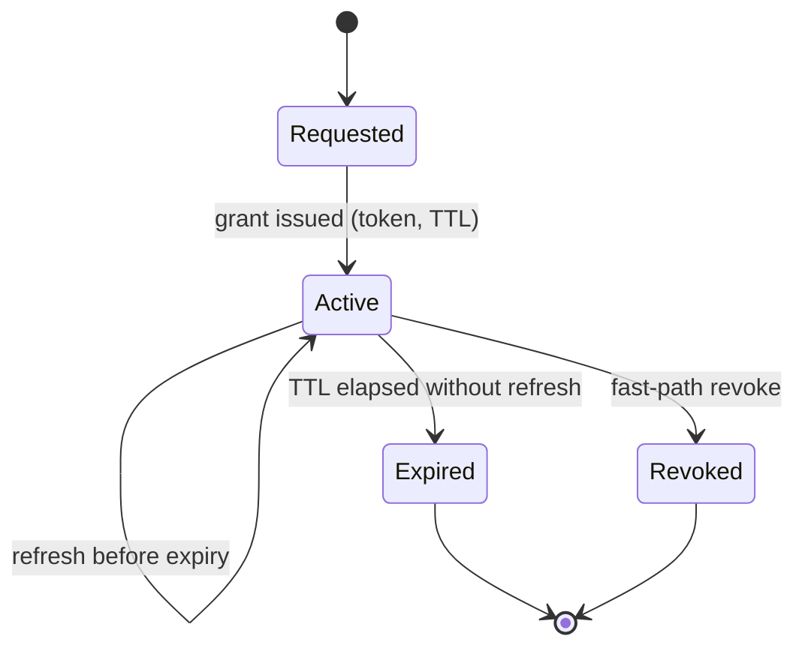

# Control, Entitlement and Security

Status: working draft.
Layer: **above the transport** — required and owned identically whichever data plane carries the
bytes. What changes between them is only the *enforcement point*: a relay's authorization hook
against a per-request check at a CDN edge ([Comparison](comparison.md) §7).

Scope: the provisioning, entitlement, tenancy and security model for the platform — the layer that
develops R7 in [Problem](problem.md) §5, and part of R8. It is the deep-dive companion to
[Architecture](architecture.md) §9.

---

> ## Evidence status: the enforcement mechanism is measured; everything above it is design
>
> **Most of this document describes a design, not a system, but the enforcement layer no longer
> does.** Three experiments have now measured it against the claims below, and two of those claims
> were wrong ([Evidence](evidence.md) §3.10). What is measured: admission and refusal against a
> credential, tenant and path isolation, announcement scope, revocation timing and its mechanism,
> token expiry as a backstop, de-provisioning granularity, key rotation, key handling, and the CPU
> cost of authorization. Where a section below has been corrected by measurement, it says so inline.
>
> Everything else — the entity model, the API shape, the fast-path *push* the design assumes and the
> implementation does not provide, tenancy beyond path isolation, orchestration, federation, the SLO
> targets — remains design intent. **Read the acceptance criteria in §8 as proposals, one of which
> §4.1 now records as unachievable.**
>
> This matters beyond ordinary caveating, for two reasons.
>
> **It remains the thinner half of the thesis.** The thesis holds that because the transport
> commoditises, durable value accrues in the control, entitlement, egress and observability layers
> instead. The egress layer has substantial evidence. This one now has evidence for its *mechanism*
> and none for the part of the argument that is commercial rather than engineering — and the
> mechanism is the part that generalises, so it is the part least able to carry the thesis. Three
> specific holes: there is **one relay** in every measurement, so entitlement across a mesh is
> untested; a **stub** drove every run, so the integration surface is untested; and **rights windows**
> — §4's *temporary* grant type — are unexercised.
>
> **The market is crowded.** MediaConnect, Zixi, LTN and others ship capable provisioning and
> management planes. "Value lives in the control plane" is therefore a *necessary* condition for
> defensibility, not a sufficient one: it has to be materially better for *this* job, not merely
> present. Nothing here demonstrates that it is.
>
> **And "value lives here" does not mean "a vendor captures it."** The design below is mostly
> *mechanism*, which generalises; what makes it useful at a large broadcaster is integration with
> conditional access, rights, scheduling, monitoring, compression, network and service-management
> systems that differ at every operator. That work is the bulk of the value and it does not generalise,
> so at the top of the market this layer is predominantly built rather than bought, and the vendor
> market for it is real mainly further down ([Economics](economics.md) §8). **Read what follows as a
> specification for something an operator builds**, with the token, key and enforcement machinery as
> the part sensibly adopted rather than written.

---

## 1. Purpose and position

The control plane is the authoritative orchestration and governance layer: out-of-band management of
the media lifecycle with no runtime dependency on, and no fate-sharing with, the data plane. It
provisions routes, manages dynamic and revocable entitlements, enforces multi-tenant isolation, and
exposes visibility to the NOC.

It is decoupled from transport mechanics. It interacts only with abstractions: it resolves routing,
authorization and tenant-lifecycle policy, then projects materialised configuration onto the
data-plane components. The intent is that a wire-protocol, ALPN or draft migration requires no change
to control-plane logic ([Architecture](architecture.md) §10).

### 1.1 The out-of-band principle, and its sharp consequence

**The single most important control-plane decision is that it is out-of-band and non-fate-sharing
with the data plane** (principle 3). Data-plane components are pushed configuration, policy and
entitlement, and they *cache and enforce it locally*. If the control plane becomes unavailable,
established media flows continue on last-known-good state: publishers keep publishing, relays keep
forwarding, gateways keep grooming, and existing entitlements remain valid until natural expiry. What
is lost is the ability to *make changes* — not the ability to *keep delivering*.

That has a sharp consequence for entitlement: **revocation cannot depend solely on the control plane
being reachable at the moment of revocation**, or a control-plane outage would make revocation
impossible. §4 resolves this with short-lived tokens plus a re-check channel, so the worst case is
bounded by token lifetime even if the re-check path is unavailable.

> **Measured, and it holds by default — but it is a default, not a property of the design.** A
> 150-second authorization-endpoint outage cost not one byte of established flow. Configure a
> staleness window, however, and the relay begins closing established sessions when that window
> lapses, **publishers included** — which trades this principle away in both directions
> ([T37](../lab/test-37-entitlement-revocation.md), §4.2). Non-fate-sharing survives a control-plane
> outage only if nobody has configured tolerance for one.

---

## 2. Entities

Six first-class, versioned, auditable entities.

| Entity | What it is |
|---|---|
| **Tenant** | An isolated administrative, cryptographic and billing domain: a broadcaster, business unit or authorised partner |
| **Channel / Service** | A logical, transport-independent feed from a publisher source; encapsulates track metadata without binding to physical instances |
| **Endpoint / Subscriber** | A consumer: an edge gateway feeding IRDs, a native subscriber, or a federation interconnect |
| **Route / Path** | The materialised end-to-end path (publisher → fabric → gateway/subscriber), tied to QoS and HA policy |
| **Entitlement / Token** | A time-bounded, signed, revocable grant authorising a specific endpoint to receive a specific channel over a specific route |
| **Policy** | Declarative rules for routing, redundancy, geographic placement and resource allocation |

### 2.1 API surface

A versioned, idempotent API mirroring the entity model: create/update/suspend/delete for tenants,
channels, routes and endpoints; grant/refresh/revoke for entitlements. Mutations follow an explicit
lifecycle: `Draft → Provisioned → Active → Suspended → Revoked/Torn-Down`.

Two properties are load-bearing rather than cosmetic. **Idempotency** — every state-modifying call
carries an idempotency key, because provisioning is driven by automation that retries and a retried
"create route" must not create two routes. **Versioning** — a tenant's own orchestration runs on its
own release cycle and cannot be forced to upgrade in lockstep.

### 2.2 State and consistency

State separates into two tiers: an **authoritative store** that is strongly consistent and replicated
for tenant records, policy and entitlements, so no two conflicting views of authorization can exist;
and **runtime projections**, a local eventually-consistent cache of pushed config at each data-plane
node.

This asymmetry — a strongly consistent but comparatively slow control plane, a fast but
eventually-consistent data plane — is deliberate and load-bearing. Control operations are human- or
automation-paced (seconds), not media-paced (milliseconds).

---

## 3. Identity and authentication

The platform authenticates **three distinct classes of principal, and conflating them is itself a
security error.** The mechanisms below are the credential *profile* this platform adopts on top of
the transport's subscription-time authorization hook and standard PKI — they are deployment choices,
not wire-format guarantees the transport defines and enforces across implementations.

- **Data-plane peers** (publishers, relays, gateways, federation peers) authenticate with **mTLS**,
  each holding an identity certificate from a cross-signed or enterprise PKI. mTLS suits long-lived
  machine-to-machine QUIC sessions and gives strong, revocable transport-layer identity.
- **Subscribers / endpoints** authenticate with **path-scoped JWTs** that also carry entitlement. For
  a consuming endpoint, identity and entitlement are answered together and bound in the same
  credential, because the two questions — who are you, what may you receive — are answered together.
- **Management-plane callers** authenticate to the API via the tenant's own identity system: OIDC or
  federated SSO for humans, scoped API credentials or workload identity for automation. Entirely
  separate from data-plane credentials.

**What the transport contributes is the enforcement point, not the token format.** Authorization is
evaluated locally at the relay at the moment of subscription, with no window in which an unauthorised
subscription is accepted and then torn down, and no separate auth proxy in front of the transport.
The shape the platform depends on — scoped paths plus expiry, checked at subscription — is simple and
stable even as the wire format churns, and the entitlement *service* is transport-independent.

> **Measured, and it holds.** Eight refusing arms — out-of-scope channel, sibling tenant, expired
> token, publish-only credential, parent path and three malformed tokens — delivered **exactly zero
> payload bytes** each, counted at the receiving endpoint. Path matching is segment-aware, so a grant
> on `cnn` does not reach `cnn-intl`. Refusal also governs *disclosure*: an affiliate is announced
> only the channels it licenses ([Evidence](evidence.md) §3.10,
> [T36](../lab/test-36-entitlement-enforcement.md)).
>
> One operational caveat the claim does not anticipate: refusal arrives by two mechanisms, and one of
> them — a credential whose key the authorization endpoint declines to serve — produces **no error to
> the client and no entry in the relay log**. The enforcement is correct and silent, so an audit that
> reads logs to prove refusals happened will find nothing to read.

**The role split above is load-bearing, and violating it is worse than it looks.** Configuring
client-certificate authentication for *subscribers* does not scope them: a peer presenting a valid
certificate and no token at all was served every channel in the estate, including another
broadcaster's. The relay treats a verified certificate as unrestricted for the path dialled, and the
authorization endpoint is told only that *some* certificate was presented, never which — so
certificate-scoped entitlement is not expressible, and enabling both credentials together bypasses
the token matrix silently ([T38](../lab/test-38-entitlement-estate.md) Part 5).

---

## 4. Entitlement

An entitlement is a time-bounded, revocable grant binding a principal (endpoint) to a resource
(channel / track namespace) over a route, subject to policy. It is realised as a short-lived,
path-scoped token that the endpoint presents when subscribing and that the relay validates **locally
against a public key**. Local validation is what allows the data plane to keep running during a
control-plane outage (§1.1).

The distinction this document draws is between **subscription** — a transport-level act — and
**entitlement** — a commercial and rights-level fact. A subscription model aligns them naturally, but
they are not the same thing: entitlement is the *policy*, subscription the *mechanism* that enforces
it. That alignment is what lets a rights window, partner off-boarding or emergency takedown be a
control-plane operation rather than manual reconfiguration of receivers.

**Grant types.** *Temporary* is the default — short-lived, tied to a rights window or session,
continuously renewed while valid. *Persistent* covers a long-lived commercial relationship such as an
always-on affiliate feed, still realised as short-lived tokens underneath so revocation stays
bounded. *Delegated* authorises a party to re-distribute to its own downstream, modelled as an
explicit recorded delegation rather than credential sharing.

**Token claims,** at minimum: issuer, subject, audience/scope (the tenant-scoped namespace and
route), issued-at and expiry, and a unique identifier for audit and fast-path revocation matching.

**Scope granularity.** As narrow as the contract allows. Broad-scope tokens reduce renewal traffic
but widen the blast radius of a leak; narrow-scope tokens do the reverse. The default is narrow.

> **There is a third term, and measurement shows it dominates the other two: de-provisioning
> granularity.** The revocable unit is the *verifying key*, not the grant inside the token — a token's
> claims cannot be narrowed after issue, so withdrawing an entitlement means declining to serve a key.
> An affiliate whose channels all authenticate under one key therefore cannot lose one of them without
> losing all of them. Withdrawing one channel from a two-channel affiliate under a shared key took the
> channel it **kept** down for **2.78 s** and required re-provisioning it under a fresh credential;
> under a key per channel the kept channel was never touched — 229,743 packets, zero continuity
> errors, indistinguishable from a session nothing was done to
> ([T38](../lab/test-38-entitlement-estate.md)).
>
> So narrow is not merely the prudent default against a leak. It is the only topology under which
> de-provisioning is surgical, and the practical unit is **one key per unit of entitlement**, which
> sizes the key estate by the licensing matrix rather than by the affiliate count. Whether that scales
> to a real estate is untested.

### 4.1 Revocation, and what deny-by-default does not mean

Revocation is the hard part of any entitlement system. The platform uses two paths together:

1. **Fast path** — the relay re-asks its admission question on a timer and drops the affected
   subscriptions when the answer changes. **Bounded by between one and two re-check periods plus
   about 0.11 s — the implementation documents two — so its floor is roughly 2.1 s.**
2. **Backstop** — short token lifetimes with continuous renewal, so the *worst case* is bounded by
   the token lifetime even if the fast path is unavailable. Revocation then happens by declining to
   refresh.

> **This description was wrong in two ways, and both are corrected above.**
>
> **It said the fast path was "an explicit revocation signal pushed to relays and gateways". Nothing
> is pushed.** The relay replays the whole admission request on a schedule derived from the
> `Cache-Control` the authorization endpoint returned, re-verifies the retained token against the
> answer, and closes the session if it no longer verifies. Revocation is a **poll**, and that
> difference is why the bound is what it is.
>
> **It said "sub-second when the control plane is healthy". That is not achievable at any setting,
> and the margin is wider than the first measurement of it suggested.** With one session live,
> decision-to-last-byte is `(re-check cadence − phase) + 0.110 s` across five cadences, the fixed
> overhead constant to within two milliseconds. That is the uncontended case: re-checks are served
> from the same cached HTTP client as admission, so once several sessions are live a re-check can be
> answered from an entry another session left up to one cadence ago, and the measured worst case
> across six staggered subscribers was **1.54 cadences** — against a bound the relay's source states
> as two. The period is carried as integer `Cache-Control` delta-seconds and clamped to a one-second
> floor, so the best achievable worst case is about **1.7 s measured and 2.11 s as documented**
> ([T37](../lab/test-37-entitlement-revocation.md), measured from the affiliate's captured egress;
> the 2× figure *specified* by the implementation). §8's `< 1 s` target is unachievable by this
> mechanism and is marked so there.
>
> **And the settings an operator would reach for to go faster disable revocation altogether.**
> `max-age=0`, a sub-second `max-age`, and omitting `Cache-Control` each produce no revalidation at
> all: the token is checked once, at admission, and a withdrawn grant never takes effect. One arm kept
> delivering for the full 50 s it was observed. **Three configurations silently yield an unrevocable
> session, and one of them is what "revoke immediately" looks like.** An operator must set an explicit
> integer `max-age`; the absence of one is not a default cadence, it is no cadence.
>
> **Two further costs of a tight cadence.** Re-check is per *session*, so at a one-second cadence the
> per-subscriber CPU slope rises 27 % against an unauthenticated relay, where a ten-second cadence
> costs nothing marginal at all ([Evidence](evidence.md) §3.10). And provisioning is bounded by the
> same cache as revocation: a grant *added* to the endpoint is not visible to the relay until the
> cached admission reply expires, so `max-age` sets the floor on §8's provisioning latency too.

**It is important not to overstate the consistency boundary.** Deny-by-default governs *ambiguous,
absent, malformed or expired* credentials — those are refused immediately, and
[T36](../lab/test-36-entitlement-enforcement.md) measures that they deliver nothing at all. It does
**not** mean an already-granted, still-valid token is dropped the instant a revoke is issued: until
the relay next re-checks, a valid token continues to be honoured. So the two regimes are **one
re-check period plus ≈ 0.11 s when the re-check path is healthy**, and **worst-case one TTL when it is
not** — never "deny within the window" for a token that is still valid.

**There are two consequential parameters, not one, and they do different jobs.** Re-check cadence
bounds a deliberate revocation and sets the steady-state re-check load, roughly in inverse proportion.
TTL bounds everything else — and it is the *only* bound that holds in the three configurations where
revalidation is inoperative. Neither has a universally correct value; for high-value contracted
content the bias is toward short lifetimes and an explicit, tight cadence.

> **An earlier draft named TTL "the single most consequential parameter", which understated the case
> and named the wrong half of it.** TTL is not what revokes a live affiliate — cadence is. TTL is what
> makes a misconfigured deployment survivable, and measurement confirms it does: a session ends
> 0.110 s after its token expires **even with revalidation switched off entirely**, which is the arm
> this experiment expected to fail ([T37](../lab/test-37-entitlement-revocation.md)). The backstop
> claim in the list above is therefore confirmed; the fast-path claim beside it was not.

**How this compares with the alternative data plane** is developed in [Comparison](comparison.md) §7,
and measurement has made the comparison *worse* for MoQ than this section first claimed. The original
framing was that segmented HTTP "lacks only the fast path". But MoQ's fast path is itself a poll on an
integer-second period, so the distinction is not push-versus-poll at all — it is a poll every
`max-age` seconds against a check on every part request. Where the CDN authorizes each request, the
segmented bound is one part-target interval, measured in this lab at **0.28–0.30 s**
([T14](../lab/test-14-data-plane-comparison.md)), against MoQ's **1.7 s measured and 2.11 s
documented** worst case. **On revocation latency MoQ is the slower of the two, by roughly six to
seven times**, and it is the only one of the two with configurations that disable revocation
entirely — or that tolerate an hour of authorization-endpoint outage while continuing to serve. MoQ's real advantage is therefore narrower than a
latency figure and does not depend on one: the enforcement point is a relay you can operate, so the
policy is yours and portable, and a subscription is a live queryable fact rather than an inference
from delivery logs.

### 4.2 Failure handling

- **Expired token** — denied; the endpoint must obtain a fresh grant.
- **Malformed or absent token** — denied by default.
- **Control plane unreachable** — existing valid tokens continue to be honoured until expiry **by
  default**, but *new* grants and refreshes cannot be issued, so entitlements naturally drain as TTLs
  elapse. This is a safe failure mode: the system fails toward *no new access* and toward *revocation
  by expiry*, never toward open access.
- **Every ambiguous case resolves to deny.**

> **The honouring of valid tokens during an outage is a configurable default, not an invariant, and
> the document previously presented it as one.** Measured: with no staleness window configured, 150 s
> of authorization-endpoint outage cost not one byte, and admission failures fail closed. But where
> `stale-while-revalidate` or `stale-if-error` is set, the relay stops honouring established sessions
> when the window lapses — and it closes **publisher** sessions on the same rule, so a control-plane
> outage takes the feed down at the contribution end as well as the delivery end
> ([T37](../lab/test-37-entitlement-revocation.md)).
>
> The distinction that makes this safe is in the *kind* of failure, not the duration: a refusal (the
> endpoint answers, and says no) closes the session immediately, while an *unavailability* (no answer,
> or a server error) enters the staleness window. An operator who sets a staleness window to be
> lenient about outages has traded §1.1's non-fate-sharing property away, in both directions.

---

## 5. Multi-tenancy

Multi-tenancy is the precondition for the platform being operated as *shared* infrastructure rather
than one silo per customer. It is also a primary source of risk, because a tenancy-isolation failure
is simultaneously a security breach and a rights-compliance breach.

**Namespace isolation.** Every channel, track and routing entity is bound to a cryptographically
enforced, hierarchically scoped namespace unique to that tenant. Relays reject any subscription whose
presented token scope does not match the target namespace. **This is the primary technical control
preventing cross-tenant access.**

**Resource quotas.** Hard quotas on concurrent active routes, aggregate ingress and egress bandwidth,
and endpoints per channel namespace, so one tenant's behaviour — malicious, buggy, or merely a
traffic spike — has a bounded blast radius.

**Data isolation.** Telemetry, audit records and captures are partitioned by tenant; one tenant
cannot observe another's routes or logs.

**The deliberate trade-off is a shared data plane with an isolated control plane.** Sharing the
fabric is what makes shared-infrastructure economics work, and it means one tenant's traffic
contributes to congestion another might experience. Quotas and prioritisation *bound* this but do not
*eliminate* it: quotas cap admission and volume, but once a shared relay's CPU, NIC or an upstream
link is saturated, latency and jitter coupling can still cross tenants. This is the same residual
risk any multi-tenant CDN carries. Where a contract requires *hard* isolation, the architecture
permits dedicated relay clusters at higher cost — isolation is a spectrum expressed as policy, not a
single global choice.

---

## 6. Policy and orchestration

The control plane translates business rules into declarative policy pushed to the fabric and the
edge.

- **Subscription policy** — who may subscribe, admission rules, and a strict deny-by-default posture.
- **Routing policy** — geographic constraints pinning routes to regional clusters for sovereignty or
  rights; dynamic exclusion of links reporting elevated loss or latency.
- **Failover policy** — for high-value contracted content, two link-disjoint paths in active/active
  dual publication, **both fed from a common source so the legs stay interchangeable**. The hitless
  selection between them happens at the *receiver*, not by deduplication in the fabric, because the
  relay is content-agnostic and its own source failover is bounded by failure detection rather than
  seamless ([Architecture](architecture.md) §5, §8.4).
- **Compliance policy** — every routing modification and authorization grant is logged to an
  immutable ledger.

**Where the business rules come from is the hard part, and it is deliberately not specified above.**
None of those policies originates in this layer. At a mature broadcaster, "who may subscribe" is a
conditional-access and rights question, "for how long" is a scheduling question, "under what geographic
constraint" is a rights question again, "which links are eligible" is network management's, "what it
costs whom" is finance's, and "who gets paged" is service management's. Each of those lives in a
long-established, deliberately isolated system with its own data model. **A control plane that cannot
read those systems automates nothing** — it relocates the manual step from a device to a form, and the
operator still reconciles by hand.

So the integration surface, not the policy engine, is what determines whether this layer delivers the
operational reduction the thesis claims for it. It is also why this layer is predominantly built rather
than bought at the top of the market: the engine generalises across operators and the integration does
not ([Economics](economics.md) §8). The design consequence for everything above is to keep policy
**sourced** rather than **authored** here — the control plane should hold a projection of decisions made
in those systems, with provenance, so that a rights change or a schedule change propagates rather than
needing re-entry. Authoring policy in the control plane creates a second source of truth for questions
the business has already answered elsewhere, and reconciling those is the failure mode that makes
platforms of this kind shelfware.

---

## 7. Security model

### 7.1 Threat model

The platform carries high-value linear content across shared, multi-tenant and partly public
infrastructure. Its posture must reflect that the network substrate is not trusted, the tenants do
not trust each other, and some content is commercially sensitive under contract.

**Assets, in rough order of value:** content confidentiality and integrity where the contract
requires it; entitlement integrity — that only authorised endpoints receive a feed, which is
simultaneously a security and a rights-compliance property; tenant isolation; the control plane
itself, compromise of which is the highest-impact target; and the signing keys underpinning
entitlement.

**Threat actors:** external network attackers (interception, injection, DDoS); a malicious or
compromised tenant reaching for another tenant's content or starving shared infrastructure; a
compromised endpoint or leaked token; a compromised federation peer; and insider or operator misuse.

**Trust boundaries:** management plane ↔ control plane; control plane ↔ data plane; between tenants;
between the platform and a federation peer; and between the platform and the public network
substrate. Each is enforced by a distinct mechanism (§3, §5).

### 7.2 Keys and secrets

Token-signing private keys and mTLS CA material are generated, stored and used inside HSMs or a cloud
KMS. **Relays and gateways hold only the public keys needed to verify signatures locally; they never
hold long-lived signing private keys.**

Signing keys and certificates rotate on a defined schedule with overlapping validity, so rotation
does not interrupt live sessions. Local public-key verification means a rotated verification key must
be distributed to the edge *ahead of use* — a control-plane push with its own consistency
considerations, and an open question (§9). Certificate revocation and token revocation are distinct
paths: the former via PKI revocation or short-lived certificates, the latter via §4.1.

> **Both claims measured, and both hold — the first more strongly than it was stated.** Every key the
> authorization endpoint could serve was a public verifying key with no private component, and the
> relay was given **no key material at all**: its entire authorization configuration is the endpoint
> URL, so there is no key store on the edge node to get wrong. The requirement is met structurally
> rather than by operational discipline. Rotation with overlapping validity interrupted nothing — the
> successor session ran on undisturbed — and the retired key stopped being honoured 0.122 s after
> retirement, inside one re-check period ([T38](../lab/test-38-entitlement-estate.md) Part 5).
>
> This does *not* settle §9's distribution question. With an authorization endpoint the edge holds no
> key to distribute *to*; the consistency problem moves to the endpoint and to its cache, where §4.1's
> `max-age` now governs it. Under `--auth-key-dir`, where the relay does hold verifying keys on disk,
> the question stands as written.

### 7.3 Data protection

**In transit**, all data-plane traffic runs over QUIC, encrypted by default, and all control-plane
traffic over TLS. There is no cleartext media or control path.

**Beyond the transport**, a relay terminates the session and sees the payload. This is *not* a
regression relative to existing distribution — it is the broadcast norm: fibre contribution feeds are
commonly carried in the clear or handed off in the clear at the demarcation, and managed IP services
behave identically, with the flow accessible to the transport as opaque data. Where rights terms
require content "secure end to end", that is in practice understood to mean the transport is
encrypted and the relaying process is protected operationally — physical and data-centre access
control, host hardening, tenancy isolation — not literal publisher-to-egress content encryption, and
this platform meets that bar.

**Where a contract instead requires the *operator itself* not to have access, transport encryption is
insufficient**, and an additional content-encryption scheme is needed. Whether that can be offered
without breaking relay fan-out and caching is an **open question** (§9), not something this design
claims to have solved.

**At rest**, logs, audit records and any captures are encrypted, partitioned by tenant and subject to
retention limits — captures in particular may contain content and must be tightly controlled.
Service identity, routing and entitlement metadata are themselves commercially sensitive, since they
reveal who receives what, and are treated as tenant-confidential.

### 7.4 Abuse mitigation

Tokens carry expiry and unique identifiers, so a captured token is bounded in value and anomalous
reuse is detectable. Public-facing control-plane endpoints sit behind rate limiting and DDoS
protection, with private peering or IP allow-listing preferred for critical nodes. At the data plane,
admission control and per-tenant quotas bound the impact of subscription floods. Anomalous
subscription patterns — impossible geography, excessive fan-out — should be detectable from the
telemetry the relay already emits.

### 7.5 Audit

Every control-plane action and every entitlement grant, refresh, revocation and delegation writes an
immutable record: timestamp, operator or principal identity, tenant context, action, target resource
and correlation id. This serves two masters — incident forensics ("who was receiving this feed at
20:03?") and rights-compliance evidence ("prove this partner only received the content they were
licensed for") — and should be exportable per tenant and per contract boundary.

---

## 8. Acceptance criteria

**The numeric targets below are proposed and illustrative** — engineering hypotheses, not committed
figures. Two of them now have measurements against them, and the revocation target is **unachievable
as written**. The availability target is deliberately modest because the control plane is out-of-band:
an outage suspends *changes* but does not interrupt established media flows (§1.1), so its
availability requirement is lower than the data plane's.

| Metric | Proposed target | Measured | Measurement boundary |
|---|---|---|---|
| Control-plane availability | 99.95 % | — | Annual uptime of the provisioning API surface |
| Route provisioning latency | < 5 s | met, but **bounded by `max-age`** — a new grant is invisible until the cached admission reply expires | `POST /v1/routes` to green data-plane configuration across all affected nodes |
| Fast-path revocation latency | ~~< 1 s~~ **not achievable; restate at ≈ 2.2 s** | One to two cadences + 0.110 s; floor **≈ 1.7 s measured, 2.11 s documented** | Revoke call to last media byte at the subscriber, with more than one session live |
| Token renewal success rate | 99.999 % | — | Legitimate refresh requests succeeding before expiration |

**The revocation target has been corrected rather than caveated.** The mechanism's period is integer
delta-seconds, so no configuration reaches sub-second; a deployment should commit to about 1.2 s, and
should *also* commit to an explicit `max-age`, because three plausible configurations disable
revocation entirely (§4.1). The measurement boundary above has been changed too: "teardown at the
relay" is the relay's account of itself, and the figure that matters commercially is the last byte the
affiliate actually received.

Behavioural criteria, which matter more than the numbers:

- **Revocation correctness.** A revoked or unrefreshed entitlement results in no further delivery
  within the stated bound — one re-check period plus ≈ 0.11 s, worst case one TTL otherwise.
  **Measured; and the TTL backstop holds even with revalidation disabled.**
- **Enforcement correctness.** No delivery ever occurs without a valid, in-scope, unexpired token,
  verified by attempting out-of-scope and expired subscriptions and confirming denial. **Measured:
  zero payload bytes on every refusing arm, counted at the receiver.** Add to this criterion that it
  must be verified at the *receiver*, not from relay logs, because one refusal mechanism logs nothing.
- **Isolation correctness.** No cross-tenant access under any tested path. **Measured for tokens.
  Fails for client certificates**, which admit their holder to every tenant (§3).
- **Operational usability.** Provisioning and revocation are simple enough that a NOC can perform an
  emergency disable under time pressure without error. **This criterion is currently failed by the
  mechanism, not by the operator**: the intuitive "revoke now" setting is one of the three that makes
  a session unrevocable, and it reports no error.
- **Key handling.** Keys never present on edge nodes; no cleartext media or control path. **Measured
  and met** (§7.2); no transport-stream structure was recoverable from the wire.
- **De-provisioning granularity.** *New criterion, from measurement.* Withdrawing one channel from a
  multi-channel affiliate must not interrupt the channels it keeps. Met only under one key per unit of
  entitlement (§4).

**Validation plan**, for what is still unvalidated: penetration testing of the API, the token issuance
path, tenant-isolation boundaries and federation interconnects; red-team scenarios covering
cross-tenant access, token theft and replay, a compromised endpoint, a compromised federation peer
over-reaching its negotiated scope, and control-plane privilege escalation. The enforcement,
revocation, rotation and isolation paths have been exercised against a single relay driven by a stub
([Evidence](evidence.md) §3.10); what that leaves is clustering, the integration surface, and rights
windows.

---

## 9. Open questions

- **Which layers are bought and which are built?** No longer wholly open: the mechanism — token issue
  and verification, key rotation, enforcement — generalises and should be adopted rather than written,
  while policy and the integration with rights, scheduling and CA systems do not generalise and are
  built ([Economics](economics.md) §8). What remains open is the middle: how much of orchestration and
  observability a product can supply before its model has to be bent to the operator's, which is the
  question that decides whether a vendor engagement is a purchase or a bespoke programme with a licence.
- **Does the operational reduction the thesis claims actually materialise from integration?** This is
  the load-bearing commercial assumption and nothing here tests it. The cost of the integration is
  knowable in advance by counting interfaces; the saving is not, and a control plane that automates
  provisioning while leaving reconciliation manual delivers neither.
- **What is the right default TTL,** and should it vary by content value and by the reachability
  characteristics of the endpoint? Halving the TTL roughly doubles the renewal rate. **Sharpened by
  measurement:** the same question now applies to re-check cadence, where the trade is explicit — a
  one-second cadence buys the floor revocation bound and costs 27 % on the per-subscriber CPU slope,
  while ten seconds costs nothing marginal (§4.1).
- **How are rotated verification keys distributed to the edge** with strong enough consistency that a
  valid token is never rejected nor a revoked key honoured during the rotation window? **Partly
  answered:** with an authorization endpoint there is no key at the edge to distribute, and rotation
  with overlap is clean (§7.2). The question stands for `--auth-key-dir` deployments, and reappears as
  cache consistency for endpoint deployments.
- **Does entitlement survive a relay mesh?** Every measurement to date is against a single relay. The
  case where a subscriber is admitted by one node and revoked at another — and where the admission
  cache is per node — is untested and is the harder problem
  ([T38](../lab/test-38-entitlement-estate.md)).
- **Do rights windows compose with the re-check cadence?** §4's *temporary* grant type is the one a
  distributor actually needs and the one nothing has exercised: every grant measured is on or off.
  Whether scheduled grant and expiry land cleanly against a poll, or produce a window at each edge, is
  open.
- **Should a peer's certificate identity reach the authorization decision?** It currently does not:
  the endpoint learns only that some certificate was presented, which is why certificate-scoped
  entitlement is not expressible (§3). This is an upstream question as much as a design one.
- **Can content be protected from the *operator*, publisher-to-egress, without breaking relay fan-out
  and caching** — and is that required for the target contracts? (§7.3.)
- **How is trust established, scoped and *revoked* across a federation boundary**, and how is a
  compromised peer contained? ([Architecture](architecture.md) §8.6.)
- **How is delegated entitlement bounded** so that a chain of re-distribution cannot outlive or
  exceed the scope of the grant at its root?
- **When layered compliance policies conflict** — a data-sovereignty constraint against a dynamic
  failover path rerouting around a congested link — what deterministic hierarchy resolves path
  selection safely?
