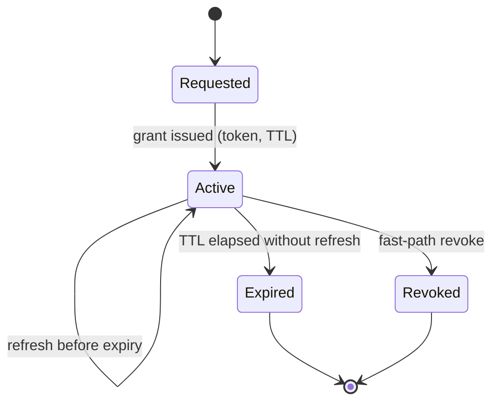

# Control, Entitlement and Security

Status: working draft.
Layer: **above the transport** — required and owned identically whichever data plane carries the
bytes. What changes between them is only the *enforcement point*: a relay's authorization hook
against a per-request check at a CDN edge ([Comparison](comparison.md) §7).

Scope: the provisioning, entitlement, tenancy and security model for the platform — the layer that
develops R7 in [Problem](problem.md) §5, and part of R8. It is the deep-dive companion to
[Architecture](architecture.md) §9.

---

> ## Evidence status: this document describes a design, not a system
>
> **Nothing in this document has been built or measured.** The rest of this repository is
> measurement-led; this document is not, and it should be read at a different confidence level. What
> *has* been verified is one architectural property, by reading the protocol and exercising the hook:
> MoQ carries authorization information at the point of subscription and a relay can accept or refuse
> there, so the enforcement point exists and is native ([Evidence](evidence.md) §3.10). Everything
> else below — the entity model, the API shape, the revocation paths, the tenancy isolation, the SLO
> targets — is design intent.
>
> This matters beyond ordinary caveating, for two reasons.
>
> **It is the largest untested assumption in the thesis.** [Problem](problem.md) §6 holds that
> durable value accrues in the control, entitlement, egress and observability layers because the
> transport commoditises. The egress layer has evidence. This one has none, and it is the half of the
> argument that is commercial rather than engineering.
>
> **The market is crowded.** MediaConnect, Zixi, LTN and others ship capable provisioning and
> management planes. "Value lives in the control plane" is therefore a *necessary* condition for
> defensibility, not a sufficient one: it has to be materially better for *this* job, not merely
> present. Nothing here demonstrates that it is.

---

## 1. Purpose and position

The control plane is the authoritative orchestration and governance layer: out-of-band management of
the media lifecycle with no runtime dependency on, and no fate-sharing with, the data plane. It
provisions routes, manages dynamic and revocable entitlements, enforces multi-tenant isolation, and
exposes visibility to the NOC.

It is decoupled from transport mechanics. It interacts only with abstractions: it resolves routing,
authorization and tenant-lifecycle policy, then projects materialised configuration onto the
data-plane components. The intent is that a wire-protocol, ALPN or draft migration requires no change
to control-plane logic ([Architecture](architecture.md) §10).

### 1.1 The out-of-band principle, and its sharp consequence

**The single most important control-plane decision is that it is out-of-band and non-fate-sharing
with the data plane** (principle 3). Data-plane components are pushed configuration, policy and
entitlement, and they *cache and enforce it locally*. If the control plane becomes unavailable,
established media flows continue on last-known-good state: publishers keep publishing, relays keep
forwarding, gateways keep grooming, and existing entitlements remain valid until natural expiry. What
is lost is the ability to *make changes* — not the ability to *keep delivering*.

That has a sharp consequence for entitlement: **revocation cannot depend solely on the control plane
being reachable at the moment of revocation**, or a control-plane outage would make revocation
impossible. §4 resolves this with short-lived tokens plus an explicit revocation channel, so the
worst case is bounded by token lifetime even if the fast path is unavailable.

---

## 2. Entities

Six first-class, versioned, auditable entities.

| Entity | What it is |
|---|---|
| **Tenant** | An isolated administrative, cryptographic and billing domain: a broadcaster, business unit or authorised partner |
| **Channel / Service** | A logical, transport-independent feed from a publisher source; encapsulates track metadata without binding to physical instances |
| **Endpoint / Subscriber** | A consumer: an edge gateway feeding IRDs, a native subscriber, or a federation interconnect |
| **Route / Path** | The materialised end-to-end path (publisher → fabric → gateway/subscriber), tied to QoS and HA policy |
| **Entitlement / Token** | A time-bounded, signed, revocable grant authorising a specific endpoint to receive a specific channel over a specific route |
| **Policy** | Declarative rules for routing, redundancy, geographic placement and resource allocation |

### 2.1 API surface

A versioned, idempotent API mirroring the entity model: create/update/suspend/delete for tenants,
channels, routes and endpoints; grant/refresh/revoke for entitlements. Mutations follow an explicit
lifecycle: `Draft → Provisioned → Active → Suspended → Revoked/Torn-Down`.

Two properties are load-bearing rather than cosmetic. **Idempotency** — every state-modifying call
carries an idempotency key, because provisioning is driven by automation that retries and a retried
"create route" must not create two routes. **Versioning** — a tenant's own orchestration runs on its
own release cycle and cannot be forced to upgrade in lockstep.

### 2.2 State and consistency

State separates into two tiers: an **authoritative store** that is strongly consistent and replicated
for tenant records, policy and entitlements, so no two conflicting views of authorization can exist;
and **runtime projections**, a local eventually-consistent cache of pushed config at each data-plane
node.

This asymmetry — a strongly consistent but comparatively slow control plane, a fast but
eventually-consistent data plane — is deliberate and load-bearing. Control operations are human- or
automation-paced (seconds), not media-paced (milliseconds).

---

## 3. Identity and authentication

The platform authenticates **three distinct classes of principal, and conflating them is itself a
security error.** The mechanisms below are the credential *profile* this platform adopts on top of
the transport's subscription-time authorization hook and standard PKI — they are deployment choices,
not wire-format guarantees the transport defines and enforces across implementations.

- **Data-plane peers** (publishers, relays, gateways, federation peers) authenticate with **mTLS**,
  each holding an identity certificate from a cross-signed or enterprise PKI. mTLS suits long-lived
  machine-to-machine QUIC sessions and gives strong, revocable transport-layer identity.
- **Subscribers / endpoints** authenticate with **path-scoped JWTs** that also carry entitlement. For
  a consuming endpoint, identity and entitlement are answered together and bound in the same
  credential, because the two questions — who are you, what may you receive — are answered together.
- **Management-plane callers** authenticate to the API via the tenant's own identity system: OIDC or
  federated SSO for humans, scoped API credentials or workload identity for automation. Entirely
  separate from data-plane credentials.

**What the transport contributes is the enforcement point, not the token format.** Authorization is
evaluated locally at the relay at the moment of subscription, with no window in which an unauthorised
subscription is accepted and then torn down, and no separate auth proxy in front of the transport.
The shape the platform depends on — scoped paths plus expiry, checked at subscription — is simple and
stable even as the wire format churns, and the entitlement *service* is transport-independent.

---

## 4. Entitlement

An entitlement is a time-bounded, revocable grant binding a principal (endpoint) to a resource
(channel / track namespace) over a route, subject to policy. It is realised as a short-lived,
path-scoped token that the endpoint presents when subscribing and that the relay validates **locally
against a public key**. Local validation is what allows the data plane to keep running during a
control-plane outage (§1.1).

The distinction this document draws is between **subscription** — a transport-level act — and
**entitlement** — a commercial and rights-level fact. A subscription model aligns them naturally, but
they are not the same thing: entitlement is the *policy*, subscription the *mechanism* that enforces
it. That alignment is what lets a rights window, partner off-boarding or emergency takedown be a
control-plane operation rather than manual reconfiguration of receivers.

**Grant types.** *Temporary* is the default — short-lived, tied to a rights window or session,
continuously renewed while valid. *Persistent* covers a long-lived commercial relationship such as an
always-on affiliate feed, still realised as short-lived tokens underneath so revocation stays
bounded. *Delegated* authorises a party to re-distribute to its own downstream, modelled as an
explicit recorded delegation rather than credential sharing.

**Token claims,** at minimum: issuer, subject, audience/scope (the tenant-scoped namespace and
route), issued-at and expiry, and a unique identifier for audit and fast-path revocation matching.

**Scope granularity.** As narrow as the contract allows. Broad-scope tokens reduce renewal traffic
but widen the blast radius of a leak; narrow-scope tokens do the reverse. The default is narrow.

### 4.1 Revocation, and what deny-by-default does not mean

Revocation is the hard part of any entitlement system. The platform uses two paths together:

1. **Fast path** — an explicit revocation signal pushed to relays and gateways, which drop the
   affected subscriptions immediately. Sub-second *when the control plane is healthy*.
2. **Backstop** — short token lifetimes with continuous renewal, so the *worst case* is bounded by
   the token lifetime even if the fast path is unavailable. Revocation then happens by declining to
   refresh.

**It is important not to overstate the consistency boundary.** Deny-by-default governs *ambiguous,
absent, malformed or expired* credentials — those are refused immediately. It does **not** mean an
already-granted, still-valid token is dropped the instant a revoke is issued: if the fast path cannot
reach the edge during a partition, a valid token continues to be honoured until it expires. So the
two regimes are **sub-second when the fast path is healthy**, and **worst-case one TTL when it is
not** — never "deny within the window" for a token that is still valid.

**TTL is therefore the single most consequential parameter in the model**, because it sets both the
worst-case revocation bound and the steady-state renewal load, roughly in inverse proportion. There
is no universally correct value; for high-value contracted content the bias is toward short lifetimes
and aggressive renewal.

**How this compares with the alternative data plane** is developed in [Comparison](comparison.md) §7,
and the short version is uncomfortable for the intuitive case: segmented HTTP has the backstop
natively and lacks only the fast path, and its backstop is tight rather than loose — about one
request interval. MoQ's real advantage is that the enforcement point is a relay you can operate, so
the policy is yours and portable, and that a subscription is a live queryable fact rather than an
inference from delivery logs.

### 4.2 Failure handling

- **Expired token** — denied; the endpoint must obtain a fresh grant.
- **Malformed or absent token** — denied by default.
- **Control plane unreachable** — existing valid tokens continue to be honoured until expiry, but
  *new* grants and refreshes cannot be issued, so entitlements naturally drain as TTLs elapse. This
  is a safe failure mode: the system fails toward *no new access* and toward *revocation by expiry*,
  never toward open access.
- **Every ambiguous case resolves to deny.**

---

## 5. Multi-tenancy

Multi-tenancy is the precondition for the platform being operated as *shared* infrastructure rather
than one silo per customer. It is also a primary source of risk, because a tenancy-isolation failure
is simultaneously a security breach and a rights-compliance breach.

**Namespace isolation.** Every channel, track and routing entity is bound to a cryptographically
enforced, hierarchically scoped namespace unique to that tenant. Relays reject any subscription whose
presented token scope does not match the target namespace. **This is the primary technical control
preventing cross-tenant access.**

**Resource quotas.** Hard quotas on concurrent active routes, aggregate ingress and egress bandwidth,
and endpoints per channel namespace, so one tenant's behaviour — malicious, buggy, or merely a
traffic spike — has a bounded blast radius.

**Data isolation.** Telemetry, audit records and captures are partitioned by tenant; one tenant
cannot observe another's routes or logs.

**The deliberate trade-off is a shared data plane with an isolated control plane.** Sharing the
fabric is what makes shared-infrastructure economics work, and it means one tenant's traffic
contributes to congestion another might experience. Quotas and prioritisation *bound* this but do not
*eliminate* it: quotas cap admission and volume, but once a shared relay's CPU, NIC or an upstream
link is saturated, latency and jitter coupling can still cross tenants. This is the same residual
risk any multi-tenant CDN carries. Where a contract requires *hard* isolation, the architecture
permits dedicated relay clusters at higher cost — isolation is a spectrum expressed as policy, not a
single global choice.

---

## 6. Policy and orchestration

The control plane translates business rules into declarative policy pushed to the fabric and the
edge.

- **Subscription policy** — who may subscribe, admission rules, and a strict deny-by-default posture.
- **Routing policy** — geographic constraints pinning routes to regional clusters for sovereignty or
  rights; dynamic exclusion of links reporting elevated loss or latency.
- **Failover policy** — for high-value contracted content, two link-disjoint paths in active/active
  dual publication, **both fed from a common source so the legs stay interchangeable**. The hitless
  selection between them happens at the *receiver*, not by deduplication in the fabric, because the
  relay is content-agnostic and its own source failover is bounded by failure detection rather than
  seamless ([Architecture](architecture.md) §5, §8.4).
- **Compliance policy** — every routing modification and authorization grant is logged to an
  immutable ledger.

---

## 7. Security model

### 7.1 Threat model

The platform carries high-value linear content across shared, multi-tenant and partly public
infrastructure. Its posture must reflect that the network substrate is not trusted, the tenants do
not trust each other, and some content is commercially sensitive under contract.

**Assets, in rough order of value:** content confidentiality and integrity where the contract
requires it; entitlement integrity — that only authorised endpoints receive a feed, which is
simultaneously a security and a rights-compliance property; tenant isolation; the control plane
itself, compromise of which is the highest-impact target; and the signing keys underpinning
entitlement.

**Threat actors:** external network attackers (interception, injection, DDoS); a malicious or
compromised tenant reaching for another tenant's content or starving shared infrastructure; a
compromised endpoint or leaked token; a compromised federation peer; and insider or operator misuse.

**Trust boundaries:** management plane ↔ control plane; control plane ↔ data plane; between tenants;
between the platform and a federation peer; and between the platform and the public network
substrate. Each is enforced by a distinct mechanism (§3, §5).

### 7.2 Keys and secrets

Token-signing private keys and mTLS CA material are generated, stored and used inside HSMs or a cloud
KMS. **Relays and gateways hold only the public keys needed to verify signatures locally; they never
hold long-lived signing private keys.**

Signing keys and certificates rotate on a defined schedule with overlapping validity, so rotation
does not interrupt live sessions. Local public-key verification means a rotated verification key must
be distributed to the edge *ahead of use* — a control-plane push with its own consistency
considerations, and an open question (§9). Certificate revocation and token revocation are distinct
paths: the former via PKI revocation or short-lived certificates, the latter via §4.1.

### 7.3 Data protection

**In transit**, all data-plane traffic runs over QUIC, encrypted by default, and all control-plane
traffic over TLS. There is no cleartext media or control path.

**Beyond the transport**, a relay terminates the session and sees the payload. This is *not* a
regression relative to existing distribution — it is the broadcast norm: fibre contribution feeds are
commonly carried in the clear or handed off in the clear at the demarcation, and managed IP services
behave identically, with the flow accessible to the transport as opaque data. Where rights terms
require content "secure end to end", that is in practice understood to mean the transport is
encrypted and the relaying process is protected operationally — physical and data-centre access
control, host hardening, tenancy isolation — not literal publisher-to-egress content encryption, and
this platform meets that bar.

**Where a contract instead requires the *operator itself* not to have access, transport encryption is
insufficient**, and an additional content-encryption scheme is needed. Whether that can be offered
without breaking relay fan-out and caching is an **open question** (§9), not something this design
claims to have solved.

**At rest**, logs, audit records and any captures are encrypted, partitioned by tenant and subject to
retention limits — captures in particular may contain content and must be tightly controlled.
Service identity, routing and entitlement metadata are themselves commercially sensitive, since they
reveal who receives what, and are treated as tenant-confidential.

### 7.4 Abuse mitigation

Tokens carry expiry and unique identifiers, so a captured token is bounded in value and anomalous
reuse is detectable. Public-facing control-plane endpoints sit behind rate limiting and DDoS
protection, with private peering or IP allow-listing preferred for critical nodes. At the data plane,
admission control and per-tenant quotas bound the impact of subscription floods. Anomalous
subscription patterns — impossible geography, excessive fan-out — should be detectable from the
telemetry the relay already emits.

### 7.5 Audit

Every control-plane action and every entitlement grant, refresh, revocation and delegation writes an
immutable record: timestamp, operator or principal identity, tenant context, action, target resource
and correlation id. This serves two masters — incident forensics ("who was receiving this feed at
20:03?") and rights-compliance evidence ("prove this partner only received the content they were
licensed for") — and should be exportable per tenant and per contract boundary.

---

## 8. Acceptance criteria

**All numeric targets below are proposed and illustrative** — engineering hypotheses to validate in a
real deployment, not committed figures, and not measurements. The availability target is deliberately
modest because the control plane is out-of-band: an outage suspends *changes* but does not interrupt
established media flows (§1.1), so its availability requirement is lower than the data plane's.

| Metric | Proposed target | Measurement boundary |
|---|---|---|
| Control-plane availability | 99.95 % | Annual uptime of the provisioning API surface |
| Route provisioning latency | < 5 s | `POST /v1/routes` to green data-plane configuration across all affected nodes |
| Fast-path revocation latency | < 1 s | Revoke call to active subscription teardown at the relay |
| Token renewal success rate | 99.999 % | Legitimate refresh requests succeeding before expiration |

Behavioural criteria, which matter more than the numbers:

- **Revocation correctness.** A revoked or unrefreshed entitlement results in no further delivery
  within the stated bound — fast-path sub-second when healthy, worst case one TTL otherwise.
- **Enforcement correctness.** No delivery ever occurs without a valid, in-scope, unexpired token,
  verified by attempting out-of-scope and expired subscriptions and confirming denial.
- **Isolation correctness.** No cross-tenant access under any tested path.
- **Operational usability.** Provisioning and revocation are simple enough that a NOC can perform an
  emergency disable under time pressure without error.
- **Key handling.** Keys never present on edge nodes; no cleartext media or control path.

**Validation plan**, when there is something to validate: penetration testing of the API, the token
issuance and verification path, tenant-isolation boundaries and federation interconnects; red-team
scenarios covering cross-tenant access, token theft and replay, a compromised endpoint, a compromised
federation peer over-reaching its negotiated scope, and control-plane privilege escalation.

---

## 9. Open questions

- **Does any of this need to be built at all, or bought?** The market is crowded (see the evidence
  note at the head of this document). The first question is not a design question.
- **What is the right default TTL,** and should it vary by content value and by the reachability
  characteristics of the endpoint? Halving the TTL roughly doubles the renewal rate.
- **How are rotated verification keys distributed to the edge** with strong enough consistency that a
  valid token is never rejected nor a revoked key honoured during the rotation window?
- **Can content be protected from the *operator*, publisher-to-egress, without breaking relay fan-out
  and caching** — and is that required for the target contracts? (§7.3.)
- **How is trust established, scoped and *revoked* across a federation boundary**, and how is a
  compromised peer contained? ([Architecture](architecture.md) §8.6.)
- **How is delegated entitlement bounded** so that a chain of re-distribution cannot outlive or
  exceed the scope of the grant at its root?
- **When layered compliance policies conflict** — a data-sovereignty constraint against a dynamic
  failover path rerouting around a congested link — what deterministic hierarchy resolves path
  selection safely?
