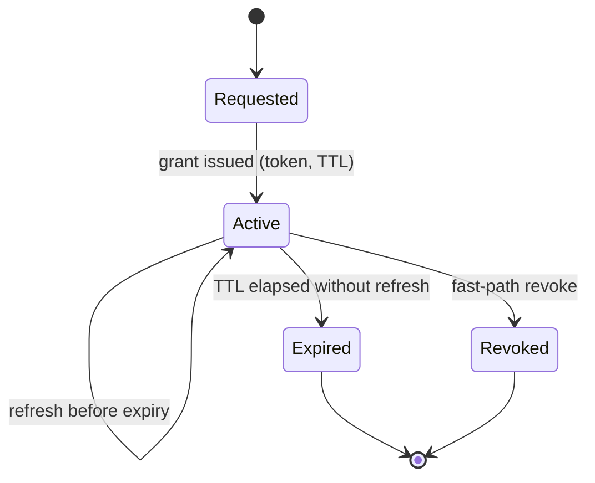

# Entitlement

Status: working draft
Scope: the model by which the platform grants, enforces, and revokes the right of
an endpoint to receive a channel. This is the deep-dive companion to
[architecture](architecture.md) §11; it develops the grant model, token design,
lifecycle, and failure behaviour. Identity and cryptography are covered in
[security](security.md); the API that issues and revokes grants is in
[control-plane](control-plane.md) §3.2.

---

## 1. Purpose

Entitlement makes distribution *dynamic and revocable* ([vision](vision.md) §7),
answering, at the point of delivery: may this endpoint receive this channel, right
now, and for how long?

The distinction this document draws is between **subscription** (a transport-level
act: an endpoint asks a relay for a track) and **entitlement** (a
commercial/rights-level fact: this party is permitted to receive this content
under a contract). MoQ's subscription model aligns them naturally — a subscription
succeeds only while a valid entitlement exists — but they are not the same thing:
entitlement is the *policy*, subscription the *mechanism* that enforces it. That
alignment is what lets a rights window, partner off-boarding, or emergency
takedown be a control-plane operation rather than manual reconfiguration of
receivers.

## 2. Entitlement model

- **Principal types.** The entitled party is an endpoint: an edge gateway feeding
  IRDs, a native MoQ subscriber (e.g. an OTT origin), or a federation peer
  representing another operator's domain. Human operators and automation are *not*
  entitlement principals; they act on the control plane (see
  [security](security.md) §2) and cause entitlements to be issued.
- **Resource types.** The entitled resource is a channel, expressed as a
  tenant-scoped track namespace ([control-plane](control-plane.md) §4.1). A grant
  may cover a single channel or a namespace prefix, but the bias is toward the
  narrowest scope that satisfies the contract (least privilege).
- **Grant types.**
  - *Temporary* — the default: a short-lived grant tied to a rights window or a
    session, continuously renewed while valid.
  - *Persistent* — a long-lived commercial relationship (e.g. an always-on
    affiliate feed), still realised as short-lived tokens under the hood (§3) so
    that revocation remains bounded.
  - *Delegated* — a grant that authorises a party to re-distribute to its own
    downstream (an affiliate re-distributing to its region), modelled as an
    explicit, recorded delegation rather than credential sharing (§6).

## 3. Token and policy design

An entitlement is realised as a short-lived, path-scoped token (JWT) that the
endpoint presents when subscribing and that the relay validates locally against a
public key ([control-plane](control-plane.md) §8.2). Local validation is
important: it means enforcement does not require a round-trip to the control plane
on every subscription, which is what allows the data plane to keep running during
a control-plane outage (§7).

- **Claims.** At minimum: issuer, subject (the endpoint principal), audience/scope
  (the tenant-scoped track namespace and route), issued-at and expiry, and a
  unique token identifier for audit and for fast-path revocation matching.
- **TTL and expiry.** Tokens are deliberately short-lived. The TTL is the single
  most consequential parameter in the whole model, because it sets the worst-case
  revocation bound (§5) and the steady-state renewal load. There is no universally
  correct value; it is a policy choice per tenant/content, biased short for
  high-value contracted content. This trade-off is stated as an open question in
  [control-plane](control-plane.md) §10.
- **Scope granularity.** Scope should be as narrow as the contract allows.
  Broad-scope tokens reduce renewal traffic but widen the blast radius of a leaked
  token; narrow-scope tokens do the reverse. The default is narrow.

## 4. Lifecycle flows

- **Provision grant.** The control plane issues a token in response to an
  authorised API call ([control-plane](control-plane.md) §3.2); the endpoint
  subscribes and delivery begins.
- **Refresh/renew.** Before expiry, the endpoint requests a new token. A refusal
  to refresh *is* a revocation (§5), which is what makes the backstop work.
- **Revoke.** An explicit revocation is pushed to relays/gateways, which drop the
  affected subscriptions.
- **Emergency disable.** A tenant- or channel-wide "stop now" that revokes all
  matching grants at once — a coarse, deliberately blunt control for
  rights-emergency or compliance takedown.

## 5. Latency and consistency

Revocation is the hard part, and it interacts directly with the out-of-band
control-plane principle ([architecture](architecture.md) §9.2). The platform uses
two paths together:

1. **Fast path** — an explicit revocation signal to relays and gateways that
   drops the affected subscriptions, giving sub-second revocation *when the
   control plane is healthy*.
2. **Backstop** — short token TTLs with continuous renewal, so the *worst-case*
   time to revoke is bounded by the TTL even if the fast path is unavailable;
   revocation then happens by declining to refresh.

The consistency boundary is therefore explicit: entitlement issuance and policy
are strongly consistent in the control-plane store (no two conflicting views of
who is authorised), while enforcement state at the edge is eventually consistent
within one TTL. It is important not to overstate this. "Deny-by-default" governs
*ambiguous, absent, malformed, or expired* credentials — those are refused
immediately (§7). It does **not** mean an already-granted, still-valid token is
dropped the instant a revoke is issued: if the fast path cannot reach the edge
(e.g. during a control-plane partition), a valid token continues to be honoured
until it expires. So the two revocation regimes are: **sub-second when the fast
path is healthy**, and **worst-case one TTL when it is not** — never "deny within
the window" for a token that is still valid. The TTL is what bounds that worst
case, which is exactly why it is the model's most consequential parameter (§3).

## 6. Multi-tenant and partner scenarios

- **Cross-org delegation.** When a route crosses a federation boundary, the
  entitlement does *not* transit transparently. The boundary validates the
  incoming grant and mints a domain-local grant for onward propagation, recording
  the mapping for audit ([architecture](architecture.md) §6.2 and §11.3).
  Transparent pass-through is rejected because it would make one operator's
  compromise another operator's breach.
- **Wholesale/affiliate distribution.** A broadcaster authorising an affiliate to
  re-distribute is modelled as delegation with its own scope and expiry, not as
  sharing the broadcaster's credentials.
- **Contract boundary mapping.** Each grant should be traceable to the commercial
  agreement it realises, so that "what is technically permitted" and "what is
  contractually agreed" can be reconciled in audit.

## 7. Failure handling

- **Expired token.** Denied. An endpoint presenting an expired token is refused
  and must obtain a fresh grant.
- **Malformed/absent token.** Denied by default ([architecture](architecture.md)
  §2, principle 5).
- **Partial outage.** If the control plane is unreachable, existing valid tokens
  continue to be honoured until expiry (data plane survives), but *new* grants and
  refreshes cannot be issued, so entitlements naturally drain as their TTLs
  elapse. This is a safe failure mode: the system fails toward *no new access* and
  toward *revocation by expiry*, never toward open access.
- **Safe defaults.** Every ambiguous case resolves to deny.

## 8. Audit and reporting

Every grant, refresh, revocation, and delegation writes an immutable audit record
(who received what, when, under which contract), correlated by the token
identifier and the platform's end-to-end correlation id
([control-plane](control-plane.md) §6.3). This serves two masters: incident
forensics ("who was receiving this feed at 20:03?") and rights-compliance
evidence ("prove this partner only received the content they were licensed for").
Reporting should be exportable per tenant and per contract boundary.

## 9. Acceptance criteria

- **Revocation correctness.** A revoked or unrefreshed entitlement results in no
  further delivery within the stated bound (fast-path sub-second when healthy;
  worst case one TTL otherwise).
- **Enforcement correctness.** No delivery ever occurs without a valid,
  in-scope, unexpired token — verified by attempting out-of-scope and expired
  subscriptions and confirming denial.
- **Operational usability.** Provisioning and revocation are simple enough that a
  NOC can perform an emergency disable under time pressure without error.

Specific numeric targets (revocation latency, renewal success rate) are proposed
in [control-plane](control-plane.md) §9 and should be treated as hypotheses to
validate, not committed figures.

## 10. Open questions

- What is the right default TTL, and should it vary by content value and by the
  reachability characteristics of the endpoint? (Shared with
  [control-plane](control-plane.md) §10.)
- How is delegated entitlement bounded so that a chain of re-distribution cannot
  outlive or exceed the scope of the grant at its root?
- In federation, how is revocation propagated across an administrative boundary
  quickly enough to meet a rights-emergency requirement, given that the downstream
  operator controls its own enforcement?
