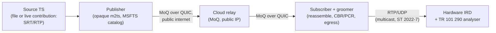

# Implementation and Testing

Status: working draft
Scope: the bridge from the reference architecture to a running, testable system —
which components are required, where to obtain the public ones, what prerequisites
they impose, a minimal reference deployment, and the test methodology that leads
to the make-or-break hardware-IRD proof. This is the practical companion to
[architecture](architecture.md) and [transport](transport.md).

> **Confidentiality note.** The platform's own publisher/subscriber and grooming
> components are, at the time of writing, a private repository. This document
> references them only by *role*; it does not disclose their internals. Everything
> else here is public, standards-track, or standard broadcast tooling.

---

## 1. Purpose

This document describes *what you would assemble* to stand up an end-to-end path
and prove it works. It is not a step-by-step install guide (versions and commands
move too fast for a reference document) but a map of the components, their
dependencies, and the validation pipeline, with enough specificity to reproduce
the setup.

The end-to-end path being assembled is the one in [architecture](architecture.md)
§3: publisher → cloud relay → edge/subscriber → egress → IRD (or analyser).

## 2. Components

| Role | Component | Source | Public? |
|---|---|---|---|
| MoQ transport (relay + endpoints) | `moq` (moq-dev) / Cloudflare `moq-rs` / `kixelated/moq` | github.com/moq-dev/moq; the wider MoQ implementations | Public |
| Media packaging profile | MSFTS `m2ts` (`draft-gregoire-moq-msfts`) | github.com/mondain/msfts; IETF draft | Public |
| TS analysis / conformance | TSDuck (`tsp`, `pcrverify`, `analyze`) | tsduck.io | Public |
| Publisher (ingest → MoQ) | Platform publisher (opaque m2ts lane) | Private repository | **No** |
| Subscriber + groomer + egress | Platform subscriber (reassembly, CBR/PCR grooming, RTP/FEC/ST 2022-7) | Private repository | **No** |
| Control plane | Provisioning/entitlement/observability services | Design ([control-plane](control-plane.md)); not yet a public artifact | **No** |
| Relay host | Cloud VM (e.g. AWS EC2) with public reachability | Any cloud/CDN with QUIC/UDP egress | Public |
| Validation hardware | Hardware IRD(s) and a TR 101 290 analyser (e.g. Sencore) | Broadcast equipment | n/a |

The deliberate split: the *transport and packaging* are public and commoditising
(consistent with the thesis in [vision](vision.md) §6), while the *broadcast-grade
publisher/subscriber/groomer and control plane* are the platform's own work. A
reader can reproduce the transport and packaging layers from public sources today;
reproducing IRD-grade egress requires the grooming logic described conceptually in
[architecture](architecture.md) §7.2 and [transport](transport.md) §4.4.

## 3. Prerequisites

- **Toolchain.** A Rust toolchain matching the targeted MoQ implementation
  (the MoQ transport crates are Rust). Standard build tooling for the surrounding
  services.
- **Transport runtime.** QUIC / HTTP-3 support end to end, which in practice means
  UDP reachability (not just TCP/443 proxies) between publisher, relay, and
  subscriber, and a working TLS 1.3 stack. Middleboxes that block or throttle UDP
  will break or degrade the path.
- **Identity / PKI.** Certificates for mTLS between data-plane peers and a signing
  key for subscriber entitlement tokens ([security](security.md) §2, §4). For a
  lab, a private CA is sufficient.
- **Network.** A publicly reachable relay endpoint; on the egress side, the
  ability to emit UDP/RTP and, for realistic tests, IP **multicast** and an
  ST 2022-7 dual-path network path to the IRD.
- **Draft pinning.** This platform was built against **draft-14** (`moq-transport`
  0.14.2), which was the production Rust transport available at the time. It is no
  longer the only one — the ecosystem has since moved on, with Rust and other
  implementations at draft-16 through draft-18 ([transport](transport.md) §5.1) —
  so treat the draft as a pinned dependency that is now *behind* the interop target
  and plan migration explicitly ([transport](transport.md) §5).
- **Validation gear.** At least one hardware IRD and, ideally, a TR 101 290
  analyser. File-based analysis (TSDuck) is a necessary but *not sufficient*
  substitute for hardware (§6).

## 4. Reference deployment topology

A minimal but representative end-to-end lab:

This mirrors what has already been run end-to-end over the public internet via a
cloud relay ([evidence](evidence.md) §1). Scaling this to the full reference
architecture adds relay federation ([relay](relay.md) §6), regional edge gateways,
and the control plane, but the single-path lab above is the unit that must work
first.

## 5. Build and run outline

At a high level, and without reproducing sensitive detail:

1. Build/obtain the MoQ relay and stand it up on a publicly reachable host with a
   valid TLS certificate and the pinned ALPN for the targeted draft.
2. Configure the publisher to ingest the source (file or live contribution),
   package it on the opaque m2ts lane, publish an MSF catalog, and connect to the
   relay.
3. Configure the subscriber to authenticate, subscribe to the advertised track,
   reassemble, groom to CBR with PCR correction, and emit the configured egress.
4. Point the egress at the IRD/analyser and confirm lock and conformance (§6).

## 6. Testing and validation

The validation pyramid below is the conceptual ordering; the formal, executable
plan that operationalises it — with per-test methodology, `tc`/`netem` impairment
profiles, result tables, and pass criteria — is in the [test plan](test-plan.md).

The validation pyramid, from cheapest/fastest to most decisive:

1. **Unit / property tests.** Byte-level round-trip fidelity of the media layer,
   *under complete, lossless carriage*: a TS in must reconstruct byte-identically
   (at the TS-packet payload level, excluding null packets stripped for transport)
   after packaging → objects → reassembly, and service signalling (SDT, PMT PIDs,
   SCTE-35, teletext, continuity counters) must be preserved
   ([evidence](evidence.md) §1, §5). This establishes the packaging/reassembly
   contract in the no-loss case; behaviour under object loss (where byte-identity
   necessarily breaks) is a separate concern tested via the redundancy and
   deterministic-grooming path ([architecture](architecture.md) §14.1). These are
   transport-draft-independent by design ([transport](transport.md) §5.2).
2. **End-to-end integration over a real network.** Run the topology of §4 over the
   public internet via the cloud relay and confirm continuous delivery under real
   loss/jitter.
3. **File-based conformance.** Capture the subscriber's egress to file and analyse
   with TSDuck (`pcrverify`, `analyze`) for PCR interval conformance and structural
   integrity. This catches gross problems cheaply but does **not** prove hardware
   acceptance.
4. **Hardware TR 101 290 conformance (the decisive test).** Feed the egress to a
   real hardware IRD and analyser and confirm a clean **P1/P2 pass**. This is the
   single most important acceptance gate in the whole project; until it passes,
   grooming is "structurally sound and file-validated," not "broadcast-acceptable"
   ([architecture](architecture.md) §7.2 and §17, [interoperability](interoperability.md)
   §6).
5. **Non-ideal-source robustness.** Repeat with real contribution captures
   (open-GOP with recovery-point SEI, discontinuities, mid-stream PID changes) to
   confirm the opaque lane's robustness ([interoperability](interoperability.md)
   §7).
6. **Redundancy drill.** Induce path failure and confirm hitless ST 2022-7
   switching at the IRD ([architecture](architecture.md) §14).
7. **Comparative lab (optional but recommended).** Head-to-head against SRT under matched conditions, feeding the economic model
   ([economics](economics.md) §8).

## 7. Acceptance gates

- **Gate 1 — media fidelity:** round-trip and non-ideal-source tests pass (steps 1,
  5). Cheap, do first.
- **Gate 2 — hardware conformance:** TR 101 290 P1/P2 pass on real IRDs (step 4).
  **Make-or-break;** if this fails, fix grooming before anything else.
- **Gate 3 — resilience:** hitless redundancy drill passes (step 6).

## 8. Version and migration considerations

The transport draft is a pinned, tracked dependency, not a stable platform. Plan
for migration (currently draft-14 → later drafts) as a thin-glue change enabled by
the transport-independent layering ([transport](transport.md) §5.2). The
implementation should make the ALPN, control-message set, and data-plane encoding
swappable behind the stable media/packaging interface so that a draft upgrade does
not touch the tested media layer or the grooming logic.

## 9. Open questions

- What is the minimum viable public reference implementation that demonstrates the
  end-to-end path without disclosing the platform's grooming logic — and is
  publishing one worth the effort as a credibility artifact?
- How is the hardware-IRD test matrix defined (which IRD models, which analyser
  settings) so that a P1/P2 pass is credible across the installed base rather than
  on a single decoder ([interoperability](interoperability.md) §10)?
- Which parts of the grooming pipeline, if any, should be contributed upstream or
  open-sourced, versus kept private (the recurring open question from the
  [README](../README.md))?
