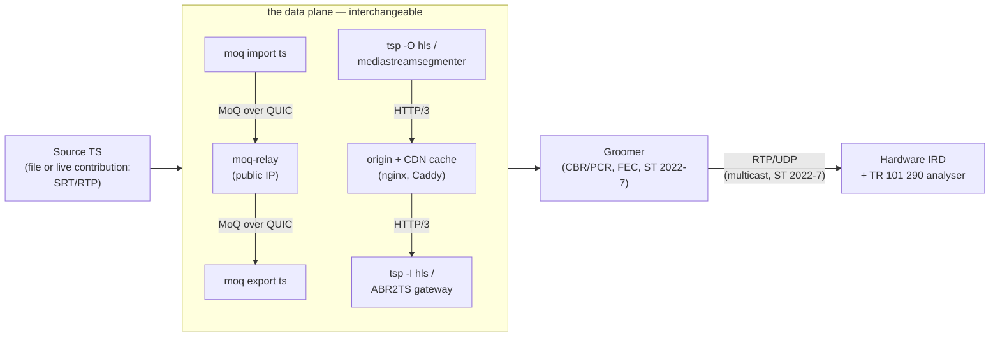

# Implementation and Testing

Status: working draft
Layer: **above the transport** — the assembly and test path is largely the same on either data plane,
and §2 marks the stages where it is not.
Scope: the bridge from the reference architecture to a running, testable system —
which components are required **on each data plane**, which of them are free and which must be bought,
what prerequisites they impose, a minimal reference deployment, and the test methodology that leads
to the make-or-break hardware-IRD proof. This is the practical companion to
[architecture](architecture.md), [transport](transport.md) and [alternatives](alternatives.md).

> **Recipes live in the lab, not here.** Exact commands, versions and runnable scripts for both data
> planes are in [lab/](../lab/README.md) — [T13](../lab/test-13-downstream-grooming.md) for grooming and
> [T14](../lab/test-14-data-plane-comparison.md) for the head-to-head, whose
> [scripts](../lab/scripts/) stand up each path end to end. This document is the map: what the stages
> are, what fills them, and what it costs.

> **Confidentiality note.** The platform's own publisher/subscriber and grooming
> components are, at the time of writing, a private repository. This document
> references them only by *role*; it does not disclose their internals. Everything
> else here is public, standards-track, or standard broadcast tooling.

---

## 1. Purpose

This document describes *what you would assemble* to stand up an end-to-end path
and prove it works. It is not a step-by-step install guide (versions and commands
move too fast for a reference document) but a map of the components, their
dependencies, and the validation pipeline.

The end-to-end path is the one in [architecture](architecture.md) §3 —
publisher → fan-out → subscriber → groomer → egress → IRD (or analyser). It has the same
shape on either data plane, and only the publish, fan-out and receive stages change.

## 2. The toolchain, stage by stage

Both data planes decompose the same way, so the useful view is stage by stage rather
than protocol by protocol. Two things fall out of it: most stages are common, and where
the two differ, **they are incomplete in opposite places** (§2.2).

| Stage | MoQ | Segmented HTTP | Owned by |
|---|---|---|---|
| **Ingest** (contribution in) | SRT / RTP / file — TSDuck `tsp` | identical | distributor |
| **Publish / package** | `moq import ts` (media-aware) or the opaque `m2ts` lane under MSFTS | *classic:* TSDuck `tsp -O hls` *low-latency TS:* Apple `mediastreamsegmenter --format=transport -w <ms>` | distributor |
| **Fan-out** | `moq-relay` on a reachable host; Cloudflare's implementation | any HTTP origin + cache: nginx, Caddy, or a commodity CDN | distributor or CDN |
| **Receive → TS** | `moq export ts` | *classic:* `tsp -I hls`, FFmpeg *low-latency:* **see §2.2** | recipient or distributor |
| **Groom → conformant CBR** | [`mpegts-pacer`](https://github.com/tdrapier-wbd/mpegts-pacer) — byte-locked CBR, PCR re-stamp, RTP/multicast egress, stream-clocked 1+1 pairing | **the same binary, no flags changed.** Bursts are ~240× coarser, so it sizes its buffer to seconds rather than milliseconds from the arrival it observes; measured to the same conformance on both (§9.1, [T16](../lab/test-16-grooming-segmented-http.md)) | **distributor, on both** |
| **Egress FEC / ST 2022-7 / start gate** | private (see below) | private; identical requirement | **distributor, on both** |
| **Analysis / conformance** | TSDuck (`pcrverify`, `analyze`), hardware TR 101 290 analyser | identical | distributor |
| **Control plane** | provisioning, entitlement, observability ([control-plane](control-plane.md)) | identical model, different projection target ([alternatives](alternatives.md) §7) | distributor |

The bottom four rows are the same on both, which is the paper's thesis expressed as
a bill of materials: the parts an operator has to build or buy do not change with the
transport, and the parts that change with the transport are the ones already written.

### 2.1 What is still private, and what no longer is

Transport, packaging and the CBR/PCR grooming stage are all reproducible from public
sources: the media-aware lane is upstream, and the groomer is a public crate — the
distribution of open and closed components the thesis expects ([vision](vision.md) §6).
What remains private is the rest of the IRD-facing egress — FEC, ST 2022-7 pairing,
start gating, egress TR 101 290 monitoring — and the control plane. A reader can
reproduce the whole path from contribution to a conformant CBR RTP egress today, on
either data plane, and the grooming logic is no longer the undisclosed part.

### 2.2 What a free path looks like, and the one stage you cannot get free

This is the practical question for anyone unwilling to buy a commercial gateway, and
it has a measured answer ([T14](../lab/test-14-data-plane-comparison.md) measurement 2b).

**Every stage above has a free implementation except one: receiving low-latency HLS
back into a transport stream.** The gap is narrow and specific, and it is worth stating
exactly, because it is easy to assume from the surrounding availability that it must
exist somewhere.

- **Publishing** low-latency HLS with MPEG-TS partial segments *is* free. Apple's HLS
  Tools do it in one command, emitting conformant `EXT-X-PART` entries pointing at
  0.28–0.30 s TS parts. The tools are closed-source and macOS-only, but they cost nothing.
- **Receiving** those parts has no free implementation at all. TSDuck cannot parse
  `EXT-X-PART` — pointed at a live edge carrying only parts it exits with `empty HLS
  media playlist` — and FFmpeg's HLS demuxer exposes no way to fetch them. Measured
  against a fully conformant origin (Apple's `ll-hls-origin-example.go`, advertising
  `CAN-BLOCK-RELOAD=YES` and `PART-HOLD-BACK`, validating clean), both fetched **zero**
  parts and issued **zero** blocking reloads, falling back to whole segments. Apple's own
  `mediastreamvalidator` fetched 17 parts over that same origin using 12 blocking
  reloads, so the capability is real and advertised; the limitation is in the clients.

So the free toolchain is **asymmetric**, and the missing half is precisely what the
commercial products sell:

| Want | Free option | Commercial option |
|---|---|---|
| Classic HLS → TS, ~6 s latency | `tsp -I hls`, FFmpeg | any professional IRD with an HLS input |
| **Low-latency HLS → TS, ~2 s** | **none** | Synamedia MEG (ABR2TS), Ateme TITAN Edge |
| MoQ → TS | `moq export ts` | **none** |
| TS → conformant CBR egress | `mpegts-pacer` | Synamedia, Ateme, Harmonic gateways |

**The two data planes are therefore incomplete in mirror-image ways.** Segmented HTTP
has mature commercial receivers and no free low-latency one; MoQ has a free receiver
and no commercial one, and carries media in only a single implementation
([interoperability](interoperability.md) §9). Neither offers a complete free path to a
low-latency, IRD-conformant hand-off today. An operator who will not buy hardware gets
classic HLS at roughly six seconds — whatever the publisher emits — or MoQ with a
single implementation to depend on.

**The narrowness of the gap is what makes it worth pinning.** A free receiver needs
`EXT-X-PART` parsing and blocking playlist reload in front of a TS demuxer that already
exists — a few hundred lines, not a new stack — and everything downstream of it, the
grooming and egress that actually decide IRD acceptance, is already public. That
possibility is tracked in §9.

## 3. Prerequisites

Most of these apply to both data planes; the two marked *MoQ only* are the cost of that choice.

- **Toolchain.** A Rust toolchain matching the targeted MoQ implementation
  (the MoQ transport crates are Rust) — *MoQ only*. Segmented HTTP needs no build step:
  TSDuck, nginx and Apple's tools are all packaged binaries. Standard build tooling for
  the surrounding services either way.
- **Transport runtime.** For MoQ, QUIC / HTTP-3 end to end, which in practice means
  UDP reachability (not just TCP/443 proxies) between publisher, relay, and
  subscriber, and a working TLS 1.3 stack; middleboxes that block or throttle UDP
  will break or degrade the path. Segmented HTTP is more forgiving by construction — it
  runs over HTTP/3 if UDP is available and falls back to HTTP/2 on TCP if it is not,
  at a cost of roughly 2.6 points of wire overhead ([evidence](evidence.md) §10).
- **Identity / PKI.** Certificates for mTLS between data-plane peers and a signing
  key for subscriber entitlement tokens ([security](security.md) §2, §4). For a
  lab, a private CA is sufficient.
- **Network.** A publicly reachable relay endpoint; on the egress side, the
  ability to emit UDP/RTP and, for realistic tests, IP **multicast** and an
  ST 2022-7 dual-path network path to the IRD.
- **Wire-version pinning** — *MoQ only.* Neither lane sits on the ecosystem's interop
  target. The preferred media-aware lane rides **moq-lite**, upstream's own simplified
  wire protocol, so it tracks upstream releases rather than the IETF draft series; the
  opaque prototype pins **draft-14** (`moq-transport` 0.14.2). Treat the wire version
  as a pinned dependency and plan migration explicitly ([transport](transport.md) §5).
  Segmented HTTP has no equivalent exposure: HLS's wire format has been stable and
  universally implemented for fifteen years, which is the interoperability and maturity
  argument in [alternatives](alternatives.md) §6 stated as a prerequisite.
- **Validation gear.** At least one hardware IRD and, ideally, a TR 101 290
  analyser. File-based analysis (TSDuck) is a necessary but *not sufficient*
  substitute for hardware (§6).

## 4. Reference deployment topology

A minimal but representative end-to-end lab. The two data planes differ only in the
middle; the source at one end and the grooming, egress and conformance stage at the
other are common, and the common part is where the engineering is.

```mermaid
flowchart LR
    SRC["Source TS\n(file or live contribution:\nSRT/RTP)"]

    subgraph DP["the data plane — interchangeable"]
        direction TB
        PUB["moq import ts"] -->|MoQ over QUIC| RELAY["moq-relay\n(public IP)"] -->|MoQ over QUIC| SUB["moq export ts"]
        HPUB["tsp -O hls /\nmediastreamsegmenter"] -->|HTTP/3| CACHE["origin + CDN cache\n(nginx, Caddy)"] -->|HTTP/3| HSUB["tsp -I hls /\nABR2TS gateway"]
    end

    GROOM["Groomer\n(CBR/PCR, FEC, ST 2022-7)"]
    IRD["Hardware IRD\n+ TR 101 290 analyser"]

    SRC --> DP --> GROOM -->|"RTP/UDP\n(multicast, ST 2022-7)"| IRD
```

The MoQ path has been run end-to-end over the public internet via a cloud relay
([evidence](evidence.md) §1); the opaque prototype exercises the same shape on
loopback only. The segmented-HTTP path has been run on loopback for burst granularity,
carriage fidelity and wire cost ([T14](../lab/test-14-data-plane-comparison.md)), and
its low-latency variant only as far as the origin, for the reason in §2.2. Scaling to
the full reference architecture adds relay federation ([relay](relay.md) §6) or CDN
tiering, regional edge gateways, and the control plane, but the single-path lab above
is the unit that must work first.

## 5. Build and run outline

At a high level, and without reproducing sensitive detail. Runnable versions of steps
1–3 for both data planes are in [lab/scripts/](../lab/scripts/) — `t14-a.sh` for MoQ,
`t14-b1.sh` and `t14-b2.sh` for classic and low-latency segmented HTTP.

1. **Stand up the fan-out.** For MoQ, build or obtain the relay and put it on a
   publicly reachable host with a valid TLS certificate and the pinned ALPN for the
   targeted draft. For segmented HTTP, point an HTTP origin at the packager's output
   directory and put a cache or CDN in front of it.
2. **Configure the publisher.** For MoQ, ingest the source, demultiplex it onto
   media-aware tracks, publish the catalog and connect to the relay — or, on the
   fallback lane, package the TS verbatim under an MSF catalog. For segmented HTTP,
   segment the source into the origin's directory, choosing the segment duration
   deliberately: it sets both the latency floor and the size of the burst the groomer
   will have to absorb, and those are the same knob
   ([architecture](architecture.md) §7.4).
3. **Configure the receiver.** Authenticate, subscribe or fetch, reassemble to a
   transport stream, groom to CBR with PCR correction, and emit the configured egress.
   This stage is where the two planes' effort diverges most: the reassembly is easier
   on segmented HTTP and the grooming considerably harder.
4. **Point the egress at the IRD/analyser** and confirm lock and conformance (§6).

## 6. Testing and validation

The validation pyramid below is the conceptual ordering; the formal, executable
plan that operationalises it — with per-test methodology, `tc`/`netem` impairment
profiles, result tables, and pass criteria — is in the [laboratory notebook](../lab/README.md).

The validation pyramid, from cheapest/fastest to most decisive:

1. **Unit / property tests.** Byte-level round-trip fidelity of the media layer,
   *under complete, lossless carriage*: a TS in must reconstruct byte-identically
   at the TS-packet payload level, excluding null packets stripped for transport, and
   service signalling (SDT, NIT, PMT PIDs, `stream_type`, SCTE-35, teletext) must be
   preserved. Continuity counters and the wall clock are *regenerated* on the
   media-aware lane rather than relayed, so they belong to the output mux's own
   correctness rather than to this check ([evidence](evidence.md) §4). This establishes the packaging/reassembly
   contract in the no-loss case; behaviour under object loss (where byte-identity
   necessarily breaks) is a separate concern tested via the redundancy and
   deterministic-grooming path ([architecture](architecture.md) §14.1). These are
   transport-draft-independent by design ([transport](transport.md) §5.2).
2. **End-to-end integration over a real network.** Run the topology of §4 over the
   public internet via the cloud relay and confirm continuous delivery under real
   loss/jitter.
3. **File-based conformance.** Capture the subscriber's egress to file and analyse
   with TSDuck (`pcrverify`, `analyze`) for PCR interval conformance and structural
   integrity. This catches gross problems cheaply but does **not** prove hardware
   acceptance.
4. **Hardware TR 101 290 conformance (the decisive test).** Feed the egress to a
   real hardware IRD and analyser and confirm a clean **P1/P2 pass**. This is the
   single most important acceptance gate in the whole project; until it passes,
   grooming is "structurally sound and file-validated," not "broadcast-acceptable"
   ([architecture](architecture.md) §7.2 and §17, [interoperability](interoperability.md)
   §6).
5. **Non-ideal-source robustness.** Repeat with real contribution captures
   (open-GOP with recovery-point SEI, damaged and spliced audio, discontinuities,
   mid-stream PID changes). This step has done real work: it is what surfaced both
   media-aware import defects that upstream has since fixed
   ([interoperability](interoperability.md) §7).
6. **Redundancy drill.** Induce path failure and confirm hitless ST 2022-7
   switching at the IRD ([architecture](architecture.md) §14). The software half is
   done — a reference receiver loses nothing across leg blackout, path loss and
   differential delay — so the drill's remaining job is the hardware merge, plus
   stating which egress topology is being accepted, since a mergeable *and* groomed
   pair requires either one groomer duplicated onto both paths (protecting the last
   hop only) or two **stream-clocked** groomers, and two arrival-clocked groomers do
   not merge at all ([evidence](evidence.md) §7).
7. **Comparative lab (not optional).** Head-to-head against the alternative data plane
   and against SRT under matched conditions, feeding the economic model
   ([economics](economics.md) §9). [T14](../lab/test-14-data-plane-comparison.md) settled
   which data plane is harder to groom, and settled it against the intuitive answer, so
   this belongs *before* a data-plane commitment rather than after one.

## 7. Acceptance gates

- **Gate 1 — media fidelity:** round-trip and non-ideal-source tests pass (steps 1,
  5). Cheap, do first.
- **Gate 2 — hardware conformance:** TR 101 290 P1/P2 pass on real IRDs (step 4).
  **Make-or-break;** if this fails, fix grooming before anything else.
- **Gate 3 — resilience:** hitless redundancy drill passes (step 6). Passed in
  software against a reference receiver; the on-hardware merge remains open.

## 8. Version and migration considerations

The wire version is a pinned, tracked dependency, not a stable platform. Plan for
migration as a thin-glue change enabled by the transport-independent layering
([transport](transport.md) §5.2). The
implementation should make the ALPN, control-message set, and data-plane encoding
swappable behind the stable media/packaging interface so that a draft upgrade does
not touch the tested media layer or the grooming logic.

## 9. Two pieces of work worth doing

One is now done and measured; the other still stands. Between them they close the free path
end to end: §9.1 lets a single groomer sit behind either data plane, §9.2 removes the receive
gap of §2.2.

### 9.1 Make the groomer data-plane agnostic — done, and measured as T16

`mpegts-pacer` was written against a MoQ egress, which arrives in 12.4 kB bursts with a
worst-case silence of 149 ms. A segmented-HTTP egress arrives in ~2.95 MB bursts with
silences over four seconds ([evidence](evidence.md) §10) — the same job, two orders of
magnitude more input buffering, and a start gate that must not declare underrun during a
normal inter-segment gap.

**The groomer now sizes itself from arrival, and the claim is demonstrated rather than
argued.** It measures the *lead* its input builds — how far ahead of real time the media it
has been handed runs — and derives the cushion, the buffer cap, the condition on which output
starts and the stall timeout from that one quantity. On a MoQ egress the lead never approaches
the 200 ms floor, so nothing changes. On a segmented-HTTP egress it settles at seconds, and
the same binary with no flag changed reaches the same conformance the MoQ lane was graded to:
zero PCR violations at 481 ns, zero repetition intervals above 40 ms, zero continuity errors,
10 ms CoV 0.068 against the ungroomed egress's 12.381, nothing dropped and nothing muted
([T16](../lab/test-16-grooming-segmented-http.md)). **One groomer serves both data planes,
and it is the same binary on either input.**

Two results from running it are worth carrying here rather than leaving in the lab record.

**The remedy was not the one this section originally implied, and the difference is
instructive.** [T14](../lab/test-14-data-plane-comparison.md) called the gap "a configuration
finding, not a defect", the proposal being that the timeouts documented for the MoQ lane were
too tight. Run that way — timeout raised, depths left alone — the groomer stops muting and
instead overflows its buffer and pads the shortfall with nulls, emitting a stream with 231
continuity errors behind a flawless PCR record and a perfectly flat wire. The operative
parameter was the cushion, 200 ms to 8 s, with the timeout following from it. A
flag-only configuration that passes does exist, so the parameter space was adequate; but its
three numbers are properties of the egress rather than of the tool, which is exactly why
deriving them is worth more than documenting them.

**Sizing from observed arrival matters more than it first appears,** because a RIST or SRT
input is not a third fixed shape to code against. Those transports are *transparent* — their
egress reproduces their publisher's cadence, measured identical to a no-transport control
([evidence](evidence.md) §11) — so a groomer behind one of them inherits whatever the far-end
encoder does, which is not a property the groomer can know in advance. The three arrival
patterns to tolerate are MoQ's fixed 12.2–12.4 kB, segmented HTTP's segment-sized bursts, and
*unknown*. Only the third requires the buffer to be adaptive rather than merely large, and it
is the case the adaptive path is built for even though T16 could only measure the second.

What remains is a bound rather than a mechanism. The cushion is clamped at a default ceiling
of 8 s, which is adequate for 2 s segments and would need raising for 6 s ones, and the cost
of absorption is arithmetic: T16's passing arm held 7.5 s of programme before emitting a byte
and ran a 13.1 MB buffer. A groomer cannot ride out a gap it has not stored programme for, so
segment duration still sets a latency floor and grooming still adds a multiple of it. What
grooming removes is that floor being visible to the receiver as a cadence fault.

### 9.2 A slim low-latency HLS receiver that pipes into the groomer

The gap in §2.2 is narrow: `EXT-X-PART` parsing, blocking playlist reload (`_HLS_msn` /
`_HLS_part`), preload-hint handling, and part-to-TS concatenation on stdout. Everything
downstream — grooming, PCR re-stamp, CBR pacing, egress — already exists and is public.
A receiver whose entire output contract is "a transport stream on stdout, into
`mpegts-pacer`" needs no player, no rendition switching, no MSE, and no decoder.

On the choice of base, one candidate is less suitable than it first appears: **Shaka
Player is a browser player targeting Media Source Extensions**, so it neither produces a
transport stream nor runs outside a browser, and Shaka Packager is a packager rather
than a client. The more promising routes, in order:

1. **Extend TSDuck's `hls` input plugin.** It already fetches playlists, already emits TS
   into a `tsp` chain, and already has everything except partial-segment support — which
   is precisely what it was measured lacking. It is C++, actively maintained, and the
   work is upstreamable, so the fix would land for everyone rather than becoming another
   private tool. This is the strongest option and the one to cost first.
2. **Extend FFmpeg's HLS demuxer**, for the same reason and a wider install base, against
   a larger and slower-moving codebase.
3. **A standalone client**, which is the least work to a first result and the most work to
   maintain; useful as a proof that the parts are consumable, less useful as a product.

The strategic point is that (1) inverts the finding in §2.2. That measurement says the
free toolchain has a hole exactly where the commercial products sell. A few hundred lines
in a maintained open-source project would fill it — which makes the current state look
much more like nobody having needed TS parts outside broadcast than like a hard problem.

## 10. Open questions

- How is the hardware-IRD test matrix defined (which IRD models, which analyser
  settings) so that a P1/P2 pass is credible across the installed base rather than
  on a single decoder ([interoperability](interoperability.md) §11)?
- §9.1 is done, which removes the ordering question that used to sit here: a receiver
  emitting part-granular bursts now has a groomer that will accept them, so §9.2 can be
  costed on its own merits. The question it leaves is narrower — is the 8 s ceiling on a
  derived cushion the right default, given that it binds at 6 s segments and that raising it
  costs resident memory on every deployment including the MoQ ones that never need it?
- Should §9.2 be attempted upstream in TSDuck rather than as a local tool? Upstreaming
  is slower and would close the gap for the whole industry rather than for one
  distributor — which is the same trade already made with the groomer, and made the
  right way round.
- Now that the grooming stage is public and the remaining private surface is the
  IRD-facing egress and control plane, does publishing that egress layer buy more in
  credibility than it costs in differentiation? Since
  [T13](../lab/test-13-downstream-grooming.md) shows the grooming *requirement* can be
  documented with off-the-shelf tools, secrecy there protects nothing defensible.
