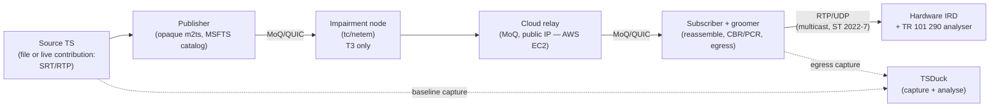
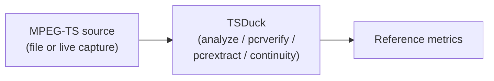
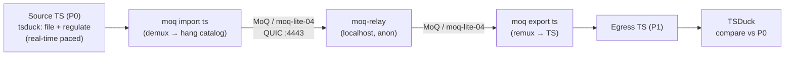
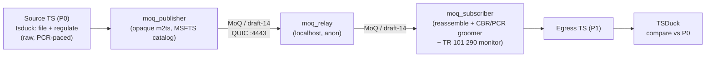
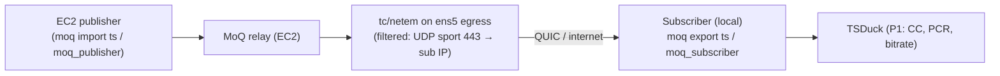
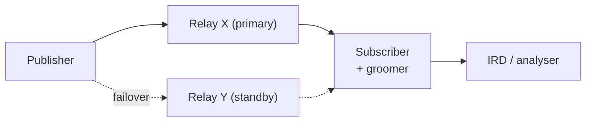
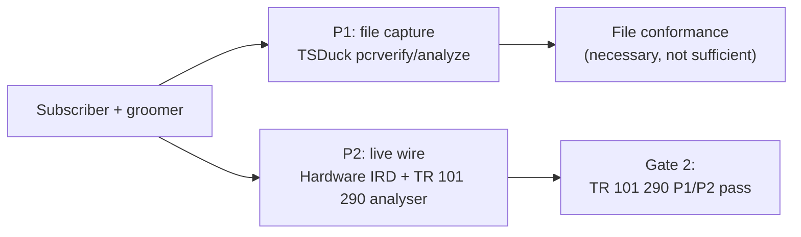
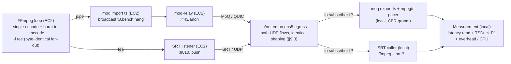
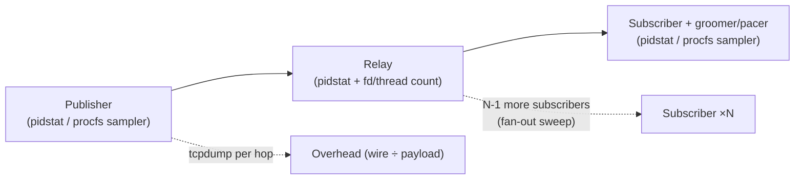

# Test Plan: MoQ MPEG-TS Primary Distribution Validation

Status: working draft
Scope: the formal validation plan for the thesis in the [README](../README.md) —
whether MPEG-TS transported over MoQ can meet professional broadcast primary
distribution requirements. It defines the test objective, the maturity baseline,
the individual tests (objective, architecture, methodology, metrics, pass
criteria, and limitations), and the conventions for recording results so that a
sceptical reader can reproduce and falsify them. This is the executable companion
to [implementation](implementation.md) §6–§7 (the validation pyramid and
acceptance gates) and draws its empirical baseline from [evidence](evidence.md).

> **Confidentiality note.** This plan references the platform's private
> publisher/subscriber/groomer components only by *role* (see
> [implementation](implementation.md) §2). It does not disclose their internals.
> All tooling named here (TSDuck, `tc`/`netem`, standard analysers) is public or
> standard broadcast equipment. Where a result would require confidential route
> or vendor data, this plan records the *method* and leaves the numbers out, per
> [CONTRIBUTING](../CONTRIBUTING.md).

> **On honesty.** This document is written to be *disproven*. Result tables use
> explicit placeholders — `TBM` (to be measured) — for numbers not yet taken, and
> record what has actually been measured separately from what is planned. A test
> plan that pre-fills its own results is worthless; the value here is the method
> and the pass criteria, agreed before the numbers are known.

---

## Contents

- [1. Test objective](#1-test-objective)
- [2. Current maturity assessment](#2-current-maturity-assessment)
- [3. How this plan maps to the validation pyramid and gates](#3-how-this-plan-maps-to-the-validation-pyramid-and-gates)
- [4. Test environment and conventions](#4-test-environment-and-conventions)
- [5. Test 1 — Baseline TS validation](#5-test-1--baseline-ts-validation) — ✅ done
- [6. Test 2 — MoQ transport transparency (media-aware lane, local)](#6-test-2--moq-transport-transparency-upstream-media-aware-lane-local) — ✅ done
- [7. Test 3 — MoQ transport transparency (opaque `m2ts` lane, local)](#7-test-3--moq-transport-transparency-opaque-m2ts-lane-local) — ✅ done
- [8. Test 4 — Remote relay end-to-end + SRT contribution (public internet)](#8-test-4--remote-relay-end-to-end--srt-contribution-public-internet) — ✅ media-aware
- [9. Test 5 — Network impairment](#9-test-5--network-impairment) — ✅ done (both lanes)
- [10. Test 6 — Relay resilience](#10-test-6--relay-resilience) — 🟡 ST 2022-7 determinism precondition analysed; drills planned
- [11. Test 7 — Timing integrity (the decisive test)](#11-test-7--timing-integrity-the-decisive-test) — **Gate 2, make-or-break**
- [12. Test 8 — SRT vs MoQ comparative benchmark](#12-test-8--srt-vs-moq-comparative-benchmark) — 🟡 clean-path baseline (§12.9); latency/impairment planned
- [13. Test 9 — System performance and resource utilisation](#13-test-9--system-performance-and-resource-utilisation) — planned
- [14. Cross-cutting limitations](#14-cross-cutting-limitations-stated-up-front)
- [15. Status summary](#15-status-summary)
- [16. Open questions](#16-open-questions)
- [17. Next steps and campaign roadmap](#17-next-steps-and-campaign-roadmap)

---

## 1. Test objective

Validate whether MPEG-TS transported via MoQ can meet professional broadcast
distribution requirements — specifically, whether a groomed MoQ egress is
**bit-transparent** to the transport stream, **timing-conformant** to
TR 101 290 P1/P2 on real hardware, and **resilient** under realistic network
impairment and infrastructure failure.

The thesis fails if any of the following holds and cannot be remedied:

- MoQ carriage is *not* bit-transparent (continuity errors, dropped signalling,
  or structural corruption survive a lossless path).
- Groomed egress cannot pass **TR 101 290 P1/P2 on a hardware IRD** (the
  make-or-break gate — [implementation](implementation.md) §7, Gate 2).
- Impairment or failure behaviour is qualitatively worse than the incumbent IP
  transports (SRT/Zixi/RIST) it would replace, at matched conditions.

This plan does not attempt to prove economic superiority; that is a separate,
route-specific exercise ([economics](economics.md)).

---

## 2. Current maturity assessment

Where the work stands at the time of writing. This is the baseline the plan is
designed to advance, reconciled with the evidence already recorded in
[evidence](evidence.md).

| Area | Status | Comment | Test(s) |
|---|---|---|---|
| MoQ transport | ✅ Proven | Publisher → relay → subscriber works end-to-end on **both** lanes locally: `moq-dev` media-aware (§6) and the platform's opaque `m2ts` lane (§7) | T2 ✅, T3 ✅ |
| Remote network path | ✅ Proven (media-aware, end-to-end) | EC2 relay reachable over the internet; **full live SRT contribution chain completed over the media-aware lane — 0 CC** (§8.4), and the **full ~9.93 Mbps feed pulled home over QUIC at 9.48 Mbps / 0 CC sustained 4 min** (T8 clean-path, §12.9); opaque-remote awaits deploying the opaque publisher on EC2 (not a transport gap) | T4 ✅ (media-aware), T8 clean-path ✅ |
| MPEG-TS preservation | ✅ Proven (file, local) | **T1 source baseline captured** (§5); media-aware lane carries elementary streams + PMT descriptors (reliably on `dev` per issue #1979, §6.8), and PR [#2440](https://github.com/moq-dev/moq/pull/2440) now adds the **DVB service layer — SDT/NIT/PMT-PID/TSID/ONID preserved**, leaving only **TDT/TOT/EIT** and CBR (restored downstream by `mpegts-pacer`, §6.7); **opaque lane is byte-transparent — SI/SCTE-35/PMT/PCR/CBR preserved verbatim, incl. TDT/TOT** (§7); live/remote source still owed | T1 ✅, T2 ✅, T3 ✅ |
| Broadcast timing | 🟡 Partial | **T1 P0 baselines clean**; **opaque-lane egress holds 0 % PCR intervals > 40 ms at P1 when fed raw** (§7.5); a downstream **`mpegts-pacer` stage grooms the bursty media-aware egress to exact CBR, 0 % PCR > 40 ms, 0 `pcrverify` violations at P1** (§6.7, T7 P1 across four clips §11.4.1); no live/hardware (P2) pass yet | T1 ✅, T3 ✅, T7 P1 ✅ |
| Failure behaviour | 🟡 Partial | **T5 impairment run on both lanes over the real EC2 path** (§9): QUIC absorbs ≤200 ms latency & ~1 % loss with 0 CC; reordering is the weak point; reconnect/relay-failure (T6) not yet exercised. **ST 2022-7 output-determinism precondition analysed** (§10.4): a single deterministic/offline groom is byte-exact reproducible, two independent *live* pacers are not yet byte-identical — no worse than SRT/Zixi on this axis, with a roadmap | T5 ✅, T6 |
| Operational model | 🟡 Conceptual | Runbooks designed ([operations](operations.md)); live SRT contribution chain now exercised over the internet (§8); still needs impairment/failover measurements | T4 ✅, T5, T6 |
| Production suitability | ❌ Not demonstrated | Needs the full evidence package below | T1–T7 |

**Overall:** roughly 65–75% through the *technical feasibility* phase. The proven
items now establish that the transport works on both lanes and that the **opaque
lane is bit-transparent on file**; the unproven items — a live/remote contribution
source, live timing conformance on hardware, and failure behaviour — are what
separate "it works in a demo" from "it is broadcast-grade."

---

## 3. How this plan maps to the validation pyramid and gates

This plan does not replace the validation pyramid and acceptance gates in
[implementation](implementation.md) §6–§7; it operationalises them. The mapping:

| This plan | Validation pyramid ([implementation](implementation.md) §6) | Acceptance gate ([implementation](implementation.md) §7) |
|---|---|---|
| **T1** Baseline TS validation | (reference for 1, 3) | precondition for Gate 1 |
| **T2** Transport transparency (media-aware lane, local) | 1 (unit/property), 2 (E2E), 3 (file conformance) | Gate 1 — media fidelity (reference lane) |
| **T3** Transport transparency (opaque `m2ts` lane, local) | 1, 2 (E2E), 3 (file conformance) | **Gate 1 — media fidelity (product lane)** |
| **T4** Remote relay + SRT contribution (public internet) | 2 (E2E over real path) | supports Gate 1 & Gate 3 |
| **T5** Network impairment | 2 (E2E under real loss/jitter) | supports Gate 1 & Gate 3 |
| **T6** Relay resilience | 6 (redundancy drill) | Gate 3 — resilience |
| **T7** Timing integrity | 3 (file conformance), 4 (**hardware TR 101 290**) | **Gate 2 — hardware conformance** |
| **T8** SRT vs MoQ comparative benchmark (§12) | 7 (comparative lab) | feeds [economics](economics.md) §8 |
| **T9** System performance and resource utilisation (§13) | 5/7 (scale, operational cost) | feeds [operations](operations.md) & [economics](economics.md) §8 |
| **T10** MPTS / multiple concurrent services (see §17.3) | 5 (scale/fidelity) | Gate 1 at multi-service scale |
| Non-ideal-source robustness (GOP, DVB subs) | 5 | Gate 1 (T3/T7 source variants) |

**Ordering.** Run cheap-and-decisive first: T1 (reference) → T2 (media-aware
fidelity) → T3 (opaque fidelity, Gate 1) → T7 file-based, then T7 hardware
(Gate 2, make-or-break) → T4/T5/T6 (real path, impairment, resilience — Gate 3).
If Gate 2 (T7 hardware) fails, stop and fix grooming before investing in
T4/T5/T6 scale work — a resilient path that a hardware IRD rejects is not a
product.

---

## 4. Test environment and conventions

### 4.1 Reference topology under test

The unit that must work first is the single-path lab from
[implementation](implementation.md) §4:



### 4.2 Measurement points

Every test is defined by *where* it measures. Three canonical capture points:

- **P0 — Source.** The input TS, before the publisher. Establishes the reference
  (T1).
- **P1 — Egress (file).** The subscriber's groomed output, captured to file and
  analysed with TSDuck. Cheap; catches gross faults; **not** sufficient for
  hardware acceptance (see [architecture](architecture.md) §7.2 caveat).
- **P2 — Egress (live wire).** The physical output as seen by a hardware IRD /
  TR 101 290 analyser. The only point that can decide PCR_accuracy (±500 ns) and
  P1/P2 (T7).

### 4.3 Tooling

| Purpose | Tool | Notes |
|---|---|---|
| TS structural / conformance analysis | **TSDuck** (`tsp`, `pcrverify`, `pcrextract`, `analyze`, `continuity`, `pat`/`pmt`/`sdt`) | Primary, sufficient for an engineering paper |
| PCR/PTS extraction & plotting | TSDuck `pcrextract` + external plotting | For jitter distributions |
| Real-time source pacing | TSDuck `regulate` (PCR-based) | Feeds live-paced TS into `import` (T2) |
| Upstream media-aware lane (T2) | **`moq-dev`** `moq` (import/export) + `moq-relay`, run locally | Public reference impl; speaks moq-lite / moq-transport-14…17 |
| Opaque `m2ts` lane (T3, T4) | **platform** `moq_publisher` / `moq_relay` / `moq_subscriber` (private) | draft-14 / MSFTS `m2ts`; subscriber grooms to CBR + runs TR 101 290 |
| Network impairment | **Linux `tc` / `netem`** (optionally `tc-tbf` for rate) | Applied at the impairment node (§4.1) |
| Hardware conformance | Hardware IRD + TR 101 290 analyser (e.g. Sencore); optionally Elecard StreamEye, R&S MTS4EA, Tektronix MTS, Ateme Titan monitoring **if access is available** | P2 only |
| Capture | `tcpdump`/`dumpcap` for wire; TSDuck for TS | Retain for reproducibility |

TSDuck is the load-bearing tool and is sufficient for the file-based tiers.
Vendor analysers (Elecard/R&S/Tektronix/Ateme) are *nice-to-have* corroboration
for T7 and are noted as access-dependent, not assumed.

### 4.4 Result-recording conventions

- Every result table records **units**, the **measurement point** (P0/P1/P2), the
  **tool and version**, the **source clip / capture identity**, and the **date**.
- Unmeasured cells are `TBM` (to be measured), never blank and never guessed.
- Each test states its **pass criteria before** results are recorded.
- Raw captures and analyser exports are the evidence of record; summary tables in
  this document point to them. (Large binaries are not committed to this repo; see
  §14.)
- Draft pinning is recorded with every transport result: currently **draft-14**
  (`moq-transport` 0.14.2) — [implementation](implementation.md) §3.

---

## 5. Test 1 — Baseline TS validation

Establish the reference. You cannot prove MoQ preserves quality without first
characterising the source. This runs *before* MoQ touches the stream.

**Status: run 2026-07-16 — reference established.** Four source clips were
characterised at P0 with TSDuck 3.44-4676 (macOS, Darwin 25.5.0). All four are
clean, conformant references (0 continuity errors, 0 transport errors, 0 PCR
discontinuities, 0% of PCR intervals > 40 ms, file-based PCR accuracy < 74 ns).
Results in §5.5; exact commands in §5.4.

### 5.1 Objective

Characterise the input MPEG-TS so that every downstream metric (T2, T3, T7) can be
stated as a *delta* against a known-good reference.

### 5.2 Architecture



### 5.3 Sources under test

| File | Role | Service | Video | Duration | TS bitrate |
|---|---|---|---|---|---|
| `testloop_clean.ts` | Synthetic clean CBR reference (FFmpeg) | Service01 | H.264 High@L4.0 4:2:0 1080i/p | 7 min 57 s | 10.00 Mbps (exact CBR) |
| `testloop.ts` | Real broadcast mux reference | Cartoonito UK HD 422 | H.264 High **4:2:2**@L4.0 1080 | 7 min 56 s | 27.51 Mbps |
| `CNNiEMEA.ts` | Real contribution capture | CNNI EMEA HD (WBD) | H.264 High@L4.0 4:2:0 1080 | 4 min 59 s | 9.95 Mbps |
| `CNNiEMEA2.ts` | Real contribution capture (longer) | CNNI EMEA HD (WBD) | H.264 High@L4.0 4:2:0 1080 | 9 min 59 s | 9.95 Mbps |

The two CNN captures are the real contribution-feed class referenced in
[evidence](evidence.md) §5 (CNN International). The GOP structure (open-GOP /
recovery-point SEI / IDR cadence) was not separately measured in this run and is
noted as a follow-up (§5.8).

### 5.4 Methodology and exact commands

All commands were run from the directory holding the clips (`~`). Each is
`-O drop` because T1 only reads and analyses; nothing is re-emitted. The `<clip>`
placeholder is each of the four files in §5.3.

**1. Structural + service + PID + table report (bitrate, PIDs, repetition, CC):**

```bash
tsp -I file <clip> -P analyze -O drop
```

**2. PCR accuracy / jitter (file-based, against PCR-estimated bitrate).**
Default threshold is 1000 µs; the sweep characterises how tight the source is,
including the TR 101 290 P2 ±500 ns limit (13.5 PCR units ≈ use `--absolute`):

```bash
# Default (1000 us) pass/fail summary
tsp -I file <clip> -P pcrverify -O drop

# Tighten in micro-seconds
tsp -I file <clip> -P pcrverify --jitter-max 500 -O drop   # then 50, 5

# Sub-microsecond, in absolute PCR units (27 units = 1 us; 13 units ~= 481 ns)
tsp -I file <clip> -P pcrverify --absolute --jitter-max 13 -O drop  # then 5, 2, 1
```

**3. PCR interval / repetition (TR 101 290 P1, ≤ 40 ms).** TSDuck has no direct
interval-histogram plugin, so PCRs are extracted to CSV and intervals computed
from the monotonic "Value offset in PID" column (col 7, in 27 MHz units;
1 ms = 27 000 units):

```bash
tsp -I file <clip> -P pcrextract --pcr --csv -o <clip>_pcr.csv -O drop

awk -F, 'NR>1{cur=$7; if(prev!=""){d=(cur-prev)/27000; n++; sum+=d;
  if(d>max)max=d; if(min==""||d<min)min=d; if(d>40)over++} prev=cur}
  END{printf "intervals=%d min=%.2f mean=%.2f max=%.2f ms  >40ms=%d (%.4f%%)\n",
  n, min, sum/n, max, over, (over/n)*100}' <clip>_pcr.csv
```

**4. Continuity-counter integrity** (prints only on error; no output = 0 errors):

```bash
tsp -I file <clip> -P continuity -O drop
```

### 5.5 Measured reference (P0, 2026-07-16)

| Metric (unit) | `testloop_clean` | `testloop` | `CNNiEMEA` | `CNNiEMEA2` |
|---|---|---|---|---|
| File size (bytes) | 596,847,172 | 1,638,619,656 | 372,971,696 | 745,917,260 |
| TS packets | 3,174,719 | 8,716,062 | 1,983,892 | 3,967,645 |
| Duration | 7:57 (477 s) | 7:56 (476 s) | 4:59 (299 s) | 9:59 (599 s) |
| TS bitrate, PCR-based (Mbps) | 10.000 | 27.508 | 9.946 | 9.946 |
| Service bitrate (Mbps) | 8.547 | 26.054 | 9.474 | 9.476 |
| Video PID bitrate (Mbps) | 8.254 | 25.062 | 9.019 | 9.021 |
| PCR PID / PMT PID | 0x0100 / 0x1000 | 0x0030 / 0x0020 | 0x006F / 0x0064 | 0x006F / 0x0064 |
| PCR interval min/mean/max (ms) | 0.60 / 19.80 / 20.45 | 27.34 / 27.74 / 28.16 | 0.15 / 24.42 / 24.95 | 0.15 / 24.42 / 24.95 |
| PCR intervals > 40 ms | **0 (0.0000%)** | **0 (0.0000%)** | **0 (0.0000%)** | **0 (0.0000%)** |
| PCR accuracy, file (jitter) | < 37 ns¹ | < 74 ns¹ | < 74 ns¹ | < 37 ns¹ |
| Continuity-counter errors | **0** | **0** | **0** | **0** |
| Transport errors / invalid sync | 0 / 0 | 0 / 0 | 0 / 0 | 0 / 0 |
| PCR discontinuities (leaps) | 0 | 0 | 0 | 0 |
| PAT repetition mean/max (ms) | 97 / 100 | 475 / 476 | 125 / 291 | 125 / 291 |
| PMT repetition mean/max (ms) | 97 / 100 | 475 / 475 | 125 / 291 | 125 / 291 |
| SDT repetition mean/max (ms) | 500 / 500 | 1974 / 1986 | 1044 / 1105 | 1044 / 1103 |
| Other SI | — | CAT | NIT 5048 ms, TDT 15144 ms | NIT 5048 ms, TDT 15145 ms |
| Audio | MPEG-2 AAC | MPEG-1 L2 256k + AC-3 + MPEG-1 L2 (VI) | MPEG-1 L2 192k + AC-3 | MPEG-1 L2 192k + AC-3 |
| Teletext | — | 0x0050 | 0x0083 | 0x0083 |
| SCTE-35 PIDs | — | 0x0060 | 0x008D/8E/8F | 0x008D/8E/8F |
| Stuffing (null) bitrate (Mbps) | 1.435 | 1.447 | 0.458 | 0.456 |

¹ File-based PCR accuracy, expressed as the tightest `pcrverify` jitter bound with
**zero** violations: `testloop_clean` and `CNNiEMEA2` pass at ≤ 37 ns (1 PCR
unit); `testloop` and `CNNiEMEA` pass at ≤ 74 ns (2 units) with 0 violations, and
show a handful only at the 37 ns bound (447 and 1 respectively). All four are far
inside the TR 101 290 P2 ±500 ns limit — as a *file arithmetic* result (see §5.8).

**Verdict:** all four clips are valid, conformant P0 references. This spans a
synthetic clean 10 Mbps CBR reference, a real 27.5 Mbps 4:2:2 broadcast mux, and
two real CNN International contribution captures — a representative spread for
T2/T3/T7 deltas.

### 5.6 Component / track inventory (P0)

The per-component breakdown of each source, from the `analyze` PID and service
reports. This is the reference against which T2 and T3 check *track carriage*:
every component below must survive (or be explicitly, knowingly dropped) when the
stream is carried over MoQ and re-emitted. T3 (§7.5) confirms the opaque lane
preserves **all** of them verbatim. PCR is carried on the video PID in all four.

**`testloop_clean.ts` — Service01 (synthetic, minimal):**

| Component | PID | Details |
|---|---|---|
| Video | 0x0100 (256) | H.264 High@L4.0, 4:2:0, 1920×1080 — **PCR PID** |
| Audio (eng) | 0x0101 (257) | MPEG-2 AAC |
| PSI | 0x0000 / 0x1000 / 0x0011 | PAT / PMT / SDT-BAT |

*No teletext, SCTE-35, CAT, NIT, or TDT/TOT.*

**`testloop.ts` — Cartoonito UK HD 422 (full broadcast mux):**

| Component | PID | Details |
|---|---|---|
| Video | 0x0030 (48) | H.264 High **4:2:2**@L4.0, 1920×1080 — **PCR PID** |
| Audio 1 (eng) | 0x0040 (64) | MPEG-1 Audio Layer II, 256 kb/s, 48 kHz stereo |
| Audio 2 (eng) | 0x0041 (65) | AC-3, stereo (L,R), 48 kHz |
| Audio 3 (eng) | 0x0042 (66) | MPEG-1 Audio Layer II — **visual-impaired commentary** |
| Subtitles (eng) | 0x0050 (80) | Teletext subtitles for the hearing impaired |
| SCTE-35 | 0x0060 (96) | Splice Info |
| PSI | 0x0000 / 0x0020 / 0x0001 / 0x0011 | PAT / PMT / CAT / SDT-BAT |

**`CNNiEMEA.ts` and `CNNiEMEA2.ts` — CNNI EMEA HD (WBD):**

| Component | PID | Details |
|---|---|---|
| Video | 0x006F (111) | H.264 High@L4.0, 4:2:0, 1920×1080 — **PCR PID** |
| Audio 1 (eng) | 0x0079 (121) | MPEG-1 Audio Layer II, 192 kb/s, 48 kHz stereo |
| Audio 2 (eng) | 0x007B (123) | AC-3, stereo (L,R), 48 kHz |
| Subtitles (eng) | 0x0083 (131) | Teletext subtitles |
| SCTE-35 | 0x008D (141), 0x008E (142), 0x008F (143) | **Three** Splice Info streams |
| PSI/SI | 0x0000 / 0x0064 / 0x0010 / 0x0011 / 0x0014 | PAT / PMT / NIT (WBD) / SDT-BAT / TDT-TOT |

### 5.7 Pass criteria

There is no pass/fail here — T1 *defines* the reference. The only failure mode is
selecting a non-representative or already-broken source. **Met:** the set is
clean (0 CC/transport/discontinuity errors) and representative (synthetic +
broadcast mux + real contribution captures), so it keeps downstream comparisons
honest.

### 5.8 Limitations and follow-ups

- **File-based PCR accuracy is arithmetic, not wire timing** — the same caveat as
  P1 ([architecture](architecture.md) §7.2). The < 74 ns figures confirm the
  source PCR values are internally consistent against the estimated CBR; they do
  *not* characterise a live source's true clock, which is only visible on the wire.
- **Two sub-millisecond minimum PCR intervals** (`testloop_clean` 0.60 ms,
  CNN 0.15 ms) appear against otherwise regular ~20–25 ms spacing. With 0 reported
  discontinuities/leaps these are most likely capture-boundary artifacts; they do
  not affect P1 (which bounds the *maximum* interval at 40 ms) and are recorded for
  completeness.
- **`testloop` PAT/PMT repetition (~475 ms)** is within TR 101 290 P1 (≤ 500 ms)
  but close to the limit — worth noting because a transport that *adds* table
  jitter could push this clip over, whereas the other three (≤ 100–291 ms) have
  ample margin.
- **GOP structure not separately measured.** The CNN captures are treated as the
  open-GOP contribution class per [evidence](evidence.md) §5, but IDR cadence /
  recovery-point SEI were not quantified in this run; add an IDR-interval
  measurement when T2's non-ideal-source variant is run.
- **Raw artifacts** (`analyze` reports, `*_pcr.csv`): not committed (§14); the §5.4
  commands regenerate them from the source clips.

---

## 6. Test 2 — MoQ transport transparency (upstream media-aware lane, local)

Where the platform's own opaque `m2ts` lane is the *product* path
([transport](transport.md) §4), Test 2 deliberately exercises the **upstream
`moq-dev` media-aware lane** — `moq import ts` → `moq-relay` → `moq export ts` —
run entirely on **localhost**. The purpose is twofold: prove the non-opaque
(media-aware) transport works end-to-end against the public reference
implementation, and characterise its **current limitations** honestly, so the case
for the opaque lane and the grooming layer rests on measured facts rather than
assertion. Its Gate 1 counterpart — the opaque lane that *is*
broadcast-transparent — is **Test 3 (§7)**, contrasted directly in §7.7.

**Status: media-aware lane works locally; the service-layer gap is now being closed
upstream.** Milestones (details §6.5–§6.7):

- **2026-07-16** — all four T1 clips round-trip through `moq-dev` locally
  (moq-lite-04). Every *elementary* stream (video, all audio incl. AC-3, teletext,
  all SCTE-35 PIDs) survives, but the lane **drops the DVB service layer**
  (SDT/NIT/TDT), **renumbers the PMT PID to `0x1000`**, regenerates the TSID, and
  emits a **non-CBR** egress (13.7–25.5 % of PCR intervals > 40 ms vs 0 % at source).
- **2026-07-18** — a downstream
  [`mpegts-pacer`](https://github.com/tdrapier-wbd/mpegts-pacer) stage (a
  transport-agnostic CBR shaper: byte-locks PCR, stuffs nulls, no demux) closes the
  *timing/CBR* half: **exact CBR**, **0 % PCR intervals > 40 ms** (from 13.6–25.4 %),
  **0 `pcrverify` violations at 500 µs** (from 104–229), **0 CC errors** (§6.7).
- **2026-07-21** — re-run on `moq-dev` @ `e3576465` (then the tip of `dev`; since
  merged, so now on **both `main` and `dev`**) confirms moq issue
  [#1979](https://github.com/moq-dev/moq/issues/1979)'s catalog-reservation fix
  (**#2072** + open-GOP detection **#2066**): the CNN open-GOP + triple-SCTE-35 feed
  round-trips **deterministically**, all elementary streams + PMT descriptors intact.
  The one thing left was the DVB **service layer** — filed upstream (→ PR #2440).
- **Forthcoming — PR [#2440](https://github.com/moq-dev/moq/pull/2440)** (open,
  targeting `main`; reviewed and confirmed working; expected to land). Maps the
  service layer through the `mpegts` catalog: **SDT (service name/provider/type), NIT, PMT PID,
  TSID and ONID are now preserved** end-to-end through the media-aware lane. Only the
  **dynamic time/EPG tables (TDT/TOT and EIT)** remain unpreserved.

**Bottom line.** With `mpegts-pacer` (timing/CBR) and PR #2440 (service layer), the
media-aware lane goes from "media-faithful but not broadcast-transparent" to close
to broadcast-transparent — the residual gaps are the live TDT/TOT/EIT tables and the
P2 hardware pass (T7). The opaque lane (§7) remains the byte-for-byte reference.

### 6.1 Objective

Demonstrate that the upstream media-aware lane carries an MPEG-TS end-to-end over a
local MoQ relay, enumerate exactly which components (§5.6) are carried when the
subscriber subscribes to them, and measure the impairments the media-aware lane
introduces — establishing *why* the opaque lane + groomer exist.

### 6.2 Architecture (all localhost)



### 6.3 Environment

- Binaries: `~/moq-dev/target/release/{moq, moq-relay}` (moq-cli / moq-relay).
  The 2026-07-16 run used build `moq-token-cli-v0.5.34-17-g81ac7020`; the
  2026-07-21 re-run (§6.8) rebuilt from `github.com/moq-dev/moq` **`dev` @
  `e3576465`** (`moq-native` 0.18.3) to pick up the #1979 catalog-reservation fix
  (#2072) and open-GOP recovery-point detection (#2066). Protocol negotiated
  **moq-lite-04**
  (moq-lite, the forwards-compatible subset — *not* the draft-14 transport the
  opaque platform pins, [implementation](implementation.md) §3). Supported by the
  binary: moq-lite-01…04, moq-transport-14…17.
- Relay config: `demo/relay/localhost.toml` (QUIC + HTTP on `[::]:4443`,
  self-signed `localhost`, `[auth] public = ""` → anonymous).
- Feed pacing: TSDuck `regulate` (real-time, PCR-based). TSDuck 3.44-4676.
- Downstream groomer (2026-07-18 addendum):
  [`mpegts-pacer`](https://github.com/tdrapier-wbd/mpegts-pacer) 0.1.0, run via its
  offline `cbr_file` example (`cargo run -p mpegts-pacer --example cbr_file`). A
  deterministic, socket-free CBR shaper: it byte-locks PCR to the output byte
  position (`PcrMode::Regenerate`), re-inserts byte-locked PCR-only packets on the
  PCR PID to hold the 40 ms repetition limit, strips input nulls, and stuffs its
  own to the target mux rate. It is **not** a muxer — PID structure, continuity
  counters, and PSI/PES payloads pass through untouched.

Three operational findings were required to make the local path work and are
recorded because they will recur for anyone reproducing this:

1. **Disable UDP GSO on loopback.** With GSO on (default), QUIC handshakes but
   then times out on macOS loopback. Pass `--server-quic-gso=false` (relay) and
   `--client-quic-gso=false` (both clients).
2. **Pace the input.** An unpaced `import` hits stdin EOF and tears the session
   down before the subscriber pulls; `tsp … -P regulate` holds the publisher up
   for the clip's real-time duration.
3. **Publisher before subscriber.** Subscribing to a not-yet-announced broadcast
   returns relay error `code=4`; start `import` first, then `export` joins the
   live edge.

### 6.4 Methodology and exact commands

**1. Start the relay (durable background process):**

```bash
cd ~/moq-dev
./target/release/moq-relay demo/relay/localhost.toml --server-quic-gso=false
# verify: curl -s http://localhost:4443/certificate.sha256   # prints the fingerprint
```

**2. Publish (media-aware import), real-time paced.** `<clip>` is each T1 source;
`<name>` a per-clip broadcast label (`.hang` selects the hang catalog):

```bash
tsp -I file <clip> -P regulate -P until --seconds 35 \
  | ./target/release/moq --client-connect http://localhost:4443 \
      --client-quic-gso=false --broadcast <name>.hang import ts
```

**3. Subscribe (export back to TS), capture to file.** Started ~4 s after the
publisher; it discovers the catalog and subscribes to every advertised track:

```bash
./target/release/moq --client-connect http://localhost:4443 \
    --client-quic-gso=false --broadcast <name>.hang export ts > <name>_out.ts
```

**4. Enumerate carried tracks** (the components actually subscribed to), from the
subscriber's own log:

```bash
grep -oE 'track=[^ ]+' <name>_sub.log | tr -d '"' | sort -u
```

**5. Analyse the egress** (what survived the round-trip) and quantify timing:

```bash
tsp -I file <name>_out.ts -P analyze -O drop            # services / PIDs
tsp -I file <name>_out.ts -P continuity -O drop         # CC errors (none = clean)
tsp -I file <name>_out.ts -P pcrextract --pcr --csv -o <name>_pcr.csv -O drop
# then the §5.4 awk one-liner for PCR interval min/mean/max and % > 40 ms
```

**6. Groom the VBR egress to CBR with `mpegts-pacer` (2026-07-18 addendum), then
re-analyse.** `<name>_out.ts` from step 3 is the media-aware subscriber's raw
(bursty, un-paced) output; `<rate>` is a target mux rate comfortably above the
clip's content rate (12 / 33 / 12 Mbps for the three clips — ≈ 1.2× source):

```bash
cargo run -q -p mpegts-pacer --example cbr_file -- \
    <name>_out.ts <name>_paced.ts <rate> regenerate

# PCR accuracy (the headline hardware-IRD gate) and cadence on the paced egress
tsp -I file <name>_paced.ts -P pcrverify --jitter-max 500 -O drop      # 500 us tolerance
tsp -I file <name>_paced.ts -P continuity -O drop                      # CC errors
tsp -I file <name>_paced.ts -P analyze -O drop                         # now exact CBR
tsp -I file <name>_paced.ts -P pcrextract --pcr --csv -o <name>_paced_pcr.csv -O drop
# then the §5.4 awk one-liner for % > 40 ms

# full structural + shape report, with the raw egress as the duration reference
# (the paced stage must preserve the egress's own duration, not the full source clip).
# compliance.py is vendored in the mpegts-pacer repo (test/compliance.py); the whole
# pace-verify-analyze cycle is also wrapped by test/run.sh --source <name>_out.ts
python3 mpegts-pacer/test/compliance.py --ts <name>_paced.ts --reference <name>_out.ts
```

### 6.5 Results — track carriage (catalog + egress)

`moq import ts` builds a **hybrid catalog**: recognised codecs become *typed*
tracks (`0.avc3` = H.264, `0.aac`/`0.mp2` = audio), and every other elementary PID
is carried as an *opaque per-PID* `N.ts` track. PSI/SI service tables are **not**
represented as tracks.

| Source | MoQ tracks advertised & subscribed | Elementary components preserved in egress (P1) |
|---|---|---|
| `testloop_clean` | `catalog.json`, `0.avc3`, `0.aac` | video 0x0100, audio 0x0101 |
| `testloop` (Cartoonito) | `catalog.json`, `0.avc3`, `0.mp2`, `1.mp2`, `0.ts`, `1.ts`, `2.ts` | video 0x0030, audio 0x0040/0x0041(AC-3)/0x0042(VI), teletext 0x0050, SCTE-35 0x0060 |
| `CNNiEMEA` | `catalog.json`, `0.avc3`, `0.mp2`, `0.ts`…`4.ts` (5 opaque) | video 0x006F, audio 0x0079/0x007B(AC-3), teletext 0x0083, SCTE-35 0x008D/8E/8F |

**Carried (verified in egress):** all video, all audio tracks (including AC-3 and
the visual-impaired commentary), teletext subtitles, and **every** SCTE-35 splice
PID — at their **original PID numbers** — with **0 continuity-counter errors** and
0 transport errors. The real CNN open-GOP feed produced video successfully, i.e.
the media-aware import weakness in [evidence](evidence.md) §5 appears **resolved
upstream** (consistent with that section's caveat). The `dev`-branch re-run (§6.8)
pins this down: it is moq issue [#1979](https://github.com/moq-dev/moq/issues/1979)'s
catalog-reservation fix (#2072) plus open-GOP recovery-point detection (#2066)
that make the open-GOP + SCTE-35 round-trip deterministic rather than a race.

### 6.6 Results — impairments introduced by the media-aware lane

| Metric | `testloop_clean` | `testloop` | `CNNiEMEA` | Source (P0) |
|---|---|---|---|---|
| Egress size captured | 21.0 MB | 65.2 MB | 24.3 MB | — |
| Continuity-counter errors | 0 | 0 | 0 | 0 |
| Service name / type | **lost** (unknown / Undefined) | **lost** | **lost** | present |
| SDT / NIT / TDT / CAT | **dropped** | **dropped** (CAT, SDT) | **dropped** (NIT, SDT, TDT) | present |
| PMT PID | 0x1000 (was 0x1000) | **0x1000** (was 0x0020) | **0x1000** (was 0x0064) | source PID |
| PCR PID | 0x0100 (kept) | 0x0030 (kept) | 0x006F (kept) | kept |
| CBR pacing / null packets | **none** | **none** | **none** | CBR |
| PCR interval max (ms) | 1680¹ | 1120¹ | 319.9 | 20–28 |
| PCR intervals > 40 ms | **25.5%** | 0.10%¹ | **13.7%** | 0% |

¹ The multi-hundred-ms/1-second maxima include a live-join / capture-stop artifact
(the subscriber joins mid-group and is killed mid-group). The robust figure is the
**percentage** over 40 ms, which reflects the steady-state bursty delivery. Even so,
`testloop_clean`'s 25.5% closely matches the ~24% pre-groom figure independently
measured in [evidence](evidence.md) §3 — two different pipelines, same phenomenon.

**Interpretation.** As measured on the 2026-07-16 build the media-aware lane was
*media-faithful* (elementary streams, continuity, PCR PID intact) but **not
broadcast-transparent**: it discarded the DVB service layer, renumbered the PMT,
and emitted a non-CBR, bursty stream violating TR 101 290 P1 on 13–26 % of
intervals. Two developments have since closed most of this:

- the *timing/CBR* half is closed **downstream of any VBR source** by the
  `mpegts-pacer` stage (§6.7); and
- the *service-layer* half is closed **upstream** by PR
  [#2440](https://github.com/moq-dev/moq/pull/2440) (reviewed, confirmed working,
  expected to land): **SDT (service name/provider/type), NIT, PMT PID, TSID and
  ONID are now preserved** through the media-aware lane, so the "lost / dropped /
  renumbered" rows above now read "preserved" for everything except the **dynamic
  TDT/TOT and EIT** tables (§6.8).

The residual media-aware gaps are therefore narrow — live TDT/TOT/EIT and the wire
(P2) timing pass (T7) — where before the lane was wholesale non-transparent. The
opaque lane (§7) remains the byte-for-byte reference that needs none of this.

### 6.7 Results — downstream `mpegts-pacer` grooming closes the P1 timing gap (2026-07-18)

The media-aware egress (§6.6) is a good stand-in for *any* bursty VBR IP source: a
MoQ subscriber, an SRT/RIST receiver, or a file replay. Feeding each clip's raw
`<name>_out.ts` (step 6, §6.4) through `mpegts-pacer` in `regenerate` mode — which
byte-locks the PCR and stuffs nulls to a constant mux rate without touching PID
structure — makes the **PCR and stuffing IRD-conformant** at P1. Measured on the
same three clips, raw egress → paced egress:

| Metric (P1, raw egress → `mpegts-pacer` egress) | `testloop_clean` | `testloop` (4:2:2) | `CNNiEMEA` |
|---|---|---|---|
| Target CBR mux rate | 12 Mbps | 33 Mbps | 12 Mbps |
| Reference bitrate (`analyze`) | bursty (non-CBR) → **12.000 Mbps exact** | bursty → **33.000 Mbps exact** | bursty → **12.000 Mbps exact** |
| PCR intervals > 40 ms | 25.4 % → **0 %** | 0.07 %¹ → **0 %** | 13.6 % → **0 %** |
| PCR interval max (ms) | 240 → **30.7** | 1000¹ → **30.3** | 320 → **30.8** |
| PCR interval mean (ms) | 40.3 → **20.9** | 20.6 → **19.2** | 39.6 → **21.3** |
| `pcrverify` jitter > 500 µs (over / total) | 229 / 792 → **0 / 1525** | 753 / 1507 → **0 / 1623** | 104 / 764 → **0 / 1422** |
| Bitrate CoV (1 ms / 10 ms window) | 9.59 → **0.11 / 0.02** | 4.40 → **0.03** | 16.4 → **0.10** |
| Burstiness (peak / mean) | 378× → **1.27×** | 172× → **1.13×** | 388× → **1.25×** |
| Null stuffing (ratio; packets) | 0 % → **30.9 % (78,645)** | 0 % → **23.3 % (159,059)** | 0 % → **20.0 % (48,274)** |
| PCR-only packets re-inserted | — → **733** | — → **116** | — → **658** |
| Content packets dropped | — → **0** | — → **0** | — → **0** |
| Continuity-counter errors | 0 → **0** | 0 → **0** | 0 → **0** |
| Compliance harness verdict | fail (bursty) → **PASS²** | fail → **PASS²** | fail → **PASS²** |

¹ `testloop`'s raw max/percentage are dominated by the live-join / capture-stop
artifact (§6.10), not steady-state cadence; the paced egress removes both the
artifact and any residual burst.

² PASS on every **hard** structural check (packet size, sync, PAT/PMT, PSI CRC,
continuity, PCR presence/monotonicity, duration-fidelity vs the raw egress) and on
all **shape** checks except two that are **not** the pacer's to fix:
`service-descriptors` — the SI the media-aware lane already dropped upstream
(§6.6); a pacer is not a muxer and cannot recreate SDT/NIT/TDT — and `tstd`, where
the harness's fixed 512-byte transport-buffer / default leak-rate model flags the
clustered elementary streams (a property of the input content, unchanged by
pacing). The duration-fidelity check is run against the raw egress, not the full
source clip, because these are ~30 s live-join captures (§6.10); the pacer preserves
the egress duration exactly (ratio 1.00).

**Interpretation.** `mpegts-pacer` converts the bursty, non-CBR media-aware egress into
an **exact-CBR** transport with **0 % of PCR intervals > 40 ms**, **byte-accurate
PCR** (0 `pcrverify` violations at the 500 µs hardware-IRD tolerance, down from
104–229), and correct **null stuffing** (20–31 %, from none), at **0 CC errors and
0 dropped content packets**. Where the source PCR is sparser than 40 ms the pacer
re-inserts byte-locked PCR-only packets on the PCR PID (116–733 here) so an IRD's
PLL never starves. This is the file/P1 evidence that a downstream pacing stage can
make an otherwise IRD-hostile VBR MoQ egress **PCR/stuffing/CBR-conformant** —
independent of the transport lane. The load-bearing caveats are unchanged: it does
**not** restore the dropped SI (the opaque lane's job, §7), and file-based PCR
accuracy is arithmetic, not the wire-timing test only a hardware IRD decides (P2 /
Test 7).

### 6.8 Results — `dev`-branch re-run: what #1979 resolves, and the service-layer gap now closed by PR #2440 (2026-07-21)

After the upstream maintainer closed
[moq issue #1979](https://github.com/moq-dev/moq/issues/1979) ("catalog
convergence race locks PSI before the video track resolves") as fixed on `dev`,
the full pipeline was re-run on that branch to establish empirically **which
metadata #1979's fix carries end-to-end and which it does not.**

**Build under test.** `moq-dev` **`e3576465`** (`moq-native` 0.18.3) — then the tip
of `dev`, since merged to `main`, so this fix now ships on both branches — which
carries both halves the round-trip needs: **#2072** (catalog *reservation gating* — the exporter withholds PSI until every PMT-reserved track resolves, so it
can no longer lock an audio-only layout then abort) and **#2066** (open-GOP
*recovery-point-SEI* keyframe detection, without which an IDR-less feed's video
never resolves and the gate stays shut). Downstream groomer:
[`mpegts-pacer`](https://github.com/tdrapier-wbd/mpegts-pacer) 0.1.0 (`auto`
bitrate mode).

**Pipeline (as requested): `ffmpeg` loop → `moq import ts` → `moq-relay` →
`moq export ts` → `mpegts-pacer`,** all localhost, source `CNNiEMEA2.ts` (the CNN
International EMEA HD open-GOP + triple-SCTE-35 capture). Fed two ways to separate
the lane's behaviour from the ingest's:

```bash
# (A) as-requested ffmpeg loop feed (re-muxes the container, so PIDs are ffmpeg's)
ffmpeg -stream_loop -1 -re -i CNNiEMEA2.ts -map 0 -c copy -copy_unknown -f mpegts - \
  | moq --client-connect http://localhost:4443 --client-quic-gso=false \
        --broadcast cnn.hang import ts
# (B) raw-fed control (tsp regulate; source PSI/SI/PIDs reach the lane intact)
tsp -I file CNNiEMEA2.ts --infinite -P regulate --pcr-synchronous -O file - | moq … import ts
```

The subscriber (`moq … export ts`) is started **first** now: on `dev` the
reservation gate publishes the catalog only once every reserved track has resolved,
so a waiting subscriber gets one complete snapshot instead of racing an
audio-only one.

**Fixed by #1979 (verified end-to-end).** The exporter **no longer aborts** — the
old `TS track layout changed after PAT/PMT was emitted` / `requires a video track
for the program clock` failures are gone — and the real open-GOP + SCTE-35 feed
round-trips deterministically. Every elementary component is carried in **one
complete PMT**, and (raw-fed) at its **original PID with its original
`stream_type` and PMT descriptors**:

| Component (raw-fed control) | Source PID / type | `dev` egress PID / type | Descriptors carried verbatim |
|---|---|---|---|
| Video (AVC) | 0x006F / 0x1B | **0x006F / 0x1B** | AVC video (0x28), Maximum-bitrate (0x0E) |
| Audio (MP2) | 0x0079 / 0x03 | **0x0079 / 0x03** | ISO-639 language, Audio-stream, Max-bitrate |
| Audio (AC-3) | 0x007B / 0x06 | **0x007B / 0x06** | ISO-639 language, AC-3 (0x6A), Max-bitrate |
| Teletext | 0x0083 / 0x06 | **0x0083 / 0x06** | ISO-639 language, Teletext (0x56) |
| SCTE-35 ×3 | 0x008D/8E/8F / 0x86 | **0x008D/8E/8F / 0x86** | program-level CUEI registration ×3; splice sections present |
| PCR PID | 0x006F | **0x006F (kept)** | — |

So the metadata that `moq import ts` *does* model — the PMT track set,
per-stream `stream_type`, the ES-level and program-level PMT descriptors
(ISO-639 language, AC-3, teletext, AVC, max-bitrate, SCTE-35 CUEI registration),
and native SCTE-35 carriage (`stream_type` 0x86, splice sections intact) — now
survives the full round-trip reliably, including for the open-GOP feed that
[evidence](evidence.md) §5 and issue #1979 recorded as failing.

**The service-layer gap on `e3576465` — and how PR #2440 closes it.** The
`e3576465` build's `mpegts` catalog section
(`rs/moq-mux/src/container/ts/catalog.rs`) modelled *per-PID PMT info + verbatim
elementary streams only*; it had **no field for service identity or the standalone
SI tables**, so `moq export ts` rebuilt just PAT + PMT and dropped the DVB service
layer. This was **not** what #1979 addressed (that was the PSI-convergence race,
i.e. elementary layout, not the DVB service tables). It was filed separately and
fixed by PR [#2440](https://github.com/moq-dev/moq/pull/2440), which threads a
service record through the catalog and rebuilds the SI on export:

| Metadata field | Source (P0) | `e3576465` egress | With PR #2440 |
|---|---|---|---|
| SDT (service name / provider) | "CNNI EMEA HD" / "Warner Bros. Discovery" | dropped → (unknown) | **preserved** |
| SDT service type | 0x19 (Advanced-codec HD TV) | dropped → 0x00 | **preserved** |
| NIT (network) | present (0x0010) | dropped | **preserved** |
| Transport-stream ID | 0x0000 | regenerated → 0x0001 | **preserved** |
| Original Network Id | present | not preserved | **preserved** |
| PMT PID | 0x0064 | renumbered → 0x1000 | **preserved (0x0064)** |
| TDT / TOT (time) | present (0x0014) | dropped | **still dropped** |
| EIT (event / EPG) | (none in these clips) | n/a | **still dropped** |

PR #2440 was reviewed and confirmed working (this plan does not re-verify it) and
is expected to land in `dev`/`main`; the figures in the middle column are the
`e3576465` measurement it supersedes. Only the **dynamic time/EPG tables (TDT/TOT,
EIT)** remain unpreserved through the media-aware lane — a live-clock/regeneration
concern deferred by design, not a catalog-mapping gap. The `ffmpeg`-loop feed (A)
additionally showed two ingest-side artifacts that are ffmpeg's, not the lane's:
`ffmpeg -c copy` re-muxes the container, renumbering PIDs (PCR → 0x0100) and
re-labelling SCTE-35 as private `stream_type` 0x06 before the bytes reach
`moq import`. The raw-fed control (B) is the faithful measure of the lane.

**Downstream `mpegts-pacer` stage (new `auto` mode).** Pacing the media-aware
egress reproduces the §6.7 result on this build and adds nothing new to worry
about — crucially, it leaves **all** of the carried metadata untouched (it is a
pacer, not a muxer):

| Metric (raw-fed `CNNiEMEA2` egress → paced) | value |
|---|---|
| `mpegts-pacer` mode | `auto` regenerate → **10.999 Mbps exact CBR** (content-rate + headroom, self-tuned) |
| PCR intervals > 40 ms | 9.08 % → **0 %** (max 320 ms → **31.9 ms**) |
| `pcrverify` jitter > 500 µs | (bursty) → **0 / 2286**, max \|jitter\| **6 µs** |
| Null stuffing | 0 % → **12.8 %** (40,910 packets); 645 PCR-only packets re-inserted; **0 dropped** |
| Continuity-counter errors | 0 → **0** |
| Metadata after pacing | PMT 0x1000, PCR 0x006F, all 7 elementary streams, SCTE-35 type 0x86 + splice sections, CUEI/language/teletext descriptors — **all intact** |
| Compliance-harness verdict | **`ts: PASS`** (only WARNs: `service-descriptors` = the SI still dropped upstream; `tstd` = the fixed-buffer model) |

**Net finding.** Two upstream fixes together close what the media-aware lane
previously dropped. **#1979** (catalog-reservation gating **#2072** + open-GOP
detection **#2066**) makes the CNN open-GOP + SCTE-35 feed round-trip
deterministically with its full elementary-stream and PMT-descriptor metadata
intact (SCTE-35 `stream_type`/sections, language, AC-3, teletext, AVC,
max-bitrate, CUEI registration); **PR #2440** then threads the DVB service layer
(SDT, NIT, PMT PID, TSID, ONID) through the catalog. With both, plus the
downstream `mpegts-pacer` for PCR/CBR conformance, the media-aware lane preserves
everything except the **dynamic TDT/TOT and EIT** tables. The opaque `m2ts` lane
(§7) remains the alternative that preserves all of it — including TDT/TOT — verbatim
with no catalog mapping at all.

### 6.9 Pass criteria

This test has two distinct bars:

- **Media-aware lane (this test): transport works locally** — ✅ met. All clips
  round-trip; all elementary components carry with 0 CC errors; open-GOP feed
  decodes — and on `dev` (§6.8) the open-GOP + SCTE-35 round-trip is now
  *deterministic* (moq issue #1979's catalog-reservation fix), not a race.
- **Broadcast transparency (Gate 1):** SI preserved, PMT PID stable, and post-groom
  PCR conformance (≈ 0 % > 40 ms) at P1. On the opaque lane this is fully
  **demonstrated in Test 3 (§7)**. On the media-aware lane it was originally out of
  scope, but PR [#2440](https://github.com/moq-dev/moq/pull/2440) now preserves the
  service layer (SDT/NIT/PMT-PID/TSID/ONID) too, leaving only TDT/TOT/EIT (§6.8); the
  hardware (P2) counterpart for both lanes is T7.
- **Downstream timing conformance (`mpegts-pacer`, §6.7): ✅ met at P1.** The bursty
  media-aware egress, once paced, holds exact CBR, 0 % of PCR intervals > 40 ms,
  and 0 `pcrverify` violations at 500 µs — the PCR/stuffing bar. It does **not**
  meet full broadcast transparency (SI stays dropped) and is **not** a P2/hardware
  pass (T7).

### 6.10 Limitations and follow-ups

- **Local loopback only.** This is not the public-internet EC2 path
  ([evidence](evidence.md) §1); it isolates the *lane* behaviour, not network
  effects (those are T4/T5).
- **Live-join captures.** The subscriber joins the live edge and is stopped mid-
  stream, so egress captures are partial and their PCR-interval *maxima* include
  boundary artifacts; the `% > 40 ms` metric is the reliable one. A cleaner run
  would gate capture on a keyframe/group boundary and a fixed duration.
- **moq-lite-04, not draft-14.** The upstream binary speaks moq-lite; the platform
  pins moq-transport draft-14. Same media-layer questions, different wire version —
  do not read these timing numbers as the opaque platform's egress.
- **Opaque-lane counterpart:** the complementary run (opaque `m2ts`, SI preserved,
  groomed to CBR) is **Test 3 (§7)**; what remains for Gate 1→2 is the live wire (T7).
- **Byte round-trip (media layer, lossless):** independently **pass** per
  [evidence](evidence.md) §1; not re-run here.
- **`mpegts-pacer` is a pacer, not a muxer (§6.7):** it fixes PCR/stuffing/CBR but
  restores neither SI nor PMT identity (the opaque lane's job, §7), and its P1
  result is arithmetic, not a wire (P2) pass (T7). Two residual notes: the `tstd`
  shape WARN reflects the compliance model's fixed transport-buffer assumptions
  against clustered elementary streams, not a pacing defect; and the target mux
  rate (≈ 1.2× source) is an operator choice trading stuffing overhead against
  burst headroom.
- **`dev`-branch cross-branch requirement (§6.8).** The open-GOP round-trip needs
  **both** #2072 (catalog reservation gating) *and* #2066 (recovery-point-SEI
  keyframe detection) on the same tree. `dev` @ `e3576465` has both (via a `main`→
  `dev` merge); on an older `dev` that carried #2072 alone, an IDR-less feed's video
  rendition never resolves, so the reservation gate stays shut and the catalog never
  publishes — correct behaviour for an input whose video genuinely never resolves,
  but a hard "no output" for real broadcast H.264. Pin the commit when reproducing.
- **Service-layer gap was a missing catalog field — now mapped by PR #2440 (§6.8).**
  On `e3576465`, `container/ts/catalog.rs` modelled per-PID PMT info + verbatim ES
  only, so `export ts` could not emit SDT/NIT or preserve PMT-PID/TSID identity. PR
  [#2440](https://github.com/moq-dev/moq/pull/2440) — filed as the follow-up to
  moq issue #1979 (which scoped only the elementary-layout race) — threads a
  service-info record through the catalog and rebuilds those tables on export.
  Reviewed and confirmed working; expected to land in `dev`/`main`. The **dynamic
  TDT/TOT and EIT** tables are still not carried (live-clock / EPG regeneration,
  deferred), so the opaque lane (§7) remains the only path that preserves *those*
  verbatim.
- **Raw artifacts** (`*_out.ts`, `*_paced.ts`, `*_pcr.csv`, logs): not committed
  (§14); the §6.4 commands regenerate them.

---

## 7. Test 3 — MoQ transport transparency (opaque `m2ts` lane, local)

Test 2 exercised the upstream **media-aware** lane and measured its limitations.
Test 3 exercises the platform's own **opaque `m2ts` lane** — the product path
([transport](transport.md) §4) — end-to-end on localhost, using the private
`moq_publisher` / `moq_relay` / `moq_subscriber` (draft-14 / MSFTS `m2ts`
packaging). This is the Gate 1 fidelity question the media-aware lane cannot
answer: is the opaque lane **bit-transparent** to the whole transport stream
(signalling and all), and does the subscriber's CBR/PCR groomer hold TR 101 290 P1
timing?

**Status: run 2026-07-17 — opaque lane is byte-transparent; SI + SCTE-35 + PCR
preserved.** All three representative clips (`testloop_clean`, `testloop` 4:2:2,
`CNNiEMEA`) round-tripped through the private opaque stack on localhost (draft-14,
`moq-transport` 0.14.2). Every elementary stream **and** the full PSI/SI
(PAT / CAT / NIT / SDT / TDT-TOT), all SCTE-35 splice PIDs, the PMT PID, the PCR
PID, the TSID/ONID, and the service name/type survived **verbatim**; **0 CC
errors**, **0 transport errors**; PCR interval **0 % > 40 ms** and the source
**CBR mux-rate preserved exactly** when the lane is fed the raw source. Results
§7.5–§7.6; the T2 ↔ T3 contrast that motivates the architecture is §7.7.

### 7.1 Objective

Demonstrate that the opaque lane carries a complete MPEG-TS end-to-end over a local
MoQ relay **without altering it** — verify, component by component against the
§5.6 inventory, that video, every audio track, teletext, **every** SCTE-35 PID,
and the full PSI/SI survive at their original PIDs; that TSID/ONID/service
identity and PMT/PCR PIDs are unchanged; and that the groomed egress stays CBR and
TR 101 290 P1-conformant. This is the Gate 1 evidence the opaque lane exists to
provide, and the direct counterpart to Test 2.

### 7.2 Architecture (all localhost)



### 7.3 Environment

- Binaries: `~/moq-publisher-subscriber/target/release/{moq_relay, moq_publisher,
  moq_subscriber}`, built from the repo's pinned `Cargo.lock` (`moq-transport`
  0.14.2, `moq-native` 0.17.0, `moq-relay` 0.12.9). Default **local** relay mode
  (moq-native / moq-net stack).
- Relay config: `relay.toml` (QUIC + HTTP on `[::]:4443`, self-signed `localhost`,
  `[auth] public = ""` → anonymous). No GSO workaround was needed (unlike the
  moq-dev relay in §6.3).
- Publisher: TCP ingest on `127.0.0.1:5001`, broadcast `mpegts`, track `ts`. Each
  MoQ Object is a concatenation of whole 188-byte TS packets (default 7 →
  1316 bytes), batched into ordered groups — **byte-preserving** by construction.
- Subscriber: reassembles Objects → MPEG-TS with a decoder-safe start gate, an
  adaptive CBR/PCR pacer, and **read-only TR 101 290 monitoring** on the egress;
  output UDP / RTP / TCP.
- TSDuck 3.44-4676 (macOS, Darwin 25.5.0).

**Methodological finding (load-bearing): feed the lane the raw TS, not an ffmpeg
remux.** The repo's convenience ingest — `ffmpeg -re -i clip.ts -c copy -f mpegts
tcp://…` — *regenerates the TS container before it ever reaches the publisher*: it
strips the null padding (`testloop_clean` 10.00 → 8.31 Mbps) and rewrites the PCR
cadence to ~80 ms (**99 % of intervals > 40 ms**). That is an FFmpeg muxer
artifact, **not** the lane. Feeding raw, PCR-paced bytes (`tsp … -P regulate`
piped straight into the publisher's TCP ingest) isolates the lane and reproduces
the source exactly. Every §7.5–§7.6 figure uses the raw-fed path. The practical
lesson for a contribution workflow: whatever remuxes the TS on the way in defines
the egress, so a transparent lane must be fed a transparent source.

### 7.4 Methodology and exact commands

**1. Start the relay (loads `relay.toml`; durable background process):**

```bash
cd ~/moq-publisher-subscriber
./target/release/moq_relay
# verify: curl -s http://localhost:4443/certificate.sha256   # prints the fingerprint
```

**2. Start the subscriber (groomer) and capture the egress.** The subscriber's
UDP egress datagrams are not always 188-aligned, and TSDuck's `ip` input silently
drops non-aligned datagrams for some streams; the robust, always-aligned capture
is the **TCP playout** with the reader connected *before* the feed starts:

```bash
./target/release/moq_subscriber --output-protocol tcp --playout-bind 127.0.0.1:5002 --no-pacing
nc 127.0.0.1 5002 > <clip>_out.ts          # reader connected first
# (single-program clips also capture cleanly via UDP: --output-protocol udp
#  --output-port 5000  +  tsp -I ip 5000 -O file <clip>_out.ts)
```

`--no-pacing` is used because `tsp regulate` (step 4) already delivers the source
in real time; the subscriber's own pacer would double-pace. The in-band PCR
figures are identical with or without it.

**3. Start the publisher (opaque `m2ts`, TCP ingest):**

```bash
./target/release/moq_publisher      # relay https://localhost:4443/anon, broadcast mpegts, track ts
```

**4. Feed the RAW source TS, PCR-paced, into the publisher's TCP ingest (no
remux):**

```bash
tsp -I file <clip> -P regulate -P until --seconds 30 -O file - | nc 127.0.0.1 5001
```

**5. Analyse the egress** (identical to §5.4): `analyze` (services / PIDs / bitrate),
`continuity` (CC errors), `pcrextract` + the §5.4 awk one-liner (PCR intervals).

### 7.5 Results — the egress reproduces the source (P1, 2026-07-17)

Source identity vs opaque egress, per clip. Every field is **preserved**:

| Field (source → egress) | `testloop_clean` | `testloop` | `CNNiEMEA` |
|---|---|---|---|
| Transport Stream Id | 0x0001 → **0x0001** | 0x0001 → **0x0001** | 0x0000 → **0x0000** |
| Original Network Id | 0xFF01 → **kept** | 0x0001 → **kept** | 0x0000 → **kept** |
| Service name / type | Service01 / 0x01 → **kept** | Cartoonito UK HD 422 / 0x01 → **kept** | CNNI EMEA HD / 0x19 → **kept** |
| PMT PID | 0x1000 → **kept** | 0x0020 → **kept** | 0x0064 → **kept** |
| PCR PID | 0x0100 → **kept** | 0x0030 → **kept** | 0x006F → **kept** |
| Egress PID count | 6 | 11 | 13 |
| Reference bitrate (Mbps) | **10.000** (= src) | **27.5** (= src) | **9.95** (= src) |
| CBR / null padding | **preserved** | **preserved** | **preserved** |
| Continuity-counter errors | **0** | **0** | **0** |
| Transport errors / invalid sync | 0 / 0 | 0 / 0 | 0 / 0 |
| PCR interval min/mean/max (ms) | 1.20 / 19.80 / 20.00 | 27.34 / 27.74 / 28.16 | 0.30 / 24.42 / 24.95 |
| PCR intervals > 40 ms | **0 %** | **0 %** | **0 %** |

**Every component from the §5.6 inventory survived verbatim, at its original PID.**
For `CNNiEMEA` the egress carried, unchanged: AVC video 0x006F, MPEG-1 audio
0x0079, **AC-3** 0x007B, teletext 0x0083, **all three SCTE-35 splice PIDs**
(0x008D / 8E / 8F, table_id 0xFC), and the full PSI/SI — PAT, **NIT** (0x0010),
**SDT** (0x0011), **TDT/TOT** (0x0014), PMT (0x0064). For `testloop` the egress
additionally preserved the **visual-impaired commentary** audio 0x0042 and the
CAT. Compare directly with the §6.5–§6.6 media-aware results, where the same clips
lost their SI and had their PMT renumbered.

### 7.6 Results — the built-in egress monitor

The subscriber runs read-only TR 101 290 monitoring on its egress (a capability
the media-aware lane lacks entirely). Observed across the three runs:

- **Transient P1** (`pat_missing` / `pmt_missing` / `pid_missing`, state
  `raised` → `recovered`) only during the live-join window, while the first
  PAT/PMT/PID cycle arrives; self-clears within the first group. Expected.
- **P2 `pcr_jitter` on `CNNiEMEA`** (~4–5 ms on PCR PID 0x006F): carried from the
  source contribution feed — the lane **surfaces** it, it does not create it
  (the raw-fed egress still measures 0 % of intervals > 40 ms).
- **0 discontinuities** in steady state; egress bitrate tracks the source.

### 7.7 Test 2 (media-aware) vs Test 3 (opaque) — the decisive contrast

The media-aware column shows the originally-measured behaviour and, where PR
[#2440](https://github.com/moq-dev/moq/pull/2440) changes it, the new state after
"→":

| Property | T2 media-aware (`moq-dev`) | T3 opaque (platform) |
|---|---|---|
| Wire model | demux → typed + opaque tracks (hang catalog) | whole-TS Objects (MSFTS `m2ts` catalog) |
| Draft negotiated | moq-lite-04 | **draft-14** (`moq-transport` 0.14.2) |
| Elementary streams | preserved (all audio, teletext, SCTE-35) | **preserved, verbatim, same PIDs** |
| PAT / PMT | PMT renumbered → 0x1000 → **kept (#2440)** | **PMT PID kept** |
| SDT / NIT | dropped → **preserved (#2440)** | **preserved verbatim** |
| TDT/TOT / CAT | **dropped** (TDT/TOT still dropped) | **preserved verbatim** |
| Service name / type | lost → **preserved (#2440)** | **preserved** |
| TSID / ONID | regenerated → **preserved (#2440)** | **preserved** |
| SCTE-35 splice PIDs | carried (as opaque per-PID tracks) | **preserved in-mux, verbatim** |
| Mux structure | VBR; null padding stripped (CBR restored by `mpegts-pacer`, §6.7) | **CBR preserved; nulls preserved** |
| PCR intervals > 40 ms (P1) | 13–26 % → **0 % (paced, §6.7)** | **0 %** |
| Egress monitoring | none | **built-in TR 101 290** |
| **Transparency verdict** | media-faithful; with #2440 + pacer, transparent **except TDT/TOT/EIT** | **broadcast-transparent** |

Test 2 and Test 3 answer different questions. **T2** proves the *upstream reference*
can carry the media; **T3** proves the *platform's opaque lane* carries the whole
transport stream — signalling and all — without alteration, which is what a
primary-distribution handoff requires. The single caveat both share is that
transparency is only as good as what touches the TS on either side: an FFmpeg
`-c copy` remux in the contribution path (§7.3) or a demux/remux lane (T2) rewrites
the stream regardless of MoQ. The opaque lane's job is to add nothing; on this
evidence, at P1, it doesn't.

### 7.8 Pass criteria

- **Bit-transparency at P1 (file): ✅ met.** TSID/ONID, service name/type, all
  PSI/SI (PAT/PMT/SDT/NIT/TDT/CAT), PMT PID, PCR PID, every elementary stream and
  every SCTE-35 PID preserved verbatim; 0 CC / transport errors; CBR and PCR
  conformance (0 % > 40 ms) preserved when fed the raw source.
- **Gate 1 media fidelity (opaque lane): ✅ met at P1.** The load-bearing gaps
  that remain are **P2 hardware conformance** (Test 7, Gate 2) and a **real-time /
  remote contribution path** (Test 4) — file-based localhost transparency is
  necessary, not sufficient.

### 7.9 Limitations and follow-ups

- **Local loopback only.** Isolates the *lane*, not network effects (Test 5) or
  the public-internet path (Test 4); not the hardware wire (Test 7).
- **Fed from file (raw, `regulate`).** A live SRT/RTP contribution source is
  Test 4. Per §7.3, an FFmpeg remux anywhere in the path is not transparent — this
  is a property of the muxer, not the lane, and must be designed around.
- **Capture-transport quirk.** TSDuck's UDP `ip` input dropped some subscribers'
  non-188-aligned egress datagrams (0 bytes captured while the subscriber's own
  counters showed full egress); the aligned **TCP playout** capture was used for
  `CNNiEMEA` / `testloop`. A capture-tooling detail, not a lane defect — TCP
  capture and the subscriber's egress counters agree.
- **`--no-decoder-start-gate`** was used for transport-only capture on the richer
  clips; it does not affect steady-state PCR/SI/CC (it only governs the join
  buffer).
- **Raw artifacts** (`*_out.ts`, `*_pcr.csv`, logs): not committed (§14); the §7.4
  commands regenerate them. Draft-14 pin and other cross-cutting caveats: §14.

---

## 8. Test 4 — Remote relay end-to-end + SRT contribution (public internet)

Tests 2 and 3 are localhost. Test 4 puts the path over the **public internet**
with a cloud relay on **AWS EC2** (`34.246.187.61`), exercising the full live
contribution chain
**local TS → FFmpeg SRT → EC2 SRT-receiver → MoQ publisher (EC2) → MoQ relay
(EC2) → MoQ subscriber (local) → TSDuck/ffplay** (the topology in §4.1 and
[evidence](evidence.md) §1).

**Status: media-aware end-to-end chain complete (2026-07-17); opaque-remote
deferred.** SSH inspection established a material fact: **the deployed cloud path is
the `moq-dev` media-aware lane, not the opaque lane** — the relay is `moq-relay`
(moq-lite-04, UDP 443) and both publishers use `moq import ts` (the loop and the
SRT-fed live broadcast); the opaque `moq_publisher` is present but its service line
is commented out (§8.5). So the **full live SRT contribution chain was completed
over the media-aware lane** (local `~/FFmpeg` SRT caller → EC2 :9000 → `moq import`
→ relay → local `moq export ts` → TSDuck: **10.3 MB / ~48 s, 0 CC errors**, §8.4),
closing the "works on the wire" milestone for the deployed lane. **Opaque-remote
(T3 over the wire) is a deployment step, not a code gap** (§8.5); the opaque lane's
transparency is already proven locally (§7).

### 8.1 Objective

Confirm that (a) the EC2 relay is reachable over a real QUIC path (loss, jitter,
RTT) rather than loopback, and (b) a **live SRT contribution feed can traverse the
whole chain** to a conformant local egress — the bridge between "works on
localhost" (T2/T3) and "works on the wire" (T7). Characterise what the deployed
(media-aware) lane preserves and drops over the internet.

### 8.2 Architecture

The EC2 publisher stage is the media-aware `moq import ts` (the opaque
`moq_publisher` is not deployed there — see §8.5).


### 8.3 Methodology and exact commands

**A. Remote subscribe — media-aware loop (T2 over the wire).** Subscribe with the
`moq-dev` client to the loop already published on EC2 and capture to file instead
of ffplay:

```bash
# user's reference subscribe (media-aware export → ffplay)
./moq --client-tls-disable-verify --client-connect https://34.246.187.61:443/anon \
  --broadcast cnn.international.emea.loop.hang export ts --latency-max 5s \
  | ffplay -probesize 10M -analyzeduration 5M -vf bwdif -sync video -framedrop -i -

# same, captured for TSDuck (moq-lite-04 negotiated over the wire)
./moq --client-tls-disable-verify --client-connect https://34.246.187.61:443/anon \
  --broadcast cnn.international.emea.loop.hang export ts --latency-max 5s > remote_ma_out.ts
tsp -I file remote_ma_out.ts -P analyze -O drop   # + continuity, pcrextract per §5.4
```

**B. Full SRT contribution chain (Test 4 proper).** SRT-capable FFmpeg is the local
`~/FFmpeg` build (not the OS FFmpeg). Transcode to a contribution rate that fits
the home uplink, push over SRT to the EC2 SRT-receiver (which feeds the EC2 media-
aware publisher `→ cnn.…live.hang`), then subscribe back locally and analyse.
Match SRT latency to the listener (6000 ms) for a stable link:

```bash
# LOCAL sender → EC2 :9000  (2 Mbps stable; 3.5 Mbps saturated the home uplink)
~/FFmpeg/ffmpeg -re -i ~/testloop_clean.ts -map 0:v:0 -map 0:a:0 \
  -c:v h264_videotoolbox -b:v 2000k -maxrate 2000k -bufsize 2000k -profile:v high -g 50 -bf 0 -realtime 1 \
  -c:a copy -f mpegts "srt://34.246.187.61:9000?mode=caller&latency=6000&peerlatency=6000&sndbuf=8388608"

# LOCAL subscribe to the live SRT-fed broadcast, capture for TSDuck
./moq --client-tls-disable-verify --client-connect https://34.246.187.61:443/anon \
  --broadcast cnn.international.emea.live.hang export ts --latency-max 5s > t4_live_out.ts
tsp -I file t4_live_out.ts -P analyze -O drop
tsp -I file t4_live_out.ts -P continuity -O drop
tsp -I file t4_live_out.ts -P pcrextract -O drop     # CSV; PCR interval stats per §5.4

# EC2 side (already running as systemd services; relay never restarted):
#   moq-relay.service          → moq-relay --server-bind 0.0.0.0:443 --tls-generate … --auth-public
#   moq-publisher.service      → ffmpeg -i "srt://0.0.0.0:9000?mode=listener&latency=6000…" -c copy -f mpegts - \
#                                  | moq … import ts --broadcast cnn.international.emea.live.hang
```

**C. Opaque remote (T3 over the wire) — not runnable on this EC2.** The platform
subscriber expects an opaque `mpegts`/`ts` broadcast, but that publisher is not
deployed on EC2 (§8.5), so this leg was not executed:

```bash
# would require the opaque moq_publisher running on EC2 first:
moq_subscriber --output-protocol tcp --playout-bind 127.0.0.1:5002 --no-pacing \
  --broadcast mpegts --track ts https://34.246.187.61:443/anon
```

### 8.4 Results (2026-07-17)

Three SRT runs were taken. Run 1 (3.5 Mbps) delivered ~3.3 MB then the home uplink
dropped the SRT link (`code=24`) — the access-link constraint, not the transport.
Run 3 (2 Mbps, matched SRT latency) was stable; figures below are from run 3.

| Metric | Media-aware loop subscribe (T2 over wire) ✅ | **Live SRT chain → media-aware (T4)** ✅ |
|---|---|---|
| Relay reachable over internet | yes (moq-lite-04; connect ~125 ms RTT) | yes (same relay/service) |
| Broadcast | `cnn.international.emea.loop.hang` (catalog + `0.avc3` + `0.mp2`) | `cnn.international.emea.live.hang` (catalog + `0.avc3` + `0.aac`) |
| SRT contribution leg (local → EC2:9000) | n/a | **works** — caller connected, feed delivered end-to-end |
| Captured egress | 24.2 MB / ~22 s | **10.3 MB / ~48 s** |
| Continuity-counter errors (P1) | **0** | **0** |
| Transport Stream Id | 0x0001 | 0x0001 |
| Service name / SI | **lost** (unknown / Undefined; SDT/NIT/TDT dropped) | **lost** (unknown / Undefined) |
| PMT PID | **renumbered → 0x1000** | **renumbered → 0x1000** |
| PCR PID | 0x0100 | 0x0100 |
| Egress bitrate | ~2.5 Mbps | ~1.66 Mbps (transcoded feed) |
| Encoded PCR interval min/mean/max | 33 / 34.98 / 319.98 ms | **40.00 / 40.00 / 40.00 ms** |
| PCR intervals > 40 ms | 13.21 % | **0 %** (n=1235) |

**End-to-end over the public internet, media-aware = complete.** A live SRT
contribution feed traversed the whole chain — local encoder → SRT → EC2 → MoQ
publish → relay → local subscribe → TSDuck — with **0 CC errors** and the media-
aware fingerprint intact (SI stripped, PMT → 0x1000, service Undefined). QUIC
carried the media losslessly; the non-transparency is the *lane*, not the network,
exactly as local Test 2 predicted. (This EC2 build predates PR #2440, §6.8: the
SI/PMT/TSID rows above reflect the pre-#2440 media-aware lane; #2440 preserves the
service layer, leaving only TDT/TOT/EIT.)

> **Later confirmation at full rate (2026-07-22, §12.9).** The run above was
> SRT-latency/uplink-limited to ~1.66 Mbps. The T8 clean-path run drove the **full
> ~9.93 Mbps** `CNNiEMEA2.ts` loop through the same media-aware lane and pulled it
> home over QUIC at **9.48 Mbps sustained for 4 minutes with 0 CC** — i.e. the remote
> path carries the full contribution rate cleanly; the earlier low Mbps was the
> source, not the transport. Same media-aware fingerprint (SI stripped, PMT → 0x1000).

**On PCR cadence:** the media-aware lane transports whatever PCR spacing the
encoder produced — it neither adds nor corrects broadcast-grade cadence. The CNN
loop's native, variable PCR came through with 13.2 % of intervals > 40 ms, while
our regular-GOP transcode produced a flat 40 ms grid (0 % > 40 ms). Neither figure
is evidence of the lane *fixing* timing; both just reflect the source. This is why
timing conformance is a groomer/egress responsibility (Test 7), not something the
transport supplies.

### 8.5 Limitations and follow-ups

- **The opaque lane is not deployed on EC2.** The cloud box runs only the `moq-dev`
  media-aware lane; the opaque `moq_publisher`/`moq_subscriber` binaries are absent
  (the service unit's opaque line is commented out). So T3-over-the-wire was not
  runnable here — this is a **deployment** gap, not a transport gap. **Next step:**
  build/deploy the opaque `moq_publisher` on EC2 (SRT-receiver → `moq_publisher
  --broadcast mpegts --track ts https://localhost:443/anon`), then repeat §8.3(C).
  Since the opaque lane is byte-transparent on loopback (§7) and QUIC is lossless
  over the wire here (0 CC), the opaque-remote result is expected to match §7.
- **Home uplink < 10 Mbps sustained.** Publishing a full-rate mux from the local
  end is not feasible; the SRT leg was transcoded to 2–3.5 Mbps H.264
  (`h264_videotoolbox`). At 3.5 Mbps the link dropped after ~30 s; 2 Mbps was
  stable. Publish-side figures are bounded by the access link, and the SRT
  transcode is not byte-transparent to the source (that is Test 3's claim, not
  Test 4's).
- **EC2 restored as found.** The relay service was never stopped or restarted
  (same PID throughout); the media-aware SRT publisher auto-restarts on SRT EOF (its
  normal behaviour) and was left active, as were both publisher services. No
  processes were left running on EC2 by this test.
- **TLS verification disabled** (`--client-tls-disable-verify`) for the relay's
  self-signed certificate — a lab convenience, not a production posture.
- Live-join capture caveats from §7.9 apply.

---

## 9. Test 5 — Network impairment

The big one: does the path survive realistic Internet conditions? This exercises
the path under controlled latency, loss, jitter, and reordering injected with Linux
`tc`/`netem`, on both lanes.

**Status: media-aware lane run and measured over the real EC2→home internet path
(2026-07-17); opaque lane built/deployed on the EC2 and measured on a controlled
loopback path (2026-07-17, §9.5).** For the media-aware run, impairment was applied
on the EC2 `ens5` egress, filtered to the QUIC media flow only (UDP sport 443 → the
subscriber's home IP) so the SSH control channel was never impaired. All services
were restored and every `netem` qdisc removed afterward (§9.8).

### 9.1 Objective

Characterise end-to-end behaviour — throughput, recovery, continuity, and timing —
as a function of controlled network impairment, and identify the operating envelope
within which each lane stays usable. A second aim: establish *which metric actually
reveals damage* on each lane, since the two lanes fail very differently.

### 9.2 Architecture



### 9.3 Method and exact commands

Impairment lives on a dedicated `prio` band so that **only** the QUIC media egress
is shaped and interactive SSH (TCP) is untouched; a watchdog removes all shaping
after 30 min even if the control session drops:

```bash
# on EC2 — build an SSH-safe netem lane (all default traffic → band 1; netem on band 4)
IFACE=ens5; SUBIP=<subscriber-home-ip>
sudo tc qdisc add dev $IFACE root handle 1: prio bands 4 priomap 0 0 0 0 0 0 0 0 0 0 0 0 0 0 0 0
sudo tc qdisc add dev $IFACE parent 1:4 handle 40: netem delay 0ms
sudo tc filter add dev $IFACE parent 1:0 protocol ip prio 1 u32 \
  match ip protocol 17 0xff match ip sport 443 0xffff match ip dst $SUBIP/32 flowid 1:4
sudo bash -c "nohup sh -c 'sleep 1800; tc qdisc del dev $IFACE root' >/dev/null 2>&1 &"  # watchdog

# change the condition per row, e.g.
sudo tc qdisc change dev $IFACE parent 1:4 handle 40: netem delay 100ms
sudo tc qdisc change dev $IFACE parent 1:4 handle 40: netem loss 1%
sudo tc qdisc change dev $IFACE parent 1:4 handle 40: netem delay 30ms 20ms distribution normal   # jitter (also reorders)
sudo tc qdisc change dev $IFACE parent 1:4 handle 40: netem delay 30ms reorder 25% 50%            # pure reordering
sudo tc qdisc del dev $IFACE root                                                                 # remove all
```

For each condition, the subscriber captured a fixed 22 s window and TSDuck reported
delivered bitrate (bytes·8/window), continuity discontinuities, transport errors,
and PCR-interval statistics. Media-aware used the existing EC2 loop
(`cnn.international.emea.loop.hang`, `moq export ts --latency-max 5s`); the opaque
lane used a purpose-built chain (§9.5).

### 9.4 Results — media-aware lane over the real EC2 path (2026-07-17)

Baseline (no impairment): **9.2–9.4 Mbps, 0 CC discontinuities, 0 transport
errors**, PCR mean ~31 ms / max ~320 ms, ~12 % of intervals > 40 ms — i.e. the
inherent media-aware burstiness from Test 2, unchanged.

**Latency** (`--latency-max 5s`):

| Added delay | Delivered Mbps | CC disc. | Transport err | Verdict |
|---|---|---|---|---|
| +20 ms | 9.10 | 0 | 0 | no effect |
| +50 ms | 9.38 | 0 | 0 | no effect |
| +100 ms | 8.90 | 0 | 0 | no effect |
| +200 ms | 8.31 | 0 | 0 | no effect |

**Packet loss** (netem Bernoulli/uncorrelated, `--latency-max 5s`):

| Loss | Delivered Mbps | CC disc. | PCR max (ms) | Verdict |
|---|---|---|---|---|
| 0.1 % | 9.47 | 0 | 320 | fully recovered |
| 1 % | 6.2–9.2 | 0 | 320–1200 | recovered; throughput dips |
| 3 % | 3.29 | 0 | 1400 | **starvation** (rate < stream rate) |
| 5 % | 2.49 | 0 | 2400 | severe starvation |

**Jitter and reordering:**

| Condition | Delivered Mbps | CC disc. | Verdict |
|---|---|---|---|
| In-order jitter (delay 60 ± 30 ms, rate-serialised) | 9.04 | 0 | **absorbed** |
| netem jitter (delay 30 ± 20 ms, reorders) | 0.16–0.22 | 0 | **collapse** |
| netem jitter (delay 60 ± 50 ms) | ~0 | – | collapse |
| Explicit reordering (25 %) | 0.97 | 0 | **collapse** |

**Buffer sensitivity:** at 1 % loss, `--latency-max` 500 ms vs 5 s both delivered
~8.7–9.2 Mbps with 0 CC — no cliff at this loss level.

### 9.5 Results — opaque lane (2026-07-17)

The opaque lane is not part of the standing EC2 deployment (§8), so it was built
and deployed for this test: the `moq-publisher-subscriber` source was compiled on
the EC2 (`aws-lc-rs` backend, `moq-transport` 0.14.2; a 4 GB swap file added to
survive the build on the 2‑vCPU host, ~8 min), and an opaque `moq_relay` +
`moq_publisher` were run feeding a PCR-paced infinite loop of `~/CNNiEMEA2.ts`
(`tsp -I file --infinite -P regulate`). Two capture paths were exercised:

- **Real internet path (443-swap):** the moq-lite stack was briefly stopped, the
  opaque relay took port 443, and the **local** subscriber connected over the
  public internet. It subscribed and received the broadcast at ~10 Mbps — the
  opaque lane works end-to-end over the wire — but the older local subscriber
  build could not hand the TCP egress to a capture tool cleanly, so no local
  TSDuck file was produced.
- **Controlled path (measured):** the freshly-built subscriber was run **on the
  EC2** over loopback, `netem` applied to the loopback QUIC flow (port 443), and
  the verbatim egress captured and analysed with TSDuck on the box. This is where
  the numbers below come from. **Caveat:** loopback has ~0 base RTT (so loss
  recovery costs almost nothing), and the loopback filter impaired *both* the
  ingest and egress QUIC hops — so these figures characterise the opaque egress's
  *transparency* under impairment, not a like-for-like loss envelope against the
  media-aware real-path run.

Baseline (no impairment): **10.16 Mbps, 0 CC, 0 transport errors, PCR mean/max
24.5 ms, 0 % > 40 ms**, and the full source identity preserved verbatim — service
"CNNI EMEA HD" (Warner Bros. Discovery), NIT present, TSID 0x0000, PMT 0x0064,
PCR 0x006F. The opaque egress is byte-faithful and IRD-shaped (CBR) exactly as in
Test 3.

**Latency and loss (loopback):**

| Condition | Delivered Mbps | CC disc. | PCR % > 40 ms | Egress transparency |
|---|---|---|---|---|
| +50 ms delay | 8.64 | 0 | 0.0 | full SI, CBR |
| +100 ms delay | 9.43 | 0 | 0.0 | full SI, CBR |
| 0.1 % loss | 10.09 | 0 | 0.0 | full SI, CBR |
| 3 % loss | 10.10 | 0 | 0.0 | full SI, CBR |
| 5 % loss | 10.11 | 0 | 0.0 | full SI, CBR |
| reorder 25 % | ~0 (collapse) | – | – | – |

At near-0 RTT, QUIC recovered loss up to 5 % with **no throughput penalty and 0
CC**, and — crucially — the recovered egress stayed **byte-transparent: 0 % PCR >
40 ms, full PSI/SI, CBR**. Reordering collapsed throughput, as on the media-aware
lane. Adding realistic RTT (120 ms) on top of loss did collapse opaque throughput
at ≥ 1 %, but that run impaired both QUIC hops at once and used a different QUIC
stack and buffer than the media-aware run, so it is **not** a controlled loss
comparison — that head-to-head belongs in T8 (§12).

**The decisive cross-lane point:** impairment does not change either lane's
*character*. Whenever data was delivered, the **media-aware** egress stayed bursty
(~13 % PCR > 40 ms; on this pre-#2440 build also SI-stripped and PMT-renumbered)
and the **opaque** egress stayed IRD-shaped (0 % PCR > 40 ms, full SI, CBR,
original PIDs). QUIC's robustness to latency and moderate loss is common to both;
the property that decides broadcast usability — *is the egress IRD-conformant?* —
is set by the lane and downstream grooming (`mpegts-pacer` for CBR/PCR, PR #2440
for the service layer, §6), and impairment neither rescues nor breaks either lane's
shape.

### 9.6 Interpretation — the two lanes fail differently

1. **QUIC is robust to latency and moderate random loss.** Added delay to +200 ms
   and Bernoulli loss to ~1 % produced **0 continuity errors** on the media-aware
   lane — the media arrived intact, just later. This is the expected strength of a
   reliable, retransmitting transport with a generous receive buffer.
2. **On the media-aware lane, loss shows up as *starvation*, not CC errors.** Because
   the subscriber re-muxes a fresh TS from whatever media objects arrive, the output
   continuity counters are always sequential — so **CC-error count does not reveal
   loss for this lane**. The true health metric is *delivered bitrate vs source
   bitrate*: at ≥ 3 % loss the delivered rate collapsed below the stream rate, which
   in a real decoder is buffering/stall, not a clean error.
3. **Reordering — not delay variation — is QUIC's weak point.** In-order jitter of
   ± 30 ms was fully absorbed (9.04 Mbps), but packet reordering (which netem's naive
   "jitter" injects) collapsed throughput by ~40× because QUIC treats reordering as
   loss and backs off. Real networks reorder far less than netem's model, so this is
   a pessimistic bound — but it identifies reordering as the condition to watch and
   to test against realistic models.

### 9.7 Pass criteria

- **Operating envelope (media-aware, ungroomed, 5 s buffer):** usable with 0 CC and
  maintained throughput up to **~1 % random loss and ≥ 200 ms added latency**, with
  in-order jitter tolerated; **starvation** sets in by ~3 % loss, and **reordering**
  is the boundary condition. A groomed, small-buffer broadcast egress will trade
  some of this loss-recovery headroom for lower latency — quantifying that trade is
  the opaque/groomer follow-up.
- Loss behaviour is *graceful and bounded* (proportionate throughput reduction,
  recovery observed), not catastrophic — except under heavy reordering. Where loss
  exceeds recovery capacity within the buffer, the redundancy path (T6 / ST 2022-7)
  is the mitigation, not the transport alone.

### 9.8 Limitations

- **CC-error is a weak damage metric for the media-aware lane** (see §9.6.2); a
  stronger metric (frame/GOP loss, decode errors, or the opaque lane's verbatim CC)
  is needed to quantify picture impact. This is a key reason the opaque lane matters
  for impairment testing.
- **Absolute Mbps reflects the subscriber's home download path**, which varies;
  the *shape* of the degradation (recovery vs starvation vs collapse) is the robust
  finding, not the exact Mbps.
- **netem models are approximations:** loss here is Bernoulli (uncorrelated), while
  real congestion loss is bursty and RTT-coupled; netem "jitter" reorders. State the
  model with every result (done above).
- **`--latency-max 5s` is a large buffer** favouring recovery; an IRD-facing egress
  runs a much smaller buffer. The small-buffer envelope is the more broadcast-
  relevant number and is the natural next measurement.
- **P1 only** (CC/PCR/bitrate at the capture point, not a decoder verdict — that is
  T7 / §14).
- **The opaque run is not a controlled loss comparison to the media-aware run.** It
  was measured on EC2 loopback (~0 RTT, both QUIC hops impaired) with a different
  QUIC stack and buffer; it demonstrates that *byte-transparency survives
  impairment*, not a matched loss envelope. A single-host, single-buffer,
  same-path head-to-head across both lanes (and vs SRT) is **T8 (§12)**.
- **The opaque lane was built and left on the EC2** (source + `aws-lc-rs` release
  binaries under `~/moq-publisher-subscriber`); the moq-lite services, port 443,
  and network config were restored exactly as found and all `netem`/swap removed.
  The build recipe (swap + `cmake`/`clang` + `cargo build --release`, ~8 min) is
  captured so the deferred T4 opaque-remote is now a start-the-binary step.

### 9.9 Candidate scenario — LEO/Starlink satellite handover (not yet run)

The §9.4–§9.5 runs used *steady* impairment. A distinct, higher-priority profile
is raised by field feedback: on **Starlink (LEO)** the perceived damage is not the
steady-state loss but the **satellite-to-satellite handover** — a periodic pulse
(roughly every ~15 s) of elevated delay and **bursty** loss lasting ~1 s, against
an otherwise near-clean baseline. Because QUIC treats a loss burst very differently
from uniform Bernoulli loss (and §9.6.3 already flags correlated loss/reordering as
the weak point), this handover pulse is a plausible cause of the periodic
degradation collaborators report, and is worth a dedicated run before drawing an
operating envelope for satellite-backhauled contribution.

A collaborator's `netem` sketch (recorded here as a **candidate**, not yet run or
endorsed as calibrated) models it as a clean-ish baseline with a periodic 1 s
handover pulse; it drives an intermediate `ifb0` ingress-redirect qdisc rather than
the SSH-safe egress `prio` band used in §9.3, so it would need adapting to the
media-only filter before running on the shared EC2:

```bash
#!/bin/bash
# S3: "Starlink medium-degraded", ~25% worse than APNIC/MMSys'24 measurements.
# Real loss is bursty (handover), not uniform: near-clean baseline, loss
# concentrated in the pulse, jitter correlated so it does not over-reorder.
BASELINE="delay 50ms 8ms 25% loss 0.3%"
tc qdisc change dev ifb0 root netem limit 20000 $BASELINE
echo "S3 baseline $BASELINE"
while true; do
    sleep 11
    tc qdisc change dev ifb0 root netem limit 20000 delay 150ms 20ms loss 10%
    echo "S3 handover delay=150ms loss=10% hold=1s"
    sleep 1
    tc qdisc change dev ifb0 root netem limit 20000 $BASELINE
    echo "S3 baseline"
done
```

**If run, it belongs alongside the T8 impairment matrix** (§12.6, condition 5 —
bursty/correlated loss) so both transports meet the same pulse, and the metric to
watch is not average throughput but **per-pulse recovery**: does each 1 s burst
cause a bounded, self-clearing dip, or does it accumulate into starvation/collapse
over successive handovers? Open items before trusting the numbers: (a) calibrate
the period/hold/loss against a real Starlink capture rather than the assumed
`~15 s / 1 s / 10 %`; (b) run it correlated with the §9.6.3 reordering finding,
since a handover that also reorders is the genuine worst case; and (c) apply it via
the SSH-safe media-only filter (§9.3), not a blanket `ifb0` qdisc, on any shared
host.

---

## 10. Test 6 — Relay resilience

Failure behaviour of the infrastructure: relay restart/failover and subscriber
reconnect. Central to the redundant-fabric architecture ([relay](relay.md),
[architecture](architecture.md) §14) and to Gate 3.

**Status: drills not yet run; the ST 2022-7 output-*determinism* precondition was
analysed and measured on the `mpegts-pacer` groomer (2026-07-20, §10.4).** The
relay-failover and subscriber-reconnect drills (§10.5) remain outstanding (`TBM`).
The determinism work is recorded first because it gates the *hitless* ST 2022-7
claim: a dual-path pair is only hitless if the two egress legs are byte-identical
and sequence-aligned, and that is a property of the groomer, not of the drill.

### 10.1 Objective

Measure recovery time and stream continuity when a relay fails and when a
subscriber reconnects, and confirm that the redundant configuration
([relay](relay.md) §6, ST 2022-7 §14.1) delivers hitless or bounded recovery.

### 10.2 Architecture



### 10.3 Methodology

- **Relay restart / failover.** With the stream running, kill relay X; observe the
  publisher/subscriber re-establishing via relay Y. Repeat with a graceful restart
  and with an abrupt kill (`SIGKILL` / instance stop).
- **Subscriber reconnect.** Drop and re-establish the subscriber; measure join
  latency and catch-up behaviour.
- **Redundancy drill (ST 2022-7).** With dual disjoint paths, induce loss/failure
  on one path and confirm hitless switching at the IRD
  ([architecture](architecture.md) §14.1) — the Gate 3 test.
- Capture at P1/P2 across the event; timestamp the failure and the recovery.

### 10.4 Findings — ST 2022-7 output determinism (pacer precondition, 2026-07-20)

ST 2022-7 reconstructs by matching RTP sequence numbers, so a dual-path pair is
hitless only if the two egress legs are **byte-identical and sequence-aligned** (it
tolerates differential path delay, not differing packet content —
[architecture](architecture.md) §14.1). Before any two-path drill is worth running,
the groomer that produces each leg must be shown to emit a **deterministic function
of the delivered stream**, not of local wall-clock or arrival jitter. This was
reviewed against the `mpegts-pacer` implementation and benchmarked against the two
reference groomers (FFmpeg `mpegtsenc` CBR, TSDuck `pcradjust` / `regulate`).

*Method (P1 / code-level; `mpegts-pacer` 0.1.0, TSDuck 3.44-4676, FFmpeg 8.1 on
Darwin 25.5.0):* offline `cbr_file` reproducibility (pace the same clip twice,
compare SHA-256), a scheduler-level probe driving the real scheduler with two
seeded arrival/emit-jitter timelines over a 20 s VBR clip, and `run-twice`
determinism checks of the FFmpeg and TSDuck references. The probe is a throwaway
harness, not committed (§14); the `cbr_file` and reference commands regenerate the
rest.

**What holds today (single leg — CBR/PCR conformance).** Each groomed leg is
IRD-conformant exactly as §6.7 / §7.5 report — byte-locked PCR (0 `pcrverify`
violations at 500 µs), 0 % of PCR intervals > 40 ms, clean PAT/PMT/continuity — and
the byte-lock model is the *same* one FFmpeg (`-muxrate`) and TSDuck (`pcradjust`)
use: PCR is a pure function of output byte position (`byte_offset × 8 × 27 MHz ÷
mux_rate`). On this axis the pacer is on par with the established tools.

**What holds today (determinism of a single groomer).** The pacer's **offline /
stream-clocked path** is byte-exact reproducible — the same input paced twice
yields identical SHA-256 output (both fixed-rate and `auto`), matching FFmpeg CBR
remux (`-c copy -muxrate`) and TSDuck `pcradjust`, which are likewise bit-identical
run-to-run. The scheduler *core* is therefore a deterministic function of the input
when driven by a stream-derived clock.

**The gap for a *dual-independent-pacer* ST 2022-7 pair.** The pacer's **live
real-time path** is *not* byte-identical across two independent instances. Its
content-vs-null interleave is gated on the wall-clock instant each datagram is
emitted, so injecting as little as **50 µs** of emit-scheduling jitter into one leg
(everything else identical) reshuffles which stuffing slots carry content and
diverges the two byte streams within the first ~30 ms — even though the total
content/null counts stay equal and each leg stays independently conformant. The
non-determinism sources are: wall-clock-gated content release; an evolving
media-rate estimate whose value depends on arrival timing; a first-arrival
(wall-clock) start anchor; and per-process RTP SSRC / timestamp / sequence origin.
Two independent MoQ subscribers → two independent *live* pacers would therefore not,
today, produce the packet-identical pair ST 2022-7 needs.

This **quantifies** the design requirement already stated in
[architecture](architecture.md) §14.1: hitless 2022-7 needs grooming keyed to the
delivered objects (byte position, object/group identity, and control-plane-supplied
mux rate / PCR PID / SSRC / sequence seed), *not* to wall-clock or arrival jitter.
The offline path already meets it; the live path does not yet. Two routes close it:
(a) drive live emission and RTP framing from stream time rather than the real clock
(lock the mux rate, anchor to a stream-intrinsic point, derive RTP
sequence/timestamp/SSRC from stream position); or (b) the standard ST 2022-7 sender
pattern — groom **once** and duplicate the identical RTP packets onto both paths,
rather than run two independent groomers.

**Positioning vs the incumbents.** Neither **SRT** nor **Zixi** hands a hardware IRD
a native ST 2022-7 pair on its own: SRT has no ST 2022-7 (its resilience is ARQ
within a latency window), and Zixi's seamless protection is its own proprietary
multi-path/bonding mechanism, not ST 2022-7 at the receiver. Where a 2022-7 pair is
required it is produced by a *separate egress stage* at the hand-off in every case.
So a MoQ subscriber + `mpegts-pacer` egress today is **no worse than an SRT or Zixi
hand-off** on this axis — none of them deliver a 2022-7 pair without that extra
stage — and MoQ + pacer has a concrete roadmap to it.

**Roadmap — two complementary placements for ST 2022-7 (design intent, not yet
built):**

1. **Upstream of the subscriber** — redundant publishers over link-disjoint paths
   with hitless selection at/near the subscriber, analogous to how Zixi switches
   between paths ([architecture](architecture.md) §4.4, §14.1). Protects the fabric
   hop.
2. **Downstream of the subscriber** — two pacers running independently in parallel,
   each fed by an independent MoQ subscriber, emitting the ST 2022-7 pair directly
   to the IRDs. This requires the deterministic (stream-clocked) grooming above so
   the two legs are byte-identical and sequence-aligned; the offline path already
   demonstrates the property is achievable, and the live path needs the changes
   listed above. Where per-leg determinism cannot be guaranteed for a feed, the
   honest fallback is a single groomer duplicated to both NICs, or 1+1 hot-standby
   with a brief switch artefact ([architecture](architecture.md) §14.1).

### 10.5 Results table

| Scenario | Recovery time | Stream continuity | Notes |
|---|---|---|---|
| Relay graceful restart | TBM | TBM (glitch / hitless) | |
| Relay abrupt kill → failover to Y | TBM | TBM | |
| Subscriber reconnect — join latency | TBM | TBM | catch-up vs live-edge behaviour |
| ST 2022-7 single-path loss (hitless drill) | TBM | **target: hitless** | Gate 3; **precondition** — byte-identical legs (§10.4) — met by a deterministic/offline or duplicate-single groomer, not yet by two independent live pacers |

### 10.6 Pass criteria (Gate 3)

- ST 2022-7 dual-path drill is **hitless** at the IRD under single-path loss.
- **Determinism precondition (measured, §10.4):** the two egress legs are
  byte-identical and sequence-aligned. Met today by a single deterministic/offline
  groomer and by a duplicate-single-groomer topology; **not yet** met by two
  independent live pacers, which is the remaining engineering item for the
  downstream-pair placement.
- Relay failover recovery time is bounded and documented; stream re-establishes
  without operator intervention.
- Subscriber reconnect join latency is bounded and the catch-up behaviour is
  defined (live-edge resync, no unbounded backlog).

### 10.7 Limitations

- A two-relay lab is not a production relay cluster; shared subscription/cache
  state and shortest-path routing across a real mesh are distributed-systems
  behaviours the platform must build and are out of scope here
  ([evidence](evidence.md) §6, [relay](relay.md) §6).
- **The §10.4 determinism result is P1 / code-level, not a hardware 2022-7 drill.**
  It establishes which topologies *can* produce a byte-identical pair; it does not
  replace the on-hardware hitless-switch drill under induced loss (still `TBM`),
  which must also verify the legs stay identical *under divergent object-loss
  recovery*, not only in the clean case ([architecture](architecture.md) §14.1).

---

## 11. Test 7 — Timing integrity

Where broadcasters will focus, and the make-or-break gate. File-based timing first
(cheap), then **hardware TR 101 290 P1/P2 on a real IRD** (Gate 2).

> **Status (2026-07-22):** P1 (file) is **passed** on the media-aware lane +
> `mpegts-pacer` across four clips — 0 % of PCR intervals > 40 ms, exact CBR, 0
> `pcrverify` violations at ±500 ns, 0 CC errors (§11.4 / §11.4.1). P2 (hardware
> IRD) is still `TBM` and remains the load-bearing gate.

### 11.1 Objective

Prove that the groomed egress is timing-conformant **on real hardware**: PCR
accuracy and interval, PTS/DTS continuity, and mux-rate stability all within
TR 101 290 limits, measured on the live wire (P2), not just on file (P1).

### 11.2 Architecture



### 11.3 Methodology

1. **File-based (P1).** Capture groomed egress; run TSDuck `pcrverify` (interval),
   `pcrextract` (for jitter distribution), and `analyze` (structure, mux rate).
   This confirms the re-stamp arithmetic.
2. **Hardware (P2).** Feed the live egress to a hardware IRD and TR 101 290
   analyser. Confirm PLL lock and a clean **P1/P2** result over a **sustained soak
   (target ≥ 24 h, ideally 72 h)** — short runs can pass by luck; only hours→days
   surface slow clock drift, buffer-model violations, and rare discontinuity
   handling. Run this soak **jointly with the T9 resource soak** (§13.3) so one long
   run yields both the IRD-stability verdict (here) and the memory/CPU-stability
   verdict (T9). Include the **ST 2022-7 determinism under loss** (T6 drill) per the
   [architecture](architecture.md) §7.2 caveat; the output-determinism *precondition*
   (which groomer topologies can produce a byte-identical pair at all) is already
   characterised in §10.4.
3. Exercise the correctness boundaries the groomer must handle, not just
   steady-state: **source-clock drift**, **PCR discontinuities / 33-bit wrap**, and
   **mid-stream PID/PCR-PID changes** ([architecture](architecture.md) §7.2).
4. Where available, corroborate with a second analyser (Elecard/R&S/Tektronix/
   Ateme) — access-dependent.

### 11.4 Metrics and results table

P1 (file) figures below are the range across four groomed clips measured
2026-07-22 (§11.4.1); P2 remains the load-bearing open item.

| Metric | Unit | Limit | P1 (file) | P2 (hardware) |
|---|---|---|---|---|
| PCR accuracy | ns | ±500 (P2) | **0 viol. @ ±500 ns; ≤ 74 ns floor¹** | **TBM (load-bearing)** |
| PCR interval — max | ms | ≤ 40 | **30.6–32.2** | TBM |
| PCR interval — % > 40 ms | % | 0 | **0.0000%** (all 4 clips) | TBM |
| PTS/DTS continuity | pass/fail | no gaps | **pass** (no gaps; DTS authored) | TBM |
| Mux-rate stability | Mbps / jitter | CBR | **exact CBR** (bitrate = pcrbitrate) | TBM |
| TR 101 290 P1 | pass/fail | pass | **pass** (file-level checks) | **TBM** |
| TR 101 290 P2 | pass/fail | pass | n/a (file) | **TBM** |
| IRD PLL lock (sustained) | hh:mm | stable | n/a | TBM (≥ 24 h target) |
| Drift / discontinuity / wrap handling | pass/fail | pass | **0 disc. (steady state)²** | TBM |

¹ File arithmetic, not wire timing: `pcrverify` records **0** violations at the
±500 ns IRD tolerance on all four clips; the tightest floor is ≤ 74 ns (≤ 2 PCR
units) on `testloop_clean` and ≤ 37 ns (≤ 1 unit) on the other three. Because the
pacer byte-locks PCR to output position, file jitter is near-zero *by construction*
— the wire (P2) test is the one that decides PCR_accuracy (§11.6).
² 0 continuity-counter errors and 0 PCR discontinuities in steady state; the
boundary cases (source-clock drift, 33-bit wrap, mid-stream PID change — §11.3 step 3)
are not exercised by these clips and remain `TBM`.

**Known baseline (pre-groom, file, P1):** ~24 % of PCR intervals exceeded 40 ms, up
to 133 ms ([evidence](evidence.md) §3) — the problem grooming exists to solve.

#### 11.4.1 Results — file-based (P1) run, media-aware lane + `mpegts-pacer` (2026-07-22)

The full lane was run locally per §11.3 (step 1): `~/CNNiEMEA2.ts` (and the three other T1
clips) → `tsp regulate` → `moq import ts` → `moq-relay` → `moq export ts` →
`mpegts-pacer` (`cbr_file`, `auto regenerate`) → TSDuck. Binaries were rebuilt from
`moq-dev` `feat/mux-ts-dvb-service-layer` **@ `5eaf99bc`** (`moq` 0.8.7, `moq-relay`
0.13.7, `moq-native` 0.18.3 — the branch carrying #2072/#2066 and the #2440 service
layer), so the exporter round-trips the CNN open-GOP + triple-SCTE-35 feed
deterministically and **keeps the PMT PID at 0x0064** (no longer renumbered).
`mpegts-pacer` 0.1.0; TSDuck 3.44-4676. Per clip, raw media-aware egress → paced:

| Clip (paced CBR) | Raw egress > 40 ms | Paced > 40 ms | Paced PCR max (ms) | Mux rate (exact CBR) | `pcrverify` > 500 µs | CC err |
|---|---|---|---|---|---|---|
| `testloop_clean` (synthetic) | 25.15 % | **0 %** | 32.15 | **9.731 Mbps** | **0** | 0 |
| `testloop` (27.5 Mbps 4:2:2) | 0 %³ | **0 %** | 30.64 | **30.085 Mbps** | **0** | 0 |
| `CNNiEMEA` (CNN, 5 min) | 13.92 % | **0 %** | 31.84 | **11.006 Mbps** | **0** | 0 |
| `CNNiEMEA2` (CNN, 10 min) | 9.08 % | **0 %** | 31.84 | **11.006 Mbps** | **0** | 0 |

³ `testloop`'s native 27 ms PCR cadence is already < 40 ms before grooming; pacing
still converts it to exact CBR (`bitrate = pcrbitrate = userbitrate`) with byte-locked
PCR. For every clip the pacer inserts byte-locked PCR-only packets where the source
spacing exceeds 40 ms (117–737 per clip) and stuffs 12.7–13.0 % nulls, dropping 0
content packets. This is the P1 arithmetic pass across a synthetic CBR reference, a
27.5 Mbps 4:2:2 mux, and two real CNN contribution captures; the load-bearing open
item remains the **P2 hardware** pass below.

### 11.5 Pass criteria (Gate 2 — make-or-break)

- **A clean TR 101 290 P1/P2 pass on a real hardware IRD, on the live wire (P2),
  sustained, including ST 2022-7 behaviour under loss.** Until this exists, the
  grooming design is "structurally sound and file-validated," not "proven
  broadcast-acceptable" ([architecture](architecture.md) §7.2,
  [implementation](implementation.md) §7).
- The T-STD buffer model remains valid (PCR-to-PTS/DTS relationship preserved
  under drift/discontinuity) — confirmed against the decoder, not just asserted.

### 11.6 Limitations

- **P1 file analysis is optimistic by construction:** it cannot see the software
  CBR pacer's scheduling jitter on a general-purpose OS/NIC, which is exactly what
  PCR_accuracy (±500 ns) tests on the wire ([architecture](architecture.md) §7.2).
  Only P2 decides it.
- A single IRD model is not the installed base; a credible pass needs a defined
  **IRD test matrix** (models, analyser settings) — open question in
  [implementation](implementation.md) §9 and [interoperability](interoperability.md)
  §10.

---

## 12. Test 8 — SRT vs MoQ comparative benchmark

Every test so far characterises MoQ against a *reference* (T1) or against
*itself* (media-aware vs opaque, impaired vs clean). Test 8 characterises it
against the **incumbent it would replace**: SRT, the de-facto IP contribution
transport. Same source, same origin box, same impaired network, measured
head-to-head. This is the test that turns "MoQ carries broadcast TS" into "MoQ is
competitive with SRT for it," and it is the empirical feed for
[economics](economics.md) §8. Promoted here from the campaign roadmap (§17.3).

**Status: clean-path baseline run (2026-07-22, §12.9); latency + impairment matrix
still planned.** The condition-0 (no-impairment) *delivered-quality* head-to-head
is now measured over the real EC2→home internet path — sustained full-rate delivery,
0 CC, and the transparency contrast on both transports (§12.9). The **glass-to-glass
latency** headline (§12.5 rows 1–3) and the **impairment matrix** (§12.6) remain
`TBM` — they need the burnt-timecode/NTP read rig and the `netem` node. The value of
the method, matched-conditions discipline, and agreed metrics still holds: a benchmark
whose ground rules are set before either side is measured cannot be accused of being
rigged after the fact.

**This is a comparison, not a pass/fail gate** ([implementation](implementation.md)
§6 step 7). MoQ does not have to *beat* SRT on every axis to be viable; the
question is whether it is within a defensible margin on latency and loss recovery
while offering the architectural properties (relay fan-out, single-transport CDN,
[relay](relay.md)) SRT lacks. The result informs positioning, it does not decide
the thesis (that is T7, Gate 2).

### 12.1 Objective

Measure MoQ and SRT **head-to-head** carrying the *same* MPEG-TS from the *same*
EC2 origin to the *same* local receiver, over the *same* controlled impairment
(reuse the T5 `netem` node, §9.3), and report:

- **Latency** — glass-to-glass, at *matched* receiver buffers, plus the relative
  MoQ − SRT delta (the headline number the request asks for).
- **Loss recovery** — time to restore full-rate clean delivery after a loss burst.
- **Delivered quality under impairment** — throughput, continuity, and TR 101 290
  P1 (PCR interval, CC) on each egress across the impairment matrix.
- **Cost of carriage** — protocol/bandwidth overhead (wire bytes vs TS payload)
  and CPU at publisher/relay/receiver, as inputs to [economics](economics.md) §8.

A second aim is to identify *where each transport wins*: the two use different
loss-recovery machinery (SRT's latency-window ARQ vs QUIC's loss detection +
retransmission), and T5 already flagged reordering as QUIC's weak point (§9.6.3) —
T8 quantifies whether SRT handles the same reordering better.

### 12.2 Architecture

One FFmpeg loop on EC2 is the single source of truth. Its muxed TS output is
tee'd, **byte-identical**, into both transports at the same instant, so any
difference measured locally is the transport's, not the source's:



Two deliberate asymmetries are inherent to the *deployed* topologies and are
recorded, not hidden (§12.8): the MoQ path traverses a **relay hop** (the point of
the architecture — CDN-scale fan-out, [relay](relay.md)) whereas SRT is a single
point-to-point hop; and the standing EC2 publisher is the **media-aware** lane
(§8), so the MoQ egress is not byte-transparent the way the SRT-carried TS is. The
`mpegts-pacer` stage grooms the MoQ egress back to CBR so the *timing* comparison is
fair; the *transparency* comparison against SRT needs the opaque lane (§8.5) and
is the opaque-remote follow-up.

### 12.3 Environment

- **EC2 origin (`34.246.187.61`):** the `moq-dev` media-aware relay + publisher
  already deployed (§8.3), plus a purpose-built T8 source on a **separate**
  broadcast (`t8.bench.hang`) and a **separate** SRT listener port (`:9010`), so
  the standing services (§8) are untouched. SRT-capable FFmpeg is the box's
  `~/FFmpeg` build. The opaque-lane variant reuses the §9.5 build.
- **Local receiver:** `moq-dev` `moq` client +
  [`mpegts-pacer`](https://github.com/tdrapier-wbd/mpegts-pacer) 0.1.0 (`moq_egress`
  example) for the MoQ path; `~/FFmpeg` (SRT-enabled) for the SRT path; TSDuck
  3.44-4676.
- **Clock discipline:** both ends NTP-synced (`chrony`) to a common stratum for
  *absolute* one-way / glass-to-glass latency. The *relative* MoQ − SRT delta does
  not need NTP (both paths carry the same burnt-in timecode and are read against
  the same local clock).
- **Matched buffers.** Latency is only comparable at equal end-to-end buffering.
  Sweep a buffer ladder **B ∈ {250 ms, 500 ms, 1 s, 2 s}** and set, per rung:
  SRT `latency=B`; MoQ subscriber `--latency-max` + `mpegts-pacer` priming ≈ B. For the
  latency runs, drive the pacer with an **explicit** `--bitrate` (not `auto`) so its
  measurement warm-up does not add uncounted latency; `auto` is fine for the
  resilience/quality runs where startup delay is irrelevant.

### 12.4 Methodology and exact commands

**1. EC2 — one encoder, timecode burnt in, tee'd to both transports.** A single
`libx264` encode overlays a running timecode (identical on both paths) and fans
out via FFmpeg's `tee` muxer to the SRT listener and to a pipe feeding `moq import`
(so both carry the same bytes):

```bash
# On EC2. DejaVu path is Amazon-Linux/Ubuntu specific; adjust fontfile as needed.
CLIP=~/CNNiEMEA2.ts
~/FFmpeg/ffmpeg -stream_loop -1 -re -i "$CLIP" -map 0:v:0 -map 0:a:0 \
  -vf "drawtext=fontfile=/usr/share/fonts/truetype/dejavu/DejaVuSansMono.ttf:\
timecode='00\:00\:00\:00':rate=25:x=20:y=20:fontsize=48:fontcolor=white:box=1:boxcolor=black@0.6,\
drawtext=fontfile=/usr/share/fonts/truetype/dejavu/DejaVuSansMono.ttf:\
text='%{localtime}':x=20:y=80:fontsize=40:fontcolor=white:box=1:boxcolor=black@0.6" \
  -c:v libx264 -preset veryfast -tune zerolatency -b:v 8M -maxrate 8M -bufsize 1M -g 25 -bf 0 \
  -c:a copy -f tee \
  "[f=mpegts]srt://0.0.0.0:9010?mode=listener&latency=1000|[f=mpegts]pipe:1" \
  | ~/moq-dev/target/release/moq --client-connect http://localhost:4443 \
      --broadcast t8.bench.hang import ts
```

The SMPTE `timecode` gives a source-identical frame reference for the **relative**
delta (no NTP needed); the `localtime` overlay gives the **absolute** glass-to-glass
number (NTP needed). Escaping is environment-specific — verify the overlay renders
before trusting the read.

> **Pacing caveat (measured §12.9).** For the *delivered-quality* runs that carry the
> original TS `-c copy` (no timecode re-encode), do **not** pace with `ffmpeg -re`:
> its reader stalls on sparse data PIDs (SCTE-35/teletext), collapsing a 10 Mbps
> source to ~1/3 real-time and backpressuring the chain. Pace the looped file with
> **`tsp -I file <clip> --infinite -P regulate --pcr-synchronous -O file -`** instead
> (paces the muxed TS by PCR). The `libx264` + `-re` encode above is only needed for
> the *latency* runs where a burnt-in timecode is required, and re-encoding regularises
> the PTS so `-re` paces correctly there. Likewise, keep FFmpeg out of the SRT
> *carriage* path (use `tsp -O srt`/`srt-live-transmit`) — an `ffmpeg -c copy -f mpegts`
> hop re-muxes and is not byte-transparent (§7.3, §12.9).

**2. Local — MoQ receive → groom → measure.**

```bash
# Latency read: play the paced MoQ egress and read the on-screen timecode.
./moq --client-tls-disable-verify --client-connect https://34.246.187.61:443/anon \
  --broadcast t8.bench.hang export ts --latency-max 1s \
  | cargo run --release -p mpegts-pacer --example moq_egress -- - 10000000 \
  | ~/FFmpeg/ffplay -probesize 10M -analyzeduration 5M -fflags nobuffer -flags low_delay -i -

# Analysis: capture a fixed 30 s window of the paced egress, then TSDuck (P1).
timeout 30 sh -c './moq --client-tls-disable-verify \
  --client-connect https://34.246.187.61:443/anon \
  --broadcast t8.bench.hang export ts --latency-max 1s \
  | cargo run --release -p mpegts-pacer --example moq_egress -- - 10000000 > t8_moq_paced.ts'
tsp -I file t8_moq_paced.ts -P analyze -O drop
tsp -I file t8_moq_paced.ts -P continuity -O drop
tsp -I file t8_moq_paced.ts -P pcrextract --pcr --csv -o t8_moq_pcr.csv -O drop
# then the §5.4 awk one-liner for PCR interval min/mean/max and % > 40 ms
```

**3. Local — SRT receive → measure.** Same clock, same window, matched buffer:

```bash
# Latency read
~/FFmpeg/ffplay -fflags nobuffer -flags low_delay \
  -i "srt://34.246.187.61:9010?mode=caller&latency=1000"

# Analysis
timeout 30 ~/FFmpeg/ffmpeg -i "srt://34.246.187.61:9010?mode=caller&latency=1000" \
  -c copy -f mpegts t8_srt_out.ts
tsp -I file t8_srt_out.ts -P analyze -O drop
tsp -I file t8_srt_out.ts -P continuity -O drop
tsp -I file t8_srt_out.ts -P pcrextract --pcr --csv -o t8_srt_pcr.csv -O drop
```

**4. Latency measurement.**

- **Relative (MoQ − SRT), no NTP:** run both `ffplay` windows side by side and
  read the *same* burnt SMPTE timecode in each; the difference in displayed
  timecode at one wall-clock instant is the transport latency delta. A single
  screen capture of both windows removes reaction-time error; read to ± one frame
  (40 ms at 25 fps) or raise `rate`/fps for finer granularity.
- **Absolute (glass-to-glass), NTP:** subtract the displayed `localtime` overlay
  from the local NTP clock at the moment of display, per path. Repeat N ≥ 30 times
  and report mean ± stddev, per buffer rung B.

**5. Impairment sweep.** Reuse the SSH-safe `netem` lane from §9.3, but steer
**both** UDP egress flows (QUIC `sport 443`, SRT `sport 9010` → the subscriber IP)
into the *same* impaired band so they see identical shaping simultaneously:

```bash
IFACE=ens5; SUBIP=<subscriber-home-ip>
sudo tc qdisc add dev $IFACE root handle 1: prio bands 4 priomap 0 0 0 0 0 0 0 0 0 0 0 0 0 0 0 0
sudo tc qdisc add dev $IFACE parent 1:4 handle 40: netem delay 0ms
for SPORT in 443 9010; do
  sudo tc filter add dev $IFACE parent 1:0 protocol ip prio 1 u32 \
    match ip protocol 17 0xff match ip sport $SPORT 0xffff match ip dst $SUBIP/32 flowid 1:4
done
sudo bash -c "nohup sh -c 'sleep 1800; tc qdisc del dev $IFACE root' >/dev/null 2>&1 &"  # watchdog

# then per §9.3, change the one condition and re-run steps 2–4 for BOTH paths, e.g.
sudo tc qdisc change dev $IFACE parent 1:4 handle 40: netem loss 1%
```

For latency/loss/jitter/reorder the two flows share the netem qdisc and are run
**concurrently** (a true simultaneous head-to-head on one impaired pipe). The
**bandwidth-starvation** condition is the exception: run it **one transport at a
time** (or give each its own `tbf`/`htb` class at the same rate) so they are not
contending for the capped pipe, which would measure fairness, not per-protocol
resilience.

### 12.5 Metrics and results table

Reported per buffer rung B (§12.3); the table below is the B = 1 s, clean-path
head. Columns are the two transports as delivered locally. **Bold** cells are
measured on the clean path (condition 0, §12.9); latency and impaired-only rows
remain `TBM`.

| Metric (unit) | MoQ + `mpegts-pacer` | SRT | Notes |
|---|---|---|---|
| Glass-to-glass latency (ms, B = 1 s) | TBM | TBM | absolute, NTP; mean ± stddev |
| **Relative latency MoQ − SRT (ms)** | — | — | **TBM** (headline delta) |
| Min buffer B for 0 CC / no stall (ms) | TBM | TBM | latency-vs-resilience knee |
| Recovery time after loss burst (s) | TBM | TBM | 20 % loss × 2 s, then clear |
| **Delivered bitrate, clean path (Mbps)** | **9.48** (240 s) | **9.96** | **source ≈ 9.93; §12.9** |
| Delivered bitrate @ 1 % / 3 % loss (Mbps) | TBM | TBM | vs source rate |
| PCR intervals > 40 ms, egress (%) | **0.06 % (paced)** | **0 %** | **§12.9**; MoQ raw 10.8 %→pacer; SRT native |
| CC errors / discontinuities, egress | **0 / 8 skips** | **0 / 0** | **§12.9**; MoQ skips = live group-eviction |
| Reordering collapse threshold | TBM | TBM | which tolerates more |
| Protocol overhead (wire ÷ TS payload − 1, %) | TBM | TBM | tcpdump per flow, fixed window |
| CPU: origin publish / relay / receive (%) | **~34 % import / 2.6 % relay / —** | **~1 % / — (no relay)** | **§12.9** (2-vCPU EC2, `pidstat`) |
| Reconnect after link drop (s) | TBM | TBM | drop and restore the flow |
| **Transparency (SI / PMT PID / PCR)** | **stripped / 0x1000 / groomed** | **preserved / 0x0064 / native** | **§12.9**; MoQ = pre-#2440 media-aware |

### 12.6 Impairment matrix

Baseline (no impairment) first, then the T5 conditions (§9.4) applied identically
to both flows, plus impairments T5 did not cover that a head-to-head warrants:

| # | Condition | `netem`/`tc` | Why (beyond T5) |
|---|---|---|---|
| 0 | Baseline | none | reference for both |
| 1 | Latency | `delay {20,50,100,200} ms` | RTT sensitivity (as T5) |
| 2 | Random loss | `loss {0.1,1,3,5} %` | Bernoulli (as T5) |
| 3 | In-order jitter | `delay 60ms 30ms distribution normal` (rate-serialised) | absorbed on QUIC (T5) — does SRT differ? |
| 4 | Reordering | `delay 30ms reorder 25% 50%` | QUIC's weak point (§9.6.3); SRT head-to-head |
| 5 | **Bursty/correlated loss** | `loss 1% 25%` or Gilbert-Elliott `loss gemodel …` | realistic congestion loss, not Bernoulli — answers §16 open question |
| 6 | **Bandwidth constraint** | `tbf`/`htb` cap at 1.05× / 1.0× / 0.9× stream rate | congestion response; per-transport (not shared) |
| 7 | **Combined WAN** | `delay 120ms loss 1%` | transcontinental profile (RTT + loss together) |
| 8 | **Loss burst → recover** | `loss 20%` for 2 s, then `del` | the recovery-time metric (§12.5) |
| 9 | Duplication | `duplicate 1%` | both should ignore; confirms robustness |

### 12.7 Interpretation / comparison criteria

Comparative, agreed before the numbers:

- **Latency competitive** if, at matched buffer B, MoQ + pacer glass-to-glass is
  within a stated margin of SRT — accounting for MoQ's extra relay hop and the
  pacer's priming, both of which are quantified separately so the *transport*
  component is isolable.
- **Loss recovery competitive** if MoQ's recovery time and delivered-rate curve
  under conditions 2/5/7/8 are within a stated margin of SRT's across the shared
  operating range, and its failure mode is no worse (graceful, bounded — §9.7).
- **Reordering** (condition 4) is called out explicitly: if SRT tolerates
  reordering that collapses QUIC (§9.6.3), that is a finding for the roadmap, not a
  disqualifier — real networks reorder far less than `netem`'s model (§9.8).
- **Egress quality** at least matches: the groomed MoQ egress holds P1 (0 % PCR
  > 40 ms, per §6.7) at least as well as SRT-carried TS whenever data is delivered.
- **Overhead/CPU** recorded as economic inputs, not pass/fail.

### 12.8 Limitations and follow-ups

- **Relay-hop asymmetry (by design).** MoQ traverses a relay (its whole point —
  [relay](relay.md)); SRT is point-to-point. So a raw latency number favours SRT
  structurally. Mitigation: also measure MoQ **relay-bypassed** (publish/subscribe
  direct, no relay) for a pure end-to-end transport delta, and report both — the
  relay cost *is* the CDN trade and belongs in [economics](economics.md) §8, not
  hidden.
- **Media-aware vs byte-transparent.** As-deployed MoQ is the media-aware lane
  (§8), so its egress is not byte-transparent like SRT-carried TS; `mpegts-pacer`
  restores CBR/PCR but not SI. The like-for-like *transparency* + latency
  comparison needs the opaque lane on EC2 (§8.5) and is the opaque-remote
  follow-up. This section's timing/resilience numbers stand regardless.
- **SRT `latency` must be swept, not fixed.** SRT's buffer is its dominant latency
  and resilience knob; comparing a single SRT `latency` to MoQ is meaningless. The
  B ladder (§12.3) exists precisely to avoid that trap.
- **Home uplink / single receiver.** As in T4 (§8.5), the local access link caps
  absolute throughput and one home path is not a population; the *shape* of the
  comparison (relative latency, recovery curves) is the robust output, not the
  absolute Mbps.
- **`netem` is an emulator** (§9.8, §14): conditions 5–8 make it more realistic but
  it is still not the real congested internet (T4).
- **P1 only; Zixi/RIST out of scope.** Egress quality is judged at the capture point
  (CC/PCR/bitrate), not a decoder verdict (T7); SRT is the incumbent to beat, Zixi
  and RIST are out of scope unless access is available.
- **Latency-read precision.** Burnt-timecode OCR is ± one frame; for sub-frame
  numbers, raise the overlay rate or corroborate with a packet-arrival timestamp
  method (first-byte wall-clock of a marked packet on each flow via `tcpdump`).
- **EC2 hygiene.** As in T4/T5, run T8's source/SRT listener on a separate
  broadcast/port, leave the standing services and port 443 as found, and remove all
  `netem` afterward (§9.8 watchdog).
- **Raw artefacts** (`t8_*`, `*_pcr.csv`, pcaps, CPU logs): not committed (§14); the
  §12.4 commands regenerate them.

### 12.9 Results — clean-path (condition 0) delivered-quality run (2026-07-22)

Run over the **real public-internet path** EC2 (`34.246.187.61`, eu-west-1) → home,
looping `~/CNNiEMEA2.ts` (1080i25 H.264, ~9.93 Mbps, 3× SCTE-35) on EC2 for
several minutes. This measures the *delivered-quality/throughput/transparency*
head-to-head (matrix condition 0); glass-to-glass **latency** and the impairment
sweep (§12.6) were **not** run (need the timecode/NTP read rig and `netem` node).

**Pipeline actually used.** MoQ leg: `tsp regulate --pcr-synchronous` (realtime PCR
pacing of the looped file) → `moq import ts` (media-aware, `t8.bench.hang`) →
`moq-relay :443/anon` → **home** `moq export ts` over QUIC → `mpegts-pacer`
(`cbr_file auto regenerate`). SRT leg: `tsp regulate` → SRT listener `:9010` → home
`tsp -I srt` (byte-faithful carriage). EC2 `moq` @ `/home/ubuntu/moq` (pre-#2440
build); FFmpeg 8.0.1 (SRT-enabled) and TSDuck 3.44 on the box.

| Result (clean path) | MoQ over QUIC + pacer | SRT (byte-faithful) |
|---|---|---|
| Sustained delivery | **9.48 Mbps over 240 s** (1.51 M pkts) | **9.96 Mbps over 40 s** |
| CC errors | **0** | **0** |
| Egress PCR > 40 ms | raw 10.78 % (max 1200 ms) → **paced 0.06 %** (8 gaps, max 139 ms) | **0 %** (native, mean 24.5 ms) |
| PCR accuracy (paced) | **0 `pcrverify` viol. @ ±500 ns**; exact CBR 10.892 Mbps | n/a (native cadence) |
| Service / SI | **stripped** → service "(unknown)", **PMT PID renumbered 0x1000** | **preserved** — "CNNI EMEA HD" / WBD / type 0x19, **PMT PID 0x0064** |
| Origin CPU (2-vCPU EC2) | `moq import` **~34 %** of one core; relay **2.6 %**; load ~1.45 | `tsp regulate`+carriage **~1 %**, no relay |
| Reference: raw TCP same path | **292 Mbps** (SSH bulk) — link is not the limit | — |

**Findings.**

1. **The QUIC download is not the bottleneck — it delivers full rate cleanly.** Once
   the source was paced correctly, the home client pulled the full ~9.5 Mbps over
   QUIC with **0 CC errors sustained for 4 minutes**; raw TCP on the same path runs
   at 292 Mbps, so the access link has ample headroom.
2. **`ffmpeg -re` mis-paces MPEG-TS with sparse data streams — a publish-side trap.**
   The first attempts fed `moq import` with `ffmpeg -stream_loop -1 -re -map 0 -c copy`.
   FFmpeg's `-re` reader stalled on the SCTE-35/teletext PIDs (their PTS barely
   advances), collapsing the source to **~1/3 real-time (~2.6 Mbps)** and
   backpressuring the whole chain — which *looked* like a download problem but was
   purely the encoder. An EC2-loopback subscriber saw the same ~2.6 Mbps, and feeding
   `moq import` **without** `-re` drained at **32 Mbps** (one core pegged), proving the
   cap was `-re`. **Fix: pace the looped file with `tsp regulate --pcr-synchronous`**
   (paces the muxed TS by PCR, immune to per-ES timestamp quirks) — this restored
   full-rate delivery. (Method note added to §12.4.)
3. **Transparency is the real MoQ−SRT difference on this path, not delivery.** SRT is
   a dumb byte pipe: carried byte-faithfully (via `tsp`) it preserves the **original
   SI** (SDT "CNNI EMEA HD"/WBD, service type 0x19), **PMT PID 0x0064**, and the native
   PCR cadence (0 % > 40 ms). The **as-deployed media-aware MoQ lane** (this EC2 build
   predates PR #2440) strips SDT/NIT, renumbers PMT to 0x1000, and emits bursty VBR
   PCR — restored to exact CBR and P1 by `mpegts-pacer`, but the *service layer* is
   still lost. The opaque lane (§7) or a #2440 build (§6.8) closes that gap; deploying
   either on EC2 is the opaque-remote follow-up (§8.5).
4. **A remux in the SRT path is not transparent (confirms §7.3).** Carrying SRT via
   `ffmpeg -c copy -f mpegts` instead of `tsp` re-muxed the stream — synthetic
   "Service01"/"FFmpeg" SDT and an ~80 ms PCR cadence — so the fair SRT reference must
   avoid FFmpeg in the carriage path (use `tsp -O srt` / `srt-live-transmit`).
5. **Origin cost.** At 10 Mbps real-time the media-aware `moq import` is single-thread
   CPU-bound at ~1/3 of one core (≈32 Mbps ceiling per core on this instance) — an
   input for [economics](economics.md) §8 and T9 (§13).

**Still owed for full T8:** glass-to-glass latency (all buffer rungs), the impairment
matrix (§12.6), protocol overhead (tcpdump per flow), and the opaque-lane transparency
comparison. These are the load-bearing comparative numbers; this run establishes the
clean-path baseline they extend.

---

## 13. Test 9 — System performance and resource utilisation

Every test so far measures *stream* correctness (fidelity, timing, resilience).
Test 9 measures the **cost of running the software**: CPU, memory, file
descriptors, and thread/connection counts at each role — publisher, relay, and
subscriber + groomer/pacer — as a function of bitrate, relay fan-out, and, above
all, **time**. It answers the operational-sizing and total-cost questions that
[operations](operations.md) and [economics](economics.md) §8 depend on, and it is
the test most likely to surface **memory leaks or unbounded growth** that only a
long run reveals. §17.2 previously scoped CPU/overhead as a cross-cutting metric;
this promotes it to a first-class test with an agreed method.

**Status: planned — not yet run.** All result cells are `TBM` (§4.4). The value
before the numbers exist is the method: which counters, sampled how, over what
sweeps and durations, with pass criteria agreed in advance. **This is a
characterisation, not a make-or-break gate** — but a resource *leak* (unbounded
RSS/fd growth) is a hard production blocker, so the soak dimension (§13.3) carries
real pass/fail weight.

### 13.1 Objective

For each role, establish the steady-state resource envelope and its scaling
behaviour, and prove it is **stable over long runs**:

- **CPU** — % of one core (and total, for multi-threaded roles) per role at a
  given mux rate; throughput per core (Mbps · %CPU⁻¹) as the sizing figure.
- **Memory** — resident set (RSS): steady-state value, peak, and — the load-bearing
  number — the **growth slope over hours→days** (a non-zero slope is a leak).
- **File descriptors / sockets / threads** — steady-state counts and growth,
  especially under repeated subscriber join/leave and relay reconnect.
- **Network overhead** — wire bytes ÷ TS payload − 1 per role/hop (the QUIC/MoQ
  framing + relay-hop cost), reconciled with the T8 overhead metric (§12.5).
- **Fan-out scaling** — how relay CPU/memory/fd grow with **N** concurrent
  subscribers, and where the knee is on the test host.

### 13.2 Architecture

The single-path lab of §4.1, with each process instrumented in place. No stream
path changes; the only additions are the sampling probes and, for fan-out, extra
subscribers on the relay.



### 13.3 Methodology and exact commands

Run on the Linux EC2 host (§8) so `pidstat`/`/proc` are available and the numbers
match the deployment; a macOS control run uses `ps -o rss,%cpu` / `footprint`.
Pin the builds (media-aware `moq-dev` @ commit; opaque `moq-publisher-subscriber`
@ `Cargo.lock`; `mpegts-pacer` 0.1.0) and record them with every result (§4.4).

**1. Steady-state sampling (per role, fixed 10 Mbps `CNNiEMEA2` loop).** Sample
each PID once per second for a fixed window (≥ 300 s) after a warm-up:

```bash
# per role, by pid: CPU%, RSS, threads, fds, minor/major faults
pidstat -h -r -u -d -t -p <PID> 1 300 > perf_<role>.log
# fd / thread / socket counts over time
while :; do printf '%s fds=%s thr=%s\n' "$(date +%s)" \
  "$(ls /proc/<PID>/fd | wc -l)" "$(ls /proc/<PID>/task | wc -l)"; sleep 1; done > fds_<role>.log
```

**2. Scaling sweeps.**

```bash
# bitrate sweep: re-run step 1 at ~2, 10, 27 Mbps (reuse the T1 clips: CNNiEMEA2, testloop)
# fan-out sweep: launch N subscribers against the same relay broadcast, N ∈ {1,5,10,25,50},
#   record relay CPU/RSS/fd at each N (subscribers on separate hosts/cores where possible)
for N in 1 5 10 25 50; do :; done   # orchestration placeholder — one moq export ts per subscriber
```

**3. Soak / endurance (the priority dimension — hours→days).** The short runs
above cannot reveal slow leaks, fragmentation, fd exhaustion, or drift; only a long
run does. Run the full path continuously for a **target ≥ 24 h, ideally 72 h**,
sampling RSS/CPU/fd/threads at a coarse interval (e.g. 60 s) and fitting the RSS vs
time slope per role:

```bash
# coarse long-run sampler (per role); run under nohup/systemd, rotate logs
while :; do printf '%s ' "$(date +%s)"; \
  ps -o rss=,%cpu=,nlwp= -p <PID>; sleep 60; done > soak_<role>.log
# leak check: linear fit of RSS vs time; slope ~0 (within noise) = pass
awk '{n++; x=$1; y=$2; sx+=x; sy+=y; sxy+=x*y; sxx+=x*x}
  END{b=(n*sxy-sx*sy)/(n*sxx-sx*sx); printf "RSS slope = %.4f MB/hour\n", b*3600/1024}' soak_<role>.log
```

Pair this with the **T7 ≥ 24 h PLL-lock soak** (§11.3): the same long run should
capture *both* IRD PLL stability (T7) and resource stability (T9), plus any
periodic degradation from event-driven conditions such as the §9.9 Starlink
handover pulse if that impairment is applied.

**4. Overhead.** Per hop, capture a fixed window with `tcpdump` and compare wire
bytes to the TS payload delivered in the same window (reconcile with §12.5).

### 13.4 Metrics and results table

Per role, at the stated bitrate/fan-out; soak columns are the headline
production-readiness numbers.

| Metric (unit) | Publisher | Relay | Subscriber + pacer | Notes |
|---|---|---|---|---|
| CPU (% of one core) @ 10 Mbps | TBM | TBM | TBM | `pidstat -u` |
| Throughput per core (Mbps/%CPU) | TBM | TBM | TBM | sizing figure |
| RSS steady-state (MB) | TBM | TBM | TBM | after warm-up |
| RSS peak (MB) | TBM | TBM | TBM | over the run |
| **RSS growth slope (MB/hour, soak)** | **TBM** | **TBM** | **TBM** | **≈ 0 required** |
| Open fds / sockets (steady; growth) | TBM | TBM | TBM | join/leave churn |
| Threads (steady) | TBM | TBM | TBM | |
| Relay CPU/RSS @ N subscribers | n/a | TBM (N=1,5,10,25,50) | n/a | fan-out knee |
| Wire ÷ TS payload − 1 (%) | TBM | TBM | TBM | overhead per hop |
| Soak duration reached (hh:mm) | TBM | TBM | TBM | target ≥ 24 h |

### 13.5 Pass criteria

- **No leak:** RSS growth slope is statistically ≈ 0 over the ≥ 24 h soak for every
  role (bounded, flat memory); fd/socket/thread counts are stable and return to
  baseline after subscriber join/leave and relay reconnect churn. A non-zero,
  sustained slope is a **production blocker**, not a characterisation note.
- **Bounded CPU with headroom** at the target bitrate and fan-out, with the
  per-core throughput and the fan-out knee documented so a relay can be sized.
- **Overhead within budget** (recorded as an economic input, not pass/fail;
  reconciled with T8 §12.5).

### 13.6 Limitations and follow-ups

- **Single host is not a cluster.** Fan-out on one relay characterises a node, not
  a federated mesh ([relay](relay.md) §6); cross-relay cache/subscription cost is
  out of scope here.
- **Tooling differs by OS.** `pidstat`/`/proc` (Linux/EC2) is the reference; a macOS
  control run uses `ps`/`footprint` and is not directly comparable — state the host
  with every result.
- **Media-aware vs opaque + pacer.** The three roles differ by lane; report each
  lane separately, and count the `mpegts-pacer` groomer as its own role (its CPU is
  the price of CBR conformance).
- **Soak needs stable infrastructure.** A 72 h run assumes the EC2 instance, home
  link, and source loop stay up; log rotation and a watchdog are required, and any
  external interruption must be annotated, not silently averaged in.
- **Raw artefacts** (`perf_*`, `soak_*`, `fds_*`, pcaps): not committed (§14); the
  §13.3 commands regenerate them.

---

## 14. Cross-cutting limitations (stated up front)

Honesty about what this plan does *not* yet cover increases its credibility, not
the reverse:

- **No hardware IRD pass yet.** Gate 2 (T7/P2) is the load-bearing open test.
  Everything above it is necessary but not sufficient.
- **No live contribution source in the *opaque* transparency run yet.** T2 and T3
  are localhost, file-fed; T4 has now run a **live SRT contribution source
  end-to-end over the public internet on the media-aware lane** (§8), but the
  opaque lane over the wire still awaits deploying the opaque publisher on EC2.
- **No production relay cluster.** T6 is a two-relay lab, not a federated mesh
  ([relay](relay.md) §6).
- **`netem` is an emulator.** T5 complements but does not replace the real
  public-internet EC2 path (T4, [evidence](evidence.md) §1).
- **Draft-14 pin.** All transport results are against a pinned, now-behind draft
  (`moq-transport` 0.14.2 — both the opaque lane and T3); migration to later drafts
  is a tracked dependency and its own re-test ([transport](transport.md) §5,
  [implementation](implementation.md) §8).
- **Reproducibility.** The *opaque* publisher/subscriber/groomer are private
  ([implementation](implementation.md) §2); the **T2 media-aware lane is fully
  reproducible today** with public `moq-dev` binaries + TSDuck (§6.4), its
  **downstream CBR/PCR groom is reproducible with the public
  [`mpegts-pacer`](https://github.com/tdrapier-wbd/mpegts-pacer) crate** (§6.7), and
  **T3 was run from the platform's own binaries** (§7.4). Reproducing the *opaque,
  IRD-grade* egress independently still requires the opaque grooming logic or an
  equivalent. Whether to publish a minimal public reference for that is an open
  question ([implementation](implementation.md) §9).
- **Large artefacts are not committed.** Captures, pcaps, and analyser exports are
  the evidence of record but are kept out of this documentation repository; this
  plan records their identity and method, not the binaries
  ([CONTRIBUTING](../CONTRIBUTING.md)).

---

## 15. Status summary

| Test | Gate | Status | Blocking gap |
|---|---|---|---|
| T1 Baseline | precondition | ✅ Done (2026-07-16) | 4 P0 references characterised (§5.5); GOP-cadence measurement outstanding |
| T2 Transparency (media-aware, local) | Gate 1 | ✅ Done (2026-07-16; `mpegts-pacer` 2026-07-18; `dev` re-run 2026-07-21; PR #2440) | media-aware lane works locally. `mpegts-pacer` grooms the VBR egress to exact CBR, 0 % PCR > 40 ms, 0 `pcrverify` violations (§6.7). The `dev` re-run (§6.8) confirms #1979 (#2072 + #2066) makes the CNN open-GOP + SCTE-35 feed round-trip deterministically with elementary streams + PMT descriptors intact; PR [#2440](https://github.com/moq-dev/moq/pull/2440) then adds the DVB service layer (SDT/NIT/PMT-PID/TSID/ONID). **Only TDT/TOT + EIT remain unpreserved** |
| T3 Transparency (opaque, local) | Gate 1 | ✅ Done (2026-07-17) | opaque lane byte-transparent at P1: SI + SCTE-35 + PMT/PCR PID + CBR + PCR conformance preserved (§7); P2 hardware still owed (T7) |
| T4 Remote + SRT (public internet) | Gate 1/3 | ✅ Done — media-aware (2026-07-17; full-rate re-run 2026-07-22) | **full live SRT chain over the wire, 0 CC** (§8.4); **full ~9.93 Mbps feed home over QUIC at 9.48 Mbps / 0 CC sustained 4 min** (§12.9); opaque-remote deferred — needs the opaque publisher *deployed* on EC2 (not a transport gap) |
| T8 SRT vs MoQ benchmark | Comparative | 🟡 Partial — clean-path baseline (2026-07-22) | delivered-quality head-to-head measured (§12.9): both full-rate, 0 CC; SRT byte-faithful preserves SI, media-aware MoQ strips it + needs pacer. **Latency + impairment matrix + overhead still `TBM`** |
| T5 Impairment | Gate 1/3 | ✅ Done (2026-07-17) | both lanes over the real EC2 path (§9); envelope characterised (latency/loss absorbed with 0 CC; reordering collapses throughput); small-buffer + hardware envelope still owed |
| T6 Resilience | Gate 3 | 🟡 Partial (determinism precondition analysed 2026-07-20) | ST 2022-7 output-determinism precondition measured (§10.4): single deterministic/offline groom byte-exact reproducible; two independent live pacers not yet byte-identical (roadmap: stream-clocked grooming or duplicate-single). Two-relay failover + subscriber-reconnect + on-hardware hitless drill still owed |
| T7 Timing (file) | Gate 2 (pre) | ✅ Done (2026-07-22) | media-aware lane + `mpegts-pacer` P1 pass on four clips (§11.4.1): 0 % PCR > 40 ms, exact CBR, 0 `pcrverify` violations @ ±500 ns, 0 CC errors; opaque-lane P1 also shown (§7.5). Hardware (P2) is the remaining gate |
| T7 Timing (hardware) | **Gate 2** | ❌ Not demonstrated | **hardware IRD access + sustained P1/P2 pass** |

The single most valuable next result is **T7 hardware (Gate 2)**: a sustained
TR 101 290 P1/P2 pass on a real IRD. It is the test most likely to disprove the
thesis, and therefore the one to run soonest. T3 has now closed the file-based
transparency question for the opaque lane; what remains between it and Gate 2 is
the live wire.

---

## 16. Open questions

- What is the minimal, agreed **IRD test matrix** (models, analyser settings) that
  makes a P1/P2 pass credible across the installed base rather than on one decoder
  ([interoperability](interoperability.md) §10)?
- What soak duration and event catalogue (drift, discontinuity, wrap, PID change)
  constitute a *sufficient* Gate 2 pass, versus a demo that happened to be clean?
- Is a public minimal reference implementation worth publishing to make T2/T3
  independently reproducible without disclosing grooming logic
  ([implementation](implementation.md) §9)?
- For T5, which `netem` loss/jitter models best approximate the real congestion
  behaviour observed on the EC2 path (T4), so the emulated envelope is trustworthy?
- Should the optional SRT/Zixi head-to-head (pyramid step 7) be promoted into this
  plan as a formal test to feed [economics](economics.md) §8? **Resolved — yes:**
  promoted to **T8 (§12)**; not yet run.

---

## 17. Next steps and campaign roadmap

With T1–T4 done (T4 media-aware end-to-end over the wire), the campaign is past the
"does it work" phase and into the "is it broadcast-grade and competitive" phase.
This section reassesses what to run next, whether the existing T5/T6/T7 skeletons
are still the right tests, and where the additional ideas raised in review belong.

### 17.1 Priority order (unchanged in spirit, sharpened)

1. **T7 hardware (Gate 2) — the make-or-break.** A sustained TR 101 290 P1/P2 pass
   on a real IRD is the single result most likely to disprove the thesis and the
   one that unlocks everything downstream. Run it soonest. Everything proven so far
   (T1–T4) is necessary but not sufficient without it.
2. **T6 resilience** (Gate 3) — **T5 impairment is now run on both lanes** over the
   real EC2 path (§9), and the **ST 2022-7 output-determinism precondition is now
   analysed** (§10.4: a single deterministic/offline groom is byte-exact
   reproducible; two independent live pacers are not yet byte-identical). The
   remaining Gate 3 pieces are the relay-failover and subscriber-reconnect drills
   and the on-hardware hitless-switch drill under loss. Making the *downstream*
   two-pacer ST 2022-7 placement work also carries the stream-clocked-grooming
   engineering item from §10.4.
3. **Office reproduction of T3/T4** (§17.5) and **T4 opaque-remote at full SRT rate**
   — deployment/environment steps, not new research; do opportunistically.

The ordering rule stands: **if Gate 2 fails, stop and fix grooming before scaling
T5/T6** — a resilient path a hardware IRD rejects is not a product.

### 17.2 Are T5, T6, T7 still the right next tests?

Yes — they remain correctly scoped and map onto the acceptance gates. The review
suggestions do not replace them; most are *assertions or variants that belong
inside them*, and only two justify new standalone tests. Mapping:

| Suggested item | Where it belongs | Action |
|---|---|---|
| TR 101 290 under increasing loss | **T5** (impairment matrix) + **T7** (timing) | Make explicit: T5 reports P1/P2 counts as a function of loss/jitter, not just pass/fail |
| Jitter statistics | **T5 / T7** metrics | Add PCR-arrival jitter (not just encoded interval) and IAT distribution to result tables |
| Recovery after disconnect | **T6** | Already the intent — add a subscriber-reconnect / resume case |
| Relay failover | **T6** | Already scoped (two-relay drill) |
| Different GOP structures | **T3/T7** source variants (pyramid step 5) | Add long-GOP / open-GOP / IPB clips as source variants; no new test |
| SCTE-35 | **T3 ✅ (carriage proven)** + **T5/T7** (splice-timing integrity under load) | Add an assertion: splice_info PTS and pre-roll survive impairment, not just the PID |
| DVB (bitmap) subtitles | **T1/T3** source variants | Add a DVB-subtitle clip to the §5.6 inventory; teletext already covered |
| MPTS / multiple concurrent services | **New — T10** | All tests to date are SPTS; primary distribution routinely carries MPTS |
| Latency vs SRT | **T8 — now a full test (§12)** | Promoted from skeleton; head-to-head SRT vs MoQ, matched source/network/buffers, serves the "competitive vs satellite/SRT/Zixi" goal |
| Bandwidth overhead | **T9 (§13)** + T8 §12.5 | Capture egress-bytes vs source-bytes and per-object QUIC/MoQ overhead per role/hop |
| CPU / memory utilisation | **T9 — now a full test (§13)** | Promoted from cross-cutting metric; per-role CPU/RSS/fd, fan-out scaling, and a hours→days soak for leak detection (operational-cost input) |

### 17.3 New tests to add (skeletons only — do not run yet)

- **T8 — SRT vs MoQ comparative benchmark: now a full test (§12).** Promoted from a
  skeleton: same source, same impaired network (reuses the T5 `netem` node, §9.3),
  measured head-to-head — glass-to-glass latency at matched buffers, recovery time
  after a loss burst, protocol overhead, and TR 101 290 output quality. Method and
  metrics are in §12; it feeds [economics](economics.md) §8. Gate: comparative, not
  pass/fail. Not yet run.
- **T9 — System performance and resource utilisation: now a full test (§13).**
  Promoted from a cross-cutting metric: per-role CPU/RSS/fd/thread envelope, fan-out
  scaling on the relay, protocol overhead, and — the priority dimension — a
  **hours→days soak** to detect memory leaks and unbounded growth (paired with the
  T7 ≥ 24 h PLL soak). Method and metrics in §13; feeds [operations](operations.md)
  and [economics](economics.md) §8. Gate: characterisation, but a resource leak is a
  production blocker. Not yet run.
- **T10 — MPTS / multiple concurrent services.** Carry a multi-program TS (or several
  SPTS broadcasts concurrently) through the opaque lane and verify per-service
  PSI/SI, PCR, and CC integrity at egress, plus relay fan-out behaviour under N
  services. Primary distribution is frequently MPTS; SPTS-only evidence is
  incomplete. Gate 1 (fidelity) at multi-service scale.

### 17.4 On a separate "Broadcast MoQ Interoperability Specification"

**Recommendation: do not create a new document.** [interoperability](interoperability.md)
§§1–9 already specifies the installed-base contract, media-carriage fidelity, egress,
**TR 101 290 conformance**, and a compatibility matrix — that *is* the
interoperability specification — and this plan's **pass criteria** (T1 §5.7, T2 §6.9,
T3 §7.8, T7 §11.5) are the measurable, agreed-before-the-numbers requirements a spec
would state. A standalone spec would duplicate both and freeze a "standard" before
Gate 2 (hardware) has validated the approach. The one useful distillation is a single
**broadcast-grade egress conformance profile** (a one-table checklist:
byte-transparency, SI/SCTE-35 preservation, CBR, TR 101 290 P1/P2 thresholds, IRD
matrix), which belongs as a short subsection of [interoperability](interoperability.md)
§6, **not** a new file.

### 17.5 Reproduction backlog

- **Reproduce T3 (opaque, local) and T4 (remote end-to-end) from the office
  network.** The office has ample upload capacity (removing the home-uplink ceiling
  that capped T4's SRT leg at ~2 Mbps), but may impose **UDP/QUIC throttling or
  DPI** that a home link does not. Re-running both there tests two things at once:
  (a) the opaque lane and full-rate SRT contribution without the access-link
  bottleneck, and (b) whether MoQ/QUIC survives an enterprise network posture that
  polices or rate-limits UDP — a real deployment risk for primary distribution.
  Record connect success, negotiated draft, throughput, and any QUIC fallback/blocking.
