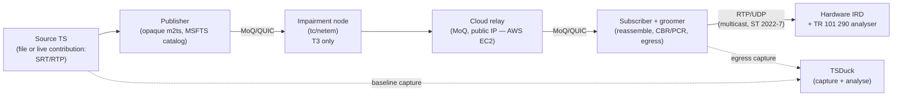
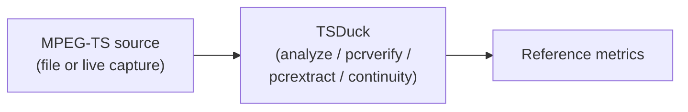
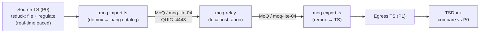
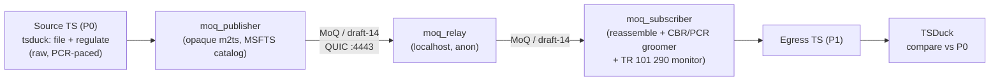
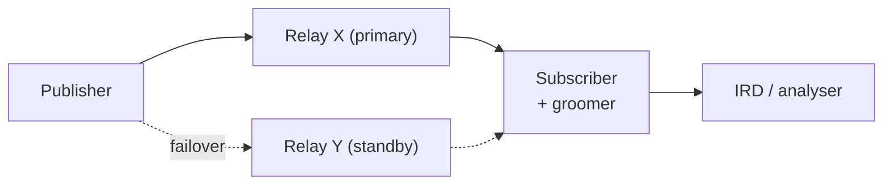
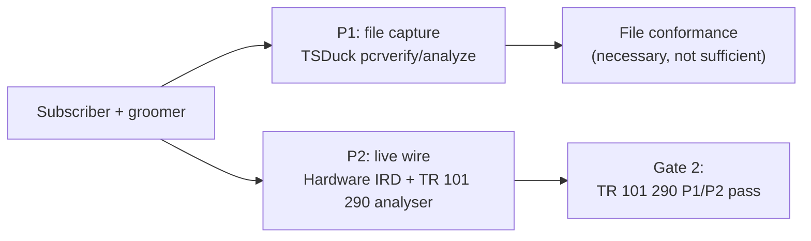

# Test Plan: MoQ MPEG-TS Primary Distribution Validation

Status: working draft
Scope: the formal validation plan for the thesis in the [README](../README.md) —
whether MPEG-TS transported over MoQ can meet professional broadcast primary
distribution requirements. It defines the test objective, the maturity baseline,
the individual tests (objective, architecture, methodology, metrics, pass
criteria, and limitations), and the conventions for recording results so that a
sceptical reader can reproduce and falsify them. This is the executable companion
to [implementation](implementation.md) §6–§7 (the validation pyramid and
acceptance gates) and draws its empirical baseline from [evidence](evidence.md).

> **Confidentiality note.** This plan references the platform's private
> publisher/subscriber/groomer components only by *role* (see
> [implementation](implementation.md) §2). It does not disclose their internals.
> All tooling named here (TSDuck, `tc`/`netem`, standard analysers) is public or
> standard broadcast equipment. Where a result would require confidential route
> or vendor data, this plan records the *method* and leaves the numbers out, per
> [CONTRIBUTING](../CONTRIBUTING.md).

> **On honesty.** This document is written to be *disproven*. Result tables use
> explicit placeholders — `TBM` (to be measured) — for numbers not yet taken, and
> record what has actually been measured separately from what is planned. A test
> plan that pre-fills its own results is worthless; the value here is the method
> and the pass criteria, agreed before the numbers are known.

---

## Contents

- [1. Test objective](#1-test-objective)
- [2. Current maturity assessment](#2-current-maturity-assessment)
- [3. How this plan maps to the validation pyramid and gates](#3-how-this-plan-maps-to-the-validation-pyramid-and-gates)
- [4. Test environment and conventions](#4-test-environment-and-conventions)
- [5. Test 1 — Baseline TS validation](#5-test-1--baseline-ts-validation) — ✅ done
- [6. Test 2 — MoQ transport transparency (media-aware lane, local)](#6-test-2--moq-transport-transparency-upstream-media-aware-lane-local) — ✅ done
- [7. Test 3 — MoQ transport transparency (opaque `m2ts` lane, local)](#7-test-3--moq-transport-transparency-opaque-m2ts-lane-local) — ✅ done
- [8. Test 4 — Remote relay end-to-end + SRT contribution (public internet)](#8-test-4--remote-relay-end-to-end--srt-contribution-public-internet) — ✅ media-aware
- [9. Test 5 — Network impairment](#9-test-5--network-impairment) — planned
- [10. Test 6 — Relay resilience](#10-test-6--relay-resilience) — planned
- [11. Test 7 — Timing integrity (the decisive test)](#11-test-7--timing-integrity-the-decisive-test) — **Gate 2, make-or-break**
- [12. Cross-cutting limitations](#12-cross-cutting-limitations-stated-up-front)
- [13. Status summary](#13-status-summary)
- [14. Open questions](#14-open-questions)
- [15. Next steps and campaign roadmap](#15-next-steps-and-campaign-roadmap)

---

## 1. Test objective

Validate whether MPEG-TS transported via MoQ can meet professional broadcast
distribution requirements — specifically, whether a groomed MoQ egress is
**bit-transparent** to the transport stream, **timing-conformant** to
TR 101 290 P1/P2 on real hardware, and **resilient** under realistic network
impairment and infrastructure failure.

The thesis fails if any of the following holds and cannot be remedied:

- MoQ carriage is *not* bit-transparent (continuity errors, dropped signalling,
  or structural corruption survive a lossless path).
- Groomed egress cannot pass **TR 101 290 P1/P2 on a hardware IRD** (the
  make-or-break gate — [implementation](implementation.md) §7, Gate 2).
- Impairment or failure behaviour is qualitatively worse than the incumbent IP
  transports (SRT/Zixi/RIST) it would replace, at matched conditions.

This plan does not attempt to prove economic superiority; that is a separate,
route-specific exercise ([economics](economics.md)).

---

## 2. Current maturity assessment

Where the work stands at the time of writing. This is the baseline the plan is
designed to advance, reconciled with the evidence already recorded in
[evidence](evidence.md).

| Area | Status | Comment | Test(s) |
|---|---|---|---|
| MoQ transport | ✅ Proven | Publisher → relay → subscriber works end-to-end on **both** lanes locally: `moq-dev` media-aware (§6) and the platform's opaque `m2ts` lane (§7) | T2 ✅, T3 ✅ |
| Remote network path | ✅ Proven (media-aware, end-to-end) | EC2 relay reachable over the internet; **full live SRT contribution chain completed over the media-aware lane — 0 CC, 10.3 MB/48 s** (§8.4); opaque-remote awaits deploying the opaque publisher on EC2 (not a transport gap) | T4 ✅ (media-aware) |
| MPEG-TS preservation | ✅ Proven (file, local) | **T1 source baseline captured** (§5); media-aware lane carries elementary streams but **drops SI + not CBR** (§6); **opaque lane is byte-transparent — SI/SCTE-35/PMT/PCR/CBR preserved verbatim** (§7); live/remote source still owed | T1 ✅, T2 ✅, T3 ✅ |
| Broadcast timing | 🟡 Partial | **T1 P0 baselines clean**; **opaque-lane egress holds 0 % PCR intervals > 40 ms at P1 when fed raw** (§7.5); no live/hardware (P2) pass yet | T1 ✅, T3 ✅, T7 |
| Failure behaviour | ❌ Not tested | Loss, reconnect, relay failure not yet exercised | T5, T6 |
| Operational model | 🟡 Conceptual | Runbooks designed ([operations](operations.md)); live SRT contribution chain now exercised over the internet (§8); still needs impairment/failover measurements | T4 ✅, T5, T6 |
| Production suitability | ❌ Not demonstrated | Needs the full evidence package below | T1–T7 |

**Overall:** roughly 65–75% through the *technical feasibility* phase. The proven
items now establish that the transport works on both lanes and that the **opaque
lane is bit-transparent on file**; the unproven items — a live/remote contribution
source, live timing conformance on hardware, and failure behaviour — are what
separate "it works in a demo" from "it is broadcast-grade."

---

## 3. How this plan maps to the validation pyramid and gates

This plan does not replace the validation pyramid and acceptance gates in
[implementation](implementation.md) §6–§7; it operationalises them. The mapping:

| This plan | Validation pyramid ([implementation](implementation.md) §6) | Acceptance gate ([implementation](implementation.md) §7) |
|---|---|---|
| **T1** Baseline TS validation | (reference for 1, 3) | precondition for Gate 1 |
| **T2** Transport transparency (media-aware lane, local) | 1 (unit/property), 2 (E2E), 3 (file conformance) | Gate 1 — media fidelity (reference lane) |
| **T3** Transport transparency (opaque `m2ts` lane, local) | 1, 2 (E2E), 3 (file conformance) | **Gate 1 — media fidelity (product lane)** |
| **T4** Remote relay + SRT contribution (public internet) | 2 (E2E over real path) | supports Gate 1 & Gate 3 |
| **T5** Network impairment | 2 (E2E under real loss/jitter) | supports Gate 1 & Gate 3 |
| **T6** Relay resilience | 6 (redundancy drill) | Gate 3 — resilience |
| **T7** Timing integrity | 3 (file conformance), 4 (**hardware TR 101 290**) | **Gate 2 — hardware conformance (make-or-break)** |
| **T8** SRT/Zixi comparative benchmark (see §15.3) | 7 (comparative lab) | feeds [economics](economics.md) §8 |
| **T9** MPTS / multiple concurrent services (see §15.3) | 5 (scale/fidelity) | Gate 1 at multi-service scale |
| Non-ideal-source robustness (GOP, DVB subs) | 5 | Gate 1 (T3/T7 source variants) |

**Ordering.** Run cheap-and-decisive first: T1 (reference) → T2 (media-aware
fidelity) → T3 (opaque fidelity, Gate 1) → T7 file-based, then T7 hardware
(Gate 2, make-or-break) → T4/T5/T6 (real path, impairment, resilience — Gate 3).
If Gate 2 (T7 hardware) fails, stop and fix grooming before investing in
T4/T5/T6 scale work — a resilient path that a hardware IRD rejects is not a
product.

---

## 4. Test environment and conventions

### 4.1 Reference topology under test

The unit that must work first is the single-path lab from
[implementation](implementation.md) §4:



### 4.2 Measurement points

Every test is defined by *where* it measures. Three canonical capture points:

- **P0 — Source.** The input TS, before the publisher. Establishes the reference
  (T1).
- **P1 — Egress (file).** The subscriber's groomed output, captured to file and
  analysed with TSDuck. Cheap; catches gross faults; **not** sufficient for
  hardware acceptance (see [architecture](architecture.md) §7.2 caveat).
- **P2 — Egress (live wire).** The physical output as seen by a hardware IRD /
  TR 101 290 analyser. The only point that can decide PCR_accuracy (±500 ns) and
  P1/P2 (T7).

### 4.3 Tooling

| Purpose | Tool | Notes |
|---|---|---|
| TS structural / conformance analysis | **TSDuck** (`tsp`, `pcrverify`, `pcrextract`, `analyze`, `continuity`, `pat`/`pmt`/`sdt`) | Primary, sufficient for an engineering paper |
| PCR/PTS extraction & plotting | TSDuck `pcrextract` + external plotting | For jitter distributions |
| Real-time source pacing | TSDuck `regulate` (PCR-based) | Feeds live-paced TS into `import` (T2) |
| Upstream media-aware lane (T2) | **`moq-dev`** `moq` (import/export) + `moq-relay`, run locally | Public reference impl; speaks moq-lite / moq-transport-14…17 |
| Opaque `m2ts` lane (T3, T4) | **platform** `moq_publisher` / `moq_relay` / `moq_subscriber` (private) | draft-14 / MSFTS `m2ts`; subscriber grooms to CBR + runs TR 101 290 |
| Network impairment | **Linux `tc` / `netem`** (optionally `tc-tbf` for rate) | Applied at the impairment node (§4.1) |
| Hardware conformance | Hardware IRD + TR 101 290 analyser (e.g. Sencore); optionally Elecard StreamEye, R&S MTS4EA, Tektronix MTS, Ateme Titan monitoring **if access is available** | P2 only |
| Capture | `tcpdump`/`dumpcap` for wire; TSDuck for TS | Retain for reproducibility |

TSDuck is the load-bearing tool and is sufficient for the file-based tiers.
Vendor analysers (Elecard/R&S/Tektronix/Ateme) are *nice-to-have* corroboration
for T7 and are noted as access-dependent, not assumed.

### 4.4 Result-recording conventions

- Every result table records **units**, the **measurement point** (P0/P1/P2), the
  **tool and version**, the **source clip / capture identity**, and the **date**.
- Unmeasured cells are `TBM` (to be measured), never blank and never guessed.
- Each test states its **pass criteria before** results are recorded.
- Raw captures and analyser exports are the evidence of record; summary tables in
  this document point to them. (Large binaries are not committed to this repo; see
  §12.)
- Draft pinning is recorded with every transport result: currently **draft-14**
  (`moq-transport` 0.14.2) — [implementation](implementation.md) §3.

---

## 5. Test 1 — Baseline TS validation

Establish the reference. You cannot prove MoQ preserves quality without first
characterising the source. This runs *before* MoQ touches the stream.

**Status: run 2026-07-16 — reference established.** Four source clips were
characterised at P0 with TSDuck 3.44-4676 (macOS, Darwin 25.5.0). All four are
clean, conformant references (0 continuity errors, 0 transport errors, 0 PCR
discontinuities, 0% of PCR intervals > 40 ms, file-based PCR accuracy < 74 ns).
Results in §5.5; exact commands in §5.4.

### 5.1 Objective

Characterise the input MPEG-TS so that every downstream metric (T2, T3, T7) can be
stated as a *delta* against a known-good reference.

### 5.2 Architecture



### 5.3 Sources under test

| File | Role | Service | Video | Duration | TS bitrate |
|---|---|---|---|---|---|
| `testloop_clean.ts` | Synthetic clean CBR reference (FFmpeg) | Service01 | H.264 High@L4.0 4:2:0 1080i/p | 7 min 57 s | 10.00 Mbps (exact CBR) |
| `testloop.ts` | Real broadcast mux reference | Cartoonito UK HD 422 | H.264 High **4:2:2**@L4.0 1080 | 7 min 56 s | 27.51 Mbps |
| `CNNiEMEA.ts` | Real contribution capture | CNNI EMEA HD (WBD) | H.264 High@L4.0 4:2:0 1080 | 4 min 59 s | 9.95 Mbps |
| `CNNiEMEA2.ts` | Real contribution capture (longer) | CNNI EMEA HD (WBD) | H.264 High@L4.0 4:2:0 1080 | 9 min 59 s | 9.95 Mbps |

The two CNN captures are the real contribution-feed class referenced in
[evidence](evidence.md) §5 (CNN International). The GOP structure (open-GOP /
recovery-point SEI / IDR cadence) was not separately measured in this run and is
noted as a follow-up (§5.8).

### 5.4 Methodology and exact commands

All commands were run from the directory holding the clips (`~`). Each is
`-O drop` because T1 only reads and analyses; nothing is re-emitted. The `<clip>`
placeholder is each of the four files in §5.3.

**1. Structural + service + PID + table report (bitrate, PIDs, repetition, CC):**

```bash
tsp -I file <clip> -P analyze -O drop
```

**2. PCR accuracy / jitter (file-based, against PCR-estimated bitrate).**
Default threshold is 1000 µs; the sweep characterises how tight the source is,
including the TR 101 290 P2 ±500 ns limit (13.5 PCR units ≈ use `--absolute`):

```bash
# Default (1000 us) pass/fail summary
tsp -I file <clip> -P pcrverify -O drop

# Tighten in micro-seconds
tsp -I file <clip> -P pcrverify --jitter-max 500 -O drop   # then 50, 5

# Sub-microsecond, in absolute PCR units (27 units = 1 us; 13 units ~= 481 ns)
tsp -I file <clip> -P pcrverify --absolute --jitter-max 13 -O drop  # then 5, 2, 1
```

**3. PCR interval / repetition (TR 101 290 P1, ≤ 40 ms).** TSDuck has no direct
interval-histogram plugin, so PCRs are extracted to CSV and intervals computed
from the monotonic "Value offset in PID" column (col 7, in 27 MHz units;
1 ms = 27 000 units):

```bash
tsp -I file <clip> -P pcrextract --pcr --csv -o <clip>_pcr.csv -O drop

awk -F, 'NR>1{cur=$7; if(prev!=""){d=(cur-prev)/27000; n++; sum+=d;
  if(d>max)max=d; if(min==""||d<min)min=d; if(d>40)over++} prev=cur}
  END{printf "intervals=%d min=%.2f mean=%.2f max=%.2f ms  >40ms=%d (%.4f%%)\n",
  n, min, sum/n, max, over, (over/n)*100}' <clip>_pcr.csv
```

**4. Continuity-counter integrity** (prints only on error; no output = 0 errors):

```bash
tsp -I file <clip> -P continuity -O drop
```

### 5.5 Measured reference (P0, 2026-07-16)

| Metric (unit) | `testloop_clean` | `testloop` | `CNNiEMEA` | `CNNiEMEA2` |
|---|---|---|---|---|
| File size (bytes) | 596,847,172 | 1,638,619,656 | 372,971,696 | 745,917,260 |
| TS packets | 3,174,719 | 8,716,062 | 1,983,892 | 3,967,645 |
| Duration | 7:57 (477 s) | 7:56 (476 s) | 4:59 (299 s) | 9:59 (599 s) |
| TS bitrate, PCR-based (Mbps) | 10.000 | 27.508 | 9.946 | 9.946 |
| Service bitrate (Mbps) | 8.547 | 26.054 | 9.474 | 9.476 |
| Video PID bitrate (Mbps) | 8.254 | 25.062 | 9.019 | 9.021 |
| PCR PID / PMT PID | 0x0100 / 0x1000 | 0x0030 / 0x0020 | 0x006F / 0x0064 | 0x006F / 0x0064 |
| PCR interval min/mean/max (ms) | 0.60 / 19.80 / 20.45 | 27.34 / 27.74 / 28.16 | 0.15 / 24.42 / 24.95 | 0.15 / 24.42 / 24.95 |
| PCR intervals > 40 ms | **0 (0.0000%)** | **0 (0.0000%)** | **0 (0.0000%)** | **0 (0.0000%)** |
| PCR accuracy, file (jitter) | < 37 ns¹ | < 74 ns¹ | < 74 ns¹ | < 37 ns¹ |
| Continuity-counter errors | **0** | **0** | **0** | **0** |
| Transport errors / invalid sync | 0 / 0 | 0 / 0 | 0 / 0 | 0 / 0 |
| PCR discontinuities (leaps) | 0 | 0 | 0 | 0 |
| PAT repetition mean/max (ms) | 97 / 100 | 475 / 476 | 125 / 291 | 125 / 291 |
| PMT repetition mean/max (ms) | 97 / 100 | 475 / 475 | 125 / 291 | 125 / 291 |
| SDT repetition mean/max (ms) | 500 / 500 | 1974 / 1986 | 1044 / 1105 | 1044 / 1103 |
| Other SI | — | CAT | NIT 5048 ms, TDT 15144 ms | NIT 5048 ms, TDT 15145 ms |
| Audio | MPEG-2 AAC | MPEG-1 L2 256k + AC-3 + MPEG-1 L2 (VI) | MPEG-1 L2 192k + AC-3 | MPEG-1 L2 192k + AC-3 |
| Teletext | — | 0x0050 | 0x0083 | 0x0083 |
| SCTE-35 PIDs | — | 0x0060 | 0x008D/8E/8F | 0x008D/8E/8F |
| Stuffing (null) bitrate (Mbps) | 1.435 | 1.447 | 0.458 | 0.456 |

¹ File-based PCR accuracy, expressed as the tightest `pcrverify` jitter bound with
**zero** violations: `testloop_clean` and `CNNiEMEA2` pass at ≤ 37 ns (1 PCR
unit); `testloop` and `CNNiEMEA` pass at ≤ 74 ns (2 units) with 0 violations, and
show a handful only at the 37 ns bound (447 and 1 respectively). All four are far
inside the TR 101 290 P2 ±500 ns limit — as a *file arithmetic* result (see §5.8).

**Verdict:** all four clips are valid, conformant P0 references. This spans a
synthetic clean 10 Mbps CBR reference, a real 27.5 Mbps 4:2:2 broadcast mux, and
two real CNN International contribution captures — a representative spread for
T2/T3/T7 deltas.

### 5.6 Component / track inventory (P0)

The per-component breakdown of each source, from the `analyze` PID and service
reports. This is the reference against which T2 and T3 check *track carriage*:
every component below must survive (or be explicitly, knowingly dropped) when the
stream is carried over MoQ and re-emitted. T3 (§7.5) confirms the opaque lane
preserves **all** of them verbatim. PCR is carried on the video PID in all four.

**`testloop_clean.ts` — Service01 (synthetic, minimal):**

| Component | PID | Details |
|---|---|---|
| Video | 0x0100 (256) | H.264 High@L4.0, 4:2:0, 1920×1080 — **PCR PID** |
| Audio (eng) | 0x0101 (257) | MPEG-2 AAC |
| PSI | 0x0000 / 0x1000 / 0x0011 | PAT / PMT / SDT-BAT |

*No teletext, SCTE-35, CAT, NIT, or TDT/TOT.*

**`testloop.ts` — Cartoonito UK HD 422 (full broadcast mux):**

| Component | PID | Details |
|---|---|---|
| Video | 0x0030 (48) | H.264 High **4:2:2**@L4.0, 1920×1080 — **PCR PID** |
| Audio 1 (eng) | 0x0040 (64) | MPEG-1 Audio Layer II, 256 kb/s, 48 kHz stereo |
| Audio 2 (eng) | 0x0041 (65) | AC-3, stereo (L,R), 48 kHz |
| Audio 3 (eng) | 0x0042 (66) | MPEG-1 Audio Layer II — **visual-impaired commentary** |
| Subtitles (eng) | 0x0050 (80) | Teletext subtitles for the hearing impaired |
| SCTE-35 | 0x0060 (96) | Splice Info |
| PSI | 0x0000 / 0x0020 / 0x0001 / 0x0011 | PAT / PMT / CAT / SDT-BAT |

**`CNNiEMEA.ts` and `CNNiEMEA2.ts` — CNNI EMEA HD (WBD):**

| Component | PID | Details |
|---|---|---|
| Video | 0x006F (111) | H.264 High@L4.0, 4:2:0, 1920×1080 — **PCR PID** |
| Audio 1 (eng) | 0x0079 (121) | MPEG-1 Audio Layer II, 192 kb/s, 48 kHz stereo |
| Audio 2 (eng) | 0x007B (123) | AC-3, stereo (L,R), 48 kHz |
| Subtitles (eng) | 0x0083 (131) | Teletext subtitles |
| SCTE-35 | 0x008D (141), 0x008E (142), 0x008F (143) | **Three** Splice Info streams |
| PSI/SI | 0x0000 / 0x0064 / 0x0010 / 0x0011 / 0x0014 | PAT / PMT / NIT (WBD) / SDT-BAT / TDT-TOT |

### 5.7 Pass criteria

There is no pass/fail here — T1 *defines* the reference. The only failure mode is
selecting a non-representative or already-broken source. **Met:** the set is
clean (0 CC/transport/discontinuity errors) and representative (synthetic +
broadcast mux + real contribution captures), so it keeps downstream comparisons
honest.

### 5.8 Limitations and follow-ups

- **File-based PCR accuracy is arithmetic, not wire timing** — the same caveat as
  P1 ([architecture](architecture.md) §7.2). The < 74 ns figures confirm the
  source PCR values are internally consistent against the estimated CBR; they do
  *not* characterise a live source's true clock, which is only visible on the wire.
- **Two sub-millisecond minimum PCR intervals** (`testloop_clean` 0.60 ms,
  CNN 0.15 ms) appear against otherwise regular ~20–25 ms spacing. With 0 reported
  discontinuities/leaps these are most likely capture-boundary artifacts; they do
  not affect P1 (which bounds the *maximum* interval at 40 ms) and are recorded for
  completeness.
- **`testloop` PAT/PMT repetition (~475 ms)** is within TR 101 290 P1 (≤ 500 ms)
  but close to the limit — worth noting because a transport that *adds* table
  jitter could push this clip over, whereas the other three (≤ 100–291 ms) have
  ample margin.
- **GOP structure not separately measured.** The CNN captures are treated as the
  open-GOP contribution class per [evidence](evidence.md) §5, but IDR cadence /
  recovery-point SEI were not quantified in this run; add an IDR-interval
  measurement when T2's non-ideal-source variant is run.
- **Raw artifacts** (full `analyze` reports and `*_pcr.csv`) are the evidence of
  record and are kept out of this repository (§12); the commands in §5.4
  regenerate them deterministically from the source clips.

---

## 6. Test 2 — MoQ transport transparency (upstream media-aware lane, local)

Where the platform's own opaque `m2ts` lane is the *product* path
([transport](transport.md) §4), Test 2 deliberately exercises the **upstream
`moq-dev` media-aware lane** — `moq import ts` → `moq-relay` → `moq export ts` —
run entirely on **localhost**. The purpose is twofold: prove the non-opaque
(media-aware) transport works end-to-end against the public reference
implementation, and characterise its **current limitations** honestly, so the case
for the opaque lane and the grooming layer rests on measured facts rather than
assertion. Its Gate 1 counterpart — the opaque lane that *is*
broadcast-transparent — is **Test 3 (§7)**, contrasted directly in §7.7.

**Status: run 2026-07-16 — media-aware lane works; limitations quantified.** All
four T1 clips (including the real CNN open-GOP contribution feed that
[evidence](evidence.md) §5 previously recorded as failing) round-tripped through
`moq-dev` locally, negotiating **moq-lite-04**. Every *elementary* stream (video,
all audio incl. AC-3, teletext, all SCTE-35 PIDs) survived; **service signalling
(SDT/NIT/TDT/CAT) was dropped**, the **PMT PID was renumbered to `0x1000`**, and
the **egress is not CBR-paced** (13.7–25.5% of PCR intervals > 40 ms vs 0% at
source). Results in §6.5–§6.6.

### 6.1 Objective

Demonstrate that the upstream media-aware lane carries an MPEG-TS end-to-end over a
local MoQ relay, enumerate exactly which components (§5.6) are carried when the
subscriber subscribes to them, and measure the impairments the media-aware lane
introduces — establishing *why* the opaque lane + groomer exist.

### 6.2 Architecture (all localhost)



### 6.3 Environment

- Binaries: `~/moq-dev/target/release/{moq, moq-relay}` (moq-cli / moq-relay),
  build `moq-token-cli-v0.5.34-17-g81ac7020`; protocol negotiated **moq-lite-04**
  (moq-lite, the forwards-compatible subset — *not* the draft-14 transport the
  opaque platform pins, [implementation](implementation.md) §3). Supported by the
  binary: moq-lite-01…04, moq-transport-14…17.
- Relay config: `demo/relay/localhost.toml` (QUIC + HTTP on `[::]:4443`,
  self-signed `localhost`, `[auth] public = ""` → anonymous).
- Feed pacing: TSDuck `regulate` (real-time, PCR-based). TSDuck 3.44-4676.

Three operational findings were required to make the local path work and are
recorded because they will recur for anyone reproducing this:

1. **Disable UDP GSO on loopback.** With GSO on (default), QUIC handshakes but
   then times out on macOS loopback. Pass `--server-quic-gso=false` (relay) and
   `--client-quic-gso=false` (both clients).
2. **Pace the input.** An unpaced `import` hits stdin EOF and tears the session
   down before the subscriber pulls; `tsp … -P regulate` holds the publisher up
   for the clip's real-time duration.
3. **Publisher before subscriber.** Subscribing to a not-yet-announced broadcast
   returns relay error `code=4`; start `import` first, then `export` joins the
   live edge.

### 6.4 Methodology and exact commands

**1. Start the relay (durable background process):**

```bash
cd ~/moq-dev
./target/release/moq-relay demo/relay/localhost.toml --server-quic-gso=false
# verify: curl -s http://localhost:4443/certificate.sha256   # prints the fingerprint
```

**2. Publish (media-aware import), real-time paced.** `<clip>` is each T1 source;
`<name>` a per-clip broadcast label (`.hang` selects the hang catalog):

```bash
tsp -I file <clip> -P regulate -P until --seconds 35 \
  | ./target/release/moq --client-connect http://localhost:4443 \
      --client-quic-gso=false --broadcast <name>.hang import ts
```

**3. Subscribe (export back to TS), capture to file.** Started ~4 s after the
publisher; it discovers the catalog and subscribes to every advertised track:

```bash
./target/release/moq --client-connect http://localhost:4443 \
    --client-quic-gso=false --broadcast <name>.hang export ts > <name>_out.ts
```

**4. Enumerate carried tracks** (the components actually subscribed to), from the
subscriber's own log:

```bash
grep -oE 'track=[^ ]+' <name>_sub.log | tr -d '"' | sort -u
```

**5. Analyse the egress** (what survived the round-trip) and quantify timing:

```bash
tsp -I file <name>_out.ts -P analyze -O drop            # services / PIDs
tsp -I file <name>_out.ts -P continuity -O drop         # CC errors (none = clean)
tsp -I file <name>_out.ts -P pcrextract --pcr --csv -o <name>_pcr.csv -O drop
# then the §5.4 awk one-liner for PCR interval min/mean/max and % > 40 ms
```

### 6.5 Results — track carriage (catalog + egress)

`moq import ts` builds a **hybrid catalog**: recognised codecs become *typed*
tracks (`0.avc3` = H.264, `0.aac`/`0.mp2` = audio), and every other elementary PID
is carried as an *opaque per-PID* `N.ts` track. PSI/SI service tables are **not**
represented as tracks.

| Source | MoQ tracks advertised & subscribed | Elementary components preserved in egress (P1) |
|---|---|---|
| `testloop_clean` | `catalog.json`, `0.avc3`, `0.aac` | video 0x0100, audio 0x0101 |
| `testloop` (Cartoonito) | `catalog.json`, `0.avc3`, `0.mp2`, `1.mp2`, `0.ts`, `1.ts`, `2.ts` | video 0x0030, audio 0x0040/0x0041(AC-3)/0x0042(VI), teletext 0x0050, SCTE-35 0x0060 |
| `CNNiEMEA` | `catalog.json`, `0.avc3`, `0.mp2`, `0.ts`…`4.ts` (5 opaque) | video 0x006F, audio 0x0079/0x007B(AC-3), teletext 0x0083, SCTE-35 0x008D/8E/8F |

**Carried (verified in egress):** all video, all audio tracks (including AC-3 and
the visual-impaired commentary), teletext subtitles, and **every** SCTE-35 splice
PID — at their **original PID numbers** — with **0 continuity-counter errors** and
0 transport errors. The real CNN open-GOP feed produced video successfully, i.e.
the media-aware import weakness in [evidence](evidence.md) §5 appears **resolved
upstream** (consistent with that section's caveat).

### 6.6 Results — impairments introduced by the media-aware lane

| Metric | `testloop_clean` | `testloop` | `CNNiEMEA` | Source (P0) |
|---|---|---|---|---|
| Egress size captured | 21.0 MB | 65.2 MB | 24.3 MB | — |
| Continuity-counter errors | 0 | 0 | 0 | 0 |
| Service name / type | **lost** (unknown / Undefined) | **lost** | **lost** | present |
| SDT / NIT / TDT / CAT | **dropped** | **dropped** (CAT, SDT) | **dropped** (NIT, SDT, TDT) | present |
| PMT PID | 0x1000 (was 0x1000) | **0x1000** (was 0x0020) | **0x1000** (was 0x0064) | source PID |
| PCR PID | 0x0100 (kept) | 0x0030 (kept) | 0x006F (kept) | kept |
| CBR pacing / null packets | **none** | **none** | **none** | CBR |
| PCR interval max (ms) | 1680¹ | 1120¹ | 319.9 | 20–28 |
| PCR intervals > 40 ms | **25.5%** | 0.10%¹ | **13.7%** | 0% |

¹ The multi-hundred-ms/1-second maxima include a live-join / capture-stop artifact
(the subscriber joins mid-group and is killed mid-group). The robust figure is the
**percentage** over 40 ms, which reflects the steady-state bursty delivery. Even so,
`testloop_clean`'s 25.5% closely matches the ~24% pre-groom figure independently
measured in [evidence](evidence.md) §3 — two different pipelines, same phenomenon.

**Interpretation.** The media-aware lane is *media-faithful* (elementary streams,
continuity, and PCR PID intact) but **not broadcast-transparent**: it discards
service/SI signalling, renumbers the PMT, and — most importantly — emits a
non-CBR, bursty stream whose PCR cadence violates TR 101 290 P1 on 13–26% of
intervals. This is precisely the gap the opaque lane (SI preserved verbatim) and
the CBR/PCR groomer (**Test 3, §7** / [architecture](architecture.md) §7.2) are
built to close — and **Test 3 now measures that closure** (§7.5–§7.7). Test 2
turns the "why" from assertion into measurement.

### 6.7 Pass criteria

This test has two distinct bars:

- **Media-aware lane (this test): transport works locally** — ✅ met. All clips
  round-trip; all elementary components carry with 0 CC errors; open-GOP feed
  decodes.
- **Broadcast transparency (Gate 1, the *opaque* lane + groomer):** SI preserved
  verbatim, PMT PID stable, and post-groom PCR conformance (≈ 0% > 40 ms) at P1 —
  **not** demonstrated here and **not** a goal of the media-aware lane. **Now
  demonstrated in Test 3 (§7)**; the hardware (P2) counterpart is T7.

### 6.8 Limitations and follow-ups

- **Local loopback only.** This is not the public-internet EC2 path
  ([evidence](evidence.md) §1); it isolates the *lane* behaviour, not network
  effects (those are T4/T5).
- **Live-join captures.** The subscriber joins the live edge and is stopped mid-
  stream, so egress captures are partial and their PCR-interval *maxima* include
  boundary artifacts; the `% > 40 ms` metric is the reliable one. A cleaner run
  would gate capture on a keyframe/group boundary and a fixed duration.
- **moq-lite-04, not draft-14.** The upstream binary speaks moq-lite; the platform
  pins moq-transport draft-14. Same media-layer questions, different wire version —
  do not read these timing numbers as the opaque platform's egress.
- **Opaque-lane counterpart delivered.** The complementary run — opaque `m2ts`
  carriage preserving SI verbatim, groomed to CBR, with the P1 conformance delta
  vs P0 — is **Test 3 (§7)**: SI/SCTE-35/PMT/PCR preserved, 0 % of intervals
  > 40 ms. What remains for Gate 1→2 is the live wire (T7).
- **Byte round-trip (media layer, lossless):** independently **pass** per
  [evidence](evidence.md) §1; not re-run here.
- **Raw artifacts** (`*_out.ts`, `*_pcr.csv`, publisher/subscriber logs) are the
  evidence of record and kept out of this repository (§12); the §6.4 commands
  regenerate them.

---

## 7. Test 3 — MoQ transport transparency (opaque `m2ts` lane, local)

Test 2 exercised the upstream **media-aware** lane and measured its limitations.
Test 3 exercises the platform's own **opaque `m2ts` lane** — the product path
([transport](transport.md) §4) — end-to-end on localhost, using the private
`moq_publisher` / `moq_relay` / `moq_subscriber` (draft-14 / MSFTS `m2ts`
packaging). This is the Gate 1 fidelity question the media-aware lane cannot
answer: is the opaque lane **bit-transparent** to the whole transport stream
(signalling and all), and does the subscriber's CBR/PCR groomer hold TR 101 290 P1
timing?

**Status: run 2026-07-17 — opaque lane is byte-transparent; SI + SCTE-35 + PCR
preserved.** All three representative clips (`testloop_clean`, `testloop` 4:2:2,
`CNNiEMEA`) round-tripped through the private opaque stack on localhost (draft-14,
`moq-transport` 0.14.2). Every elementary stream **and** the full PSI/SI
(PAT / CAT / NIT / SDT / TDT-TOT), all SCTE-35 splice PIDs, the PMT PID, the PCR
PID, the TSID/ONID, and the service name/type survived **verbatim**; **0 CC
errors**, **0 transport errors**; PCR interval **0 % > 40 ms** and the source
**CBR mux-rate preserved exactly** when the lane is fed the raw source. Results
§7.5–§7.6; the T2 ↔ T3 contrast that motivates the architecture is §7.7.

### 7.1 Objective

Demonstrate that the opaque lane carries a complete MPEG-TS end-to-end over a local
MoQ relay **without altering it** — verify, component by component against the
§5.6 inventory, that video, every audio track, teletext, **every** SCTE-35 PID,
and the full PSI/SI survive at their original PIDs; that TSID/ONID/service
identity and PMT/PCR PIDs are unchanged; and that the groomed egress stays CBR and
TR 101 290 P1-conformant. This is the Gate 1 evidence the opaque lane exists to
provide, and the direct counterpart to Test 2.

### 7.2 Architecture (all localhost)



### 7.3 Environment

- Binaries: `~/moq-publisher-subscriber/target/release/{moq_relay, moq_publisher,
  moq_subscriber}`, built from the repo's pinned `Cargo.lock` (`moq-transport`
  0.14.2, `moq-native` 0.17.0, `moq-relay` 0.12.9). Default **local** relay mode
  (moq-native / moq-net stack).
- Relay config: `relay.toml` (QUIC + HTTP on `[::]:4443`, self-signed `localhost`,
  `[auth] public = ""` → anonymous). No GSO workaround was needed (unlike the
  moq-dev relay in §6.3).
- Publisher: TCP ingest on `127.0.0.1:5001`, broadcast `mpegts`, track `ts`. Each
  MoQ Object is a concatenation of whole 188-byte TS packets (default 7 →
  1316 bytes), batched into ordered groups — **byte-preserving** by construction.
- Subscriber: reassembles Objects → MPEG-TS with a decoder-safe start gate, an
  adaptive CBR/PCR pacer, and **read-only TR 101 290 monitoring** on the egress;
  output UDP / RTP / TCP.
- TSDuck 3.44-4676 (macOS, Darwin 25.5.0).

**Methodological finding (load-bearing): feed the lane the raw TS, not an ffmpeg
remux.** The repo's convenience ingest — `ffmpeg -re -i clip.ts -c copy -f mpegts
tcp://…` — *regenerates the TS container before it ever reaches the publisher*: it
strips the null padding (`testloop_clean` 10.00 → 8.31 Mbps) and rewrites the PCR
cadence to ~80 ms (**99 % of intervals > 40 ms**). That is an FFmpeg muxer
artifact, **not** the lane. Feeding raw, PCR-paced bytes (`tsp … -P regulate`
piped straight into the publisher's TCP ingest) isolates the lane and reproduces
the source exactly. Every §7.5–§7.6 figure uses the raw-fed path. The practical
lesson for a contribution workflow: whatever remuxes the TS on the way in defines
the egress, so a transparent lane must be fed a transparent source.

### 7.4 Methodology and exact commands

**1. Start the relay (loads `relay.toml`; durable background process):**

```bash
cd ~/moq-publisher-subscriber
./target/release/moq_relay
# verify: curl -s http://localhost:4443/certificate.sha256   # prints the fingerprint
```

**2. Start the subscriber (groomer) and capture the egress.** The subscriber's
UDP egress datagrams are not always 188-aligned, and TSDuck's `ip` input silently
drops non-aligned datagrams for some streams; the robust, always-aligned capture
is the **TCP playout** with the reader connected *before* the feed starts:

```bash
./target/release/moq_subscriber --output-protocol tcp --playout-bind 127.0.0.1:5002 --no-pacing
nc 127.0.0.1 5002 > <clip>_out.ts          # reader connected first
# (single-program clips also capture cleanly via UDP: --output-protocol udp
#  --output-port 5000  +  tsp -I ip 5000 -O file <clip>_out.ts)
```

`--no-pacing` is used because `tsp regulate` (step 4) already delivers the source
in real time; the subscriber's own pacer would double-pace. The in-band PCR
figures are identical with or without it.

**3. Start the publisher (opaque `m2ts`, TCP ingest):**

```bash
./target/release/moq_publisher      # relay https://localhost:4443/anon, broadcast mpegts, track ts
```

**4. Feed the RAW source TS, PCR-paced, into the publisher's TCP ingest (no
remux):**

```bash
tsp -I file <clip> -P regulate -P until --seconds 30 -O file - | nc 127.0.0.1 5001
```

**5. Analyse the egress** (identical to §5.4): `analyze` (services / PIDs / bitrate),
`continuity` (CC errors), `pcrextract` + the §5.4 awk one-liner (PCR intervals).

### 7.5 Results — the egress reproduces the source (P1, 2026-07-17)

Source identity vs opaque egress, per clip. Every field is **preserved**:

| Field (source → egress) | `testloop_clean` | `testloop` | `CNNiEMEA` |
|---|---|---|---|
| Transport Stream Id | 0x0001 → **0x0001** | 0x0001 → **0x0001** | 0x0000 → **0x0000** |
| Original Network Id | 0xFF01 → **kept** | 0x0001 → **kept** | 0x0000 → **kept** |
| Service name / type | Service01 / 0x01 → **kept** | Cartoonito UK HD 422 / 0x01 → **kept** | CNNI EMEA HD / 0x19 → **kept** |
| PMT PID | 0x1000 → **kept** | 0x0020 → **kept** | 0x0064 → **kept** |
| PCR PID | 0x0100 → **kept** | 0x0030 → **kept** | 0x006F → **kept** |
| Egress PID count | 6 | 11 | 13 |
| Reference bitrate (Mbps) | **10.000** (= src) | **27.5** (= src) | **9.95** (= src) |
| CBR / null padding | **preserved** | **preserved** | **preserved** |
| Continuity-counter errors | **0** | **0** | **0** |
| Transport errors / invalid sync | 0 / 0 | 0 / 0 | 0 / 0 |
| PCR interval min/mean/max (ms) | 1.20 / 19.80 / 20.00 | 27.34 / 27.74 / 28.16 | 0.30 / 24.42 / 24.95 |
| PCR intervals > 40 ms | **0 %** | **0 %** | **0 %** |

**Every component from the §5.6 inventory survived verbatim, at its original PID.**
For `CNNiEMEA` the egress carried, unchanged: AVC video 0x006F, MPEG-1 audio
0x0079, **AC-3** 0x007B, teletext 0x0083, **all three SCTE-35 splice PIDs**
(0x008D / 8E / 8F, table_id 0xFC), and the full PSI/SI — PAT, **NIT** (0x0010),
**SDT** (0x0011), **TDT/TOT** (0x0014), PMT (0x0064). For `testloop` the egress
additionally preserved the **visual-impaired commentary** audio 0x0042 and the
CAT. Compare directly with the §6.5–§6.6 media-aware results, where the same clips
lost their SI and had their PMT renumbered.

### 7.6 Results — the built-in egress monitor

The subscriber runs read-only TR 101 290 monitoring on its egress (a capability
the media-aware lane lacks entirely). Observed across the three runs:

- **Transient P1** (`pat_missing` / `pmt_missing` / `pid_missing`, state
  `raised` → `recovered`) only during the live-join window, while the first
  PAT/PMT/PID cycle arrives; self-clears within the first group. Expected.
- **P2 `pcr_jitter` on `CNNiEMEA`** (~4–5 ms on PCR PID 0x006F): carried from the
  source contribution feed — the lane **surfaces** it, it does not create it
  (the raw-fed egress still measures 0 % of intervals > 40 ms).
- **0 discontinuities** in steady state; egress bitrate tracks the source.

### 7.7 Test 2 (media-aware) vs Test 3 (opaque) — the decisive contrast

| Property | T2 media-aware (`moq-dev`) | T3 opaque (platform) |
|---|---|---|
| Wire model | demux → typed + opaque tracks (hang catalog) | whole-TS Objects (MSFTS `m2ts` catalog) |
| Draft negotiated | moq-lite-04 | **draft-14** (`moq-transport` 0.14.2) |
| Elementary streams | preserved (all audio, teletext, SCTE-35) | **preserved, verbatim, same PIDs** |
| PAT / PMT | PAT kept, **PMT renumbered → 0x1000** | **PMT PID kept** |
| SDT / NIT / TDT / CAT | **dropped** | **preserved verbatim** |
| Service name / type | **lost** (unknown / Undefined) | **preserved** |
| TSID / ONID | not preserved (regenerated) | **preserved** |
| SCTE-35 splice PIDs | carried (as opaque per-PID tracks) | **preserved in-mux, verbatim** |
| Mux structure | VBR; null padding stripped | **CBR preserved; nulls preserved** |
| PCR intervals > 40 ms (P1) | 13–26 % | **0 %** |
| Egress monitoring | none | **built-in TR 101 290** |
| **Transparency verdict** | media-faithful, **not** broadcast-transparent | **broadcast-transparent** |

Test 2 and Test 3 answer different questions. **T2** proves the *upstream reference*
can carry the media; **T3** proves the *platform's opaque lane* carries the whole
transport stream — signalling and all — without alteration, which is what a
primary-distribution handoff requires. The single caveat both share is that
transparency is only as good as what touches the TS on either side: an FFmpeg
`-c copy` remux in the contribution path (§7.3) or a demux/remux lane (T2) rewrites
the stream regardless of MoQ. The opaque lane's job is to add nothing; on this
evidence, at P1, it doesn't.

### 7.8 Pass criteria

- **Bit-transparency at P1 (file): ✅ met.** TSID/ONID, service name/type, all
  PSI/SI (PAT/PMT/SDT/NIT/TDT/CAT), PMT PID, PCR PID, every elementary stream and
  every SCTE-35 PID preserved verbatim; 0 CC / transport errors; CBR and PCR
  conformance (0 % > 40 ms) preserved when fed the raw source.
- **Gate 1 media fidelity (opaque lane): ✅ met at P1.** The load-bearing gaps
  that remain are **P2 hardware conformance** (Test 7, Gate 2) and a **real-time /
  remote contribution path** (Test 4) — file-based localhost transparency is
  necessary, not sufficient.

### 7.9 Limitations and follow-ups

- **Local loopback only.** Isolates the *lane*, not network effects (Test 5) or
  the public-internet path (Test 4); not the hardware wire (Test 7).
- **Fed from file (raw, `regulate`).** A live SRT/RTP contribution source is
  Test 4. Per §7.3, an FFmpeg remux anywhere in the path is not transparent — this
  is a property of the muxer, not the lane, and must be designed around.
- **Capture-transport quirk.** TSDuck's UDP `ip` input dropped some subscribers'
  non-188-aligned egress datagrams (0 bytes captured while the subscriber's own
  counters showed full egress); the aligned **TCP playout** capture was used for
  `CNNiEMEA` / `testloop`. A capture-tooling detail, not a lane defect — TCP
  capture and the subscriber's egress counters agree.
- **`--no-decoder-start-gate`** was used for transport-only capture on the richer
  clips; it does not affect steady-state PCR/SI/CC (it only governs the join
  buffer).
- **Draft-14 pin** — the same tracked dependency as §12.
- **Raw artifacts** (`*_out.ts`, `*_pcr.csv`, publisher/subscriber logs) are the
  evidence of record and kept out of this repository (§12); the §7.4 commands
  regenerate them.

---

## 8. Test 4 — Remote relay end-to-end + SRT contribution (public internet)

Tests 2 and 3 are localhost. Test 4 puts the path over the **public internet**
with a cloud relay on **AWS EC2** (`34.246.187.61`), exercising the full live
contribution chain
**local TS → FFmpeg SRT → EC2 SRT-receiver → MoQ publisher (EC2) → MoQ relay
(EC2) → MoQ subscriber (local) → TSDuck/ffplay** (the topology in §4.1 and
[evidence](evidence.md) §1).

**Status: media-aware end-to-end chain complete (2026-07-17); opaque-remote
deferred.** Inspecting the EC2 by SSH established a material fact: **the deployed
cloud path is the `moq-dev` media-aware lane, not the opaque lane.** The relay is
`moq-relay` (moq-lite-04, systemd service, UDP 443, untouched), and both
publishers use `moq import ts`:

- `cnn.international.emea.loop.hang` — a `CNNiEMEA2.ts` loop (media-aware);
- `cnn.international.emea.live.hang` — the **SRT-fed live** broadcast: `ffmpeg`
  SRT listener on UDP 9000 → `moq import ts` (media-aware).

The opaque `moq_publisher` is **not deployed on EC2** — the `moq-publisher.service`
unit even carries the opaque `moq_publisher --broadcast mpegts --track ts` line
*commented out*, with the active `ExecStart` running the media-aware import. So the
**full end-to-end SRT contribution chain was completed over the media-aware lane**
(local `~/FFmpeg` SRT caller → EC2 :9000 → `moq import` → relay → local
`moq export ts` → TSDuck: **10.3 MB / ~48 s, 0 CC errors**, §8.4). Because our
overall goal is carrying TS end-to-end *media-aware lane or not*, this closes the
"works on the wire" milestone for the deployed lane. **Opaque-remote (T3 over the
wire) is a deployment step, not a code gap:** it needs the opaque `moq_publisher`
built and started on EC2; the opaque lane's transparency is already proven locally
(§7). See §8.5.

### 8.1 Objective

Confirm that (a) the EC2 relay is reachable over a real QUIC path (loss, jitter,
RTT) rather than loopback, and (b) a **live SRT contribution feed can traverse the
whole chain** to a conformant local egress — the bridge between "works on
localhost" (T2/T3) and "works on the wire" (T7). Characterise what the deployed
(media-aware) lane preserves and drops over the internet.

### 8.2 Architecture

The EC2 publisher stage is the media-aware `moq import ts` (the opaque
`moq_publisher` is not deployed there — see §8.5).


### 8.3 Methodology and exact commands

**A. Remote subscribe — media-aware loop (T2 over the wire).** Subscribe with the
`moq-dev` client to the loop already published on EC2 and capture to file instead
of ffplay:

```bash
# user's reference subscribe (media-aware export → ffplay)
./moq --client-tls-disable-verify --client-connect https://34.246.187.61:443/anon \
  --broadcast cnn.international.emea.loop.hang export ts --latency-max 5s \
  | ffplay -probesize 10M -analyzeduration 5M -vf bwdif -sync video -framedrop -i -

# same, captured for TSDuck (moq-lite-04 negotiated over the wire)
./moq --client-tls-disable-verify --client-connect https://34.246.187.61:443/anon \
  --broadcast cnn.international.emea.loop.hang export ts --latency-max 5s > remote_ma_out.ts
tsp -I file remote_ma_out.ts -P analyze -O drop   # + continuity, pcrextract per §5.4
```

**B. Full SRT contribution chain (Test 4 proper).** SRT-capable FFmpeg is the local
`~/FFmpeg` build (not the OS FFmpeg). Transcode to a contribution rate that fits
the home uplink, push over SRT to the EC2 SRT-receiver (which feeds the EC2 media-
aware publisher `→ cnn.…live.hang`), then subscribe back locally and analyse.
Match SRT latency to the listener (6000 ms) for a stable link:

```bash
# LOCAL sender → EC2 :9000  (2 Mbps stable; 3.5 Mbps saturated the home uplink)
~/FFmpeg/ffmpeg -re -i ~/testloop_clean.ts -map 0:v:0 -map 0:a:0 \
  -c:v h264_videotoolbox -b:v 2000k -maxrate 2000k -bufsize 2000k -profile:v high -g 50 -bf 0 -realtime 1 \
  -c:a copy -f mpegts "srt://34.246.187.61:9000?mode=caller&latency=6000&peerlatency=6000&sndbuf=8388608"

# LOCAL subscribe to the live SRT-fed broadcast, capture for TSDuck
./moq --client-tls-disable-verify --client-connect https://34.246.187.61:443/anon \
  --broadcast cnn.international.emea.live.hang export ts --latency-max 5s > t4_live_out.ts
tsp -I file t4_live_out.ts -P analyze -O drop
tsp -I file t4_live_out.ts -P continuity -O drop
tsp -I file t4_live_out.ts -P pcrextract -O drop     # CSV; PCR interval stats per §5.4

# EC2 side (already running as systemd services; relay never restarted):
#   moq-relay.service          → moq-relay --server-bind 0.0.0.0:443 --tls-generate … --auth-public
#   moq-publisher.service      → ffmpeg -i "srt://0.0.0.0:9000?mode=listener&latency=6000…" -c copy -f mpegts - \
#                                  | moq … import ts --broadcast cnn.international.emea.live.hang
```

**C. Opaque remote (T3 over the wire) — not runnable on this EC2.** The platform
subscriber expects an opaque `mpegts`/`ts` broadcast, but that publisher is not
deployed on EC2 (§8.5), so this leg was not executed:

```bash
# would require the opaque moq_publisher running on EC2 first:
moq_subscriber --output-protocol tcp --playout-bind 127.0.0.1:5002 --no-pacing \
  --broadcast mpegts --track ts https://34.246.187.61:443/anon
```

### 8.4 Results (2026-07-17)

Three SRT runs were taken. Run 1 (3.5 Mbps) delivered ~3.3 MB then the home uplink
dropped the SRT link (`code=24`) — the access-link constraint, not the transport.
Run 3 (2 Mbps, matched SRT latency) was stable; figures below are from run 3.

| Metric | Media-aware loop subscribe (T2 over wire) ✅ | **Live SRT chain → media-aware (T4)** ✅ |
|---|---|---|
| Relay reachable over internet | yes (moq-lite-04; connect ~125 ms RTT) | yes (same relay/service) |
| Broadcast | `cnn.international.emea.loop.hang` (catalog + `0.avc3` + `0.mp2`) | `cnn.international.emea.live.hang` (catalog + `0.avc3` + `0.aac`) |
| SRT contribution leg (local → EC2:9000) | n/a | **works** — caller connected, feed delivered end-to-end |
| Captured egress | 24.2 MB / ~22 s | **10.3 MB / ~48 s** |
| Continuity-counter errors (P1) | **0** | **0** |
| Transport Stream Id | 0x0001 | 0x0001 |
| Service name / SI | **lost** (unknown / Undefined; SDT/NIT/TDT dropped) | **lost** (unknown / Undefined) |
| PMT PID | **renumbered → 0x1000** | **renumbered → 0x1000** |
| PCR PID | 0x0100 | 0x0100 |
| Egress bitrate | ~2.5 Mbps | ~1.66 Mbps (transcoded feed) |
| Encoded PCR interval min/mean/max | 33 / 34.98 / 319.98 ms | **40.00 / 40.00 / 40.00 ms** |
| PCR intervals > 40 ms | 13.21 % | **0 %** (n=1235) |

**End-to-end over the public internet, media-aware = complete.** A live SRT
contribution feed traversed the whole chain — local encoder → SRT → EC2 → MoQ
publish → relay → local subscribe → TSDuck — with **0 CC errors** and the media-
aware fingerprint intact (SI stripped, PMT → 0x1000, service Undefined). QUIC
carried the media losslessly; the non-transparency is the *lane*, not the network,
exactly as local Test 2 predicted.

**On PCR cadence:** the media-aware lane transports whatever PCR spacing the
encoder produced — it neither adds nor corrects broadcast-grade cadence. The CNN
loop's native, variable PCR came through with 13.2 % of intervals > 40 ms, while
our regular-GOP transcode produced a flat 40 ms grid (0 % > 40 ms). Neither figure
is evidence of the lane *fixing* timing; both just reflect the source. This is why
timing conformance is a groomer/egress responsibility (Test 7), not something the
transport supplies.

### 8.5 Limitations and follow-ups

- **The opaque lane is not deployed on EC2.** The cloud box runs only the `moq-dev`
  media-aware lane; the opaque `moq_publisher`/`moq_subscriber` binaries are absent
  (the service unit's opaque line is commented out). So T3-over-the-wire was not
  runnable here — this is a **deployment** gap, not a transport gap. **Next step:**
  build/deploy the opaque `moq_publisher` on EC2 (SRT-receiver → `moq_publisher
  --broadcast mpegts --track ts https://localhost:443/anon`), then repeat §8.3(C).
  Since the opaque lane is byte-transparent on loopback (§7) and QUIC is lossless
  over the wire here (0 CC), the opaque-remote result is expected to match §7.
- **Home uplink < 10 Mbps sustained.** Publishing a full-rate mux from the local
  end is not feasible; the SRT leg was transcoded to 2–3.5 Mbps H.264
  (`h264_videotoolbox`). At 3.5 Mbps the link dropped after ~30 s; 2 Mbps was
  stable. Publish-side figures are bounded by the access link, and the SRT
  transcode is not byte-transparent to the source (that is Test 3's claim, not
  Test 4's).
- **EC2 restored as found.** The relay service was never stopped or restarted
  (same PID throughout); the media-aware SRT publisher auto-restarts on SRT EOF (its
  normal behaviour) and was left active, as were both publisher services. No
  processes were left running on EC2 by this test.
- **TLS verification disabled** (`--client-tls-disable-verify`) for the relay's
  self-signed certificate — a lab convenience, not a production posture.
- Live-join capture caveats from §7.9 apply.

---

## 9. Test 5 — Network impairment

The big one: does the path survive realistic Internet conditions? This exercises
the E2E path under controlled latency, loss, and jitter injected at the impairment
node (§4.1) with Linux `tc`/`netem`.

### 9.1 Objective

Characterise end-to-end behaviour — delay, buffer occupancy, recovery, and video
impact — as a function of controlled network impairment, and identify the
operating envelope within which the groomed egress stays conformant.

### 9.2 Architecture


### 9.3 Methodology

Apply impairment on the egress interface of the impairment node, one variable at a
time, then in combination. Representative `netem` invocations (adjust interface):

```bash
# Latency (fixed one-way add)
sudo tc qdisc add dev eth0 root netem delay 20ms      # then 50ms, 100ms

# Jitter (delay with variation, correlated)
sudo tc qdisc change dev eth0 root netem delay 50ms 10ms 25%   # 10/50/100ms variation

# Packet loss
sudo tc qdisc change dev eth0 root netem loss 0.01%   # then 0.1%, 1%

# Combined (example)
sudo tc qdisc change dev eth0 root netem delay 50ms 10ms loss 0.1%

# Remove
sudo tc qdisc del dev eth0 root
```

For each condition, run for a fixed soak window, capture at P1 (and P2 where the
IRD is available), and record the metrics below. Note whether the QUIC transport
recovers losses (retransmit within deadline) or whether loss reaches the TS as
object loss.

### 9.4 Impairment matrix and results

**Latency**

| Added latency | End-to-end delay (ms) | Buffer behaviour | CC errors (P1) | Output stable? |
|---|---|---|---|---|
| +20 ms | TBM | TBM | TBM | TBM |
| +50 ms | TBM | TBM | TBM | TBM |
| +100 ms | TBM | TBM | TBM | TBM |

**Packet loss**

| Loss | Recovered by QUIC? | Object loss at TS? | Video impact | CC / P1 conformance |
|---|---|---|---|---|
| 0.01% | TBM | TBM | TBM | TBM |
| 0.1% | TBM | TBM | TBM | TBM |
| 1% | TBM | TBM | TBM | TBM |

**Jitter**

| Jitter | Output stability | De-jitter buffer occupancy | PCR interval (post-groom) |
|---|---|---|---|
| 10 ms | TBM | TBM | TBM |
| 50 ms | TBM | TBM | TBM |
| 100 ms | TBM | TBM | TBM |

### 9.5 Pass criteria

- Define, from the matrix, the **operating envelope**: the latency/loss/jitter
  region within which the groomed egress stays TR 101 290-conformant and video is
  artefact-free.
- Loss behaviour is *graceful and bounded*, not catastrophic — degradation is
  proportionate and recovery is observed. Where loss exceeds recovery capacity,
  the redundancy path (T6 / ST 2022-7) is the mitigation, not the transport alone.

### 9.6 Limitations

- `netem` on a single node emulates a path segment, not the full statistical
  behaviour of the public internet; it complements, but does not replace, the real
  EC2-path run ([evidence](evidence.md) §1).
- Loss correlation models in `netem` are approximations; real congestion loss is
  bursty and RTT-coupled. State the model used with every result.

---

## 10. Test 6 — Relay resilience

Failure behaviour of the infrastructure: relay restart/failover and subscriber
reconnect. Central to the redundant-fabric architecture ([relay](relay.md),
[architecture](architecture.md) §14) and to Gate 3.

### 10.1 Objective

Measure recovery time and stream continuity when a relay fails and when a
subscriber reconnects, and confirm that the redundant configuration
([relay](relay.md) §6, ST 2022-7 §14.1) delivers hitless or bounded recovery.

### 10.2 Architecture



### 10.3 Methodology

- **Relay restart / failover.** With the stream running, kill relay X; observe the
  publisher/subscriber re-establishing via relay Y. Repeat with a graceful restart
  and with an abrupt kill (`SIGKILL` / instance stop).
- **Subscriber reconnect.** Drop and re-establish the subscriber; measure join
  latency and catch-up behaviour.
- **Redundancy drill (ST 2022-7).** With dual disjoint paths, induce loss/failure
  on one path and confirm hitless switching at the IRD
  ([architecture](architecture.md) §14.1) — the Gate 3 test.
- Capture at P1/P2 across the event; timestamp the failure and the recovery.

### 10.4 Results table

| Scenario | Recovery time | Stream continuity | Notes |
|---|---|---|---|
| Relay graceful restart | TBM | TBM (glitch / hitless) | |
| Relay abrupt kill → failover to Y | TBM | TBM | |
| Subscriber reconnect — join latency | TBM | TBM | catch-up vs live-edge behaviour |
| ST 2022-7 single-path loss (hitless drill) | TBM | **target: hitless** | Gate 3 |

### 10.5 Pass criteria (Gate 3)

- ST 2022-7 dual-path drill is **hitless** at the IRD under single-path loss.
- Relay failover recovery time is bounded and documented; stream re-establishes
  without operator intervention.
- Subscriber reconnect join latency is bounded and the catch-up behaviour is
  defined (live-edge resync, no unbounded backlog).

### 10.6 Limitations

- A two-relay lab is not a production relay cluster; shared subscription/cache
  state and shortest-path routing across a real mesh are distributed-systems
  behaviours the platform must build and are out of scope here
  ([evidence](evidence.md) §6, [relay](relay.md) §6).

---

## 11. Test 7 — Timing integrity (the decisive test)

Where broadcasters will focus, and the make-or-break gate. File-based timing first
(cheap), then **hardware TR 101 290 P1/P2 on a real IRD** (Gate 2).

### 11.1 Objective

Prove that the groomed egress is timing-conformant **on real hardware**: PCR
accuracy and interval, PTS/DTS continuity, and mux-rate stability all within
TR 101 290 limits, measured on the live wire (P2), not just on file (P1).

### 11.2 Architecture



### 11.3 Methodology

1. **File-based (P1).** Capture groomed egress; run TSDuck `pcrverify` (interval),
   `pcrextract` (for jitter distribution), and `analyze` (structure, mux rate).
   This confirms the re-stamp arithmetic.
2. **Hardware (P2).** Feed the live egress to a hardware IRD and TR 101 290
   analyser. Confirm PLL lock and a clean **P1/P2** result over a sustained soak
   (target ≥ 24 h). Include the **ST 2022-7 determinism under loss** (T6 drill) as
   part of this, per the [architecture](architecture.md) §7.2 caveat.
3. Exercise the correctness boundaries the groomer must handle, not just
   steady-state: **source-clock drift**, **PCR discontinuities / 33-bit wrap**, and
   **mid-stream PID/PCR-PID changes** ([architecture](architecture.md) §7.2).
4. Where available, corroborate with a second analyser (Elecard/R&S/Tektronix/
   Ateme) — access-dependent.

### 11.4 Metrics and results table

| Metric | Unit | Limit | P1 (file) | P2 (hardware) |
|---|---|---|---|---|
| PCR accuracy | ns | ±500 (P2) | TBM (arithmetic only) | **TBM (load-bearing)** |
| PCR interval — max | ms | ≤ 40 | TBM | TBM |
| PCR interval — % > 40 ms | % | 0 | TBM | TBM |
| PTS/DTS continuity | pass/fail | no gaps | TBM | TBM |
| Mux-rate stability | Mbps / jitter | CBR | TBM | TBM |
| TR 101 290 P1 | pass/fail | pass | n/a (file) | **TBM** |
| TR 101 290 P2 | pass/fail | pass | n/a (file) | **TBM** |
| IRD PLL lock (sustained) | hh:mm | stable | n/a | TBM (≥ 24 h target) |
| Drift / discontinuity / wrap handling | pass/fail | pass | TBM | TBM |

**Known baseline (pre-groom, file, P1):** ~24% of PCR intervals exceeded 40 ms,
up to 133 ms ([evidence](evidence.md) §3). This is the problem grooming exists to
solve and the "before" figure against which the groomed "after" must be reported.

### 11.5 Pass criteria (Gate 2 — make-or-break)

- **A clean TR 101 290 P1/P2 pass on a real hardware IRD, on the live wire (P2),
  sustained, including ST 2022-7 behaviour under loss.** Until this exists, the
  grooming design is "structurally sound and file-validated," not "proven
  broadcast-acceptable" ([architecture](architecture.md) §7.2,
  [implementation](implementation.md) §7).
- The T-STD buffer model remains valid (PCR-to-PTS/DTS relationship preserved
  under drift/discontinuity) — confirmed against the decoder, not just asserted.

### 11.6 Limitations

- **P1 file analysis is optimistic by construction:** it cannot see the software
  CBR pacer's scheduling jitter on a general-purpose OS/NIC, which is exactly what
  PCR_accuracy (±500 ns) tests on the wire ([architecture](architecture.md) §7.2).
  Only P2 decides it.
- A single IRD model is not the installed base; a credible pass needs a defined
  **IRD test matrix** (models, analyser settings) — open question in
  [implementation](implementation.md) §9 and [interoperability](interoperability.md)
  §10.

---

## 12. Cross-cutting limitations (stated up front)

Honesty about what this plan does *not* yet cover increases its credibility, not
the reverse:

- **No hardware IRD pass yet.** Gate 2 (T7/P2) is the load-bearing open test.
  Everything above it is necessary but not sufficient.
- **No live contribution source in the *opaque* transparency run yet.** T2 and T3
  are localhost, file-fed; T4 has now run a **live SRT contribution source
  end-to-end over the public internet on the media-aware lane** (§8), but the
  opaque lane over the wire still awaits deploying the opaque publisher on EC2.
- **No production relay cluster.** T6 is a two-relay lab, not a federated mesh
  ([relay](relay.md) §6).
- **`netem` is an emulator.** T5 complements but does not replace the real
  public-internet EC2 path (T4, [evidence](evidence.md) §1).
- **Draft-14 pin.** All transport results are against a pinned, now-behind draft
  (`moq-transport` 0.14.2 — both the opaque lane and T3); migration to later drafts
  is a tracked dependency and its own re-test ([transport](transport.md) §5,
  [implementation](implementation.md) §8).
- **Reproducibility.** The *opaque* publisher/subscriber/groomer are private
  ([implementation](implementation.md) §2); the **T2 media-aware lane is fully
  reproducible today** with public `moq-dev` binaries + TSDuck (§6.4), and **T3 was
  run from the platform's own binaries** (§7.4). Reproducing the *opaque, groomed,
  IRD-grade* egress independently still requires the grooming logic or an
  equivalent. Whether to publish a minimal public reference is an open question
  ([implementation](implementation.md) §9).
- **Large artefacts are not committed.** Captures, pcaps, and analyser exports are
  the evidence of record but are kept out of this documentation repository; this
  plan records their identity and method, not the binaries
  ([CONTRIBUTING](../CONTRIBUTING.md)).

---

## 13. Status summary

| Test | Gate | Status | Blocking gap |
|---|---|---|---|
| T1 Baseline | precondition | ✅ Done (2026-07-16) | 4 P0 references characterised (§5.5); GOP-cadence measurement outstanding |
| T2 Transparency (media-aware, local) | Gate 1 | ✅ Done (2026-07-16) | media-aware lane works locally; SI dropped / PMT renumbered / bursty (§6) — by design, the motivation for T3 |
| T3 Transparency (opaque, local) | Gate 1 | ✅ Done (2026-07-17) | opaque lane byte-transparent at P1: SI + SCTE-35 + PMT/PCR PID + CBR + PCR conformance preserved (§7); P2 hardware still owed (T7) |
| T4 Remote + SRT (public internet) | Gate 1/3 | ✅ Done — media-aware (2026-07-17) | **full live SRT chain over the wire, 0 CC, 10.3 MB/48 s** (§8.4); opaque-remote deferred — needs the opaque publisher *deployed* on EC2 (not a transport gap) |
| T5 Impairment | Gate 1/3 | ❌ Not started | build impairment node; run matrix |
| T6 Resilience | Gate 3 | ❌ Not started | two-relay failover + ST 2022-7 hitless drill |
| T7 Timing (file) | Gate 2 (pre) | 🟡 Partial | opaque-lane P1 conformance shown (§7.5); groomed "after" vs known "before" on a live source still owed |
| T7 Timing (hardware) | **Gate 2** | ❌ Not demonstrated | **hardware IRD access + sustained P1/P2 pass** |

The single most valuable next result is **T7 hardware (Gate 2)**: a sustained
TR 101 290 P1/P2 pass on a real IRD. It is the test most likely to disprove the
thesis, and therefore the one to run soonest. T3 has now closed the file-based
transparency question for the opaque lane; what remains between it and Gate 2 is
the live wire.

---

## 14. Open questions

- What is the minimal, agreed **IRD test matrix** (models, analyser settings) that
  makes a P1/P2 pass credible across the installed base rather than on one decoder
  ([interoperability](interoperability.md) §10)?
- What soak duration and event catalogue (drift, discontinuity, wrap, PID change)
  constitute a *sufficient* Gate 2 pass, versus a demo that happened to be clean?
- Is a public minimal reference implementation worth publishing to make T2/T3
  independently reproducible without disclosing grooming logic
  ([implementation](implementation.md) §9)?
- For T5, which `netem` loss/jitter models best approximate the real congestion
  behaviour observed on the EC2 path (T4), so the emulated envelope is trustworthy?
- Should the optional SRT/Zixi head-to-head (pyramid step 7) be promoted into this
  plan as a formal test to feed [economics](economics.md) §8? (See §15 — yes, as T8.)

---

## 15. Next steps and campaign roadmap

With T1–T4 done (T4 media-aware end-to-end over the wire), the campaign is past the
"does it work" phase and into the "is it broadcast-grade and competitive" phase.
This section reassesses what to run next, whether the existing T5/T6/T7 skeletons
are still the right tests, and where the additional ideas raised in review belong.

### 15.1 Priority order (unchanged in spirit, sharpened)

1. **T7 hardware (Gate 2) — the make-or-break.** A sustained TR 101 290 P1/P2 pass
   on a real IRD is the single result most likely to disprove the thesis and the
   one that unlocks everything downstream. Run it soonest. Everything proven so far
   (T1–T4) is necessary but not sufficient without it.
2. **T5 impairment** and **T6 resilience** (Gate 3) — once Gate 2 holds, these show
   the path survives real loss and infrastructure failure.
3. **T4 opaque-remote** — a *deployment* step (build/start the opaque publisher on
   EC2), not new research; expected to match §7 given QUIC is lossless over the wire
   (§8.4). Low priority; do it opportunistically.

The ordering rule stands: **if Gate 2 fails, stop and fix grooming before scaling
T5/T6** — a resilient path a hardware IRD rejects is not a product.

### 15.2 Are T5, T6, T7 still the right next tests?

Yes — they remain correctly scoped and map onto the acceptance gates. The review
suggestions do not replace them; most are *assertions or variants that belong
inside them*, and only two justify new standalone tests. Mapping:

| Suggested item | Where it belongs | Action |
|---|---|---|
| TR 101 290 under increasing loss | **T5** (impairment matrix) + **T7** (timing) | Make explicit: T5 reports P1/P2 counts as a function of loss/jitter, not just pass/fail |
| Jitter statistics | **T5 / T7** metrics | Add PCR-arrival jitter (not just encoded interval) and IAT distribution to result tables |
| Recovery after disconnect | **T6** | Already the intent — add a subscriber-reconnect / resume case |
| Relay failover | **T6** | Already scoped (two-relay drill) |
| Different GOP structures | **T3/T7** source variants (pyramid step 5) | Add long-GOP / open-GOP / IPB clips as source variants; no new test |
| SCTE-35 | **T3 ✅ (carriage proven)** + **T5/T7** (splice-timing integrity under load) | Add an assertion: splice_info PTS and pre-roll survive impairment, not just the PID |
| DVB (bitmap) subtitles | **T1/T3** source variants | Add a DVB-subtitle clip to the §5.6 inventory; teletext already covered |
| MPTS / multiple concurrent services | **New — T9** | All tests to date are SPTS; primary distribution routinely carries MPTS |
| Latency vs SRT | **New — T8** | Promote the optional SRT/Zixi head-to-head; directly serves the "competitive vs satellite/SRT/Zixi" goal |
| Bandwidth overhead | **Cross-cutting metric** | Capture egress-bytes vs source-bytes and per-object QUIC/MoQ overhead across T3/T4 |
| CPU utilisation | **Cross-cutting metric** | Record publisher/relay/groomer CPU during T4/T5 (operational cost input) |

### 15.3 New tests to add (skeletons only — do not run yet)

- **T8 — Comparative benchmark vs SRT (and Zixi/RIST where available).** Same
  source, same impaired network (reuse the T5 `netem` node), measured head-to-head:
  glass-to-glass latency at matched buffers, recovery time after a loss burst,
  protocol overhead, and TR 101 290 output quality. This is the test that turns
  "MoQ works" into "MoQ is competitive," and it feeds [economics](economics.md) §8.
  Gate: comparative, not pass/fail.
- **T9 — MPTS / multiple concurrent services.** Carry a multi-program TS (or several
  SPTS broadcasts concurrently) through the opaque lane and verify per-service
  PSI/SI, PCR, and CC integrity at egress, plus relay fan-out behaviour under N
  services. Primary distribution is frequently MPTS; SPTS-only evidence is
  incomplete. Gate 1 (fidelity) at multi-service scale.

Everything else above is folded into T3/T5/T6/T7 as variants or metrics rather than
new documents or tests — deliberately, to keep the campaign concise.

### 15.4 On a separate "Broadcast MoQ Interoperability Specification"

**Recommendation: do not create a new document.** The value it would carry already
exists and is better placed where it is:

- [interoperability](interoperability.md) already specifies the installed-base
  contract, ingest, media-carriage fidelity, egress, **TR 101 290 conformance**,
  non-ideal-source handling, and a compatibility matrix (§§1–9) — that *is* the
  interoperability specification.
- This plan's **pass criteria** (T1 §5.7, T2 §6.7, T3 §7.8, T7 §11.5) are the
  measurable, agreed-before-the-numbers conformance requirements a spec would state.

A standalone spec now would duplicate both and, worse, freeze a "standard" before
Gate 2 (hardware) has validated the approach — cart before horse. The one genuinely
useful distillation is a single **broadcast-grade egress conformance profile**: a
one-table checklist (byte-transparency, SI/SCTE-35 preservation, CBR, TR 101 290
P1/P2 thresholds, IRD matrix) derived from the pass criteria above. If wanted, that
belongs as a short subsection of [interoperability](interoperability.md) §6, **not**
a new file — consistent with the goal of being concise but detailed, and not
generating documents for their own sake.
